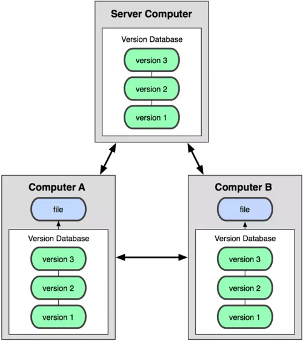
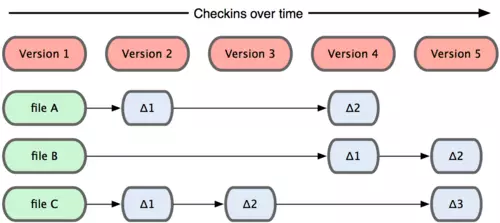
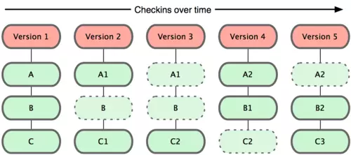
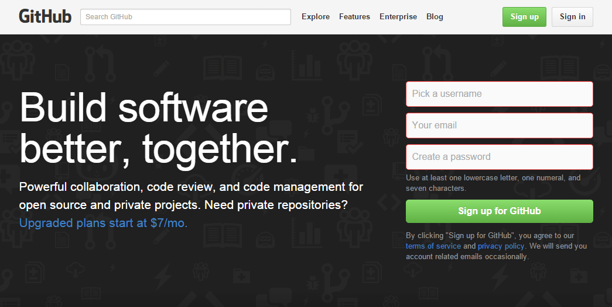

# Tổng quan
- Khi lập trình, vô tình xóa 1 đoạn code, 1 file làm chương trình gặp lỗi.
- Muốn trở lại trạng thái của code cũ trước khi thay đổi.
- Muốn kiểm tra những thay đổi: thay đổi ở đâu, như thế nào, ai đã thực hiện sự thay đổi đó...
- Trường hợp file đang chia sẻ trong nhóm, nếu có hai người chỉnh sửa cùng lúc, thì sẽ xảy ra trường hợp xóa mất nội dung thay đổi của người đã chỉnh sửa trước đó.

==>  Công cụ giúp quản lý phiên bản của source code ra đời: `Hệ thống quản lý phiên bản(Version Control System - VCS)`.

# VCS gồm:
- **Hệ thống quản lý phiên bản tập trung (Centralized Version Control Systems - CVCSs)**
    - Mô hình này gồm 1 máy chủ có chứa tất cả các file đã được phiên bản hóa kèm theo danh sách các máy khách có quyền thay đổi các tập tin này trên máy chủ trung tâm đó.

    

    
    

- Các thành viên trong team có thể kết nối với nhau. Tuy nhiên:

    - Khi máy chủ gặp sự cố, các thành viên không thể kết nối với nhau.
    - Nếu ổ cứng máy chủ bị hỏng, các bản sao lưu dự phòng chưa kịp lưu lại thì thông tin sẽ bị thất thoát, thậm chí `mất tất cả`
- **Hệ thống quản lý phiên bản phân tán( Distributed Version Control System - DVCSs)**
    - Trong DVCS các máy khách sao chép toàn bộ kho chứa(repository). Do đó chúng luôn có những bản sao chứa đầy đủ tất cả các dữ liệu. 
    
    
    

    
    

    - Ngoài ra, DVCSs còn giải quyết được bài toán quản lý nhiều kho chứa từ xa, khi đó còn có thể cộng tác với nhiều nhóm người khác nhau theo những cách khác nhau trong cùng một dự án.

    - Git là một trong những hệ thống quản lý đó, và được sử dụng khá phổ biến hiện nay. 

# Điểm khác nhau giữa Git với các VCS khác
- Phần lớn các VCS khác lưu thông tin dữ liệu dưới dạng:
    - Các tập tin được thay đổi.
    - Coi thông tin được lưu trữ như một tập hợp các tập tin.
    - Các thay đổi thực hiện trên mỗi tập tin theo thời gian.

    

    
    

    
- Git xem dữ liệu giống như:
    - Một tập hợp các "ảnh"(**snapshot**) trên mỗi tập tin và thư mục sau khi commit.
    - Mỗi lần bạn lưu lại trạng thái hiện tại của dự án, về cơ bản Git "chụp một bức ảnh" ghi lại nội dung của tất cả các tập tin tại thời điểm đó và tạo ra một tham chiếu tới "ảnh" đó.
    - Để hiệu quả hơn, nếu như tập tin không có sự thay đổi nào, Git không lưu trữ tập tin đó lại một lần nữa mà chỉ tạo một liên kết tới tập tin gốc đã tồn tại trước đó.

   

    
    

# 1. Khái niệm về Git
- `Git` là một **Hệ thống quản lý dữ liệu phân tán**( *Distributed Version Control System - DVCS*) là một hệ thống quản lý phổ biến hiện nay. DVCS nghĩa là hệ thống giúp mỗi máy tính có thể lưu trữ nhiều phiên bản khác nhau của một mã nguồn được nhân bản (**clone**) từ một kho chứa mã nguồn (**repository**), mỗi thay đổi vào mã nguồn trên máy tính sẽ có thể ủy thác (**commit**) rồi đưa lên máy chủ nơi đặt kho chứa chính. Và một máy tính khác (nếu họ có quyền truy cập) cũng có thể clone lại mã nguồn từ kho chứa hoặc clone lại một tập hợp các thay đổi mới nhất trên máy tính kia.
- Hiểu đơn giản **git** giúp lưu lại các phiên bản của những lần thay đổi vào mã nguồn và có thể dễ dàng khôi phục lại, có thể xem những gì đã thay đổi,và ai đã thay đổi.
## Phân biệt Git & Github
- `Git` là tên gọi của một mô hình hệ thống quản lý dữ liệu.
- `GitHub` là một trang web,cho phép người dùng tạo tài khoản, tạo kho chứa repo và cho phép lưu source code lên đó.

# 2. Tại sao nên dùng git?
- Git dễ sử dụng, an toàn và nhanh chóng.
- Có thể giúp quy trình làm việc code theo nhóm đơn giản hơn rất nhiều bằng việc kết hợp các phân nhánh (branch).
- Bạn có thể làm việc ở bất cứ đâu vì chỉ cần clone mã nguồn từ kho chứa hoặc clone một phiên bản thay đổi nào đó từ kho chứa, hoặc một nhánh nào đó từ kho chứa.
- Dễ dàng trong việc triển khai dự án.
# 3. Cài đặt git
 [Cài đặt git và thiết lập ban đầu](https://thachpham.com/tools/git-cai-dat-git-va-thiet-lap-ban-dau.html)

 # 4. Git- Cấu hình username và email
 - Trước khi sử dụng git cần phải cấu hình hai thông số đó là username và email. Sử dụng 2 lệnh sau:

    `git config --gloabk user.name "Tên username"`

    `git config --global user.email 'Tên email'`
# 5 Một số các thuật ngữ quan trọng liên quan đến Git
## Branch
- Trong GIT, Branch được hiểu là các nhánh. Các Branch sẽ tương ứng với các phiên bản cụ thể trong kho lưu trữ. Branch cho phép người dùng có thể dễ dàng truy cập, theo dõi các thay đổi của các phiên bản, từ đó thử nghiệm hoặc lựa chọn sử dụng phiên bản cũ hơn. 

## Commit
- Commit là một thuật ngữ cực kỳ quen thuộc trong Git. Vậy commit trong git là gì? Hiểu một cách đơn giản, commit là thuật ngữ thể hiện một thời điểm cụ thể trong lịch sử thực hiện code của bạn. Các dự án sẽ có nhiều thời điểm cụ thể trong lịch sử nên sẽ có nhiều code. Khi sử dụng git, bạn có thể dùng lệnh commit kết hợp với lệnh git add để kiểm tra các thay đổi và lưu trữ trong local repository. 

## Check out
- Khi sử dụng git, các lập trình viên sẽ dùng lệnh checkout để chuyển giữa các nhánh hay còn gọi là các branch. Chỉ cần nhập lệnh git checkout + tên Branch, bạn đã có thể chuyển đến nhánh mong muốn. Đồng thời, lệnh check out cũng cho phép người dùng chuyển về branch (master Branch). 

## Fetch
- Sử dụng lệnh Fetch sẽ cho phép bạn nạp và tải các bản sao trên hệ thống lưu trữ và tải các tệp nhánh về máy tính cá nhân. Bạn có thể sử dụng lệnh Fetch để lưu các thay đổi mới nhất vào kho lưu trữ. Fetch cho phép bạn có thể lưu trữ nhiều nhánh trong cùng một thời điểm. 

## Fork
- Fork là thuật ngữ thể hiện các bản sao của một kho lưu trữ. Tiện ích fork cho phép người dùng – các lập trình viên có thể thử nghiệm các thay đổi. Nhờ việc sử dụng trên bản sao nên người dùng có thể thoải mái thay đổi mà không lo ảnh hưởng tới các dự án chính. 

## Head
- Các nhánh trong Git sẽ bao gồm các commit. Và các commit ở đầu 1 nhánh sẽ được gọi là Head. Một head sẽ tương ứng với một commit mới nhất trong hệ thống lưu trữ. 

## Index
- Index là thuật ngữ được sử dụng khi bạn thêm/xóa/thay đổi một file dữ liệu nào đó. Tuy nhiên, file dữ liệu này vẫn sẽ cần nằm trong thư mục cho đến khi bạn sẵn sàng commit các thay đổi. Bạn có thể phân biệt các thay đổi dựa vào màu sắc của commit. Các thay đổi có màu xanh tức là đã sẵn sàng để được thay đổi, còn màu đỏ là chưa sẵn sàng. 

## Master
- Master trong Git là gì? Đây là các nhánh chính trong kho lưu trữ của phần mềm Git mà bạn đang sử dụng. Nhánh master sẽ bao gồm các thay đổi và commit trong thời gian gần đây nhất. 

## Merge
- Trong Git, người dùng có thể dùng lệnh Git Merge để bổ sung các thay đổi từ branch này sang branch khác. Người dùng chỉ cần dùng lệnh Merge và pull requests là đã có thể dễ dàng kéo các yêu cầu từ các nhánh khác nhau. 

## Origin
- Đây là phiên bản mặc định của hệ thống lưu trữ. Origin sẽ đóng vai trò liên lạc với nhánh chính. Vì thế, người dùng có thể dùng lệnh Git push Origin master để thay đổi tới nhánh chính. Việc thay đổi có thể diễn ra cục bộ.

## Pull
- Thuật ngữ Pull trong Git là gì? Hiểu một cách đơn giản, Pull là việc người dùng đề xuất các thay đổi mới cho Master Branch. Đây là tính năng phù hợp với các dự án cần làm việc nhóm. Người thực hiện có thể dùng tính năng Pull Request để yêu cầu người có nhiệm vụ thực hiện bảo trì kho lưu trữ để xem xét các thay đổi của hệ thống. 

- Người dùng có thể dùng lệnh Git Pull để thay đổi lịch sử lưu trữ vào các nhánh chính. 

## Push
- Lệnh Push được sử dụng khi người lập trình cần cập nhật các branch từ xa. Đồng thời, Git Push cũng được dùng cho những thay đổi mới nhất mà người sử dụng đã commit.

## Rebase
- Nếu muốn phân tích, di chuyển các commit, rebase sẽ là lệnh phù hợp. Bạn cũng có thể sử dụng lệnh Git rebase để thoát khỏi commit hoặc hợp nhất 2 nhánh khác nhau.

## Remote
- Remote cũng là một kho lưu trữ. Tuy nhiên, đây là kho lưu trữ từ xa. Remote là một bản sao của một nhánh, có cấu trúc giao tiếp ngược dòng với nhánh gốc cũng như các nhánh khác có trong kho lưu trữ. 

## Repository
- Đây là thuật ngữ thể hiện kho lưu trữ GIT với các tập của dự án. Trong kho lưu trữ Repository có thể chứa các branch, tags và các commit. 

## Stash
- Lệnh Stash cho phép người dùng có thể loại bỏ các thay đổi hiện có tại mục đang lựa chọn. Sau đó, bạn có thể xóa các stashes. Trong trường hợp bạn muốn tạm dừng hoạt động của mình trong thời gian ngắn, lệnh Stash sẽ là lựa chọn hữu ích dành cho bạn.  

## Tags
- Các tags được sử dụng để theo dõi commit quan trọng trong hệ thống. Người dùng có thể sử dụng các tags để chú thích commit, giúp việc tra cứu đối tượng nhanh chóng và đầy đủ hơn. 

## Upstream
- Upstream là thuật ngữ để bạn có thể push các thay đổi trong nhóm chính. 