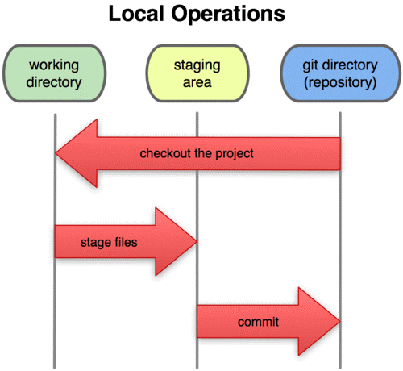

# Repository
# 1. Khái niệm
- `Repository` (gọi tắt là repo) được hiểu là kho chứa `toàn bộ project` bao gồm source code, lịch sử và nội dung thay đổi của từng file, từng cá nhân trong project đó, gồm 2 loại:
    - `Remote repo`: kho này dùng để chia sẻ cho nhiều người và được đặt trên server.
    - `Local repo`: kho này đặt trên máy của người dùng.
- Do repository phân thành 2 loại là local và remote nên với những công việc bình thường thì có thể sử dụng local repository và thực hiện trên toàn bộ máy sẵn có. Khi muốn công khai nội dung công việc mà bản thân đã làm trên local repository, thì sẽ upload lên remote repository rồi công khai. Thêm nữa, thông qua remote repository cũng có thể lấy về nội dung công việc của người khác.

    
    

    
    

# 2 Lệnh tạo Repo: `git init`

- Khi chúng ta chạy lệnh `$ git init` thì một thư mục ẩn được tạo ra đó là `.git`, thư mục này sẽ chứa toàn bộ database và các thao tác của dự án, nó có một số thư mục con và một số file quan trọng gồm: HEAD, branches/, config, description, hooks/ index, info/, objects/, refs/.
        

        
        
   
    Trong đó bạn cần chú ý đến thư mục objects vì đây là thư mục chứa toàn bộ database, nó có 4 objects như sau:

        - tree: là directory
        - blob: là file
        - commit
        - tag
# 3 Ba trạng thái của một repo:

    

    

- **Working directory**: đây là nơi bạn thực hiện các thao tác chỉnh sửa với file mã nguồn của mình. ví dụ: notepad++, visual code...Tương ứng trạng thái **Modified**

- **Staging area**: đây là một khu vực trung gian mà commit có thể được định dạng và xem lại trước khi hoàn thành. Những thay đổi của bạn với file mã nguồn được lưu lại, giống như Save. Tương ứng trạng thái **Staged**

- **Git directory**: nơi lưu trữ mã nguồn( github), tiếp nhận và lưu trữ các commit từ stage area. Tương ứng trạng thái **Committed**
    
## Tương ứng có các hành động - có 2 workflow:

   **a. Subversion-style()**:

    i. Sau khi tạo xong repo, clone repo này về máy tính của bạn bằng lệnh `git clone địa_chỉ_git`.

    ii. Checkout: tạo nhánh `git checkout -b tên_nhánh`.

    iii. Add: lưu file thay đổi(mang tính cục bộ)- tương ứng `git add tên_file`.
    
    iv. Commmit: ghi lại trạng thái thay đổi - tương ứng `git commit -m message`. Mỗi một commit sẽ đính kèm 1 *message* mô tả sự thay đổi của code.

    v. Push: chia sẻ những thay đổi từ local lên remote repo - tương ứng lệnh `git push`.

    

 
    vi. Pull: đồng bộ trạng thái từ server về máy trạm - tương ứng lệnh `git pull`.

**b. Integration Manager**: Tạm dịch là tích hợp quản lý, kiểu này hịn và chuyên nghiệp hơn.

    i. "Sao chép" repository về kho của mình, gọi là `fock repo`.

    ii. Clone fock repo từ kho về máy tính cá nhân.

    iii. Sau khi chỉnh sửa, push trạng thái mới lên fock repo.

    iv. Tạo bản so sánh giữa 2 branch của 2 repo, gọi là `pull request`, gửi cho người quản lý có quyền merge code mới vào.

**Lưu ý**:

- Git không cho phép bạn **push** lên máy chủ nếu ai đó đã **push** `trong khoảng thời gian` từ lần `cuối cùng` bạn **pull** về trở đi.
    
    

    
Khi đó bạn cần phải pull về để đồng bộ những thay đổi của người khác, kiểm tra lại add, commit rồi mới push lên lại.
- Khi thực hiện pull/merge, git sẽ tự động tích hợp những chỗ thay đổi, tuy nhiên cũng có trường hợp không tích hợp tự động được. Đó là lúc có sự thay đổi ở cùng một nơi giống nhau giữa remote và local repo, git không biết lấy thay đổi từ đâu lúc này sẽ sinh ra `xung đột(conflict)` vd như hình bên dưới đây.

    

    
    

    - Phần phía trên mà đã được chia ra bằng ==== là của local repository, phía dưới được hiển thị là nội dung chỉnh sửa của remote repository. Lúc này cần xóa 1 trong 2 những thay đổi đó để giải quyết xung đột.

        
    

    
    

        
- Trong lệnh git push có từ `origin`, đây chính là `tên remote repo`, mặc định khi clone một repo thì nó đặt tên là origin.
# 4. Lấy dữ liệu từ Remote Repo
- Có 3 loại lấy dữ liệu từ remote repo:
    - **git clone**: Lệnh này sẽ sao chép toàn bộ dữ liệu trên repository và sao chép luôn các thiết lập về repository, tức là nó sẽ tự động tạo một master branch trên máy tính của bạn. Lệnh này chỉ nên sử dụng khi bạn cần tạo mới một Git mới trên máy tính với toàn bộ dữ liệu và thiết lập của một remote repository.
    - **git pull**: Lệnh này sẽ tự động lấy toàn bộ dữ liệu từ remote repository và gộp vào cái branch hiện tại bạn đang làm việc.
    
    
    

    
    

    - **git fetch**: tải về dữ liệu từ Remote Repo (các dữ liệu như các commit, các file, refs), dữ liệu tải về để bạn theo dõi sự thay đổi của remote, tuy nhiên tải về bằng git fetch nó chưa tích hợp thay đổi ngay local repository của bạn, mục đích để theo dõi các commit người khác đã cập nhật lên server, để có được thông thông tin khác nhau giữa remote và local.
# 5. Thêm, sửa, xóa remote Repo
- Thêm một remote repo vào local repo sử dụng cú pháp:
    `git remote add tên_repo [url]` (url là đường dẫn trỏ tới repo, phần đuôi là .git)
    
- Xem repo đã thêm: `git remote` hoặc `git remote -v`
- Xóa một repo sử dụng cú pháp:
    `git remote rm tên_repo`
- Đổi tên repo:
    `git remote tên_repo_cũ tên_mới`
- Thay đổi link của remote repo:
    `git remote set-url tên_repo <link>`
# 6. Git - Push data lên remote Repo
- Đẩy mới một branch tại local lên remote: 
    `git push --set-upstream tên_remote tên_nhánh`

    Khi thực hiện lệnh này thì git bash sẽ yêu cầu nhập thông tin `username` và `password`, đây chính là thông tin mà bạn đăng nhập vào remote server.

    Sau khi lệnh này thực hiện thành công thì mọi dữ liệu trên local của bạn sẽ được đẩy lên remote, và trên remote cũng sẽ tạo một branch giống tên branch mà bạn đã thiết lập

# 7. Git - Lưu thông tin đăng nhập với credential store
- Khi bạn thực hiện bất kì thao tác nào liên quan đến remote thì bắt buộc phải nhập thông tin đăng nhập, đây là điều kiện để đảm bảo dữ liệu của bạn không bị mất. Sử dụng `credential store` để lưu trữ mật khẩu trên disk, nghĩa là nó sẽ tự động đăng nhập cho mỗi thao tác của bạn.

- Để lưu thông tin đăng nhập thì bạn thực hiện các lệnh sau.

    - Bước 1: Chạy lệnh `$ git config credential.helper store`

    - Bước 2: Thực hiện một thao tác push, lần này git sẽ bắt bạn đăng nhập, nhưng kể từ đó bạn sẽ không cần phải đăng nhập khi thao tác với remote repo