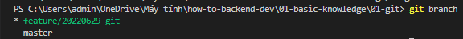
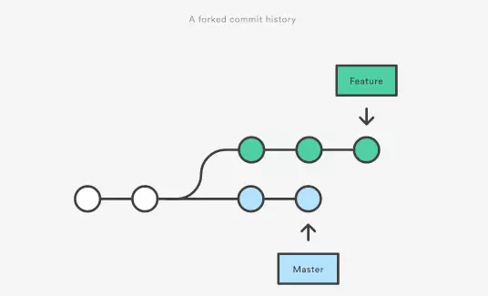
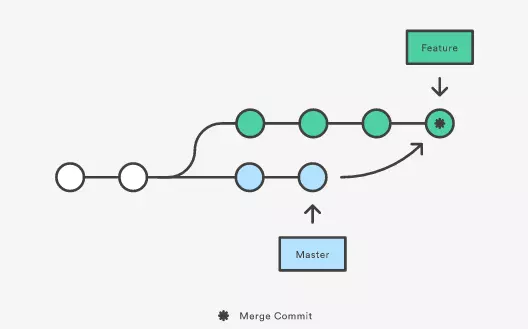
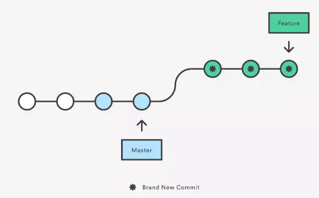

# Branch - Nhánh
# 1. Thao tác với branch
- **Tạo 1 branch**: 
    - Xem toàn bộ branch có trong working tree: `git branch`
        

         
        

         Git sử dụng dấu hoa thị và phông chữ có màu khác để xác định nhánh nào đang hoạt động. Ký hiệu này đại diện cho con trỏ **HEAD** hiển thị nhánh nào đang hoạt động.

    - Tạo 1 branch: `git branch tên_nhánh`

         *Lưu ý*: Đặt tên nhánh có thể dựa trên quy chuẩn `tính_năng/thời_gian/người_thực_hiện/mô_tả_công_việc` sẽ thực hiện.
            vd: feature/20220629_gut, fixbug/20220607_gtgc.... 
- **Checkout chuyển sang 1 branch khác**:
    - `git checkout tên_nhánh`
    - Kết hợp tạo branch và checkout: `git checkout -b tên_nhánh` 
- **Đổi tên nhánh**
    - `git branch -m old_branch new_branch`
- **Xóa 1 branch**:
    - `git branch -d tên_nhánh`
- **Merge branch**: tức là gộp hai branch lại với nhau, thao tác này thường dùng để merge branch khác vào branch master trước khi push lên remote repository, hoặc merge hai branch thành một để giải quyết chung một task.vd merge dev vào master
    - Checkout sang nhánh master
    - Sử dụng lệnh: `git merge dev`

`Tích hợp nhánh`

    Git rebase và git merge là 2 câu lệnh được sử dụng để giải quyết việc tích hợp những thay đổi từ 1 nhánh này vào 1 nhánh khác. Tuy nhiên cách thức của chúng sẽ khác nhau.
    

    
    

#### **Merging**
    Ví dụ merge branch `master` vào branch `Feature` bằng cách :
-  `git checkout Feature`
-  `git merge master`

    Câu lệnh trên sẽ tạo ra một `merge commit` mới trên branch `Feature` bao gồm lịch sử của cả 2 branch (Hình minh họa)

    Ưu điểm: Merging không làm thay đổi hệ thống. Những nhánh đang tồn tại sẽ không bị ảnh hưởng gì cả. 

    Nhược điểm: Branch Feature sẽ có thêm 1 commit merge mỗi lần bạn cần tích hợp những thay đổi từ các nhánh khác vào nó. Nếu branch master liên tục bị thay đổi thì lịch sử commit của branch Feature sẽ rất khó nhìn. Nó sẽ gây rất nhiều khó khăn trong việc xem lại lịch sử commit của dự án
#### **Rebase**
`Git rebase`: là 1 tiện ích git được dùng để tích hợp các thay đổi từ nhánh này sang nhánh khác. Rebasing là quá trình kết hợp hoặc di chuyển 1 chuỗi các commit trên một commit cơ sở mới.

Cũng là một cách gộp những thay đổi từ các nhánh với nhau bằng commands:

- `git checkout Feature`

- `git rebase master`

Lệnh `git rebase` sẽ đưa toàn bộ nhánh `master` làm base của `Feature`. Nhưng thay vì dùng một commit merge, nó sẽ viết lại lịch sử của project bằng cách tạo các commit hoàn toàn mới cho mỗi commit ở nhánh ban đầu.

Lợi ích chính của việc `rebasing` này là lịch sử project sẽ gọn gàng & sạch sẽ hơn. Đầu tiên, nó sẽ loại bỏ những `commit merge` không cần thiết mà được sinh ra bởi git merge. Sau đó, như bạn đã thấy trên biểu đồ phía trên, `rebasing` sẽ tạo ra `một đường thẳng commit` trong lịch sử commit

- Nếu có 1 số xung đột trong nhánh, hãy giải quyết chúng và thực hiện lệnh dưới đây để tiếp tục thay đổi: `git rebase --continue` 

**Khác nhau**:

- `Merge`: Thao tác merge là kết quả của phép trộn giữa ba commit, đó là commit cha chung và 2 commit mới nhất của 2 nhánh (hai điểm kết thúc), kết quả sẽ tạo ra một commit chứa kết quả của phép trộn.
- `Rebase`: Cho lịch sử rõ ràng hơn, bởi nó sẽ duyệt qua từng commit của nhánh đang làm việc và thực hiện thay đổi, vì vậy nhìn vào ta sẽ thấy giống như một đường thẳng.

==> Nếu bạn muốn một lịch sử commit gọn gàng, chỉ có 1 hàng trên cây commit thôi, thì bạn `git rebase` sẽ phù hợp với bạn