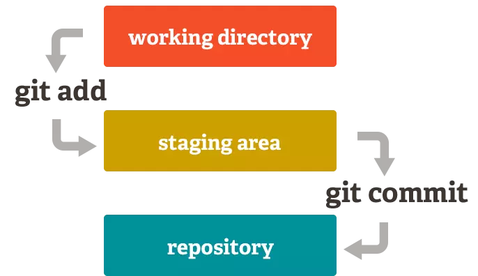

# Staging Area
# 1. Khái niệm
- **Staging Area** nghĩa là một khu vực mà nó sẽ được chuẩn bị cho quá trình commit. Trước hết, trong các hệ thống quản lý phiên bản (Version Control System) thì các dữ liệu sẽ được lưu trữ ở hai nơi, một là thư mục bạn đang làm việc trên *máy tính* và một là *kho chứa mã nguồn (repository)* sau khi bạn đã thực hiện thay đổi (ví dụ như kho chứa trên Github).
- Với Git thì nó có thêm một lựa chọn nữa đó là có thêm một khu vực trung gian gọi là **Staging Area** và đây chính là một lợi thế lớn của Git. Staging Area nghĩa là khu vực sẽ lưu trữ những thay đổi của bạn trên tập tin để nó có thể được commit, vì muốn commit tập tin nào thì tập tin đó phải nằm trong Staging Area. Một tập tin khi nằm trong Staging Area sẽ có trạng thái là *Stagged* (xem thêm ở dưới). 


<p align="center">
    
</p>

- Để đưa một tập tin vào Staging Area thì bạn sẽ cần phải sử dụng lệnh `git add tên_file`

# 2. Commit là gì và cách hoạt động của nó?

# 2.1. Khái niệm
- **Commit** nghĩa là một hành động để Git lưu lại một bản chụp (snapshot) của các sự thay đổi trong thư mục làm việc, và các tập tin và thư mục được thay đổi đã phải nằm trong Staging Area. Lênh commit sẽ băm các file và lưu chúng dưới dạng đối tượng tree (thư mục), trong tree sẽ chứa tất cả các blob (tức là các file trên) và mỗi blod sẽ trỏ đến file gốc của nó. Sau đó nó tạo một đối tượng commit chứa các thông tin metadata như author, email, message ... và đặc biệt là đối tượng commit này có một con trỏ trỏ tới đối tượng tree, vì vậy ta có thể tái tạo lại history thông qua đối tượng commit này.

- Nếu bạn muốn đưa tập tin lên repository thì bạn phải commit nó trước rồi sau đó lệnh `git push origin master` sẽ có nhiệm vụ đưa toàn bộ các tập tin đã được commit lên repository.
- Khi commit yêu cầu có commit message. Vì message này giúp chúng ta khi xem lại có thể hiểu được là tập tin này đã được chỉnh sửa nội dung gì...

# 2.2. Điều kiện để commit một tập tin
- Nếu muốn commit một tập tin nào đó thì cần phải đưa tập tin đó vào trạng thái tracked bằng lệnh `git add tên_file`. trong git có 2 loại trạng thái chính là **Tracked** và **Untracked**.
    - **Tracked**: là tập tin được đánh dấu theo dõi trong Git để làm việc với nó. Nó có thêm các trạng thái phụ khác: Unmodified(chưa chỉnh sửa gì), Modified (đã chỉnh sửa) và Staged (đã sẵn sàng để commit).
    - **Untracked**: Là tập tin còn lại mà bạn sẽ không muốn làm việc với nó trong Git.

    **Lưu ý**: Nếu tập tin đó đã được Tracked nhưng đang rơi vào trạng thái (Modified) thì nó vẫn sẽ *không thể commit* được mà bạn phải đưa nó về Staged cũng bằng lệnh `git add`.

- Bỏ qua Staging Area để commit:  Có thể đưa 1 tập tin đã được tracked để commit mà không cần đưa nó vào Staging Area với tham số `-a` trong lệnh **git commit**.
Vd: `git commit -a -m "Skipped staging area to commit"`.

# 2.3. Tìm hiểu thêm về các trạng thái


<p align="center">
    
</p>

## a. Untracked
- Là files chưa được git theo dõi <=> là files chưa được add vào staging area bất cứ 1 lần nào <=> là files mới được tạo lần đầu tiên trong project source.

```On branch feature/20220629_git
Untracked files:
  (use "git add <file>..." to include in what will be committed)
        ../

nothing added to commit but untracked files present (use "git add" to track)
```
- Để đưa từ Untracked sang Tracked thì sử dụng lệnh *git add*. Một tập tin được đưa về trạng thái Tracked thì nó sẽ ở trạng thái Staged luôn.
## b. Tracked 
- Khi một tập tin đã được đưa về Tracked thì nó sẽ thay đổi giữa 3 trạng thái khác nhau: UnModified, Modified, Staged.
    - **Unmodified**: là files đã được git theo dõi nhưng chưa có bất cứ 1 thay đổi gì so với phiên bản cũ của files đó.
    - **Modified**: là những files đã được git theo dõi và vừa mới có sự thay đổi nội dung files và những nội dung đó chưa được add vào staging area.
    - **Staged**: là những files đã được tạo mới hoặc mới sửa đổi và đã được đưa vào staging area
## c. Lệnh chuyển trạng thái
- **Untracked sang Tracked**: git add tên_file hoặc git add .
- **Chuyển từ Tracked về Untracked**: sử dụng lệnh `rm tên_file` hoặc `git restore --staged tên_file`. Lệnh `rm` giúp đưa tập tin về trạng thái Untracked nhưng *không xóa hẳn* trong ổ cứng.
Nếu muốn xóa luôn tập tin đó thì dùng lệnh: `git rm -f tên_file` và **nhớ cẩn thận** khi dùng lệnh này.
- **Unmodified sang Modified**: đơn giản là sửa nội dung.
- **Modified về UnModified**: `git restore tên_file` hoặc `git restore .` (chuyển all).
- **Modified sang Staged**: git add
- **Staged về Modified**: `git restore --staged` hoặc `git restore --staged .` (all)
- Bỏ tập tin ra khỏi Staging Area: `git reset HEAD tên_file`. (HEAD tượng trưng cho con trỏ chỉ cho bạn biết bạn đang nằm ở đâu)