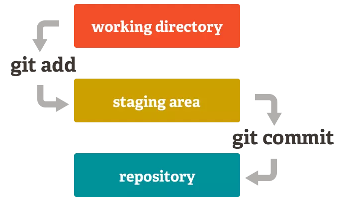

# Tìm hiểu về Git
## Tổng quan
- Khi lập trình, vô tình xóa 1 đoạn code, 1 file làm chương trình gặp lỗi.
- Muốn trở lại trạng thái của code cũ trước khi thay đổi.
- Muốn kiểm tra những thay đổi: thay đổi ở đâu, như thế nào, ai đã thực hiện sự thay đổi đó...
- Trường hợp file đang chia sẻ trong nhóm, nếu có hai người chỉnh sửa cùng lúc, thì sẽ xảy ra trường hợp xóa mất nội dung thay đổi của người đã chỉnh sửa trước đó.

==>  Công cụ giúp quản lý phiên bản của source code ra đời: `**Hệ thống quản lý phiên bản(Version ControL System - VCS)**`.

## VCS gồm:
- **Hệ thống quản lý phiên bản tập trung (Centralized Version Control Systems - CVCSs)**
    - Mô hình này gồm 1 máy chủ có chứa tất cả các file đã được phiên bản hóa kèm theo danh sách các máy khách có quyền thay đổi các tập tin này trên máy chủ trung tâm đó.

<p align="center">
  
</p>

    -  Các thành viên trong team có thể kết nối với nhau. Tuy nhiên:
        - Khi máy chủ gặp sự cố, các thành viên không thể kết nối với nhau.
        - Nếu ổ cứng máy chủ bị hỏng, các bản sao lưu dự phòng chưa kịp lưu lại thì thông tin sẽ bị thất thoát, thậm chí `mất tất cả`
- **Hệ thống quản lý phiên bản phân tán(Distributed Version Control System - DVCSs)**
    - Trong DVCS các máy khách sao chép toàn bộ kho chứa(repository). Do đó chúng luôn có những bản sao chứa đầy đủ tất cả các dữ liệu. 
    
    
    <p align="center">
    
    </p>
    - Ngoài ra, DVCSs còn giải quyết được bài toán quản lý nhiều kho chứa từ xa, khi đó còn có thể cộng tác với nhiều nhóm người khác nhau theo những cách khác nhau trong cùng một dự án.
    - Git là một trong những hệ thống quản lý đó, và được sử dụng khá phổ biến hiện nay. 

## Điểm khác nhau giữa Git với các VCS khác
- Phần lớn các VCS khác lưu thông tin dữ liệu dưới dạng:
    - Các tập tin được thay đổi.
    - Coi thông tin được lưu trữ như một tập hợp các tập tin.
    - Các thay đổi thực hiện trên mỗi tập tin theo thời gian.

    <p align="center">
    
    </p>
    
- Git xem dữ liệu giống như:
    - Một tập hợp các "ảnh"(**snapshot**) trên mỗi tập tin và thư mục sau khi commit.
    - Mỗi lần bạn lưu lại trạng thái hiện tại của dự án, về cơ bản Git "chụp một bức ảnh" ghi lại nội dung của tất cả các tập tin tại thời điểm đó và tạo ra một tham chiếu tới "ảnh" đó.
    - Để hiệu quả hơn, nếu như tập tin không có sự thay đổi nào, Git không lưu trữ tập tin đó lại một lần nữa mà chỉ tạo một liên kết tới tập tin gốc đã tồn tại trước đó.


   <p align="center">
    
    </p>
## 1. Khái niệm về Git
- `Git` là một **Hệ thống quản lý dữ liệu phân tán**(*Distributed Version Control System - DVCS*) là một hệ thống quản lý phổ biến hiện nay. DVCS nghĩa là hệ thống giúp mỗi máy tính có thể lưu trữ nhiều phiên bản khác nhau của một mã nguồn được nhân bản (**clone**) từ một kho chứa mã nguồn (**repository**), mỗi thay đổi vào mã nguồn trên máy tính sẽ có thể ủy thác (**commit**) rồi đưa lên máy chủ nơi đặt kho chứa chính. Và một máy tính khác (nếu họ có quyền truy cập) cũng có thể clone lại mã nguồn từ kho chứa hoặc clone lại một tập hợp các thay đổi mới nhất trên máy tính kia.
- Hiểu đơn giản **git** giúp lưu lại các phiên bản của những lần thay đổi vào mã nguồn và có thể dễ dang khôi phục lại, có thể xem những gì đã thay đổi,và ai đã thay đổi.
### Phân biệt Git & Github
- Git là tên gọi của một mô hình hệ thống.
- `GitHub` là một trang web,cho phép người dùng tạo tài khoản, tạo kho chứa repo và cho phép lưu source code lên đó.


## 2. Tại sao nên dùng git?
- Git dễ sử dụng, an toàn và nhanh chóng.
- Có thể giúp quy trình làm việc code theo nhóm đơn giản hơn rất nhiều bằng việc kết hợp các phân nhánh (branch).
- Bạn có thể làm việc ở bất cứ đâu vì chỉ cần clone mã nguồn từ kho chứa hoặc clone một phiên bản thay đổi nào đó từ kho chứa, hoặc một nhánh nào đó từ kho chứa.
- Dễ dàng trong việc triển khai dự án.
## 3. Cài đặt git
 [Cài đặt git và thiết lập ban đầu](https://thachpham.com/tools/git-cai-dat-git-va-thiet-lap-ban-dau.html)
## 4. Thao tác với git
### 4.1.  Repository
#### 4.1.1. Khái niệm
- `Repository` (gọi tắt là repo) được hiểu là kho chứa `toàn bộ project` bao gồm source code, lịch sử và nội dung thay đổi của từng file, từng cá nhân trong project đó, gồm 2 loại:
    - `Remote repo`: kho này dùng để chia sẻ cho nhiều người và được đặt trên server.
    - `Local repo`: kho này đặt trên máy của người dùng.
- Do repository phân thành 2 loại là local và remote nên với những công việc bình thường thì có thể sử dụng local repository và thực hiện trên toàn bộ máy sẵn có. Khi muốn công khai nội dung công việc mà bản thân đã làm trên local repository, thì sẽ upload lên remote repository rồi công khai. Thêm nữa, thông qua remote repository cũng có thể lấy về nội dung công việc của người khác.

    
    <p align="center">
    
    </p>

- Ba trạng thái của một repo:


<p align="center">
    
</p>


<p align="center">
    
</p>
    - Working directory: đây là nơi bạn thực hiện các thao tác chỉnh sửa với file mã nguồn của mình. ví dụ: notepad++, visual code...

    - Staging area: đây là một khu vực trung gian mà commit có thể được định dạng và xem lại trước khi hoàn thành. Những thay đổi của bạn với file mã nguồn được lưu lại, giống như Save.

    - Git directory: nơi lưu trữ mã nguồn(github).
    
- Tương ứng có các hành động - 2 workflow:

   **Subversion-style()**:
    1. Sau khi tạo xong repo, clone repo này về máy tính của bạn bằng lệnh `git clone địa_chỉ`.
    2. Checkout: tạo nhánh `git checkout tên_nhánh`
    3. Add: lưu file thay đổi(mang tính cục bộ)- tương ứng `git add tên_file`
    4. Commmit: ghi lại trạng thái thay đổi - tương ứng `git commit -m message`. Mỗi một commit sẽ đính kèm 1 *message* mô tả sự thay đổi của code.
    5. Push: chia sẻ những thay đổi từ local lên remote repo - tương ứng lệnh `git push`. 
    
    
    <p align="center">
    
    </p>
    6. Pull: đồng bộ trạng thái từ server về máy trạm - tương ứng lệnh `git pull`.
    


    **Integration Manager**: Tạm dịch là tích hợp quản lý, kiểu này hịn và chuyên nghiệp hơn.

    1. "Sao chép" repository về kho của mình, gọi là fock repo
    2. Clone fock repo từ kho về máy tính cá nhân.
    3. Sau khi chỉnh sửa, push trạng thái mới lên fock repo.
    4. Tạo bản so sánh giữa 2 branch của 2 repo, gọi là pull request, gửi cho người quản lý có quyền merge code mới vào.

    **Lưu ý**:
    - Git không cho phép bạn **push** lên máy chủ nếu ai đó đã **push** `trong khoảng thời gian` từ lần cuối cùng bạn **pull** về trở đi.
    
    
    <p align="center">
    
    </p>
    
    Khi đó bạn cần phải pull về để đồng bộ những thay đổi của người khác, kiểm tra lại add, commit rồi mới push lên lại.
    - Khi thực hiện pull/merge, git sẽ tự động tích hợp những chỗ thay đổi, tuy nhiên cũng có trường hợp không tích hợp tự động được. Đó là lúc có sự thay đổi ở cùng một nơi giống nhau giữa remote và local repo, git không biết lấy thay đổi từ đâu lúc nàu sẽ sinh ra xung đột(conflict) vd như hình bên dưới đây.


    <p align="center">
    
    </p>
        - Phần phía trên mà đã được chia ra bằng ==== là của local repository, phía dưới được hiển thị là nội dung chỉnh sửa của remote repository. Lúc này cần xóa 1 trong 2 những thay đổi đó để giải quyết xung đột.

        
    <p align="center">
    
    </p>
        
    - Trong lệnh git push có từ `orgin`, đây chính là `tên remote repo`, mặc định khi clone một repo thì nó đặt tên là origin.
#### 4.1.2. Lấy dữ liệu từ Remote Repo
- Có 3 loại lấy dữ liệu từ remote repo:
    - **git clone**: Lệnh này sẽ sao chép toàn bộ dữ liệu trên repository và sao chép luôn các thiết lập về repository, tức là nó sẽ tự động tạo một master branch trên máy tính của bạn. Lệnh này chỉ nên sử dụng khi bạn cần tạo mới một Git mới trên máy tính với toàn bộ dữ liệu và thiết lập của một remote repository.
    - **git pull**: Lệnh này sẽ tự động lấy toàn bộ dữ liệu từ remote repository và gộp vào cái branch hiện tại bạn đang làm việc.
    
    
    <p align="center">
    
    </p>

    - **git fetch**: Lệnh này sẽ lấy toàn bộ dữ liệu từ remote repository nhưng sẽ cho phép bạn gộp thủ công vào một branch nào đó trên thư mục Git ở máy tính.
### 4.2 Branch - nhánh của repo
#### 4.2.1. Đặc điểm
- Các nhánh sẽ *độc lập* với nhau và phát triển một *tính năng* hoặc làm một nhiệm vụ nào đó, không ảnh hưởng đến các nhánh khác.
- Khi các nhánh hợp nhất lại với nhau gọi là **merge**, thông thường nhánh mặc định là **master**.
- Branch ở trên local repo thì gọi là *local branch*.
- Branch ở trên remote repo thì gọi là *remote branch*.
- Một branch trên local có thể liên kết với *1 hoặc nhiều branch* trên remote hoặc không branch nào cả.
- Git cho phép và khuyến khích bạn tạo nhiều branch tại máy tính cá nhân của bạn, việc tạo, sáp nhập và xóa bỏ những branch này diễn ra rất nhanh chóng.
- Thông thường **branch master** chứa phiên bản code chạy *ngon nghẻ* nhất.
- Một số branch nhỏ như **dev**( *kiểm thử lại chức năng*), **feature**( *xây dựng các tính năng mới*).
- Việc merge code được thực hiện lần lượt, vd từ nhánh nhỏ trong dev -> dev -> master.
#### 4.2.2. Thao tác với branch
- Tạo 1 branch: 
    - Xem toàn bộ branch có trong working tree: git branch
    - Tạo 1 branch: git branch tên_nhánh
- Checkout 1 branch:
    - git checkout tên_nhánh
- Xóa 1 branch:
    - git branch -d tên_nhánh
- Merge 2 branch:vd merge dev vào master
    - Checkout sang nhánh master
    - Sử dụng lệnh: git merge dev

### 4.3 Staging Area
#### 4.3.1. Khái niệm
- **Staging Area** nghĩa là một khu vực mà nó sẽ được chuẩn bị cho quá trình commit. Trước hết, trong các hệ thống quản lý phiên bản (Version Control System) thì các dữ liệu sẽ được lưu trữ ở hai nơi, một là thư mục bạn đang làm việc trên *máy tính* và một là *kho chứa mã nguồn (repository)* sau khi bạn đã thực hiện thay đổi (ví dụ như kho chứa trên Github).
- Với Git thì nó có thêm một lựa chọn nữa đó là có thêm một khu vực trung gian gọi là **Staging Area** và đây chính là một lợi thế lớn của Git. Staging Area nghĩa là khu vực sẽ lưu trữ những thay đổi của bạn trên tập tin để nó có thể được commit, vì muốn commit tập tin nào thì tập tin đó phải nằm trong Staging Area. Một tập tin khi nằm trong Staging Area sẽ có trạng thái là *Stagged* (xem thêm ở dưới). 


<p align="center">
    
</p>
- Để đưa một tập tin vào Staging Area thì bạn sẽ cần phải sử dụng lệnh `git add tên_file`
#### 4.3.2. Commit là gì và cách hoạt động của nó?

#### 4.3.2.1. Khái niệm
- **Commit** nghĩa là một hành động để Git lưu lại một bản chụp (snapshot) của các sự thay đổi trong thư mục làm việc, và các tập tin và thư mục được thay đổi đã phải nằm trong Staging Area. Mỗi lần commit nó sẽ được lưu lại lịch sử chỉnh sửa của mã nguồn kèm theo tên và địa chỉ email của người commit.
- Nếu bạn muốn đưa tập tin lên repository thì bạn phải commit nó trước rồi sau đó lệnh `git push origin master` sẽ có nhiệm vụ đưa toàn bộ các tập tin đã được commit lên repository.
- Khi commit yêu cầu có commit message. Vì message này giúp chúng ta khi xem lại có thể hiểu được là tập tin này đã được chỉnh sửa nội dung gì...
#### 4.3.2.2. Điều kiện để commit một tập tin
- Nếu muốn commit một tập tin nào đó thì cần phải đưa tập tin đó vào trạng thái tracked bằng lệnh `git add tên_file`. trong git có 2 loại trạng thái chính là **Tracked** và **Untracked**.
    - **Tracked**: là tập tin được đánh dấu theo dõi trong Git để làm việc với nó. Nó có thêm các trạng thái phụ khác: Unmodified(chưa chỉnh sửa gì), Modified (đã chỉnh sửa) và Staged (đã sẵn sàng để commit).
    - **Untracked**: Là tập tin còn lại mà bạn sẽ không muốn làm việc với nó trong Git.

    **Lưu ý**: Nếu tập tin đó đã được Tracked nhưng đang rơi vào trạng thái (Modified) thì nó vẫn sẽ *không thể commit* được mà bạn phải đưa nó về Staged cũng bằng lệnh `git add`.

- Bỏ qua Staging Area để commit:  Có thể đưa 1 tập tin đã được tracked để commit mà không cần đưa nó vào Staging Area với tham số `-a` trong lệnh **git commit**.
Vd: `git commit -a -m "Skipped staging area to commit"`.

#### 4.3.2.3. Tìm hiểu thêm về các trạng thái


<p align="center">
    
</p>

#### a. Untracked
- Là files chưa được git theo dõi <=> là files chưa được add vào staging area bất cứ 1 lần nào <=> là files mới được tạo lần đầu tiên trong project source.

```On branch feature/20220629_git
Untracked files:
  (use "git add <file>..." to include in what will be committed)
        ../

nothing added to commit but untracked files present (use "git add" to track)
```
- Để đưa từ Untracked sang Tracked thì sử dụng lệnh *git add*. Một tập tin được đưa về trạng thái Tracked thì nó sẽ ở trạng thái Staged luôn.
#### b. Tracked 
- Khi một tập tin đã được đưa về Tracked thì nó sẽ thay đổi giữa 3 trạng thái khác nhau: UnModified, Modified, Staged.
    - **Unmodified**: là files đã được git theo dõi nhưng chưa có bất cứ 1 thay đổi gì so với phiên bản cũ của files đó.
    - **Modified**: là những files đã được git theo dõi và vừa mới có sự thay đổi nội dung files và những nội dung đó chưa được add vào staging area.
    - **Staged**: là những files đã được tạo mới hoặc mới sửa đổi và đã được đưa vào staging area
#### c. Lệnh chuyển trạng thái
- **Untracked sang Tracked**: git add tên_file hoặc git add .
- **Chuyển từ Tracked về Untracked**: sử dụng lệnh `rm tên_file` hoặc `git restore --staged tên_file`. Lệnh `rm` giúp đưa tập tin về trạng thái Untracked nhưng *không xóa hẳn* trong ổ cứng.
Nếu muốn xóa luôn tập tin đó thì dùng lệnh: `git rm -f tên_file` và **nhớ cẩn thận** khi dùng lệnh này.
- **Unmodified sang Modified**: đơn giản là sửa nội dung.
- **Modified về UnModified**: `git restore tên_file` hoặc `git restore .` (chuyển all).
- **Modified sang Staged**: git add
- **Staged về Modified**: `git restore --staged` hoặc `git restore --staged .` (all)
- Bỏ tập tin ra khỏi Staging Area: git reset HEAD tên_file. (HEAD tượng trưng cho con trỏ chỉ cho bạn biết bạn đang nằm ở đâu)
### Một số lệnh khác
- **`git log`** hoặc **`git diff`**: xem lịch sử commit
- **`git status`**: xem trạng thái của gist repo xem đang ở nhánh nào, có thay đổi gì không.
- **`git reset`**: để xóa sự thay đổi về trạng thái ban đầu chưa sửa hoặc về bất cứ commit nào trong quá khứ
- **`Stash`**: Là tính năng lưu tạm các sự thay đổi vào local khi chúng ta đang làm code dở ở nhánh A nhưng lại chưa muốn commit thì chúng ta phải sang nhánh B để fix bug nên chúng ta phải stash lại để không bị mất code cũng không phải commit. Khi quay lại nhánh A sẽ apply stash để sửa tiếp.
    - `git stash save` --lưu change hiện tại vào stash
    - `git stash list` --hiển thị danh sách stash
    - `git stash apply <stash_name>` --đẩy changes từ 1 stash vào một nhánh


# Tài liệu tham khảo
[1] [Git-Học nghiêm túc một lần](http://https://viblo.asia/p/git-hoc-nghiem-tuc-mot-lan-phan-1-OeVKBo6JZkW)

[2] [Serie Git cơ bản](https://thachpham.com/tools/git-gioi-thieu-serie-git-co-ban.html)

[3] [Cơ bản về git](https://backlog.com/git-tutorial/vn/intro/intro1_1.html)

[4] [Những gì cần biết khi làm việc với git](https://tedu.com.vn/kien-thuc/nhung-gi-can-biet-khi-lam-viec-voi-git-trong-du-an-291.html)