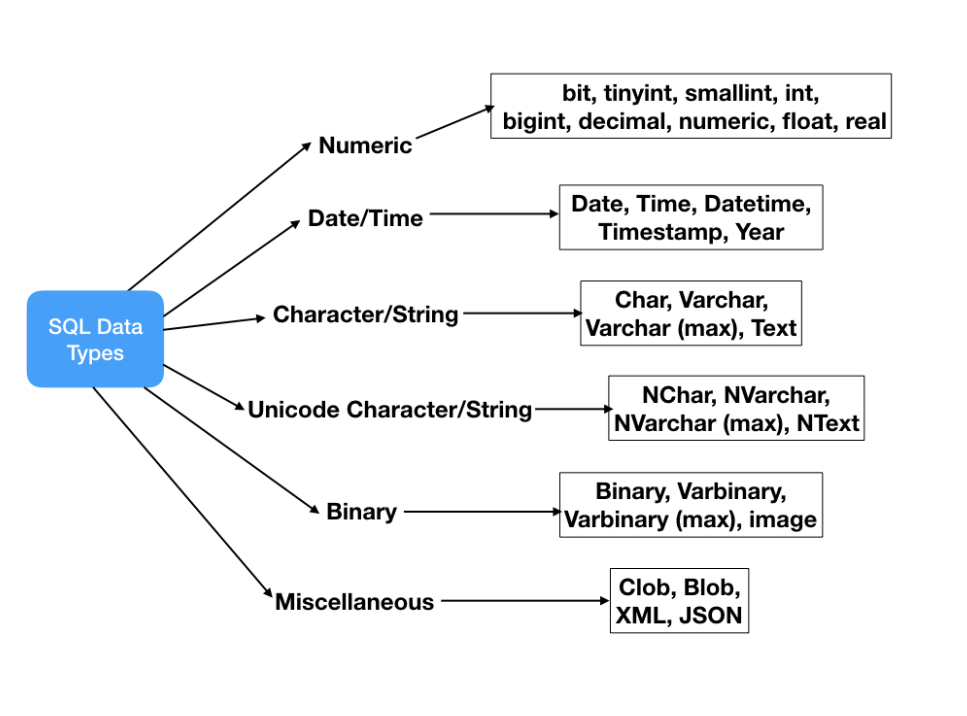

# SQL BASIC

## What is SQL ?
- `DBMS-Database Management System`là phần mềm được thiết kế để có thể xác định, tiến hành các thao tác, truy xuất và quản lý dữ liệu trong `database`.
- `Database` là một bộ sưu tập dữ liệu được tổ chức bày bản và thường được truy cập từ hệ thống máy tính hoặc tồn tại dưới dạng tập tin trong `DBMS`.
- `SQL-Structure Query Language` là ngôn ngữ cho phép chúng ta viết các câu lệnh để thao tác với dữ liệu trong `database`.
  

- Trong lập trình khi nhắc đến `SQL` và `NoSQL` chúng ta ngầm hiểu là ám chỉ đến 2 loại `DBMS` khác nhau:
    - `Relational database`: `MySQL`, `MSSQL`, `Postgres`... Đây là những `database` thường sử dụng để lưu trữ dữ liệu có cấu trúc rõ ràng, có tính quan hệ với nhau và quan trọng nhất là sử dụng `SQL` để truy vấn data.
    - `Non-relational database`: `MongoDB`, `Cassandra`, `DynamoDB`... Hiểu một cách đơn giản nó ngược lại so với `SQL`. Đây là những `database` có khả năng lưu trữ dữ liệu phi cấu trúc, không cần thể hiện quan hệ ràng buộc với nhau, không sử dụng `SQL` để truy vấn data.

- Trong nội dung của phần này chúng ta sẽ chỉ tập trung tìm hiểu về `Relational database`, `SQL` và các `DBMS` hỗ trợ `Relational database`.

## Database structure
- Trong `relational database`, `data` được tổ chức dưới dạng `table` bao gồm `column (field)` và `row (record)`
  
- Ví dụ với `table` Product chứa thông tin của các sản phẩm bao gồm một vài column cơ bản như id, product_name, price, description.

### Column (field)
- Một `Column` sẽ bao gồm tên của `Column` và kiểu dữ liệu -`Data types`

#### Data types
- `Data Types` định nghĩa kiểu của giá trị sẽ được lưu trong `column` của một `table`.
  
- `Data Types` có thể được chia thành các loại chính sau:
    - `Numeric`: các thể loại số như là int, tinyint, bigint, float, real, etc.  
      
    - `Date, Time`: thời gian và ngày tháng năm như là  Date, Time, Datetime, etc.  
      
    - `Character, String:`: ký tự và chuỗi như là char, varchar, text, etc.  
        
      *`Lưu ý`: các kiểu dữ liệu trên dành cho các luồng ký tự (character stream) không nên được sử dụng cho kí tự unicode.*  
    - `Unicode character`: ký tự thuộc các bảng mã Unicode như là nchar, nvarchar, ntext, etc.  
        
      *`Lưu ý`: các loại dữ liệu kể trên chưa được hỗ trợ trong MySql.*  
    - `Binary`: chuỗi nhị phân như là binary, varbinary, etc.  
        
    - `Miscellaneous`: các kiểu đặc biệt khác như là clob, blob, xml, cursor, table, etc.  
        
- Một số lưu ý quan trọng về `Data Types`:
    - Không phải tất cả các `Data Type` đều được hỗ trợ trong các `DBMS`, ví dụ `Oracle database` không hỗ trợ kiểu DATETIME.
      vì vậy khi thiết kế cơ sở dữ liệu hay viết câu lệnh `SQL` cần nắm rõ kiểu dữ liệu có được hỗ trợ trong `DBMS` đang sử dụng hay không.
    - Bài viết chỉ nêu ra những loại dữ liệu phổ biến nhất trong các `DBMS` một số `DBMS` vẫn có các `Data type` của riêng chúng như
      Microsoft SQL Server có `money`, `smallmoney`.
    - Cần lưu ý về khả năng lưu trữ của `Data Type` để chọn ra loại phù hợp nhất cho yêu cầu của dự án.

#### NULL 
-`NULL`: Là 1 ký hiệu trong `SQL` và các `RDBMS` chỉ sự vô giá trị.
#####  History of NULL
- E.F.Codd- người khai sinh ra cơ sở dữ liệu quan hệ khi nghiên cứu về sự vô giá trị của dữ liệu đã chia chúng thành 2 loại: 
  - `Unknown`: chưa biết hay là chưa có thông tin, chúng ta biết chắc rằng dữ liệu đó sẽ có giá trị nhưng trong thời điểm hiện tại chúng ta chưa biết giá trị của dữ liệu đó.
(VD: Khi đi đường chúng ta thấy những người đi bộ và biết chắc chắn là họ có tuổi nhưng lại không thể biết chính xác là bao nhiêu=>Bây giờ không hiểu nhưng nếu đầy đủ điều kiện thì có thể hiểu)
  - `Not Applicable/Inapplicable`:  thông tin không thể áp dụng cho dữ liệu mà chúng ta nói đến (VD: Khi chúng ta gán độ dài của cánh máy bay cho 1 bảng dữ liệu về oto=>
Kể cả có cố gắng thế nào đi chăng nữa thì cũng không hiểu).
- Sau này hai loại vô giá trị trên được gom lại thành một và lấy ký hiệu đại diện là `NULL`.
##### NULL characteristics
- Các giá trị khi so sánh với `NULL` sẽ trả về kết quả `UNKOWN`:
```sql
--Tất cả những biểu thức dưới đây đều được trả kết quả unknown
1 = NULL
2 > NULL
3 < NULL
4 <> NULL
NULL = NULL
```
  - Vì tính chất này nên khi dùng các toán tử để so sánh sẽ gây ra lỗi, chẳng hạn như câu Query dưới đây, 
Database sẽ thực hiện so sánh và trả về tất cả các giá trị  `col_1 = NULL` cho ra kết quả `TRUE` nhưng lại nhận lại các giá trị `UNKOWN` từ đó gây ra lỗi.
Để khắc phục điều này chúng ta sử dụng `col_1 IS NULL` để thay thế cho `col_1 = NULL`.
```sql
--SQL thất bại khi gọi ra NULL
SELECT *
  FROM tbl_A
 WHERE col_1 = NULL
```
- 
## How database store data
https://www.youtube.com/watch?v=OyBwIjnQLtI&list=PL6n9fhu94yhXg5A0Fl3CQAo1PbOcRPjd0
https://modern-sql.com/concept/three-valued-logic
