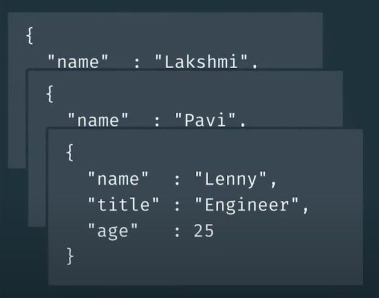

# Chapter 1: What is MongoDB?

## 1. What is MongoDB?

`DB` là một tập hợp các dữ liệu và thông tin được lưu một cách có tổ chức và cấu trúc nhất định. Có 2 loại DB là `SQL` và `NoSQL`.

MongoDB là một DB thuộc loại NoSQL, nó thể hiện việc lưu trữ dữ liệu nhưng không thể hiện quan hệ ràng buộc giữa chúng, và không lưu dưới dạng các bảng và cột như SQL. Mặc dù không lưu dưới dạng các bảng và cột, nhưng MongoDB vẫn lưu teo cấu trúc và tổ chức của nó.

Cụ thể hơn, MongoDB là một cơ sở dữ liệu tài liệu (`MongoDB is a NoSQL document data base`). Nghĩa là, các dữ liệu trong MongoDB được lưu trữ dưới dạng các `tài liệu` (document). Và tập hợp các tài liệu được gọi là một `collection`.

## 2. What is a Document in the MongoDB?

Một `document` trong MongoDB là một cách tổ chức và lưu trữ dữ liệu dưới dạng một tập hợp các cặp giá trị `field` - `value`, hay còn gọi là `key` - `value`. Trong đó các trường (`field`) là duy nhất và value là giá trị của các trường đó.

Nó như là một đối tượng JSON vậy. Ví dụ:

```JSON
{
    <field>: <value>,
    <field>: <value>,
    "name": "Lakshmi",
    "title": "Team Lead",
    "age": 26
}
```

Một `collection` trong MongoDB là một cách lưu trữ có tổ chức của các `document`, và **thông thường** thì các field của document thuộc một collection là giống nhau.



Về khoản này, chúng ta hoàn toàn có thể ánh xạ khái niệm collection và document của MongoDB sang với table và record của SQL: một collection tương tự với một table và một document là một record trong table đó, vì vậy nên các trường (field) của document chính là các cột (column) trong bảng của SQL.


