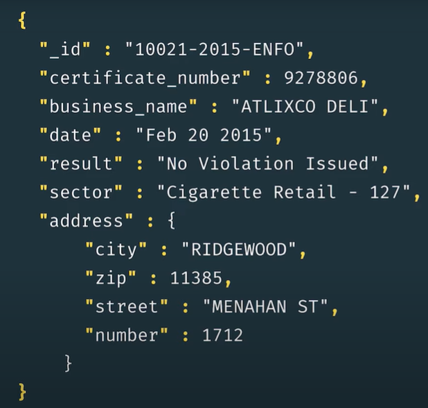
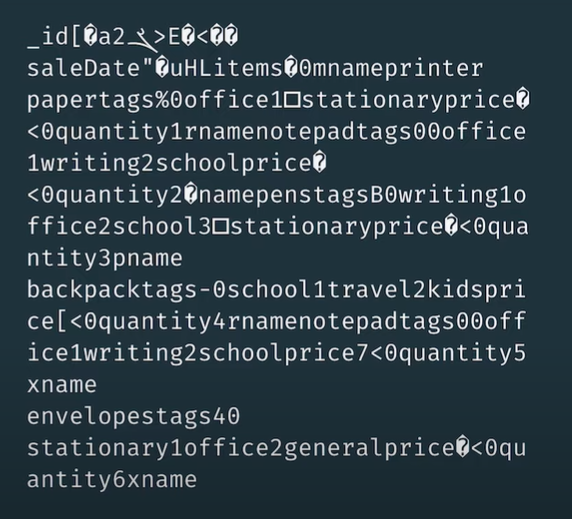

# Chapter 2: Importing, Exporting and Querying data

## 1. How does MongoDB store data?

Khi chúng ta xem, tìm kiếm, cập nhật, thêm mới, xóa bỏ (nói chung là các hành động CRUD) với document và collection trong MongoDB, chúng ta đang thao tác với [JSON (JavaScript Object Notation)](https://www.w3schools.com/js/js_json_intro.asp).



Chúng ta sẽ không bàn nhiều về JSON ở bài viết này. Ngoài các ưu điểm của JSON ra, ta cần đề cập tới 1 số yếu điểm của nó đó chính là các ký tự là văn bản (con người đọc được, tốn công encode/edcode khi lưu trữ), tiêu tốn khá nhiều khoảng trắng và xuống dòng, có số lượng kiểu dữ liệu hạn chế, ... Vì thế nên MongoDB cho phép người dùng xem dữ liệu dưới dạn JSON nhưng lại lưu trữ dữ liệu dưới dạng BSON.

BSON (Binary JSON) là một kiểu JSON nhưng lưu dưới dạng nhị phân. Nó cắt giảm khoảng trống thừa, tăng tốc độ khi truy cập, hỗ trợ nhiều kiểu dữ liệu và linh hoạt hơn. Điều này giúp cho việc sử dụng BSON để lưu trữ mang lại hiệu năng cao hơn của MongoDB.



## 2. Import & export

Import và export dữ liệu của DB hoặc collection là hành động lưu trữ hoặc migrate/dump dữ liệu từ DB này qua DB khác hoặc từ địa chỉ này qua địa chỉ khác. MongoDB lưu trữ dữ liệu dưới dạng BSON, nhưng thể hiện dữ liệu cho người dùng xem dưới dạng JSON. Vì vậy, có 2 cách để import dữ liệu cũng như 2 cách để export dữ liệu.


Khi chúng ta muốn thao tác với kiểu dữ liệu JSON, chúng ta có 2 lệnh `mongoimport` và `mongoexport`.

Cấu trúc của 2 lệnh trên như sau:

```shell
mongoexport --collection=<coll> <options> <connection-string>

mongoimport <options> <connection-string> <file>
```

Chúng ta có thể export được 1 collection trong DB, hoặc cả DB. Ngoài ra, chúng ta có thể lưu trữ vào file và vị trí thư mục mà ta mong muốn. Với import chúng ta cần trỏ đường dẫn của file dữ liệu cần import vào trong MongoDB.

Với các option cụ thể của lệnh export có thể đọc tại [đây](https://www.mongodb.com/docs/database-tools/mongoexport/), và lệnh import có thể đọc tại [đây](https://www.mongodb.com/docs/database-tools/mongoimport/)


Khi chúng ta muốn thao tác với kiểu dữ liệu BSON, chúng ta có 2 lệnh `mongorestore` và `mongodump`

Cấu trúc của 2 lệnh trên như sau:

```shell
mongodump <options> <connection-string>

mongorestore <options> <connection-string> <directory or file to restore>
```

Với các option cụ thể của lệnh dump có thể đọc tại [đây](https://www.mongodb.com/docs/database-tools/mongodump/) và lệnh restore có thể đọc tại [đây](https://www.mongodb.com/docs/database-tools/mongorestore/)

## 3. Data explorer

## 4. Find command


<br/>
<br/>

REFERENCES

[1] MongoDB Basic tutorial of `MongoDB university`
