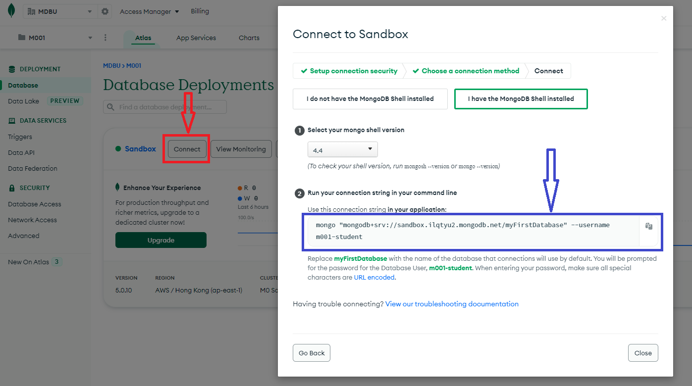
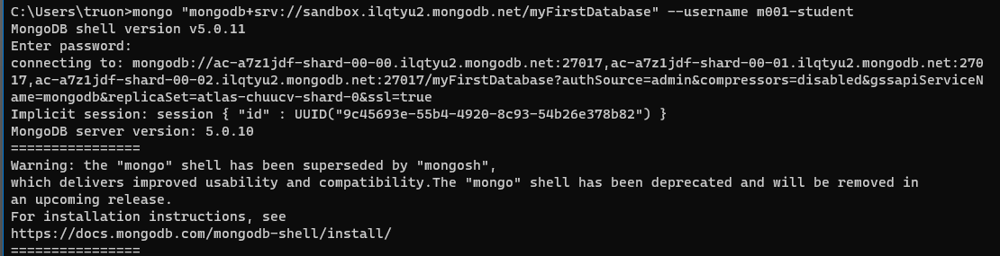
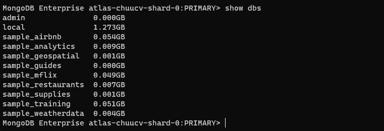
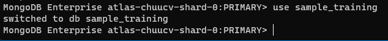
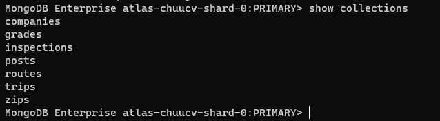
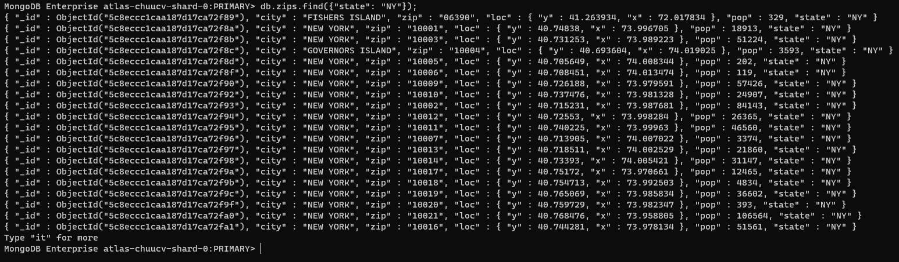
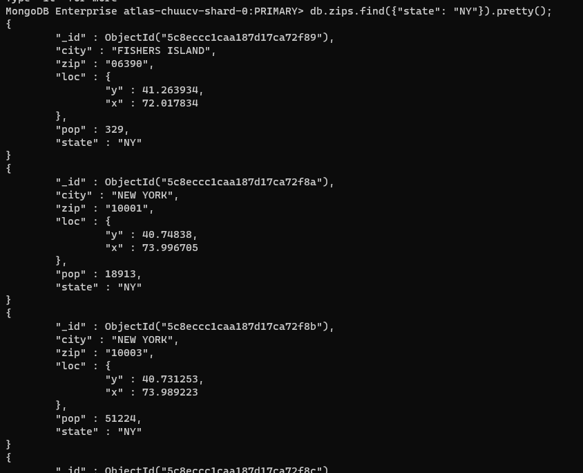
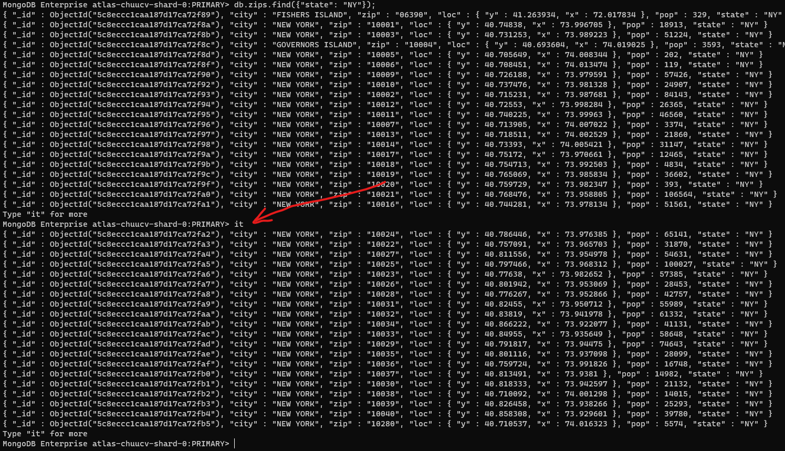
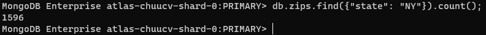

# Chapter 2: Importing, Exporting and Querying data

## 1. How does MongoDB store data?

Khi chúng ta xem, tìm kiếm, cập nhật, thêm mới, xóa bỏ (nói chung là các hành động CRUD) với document và collection trong MongoDB, chúng ta đang thao tác với [JSON (JavaScript Object Notation)](https://www.w3schools.com/js/js_json_intro.asp).


Chúng ta sẽ không bàn nhiều về JSON ở bài viết này. Ngoài các ưu điểm của JSON ra, ta cần đề cập tới 1 số yếu điểm của nó đó chính là các ký tự là văn bản (con người đọc được, tốn công encode/edcode khi lưu trữ), tiêu tốn khá nhiều khoảng trắng và xuống dòng, có số lượng kiểu dữ liệu hạn chế, ... Vì thế nên MongoDB cho phép người dùng xem dữ liệu dưới dạn JSON nhưng lại lưu trữ dữ liệu dưới dạng BSON.

BSON (Binary JSON) là một kiểu JSON nhưng lưu dưới dạng nhị phân. Nó cắt giảm khoảng trống thừa, tăng tốc độ khi truy cập, hỗ trợ nhiều kiểu dữ liệu và linh hoạt hơn. Điều này giúp cho việc sử dụng BSON để lưu trữ mang lại hiệu năng cao hơn của MongoDB.


## 2. Import & export

Import và export dữ liệu của DB hoặc collection là hành động lưu trữ hoặc migrate/dump dữ liệu từ DB này qua DB khác hoặc từ địa chỉ này qua địa chỉ khác. MongoDB lưu trữ dữ liệu dưới dạng BSON, nhưng thể hiện dữ liệu cho người dùng xem dưới dạng JSON. Vì vậy, có 2 cách để import dữ liệu cũng như 2 cách để export dữ liệu.


Khi chúng ta muốn thao tác với kiểu dữ liệu JSON, chúng ta có 2 lệnh `mongoimport` và `mongoexport`.

Cấu trúc của 2 lệnh trên như sau:

```shell
mongoexport --collection=<coll> <options> <connection-string>

mongoimport <options> <connection-string> <file>
```

Chúng ta có thể export được 1 collection trong DB, hoặc cả DB. Ngoài ra, chúng ta có thể lưu trữ vào file và vị trí thư mục mà ta mong muốn. Với import chúng ta cần trỏ đường dẫn của file dữ liệu cần import vào trong MongoDB.

Với các option cụ thể của lệnh export có thể đọc tại [đây](https://www.mongodb.com/docs/database-tools/mongoexport/), và lệnh import có thể đọc tại [đây](https://www.mongodb.com/docs/database-tools/mongoimport/)


Khi chúng ta muốn thao tác với kiểu dữ liệu BSON, chúng ta có 2 lệnh `mongorestore` và `mongodump`

Cấu trúc của 2 lệnh trên như sau:

```shell
mongodump <options> <connection-string>

mongorestore <options> <connection-string> <directory or file to restore>
```

Với các option cụ thể của lệnh dump có thể đọc tại [đây](https://www.mongodb.com/docs/database-tools/mongodump/) và lệnh restore có thể đọc tại [đây](https://www.mongodb.com/docs/database-tools/mongorestore/)

## 3. Find command

Chúng ta làm quen với câu lệnh thao thác với dữ liệu đầu tiên trong MongoDB, câu lệnh tìm kiếm - `find()`

Trước tiên, chúng ta cần connect tới MongoDB của chúng ta. Để làm được điều này, ta cần cài đặt mongoDB ở trong máy tính của chúng ta, hoặc sử dụng server của [Atlas](https://cloud.mongodb.com/).

Hướng dẫn cài đặt MongoDB server tại [đây](https://www.mongodb.com/docs/manual/installation/)

Sau khi đã cài đặt MongoDB server, ta mở terminal lên và thực hiện connect bằng lệnh (lệnh này được copy từ Atlas)




Và kết quả sau khi connect thành công tới DB:



Để hiển thị tất cả danh sách database đang có trong server, chúng ta sử dụng lệnh `show dbs`



Trong đó 2 database `admin` và `local` là 2 database của hệ thống, chúng ta chưa nên khám phá ở thời điểm hiện tại, hãy quan tâm tới các database khác ngoài 2 database này.

Muốn sử dụng 1 trong các database hiện có, chúng ta sử dụng lệnh `use <db name>` để thực hiện.



Và hiển thị tất cả các collection hiện có trong db `sample_training`, ta sử dụng lệnh `show collections`



Như đã đề cập ở bài trước, các collection trong MongoDB tương đương với các bảng trong các ngôn ngữ SQL khác. Vì vậy, chúng ta muốn tìm kiếm dữ liệu trong collection, tức là đồng nghĩa với việc chúng ta thực hiện tìm kiếm trong các bảng. Và việc này chính là sử dụng câu truy vấn `SELECT` trong SQL, nhưng với MongoDB, đó chính là câu lệnh `find()`. Ví dụ, muốn tìm các bang có tên là `NY` trong bảng `zips`, chúng ta sẽ dùng lệnh sau:

```JS
db.zips.find({"state": "NY"});
```
Lệnh này tương đương với câu SQL:

```SQL
SELECT * 
FROM zips
WHERE state = 'NY';
```

Và đây là kết quả:



Nếu như muốn format định dạng JSON cho dễ nhìn và đẹp hơn, ta dùng hàm `pretty()`.



Và đây chính là kết quả trả ra, hay còn gọi là `result set`. Và MongoDB sẽ mặc định trả ra 20 bản ghi đầu tiên hợp lệ với bộ lọc (filter) bên trong hàm `find`. Muốn xem các bản ghi tiếp theo của result set, ta gõ lệnh `it` - viết tắt của `iterate`.



Khi sử dụng `it`, chúng ta đang duyệt qua cursor, cursor là một con trỏ thực hiện trỏ tới ô nhớ lưu trữ kết quả của câu truy vấn mà chúng ta vừa mới chạy.

Một ví dụ khác, chúng ta cần đếm xem có bao nhiêu bản ghi có state mang giá trị "NY", chúng ta cần thực hiện một câu truy vấn tương đương với câu truy vấn sử dụng hàm `COUNT` trong SQL:

```SQL
SELECT COUNT(*)
FROM zips
WHERE state = 'NY';
```

Với MongoDB, câu truy vấn sẽ như sau:

```JS
db.zips.find({"state": "NY"}).count();
```

Và đây là kết quả:



Nếu để ý một chút ta hoàn toàn có thể thấy rằng, các câu lệnh truy vấn trong MongoDB có cú pháp chính là JavaScript. Đây là một điểm mới và mạnh mẽ của MongoDB, sử dụng JS là một ngôn ngữ dễ tiếp cận, không quá khó và thời gian học nhanh, sẽ làm người sử dụng dễ dàng làm quen cũng như trở nên thành thạo với truy vấn của MongoDB hơn. Cụ thể, dầu tiên sẽ là `db`, sau đó tới tên của collection, rồi tới tên hàm chúng ta cần sử dụng.

```JS
db.<collection name>.<method name>();
```

Hàm `find` có rất nhiều điều kiện truy vấn tương đương với SQL mà ta đã biết như `AND`, `OR`, `NOT`, ... hay các hàm tính toán phức tạp hơn, ... Cú pháp cơ bản và chi tiết được đề cập ở [đây](https://www.mongodb.com/docs/manual/reference/method/db.collection.find/). Trong các phần tiếp theo, chúng ta sẽ tìm hiểu kĩ hơn về hàm `find` cũng như cách thức sử dụng nó một cách nhuần nhuyễn hơn.

<br/>
<br/>

REFERENCES

[1] MongoDB Basic tutorial of `MongoDB university`
