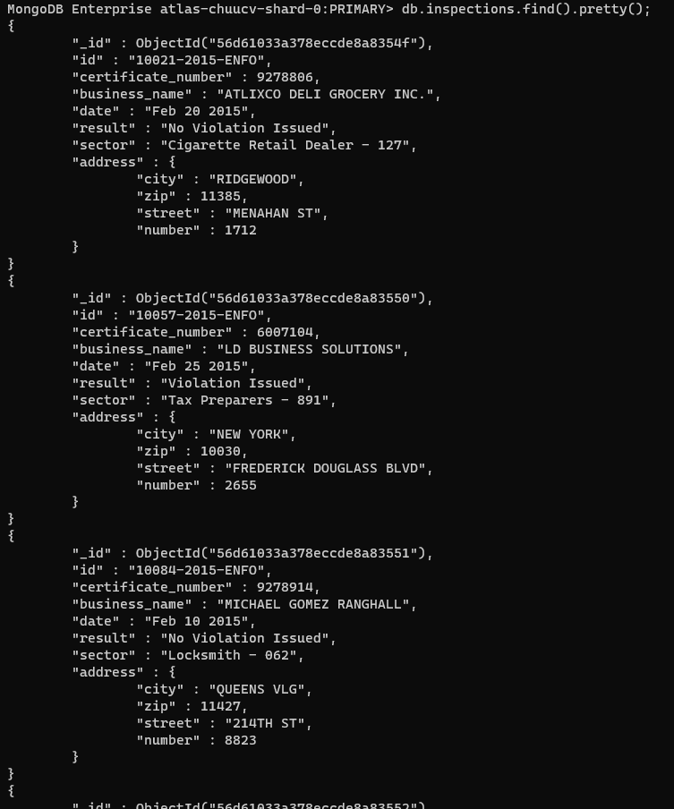
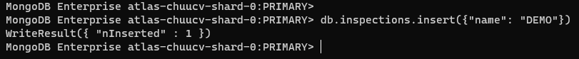
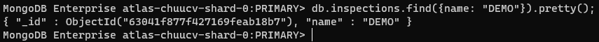
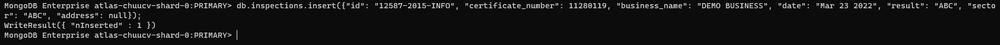
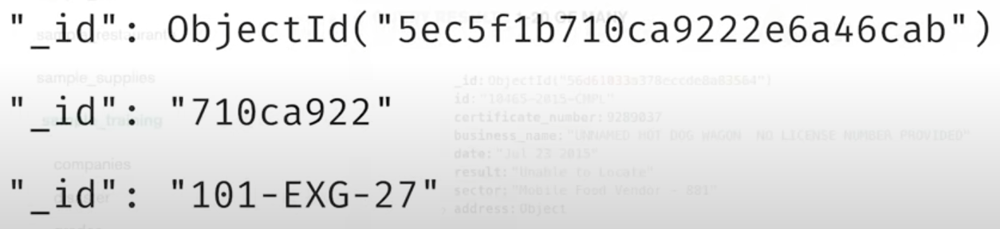

# Chapter 3: Creating and Manipulating documents

## 1. Inserting new documents, ObjectId

Muốn insert dữ liệu (insert document) vào một collection, chúng ta sử dụng hàm [`insert()`](https://www.mongodb.com/docs/manual/reference/method/db.collection.insert/). 

Giả sử chúng ta cần insert data vào collection `inspections` thuộc db `sample_training`, các document sẽ có dạng như sau.

Một điểm đáng chú ý trong MongoDB khác so với SQL, đó chính là việc ta không cần insert đầy đủ, đúng theo cấu trúc của collection (mà thực ra không có cấu trúc được chỉ định sẵn cho collection rằng bắt buộc nó phải có bao nhiêu cột, bao nhiêu trường giống SQL). Ngược lại, với SQL, khi chúng ta tạo bảng, chúng ta cần quy định xem bảng đó có bao nhiêu trường/cột, các cột nào được phép NULL và các cột nào không. Từ đó, khi chạy lệnh insert ta cần insert tất cả các trường mà không cho phép NULL.

Ví dụ, một document của collection `inspections` chứa các trường như `certificate_number`, `result`, `sector`, ... Nhưng nếu ta cố tình insert một document mới không có các trường trên, mà là các trường ta tùy ý thêm vào thì sao?

MongoDB vẫn cho phép chúng ta insert như bình thường, và để kiểm chứng, chúng ta thử tìm kiếm.

Điều này nói lên sự khác biệt to lớn giữa SQL và NoSQL, một bên là các ràng buộc chặt chẽ cần tuân thủ (đó là SQL), còn một bên thì ngược lại, rất thoải mái, phóng túng và không yêu cầu chặt chẽ. Tất nhiên mỗi thứ đều có ưu nhược điểm của nó, ta không bàn sâu về điều đó ở đây, nhưng cũng khuyến nghị rằng chúng ta nên giữ các document trong một collection một cách đồng bộ và trong sáng nhất có thể để tránh việc xung đột và quản lý dữ liệu không được tốt sau này. Vì vậy nên chúng ta nên insert một document với đầy đủ các trường thông tin.

Có một điều chúng ta để ý, đó chính là việc mỗi một document đều có một trường `_id`. Đây chính là giá trị duy nhất không trùng lặp được sử dụng để phân biệt các document với nhau. MongoDB sẽ tự động sinh ra trường này một cách ngẫu nhiên bằng mã hexa cho chúng ta mỗi khi chúng ta thực hiện insert dữ liệu vào collection. 

Giá trị của trường `_id` mặc định là một đối tượng `ObjectId`. Chúng ta hoàn toàn có thể sử dụng giá trị mà chúng ta tự định nghĩa riêng, không theo `ObjectId` của MongoDB, khi ấy, chúng ta cần chỉ rõ giá trị của trường `_id` trong câu lệnh insert, nhưng cần đảm bảo rằng giá trị của trường `_id` này là duy nhất, không được trùng lặp trong một collection. Ảnh dưới đây là một vài ví dụ về giá trị của trường `_id`.

Ngoài ra, câu lệnh `insert` còn hỗ trợ chúng ta có thể thêm vào một mảng các document, chi tiết hơn có thể đọc ở [đây](https://www.mongodb.com/docs/manual/reference/method/db.collection.insert/). Bên cạnh hàm `insert`, MongoDB còn hỗ trợ hàm [`insertOne`](https://www.mongodb.com/docs/manual/reference/method/db.collection.insertOne/) và [`insertMany`](https://www.mongodb.com/docs/manual/reference/method/db.collection.insertMany/)
