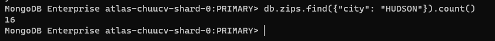
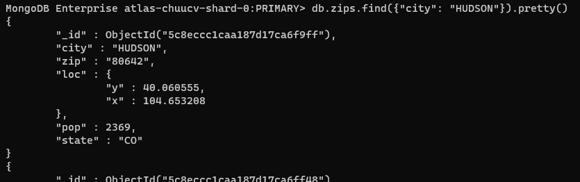
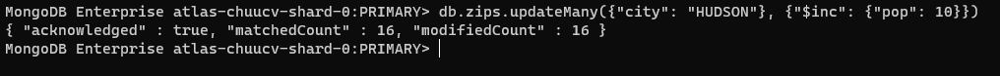
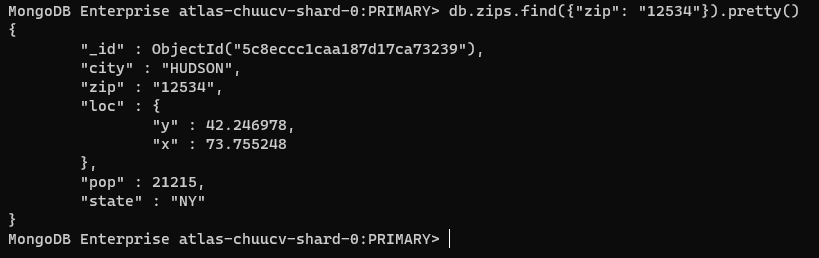
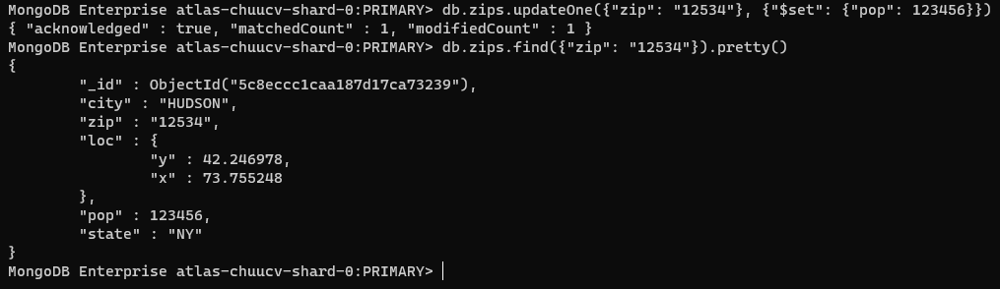
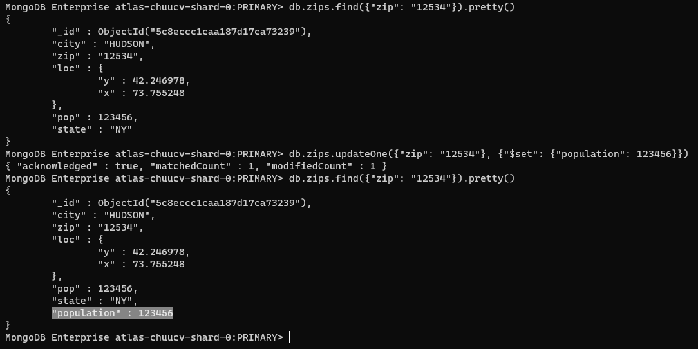
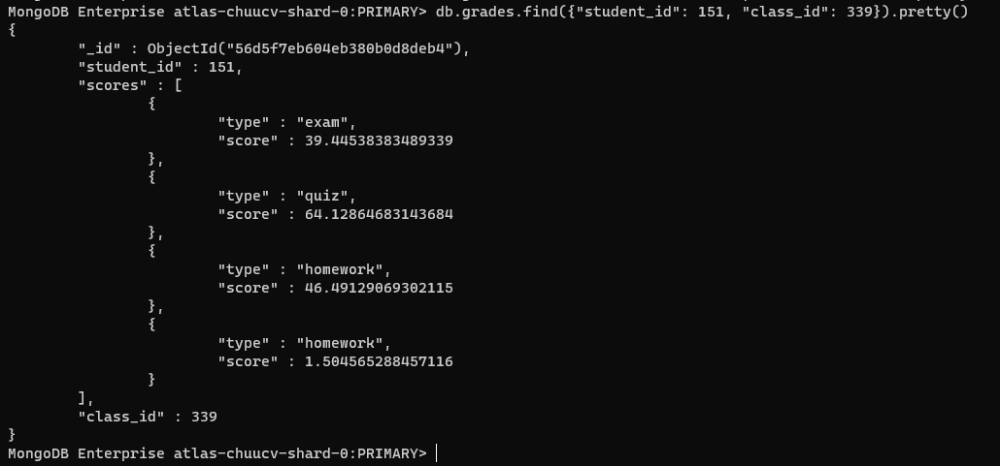
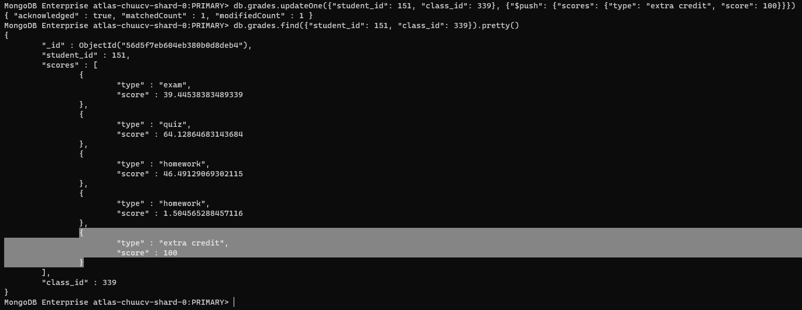

# Chapter 3: Creating and Manipulating documents

## 1. Inserting new documents, ObjectId

Muốn insert dữ liệu (insert document) vào một collection, chúng ta sử dụng hàm [`insert()`](https://www.mongodb.com/docs/manual/reference/method/db.collection.insert/). 

Giả sử chúng ta cần insert data vào collection `inspections` thuộc db `sample_training`, các document sẽ có dạng như sau.


Một điểm đáng chú ý trong MongoDB khác so với SQL, đó chính là việc ta không cần insert đầy đủ, đúng theo cấu trúc của collection (mà thực ra không có cấu trúc được chỉ định sẵn cho collection rằng bắt buộc nó phải có bao nhiêu cột, bao nhiêu trường giống SQL). Ngược lại, với SQL, khi chúng ta tạo bảng, chúng ta cần quy định xem bảng đó có bao nhiêu trường/cột, các cột nào được phép NULL và các cột nào không. Từ đó, khi chạy lệnh insert ta cần insert tất cả các trường mà không cho phép NULL.

Ví dụ, một document của collection `inspections` chứa các trường như `certificate_number`, `result`, `sector`, ... Nhưng nếu ta cố tình insert một document mới không có các trường trên, mà là các trường ta tùy ý thêm vào thì sao?


MongoDB vẫn cho phép chúng ta insert như bình thường, và để kiểm chứng, chúng ta thử tìm kiếm.


Điều này nói lên sự khác biệt to lớn giữa SQL và NoSQL, một bên là các ràng buộc chặt chẽ cần tuân thủ (đó là SQL), còn một bên thì ngược lại, rất thoải mái, phóng túng và không yêu cầu chặt chẽ. Tất nhiên mỗi thứ đều có ưu nhược điểm của nó, ta không bàn sâu về điều đó ở đây, nhưng cũng khuyến nghị rằng chúng ta nên giữ các document trong một collection một cách đồng bộ và trong sáng nhất có thể để tránh việc xung đột và quản lý dữ liệu không được tốt sau này. Vì vậy nên chúng ta nên insert một document với đầy đủ các trường thông tin.


Có một điều chúng ta để ý, đó chính là việc mỗi một document đều có một trường `_id`. Đây chính là giá trị duy nhất không trùng lặp được sử dụng để phân biệt các document với nhau. MongoDB sẽ tự động sinh ra trường này một cách ngẫu nhiên bằng mã hexa cho chúng ta mỗi khi chúng ta thực hiện insert dữ liệu vào collection. 

Giá trị của trường `_id` mặc định là một đối tượng `ObjectId`. Chúng ta hoàn toàn có thể sử dụng giá trị mà chúng ta tự định nghĩa riêng, không theo `ObjectId` của MongoDB, khi ấy, chúng ta cần chỉ rõ giá trị của trường `_id` trong câu lệnh insert, nhưng cần đảm bảo rằng giá trị của trường `_id` này là duy nhất, không được trùng lặp trong một collection. Ảnh dưới đây là một vài ví dụ về giá trị của trường `_id`.


Khi ta insert document vào collection của MongoDB, nếu như trùng giá trị của trường `_id` thì MongoDB sẽ bắn ra lỗi và hành động insert sẽ không thành công.

Ngoài ra, câu lệnh `insert` còn hỗ trợ chúng ta có thể thêm vào một mảng các document, chi tiết hơn có thể đọc ở [đây](https://www.mongodb.com/docs/manual/reference/method/db.collection.insert/). Bên cạnh hàm `insert`, MongoDB còn hỗ trợ hàm [`insertOne`](https://www.mongodb.com/docs/manual/reference/method/db.collection.insertOne/) và [`insertMany`](https://www.mongodb.com/docs/manual/reference/method/db.collection.insertMany/)

Khi sử dụng hàm `insert` và truyền vào một mảng các document, các document này lần lượt được insert theo thứ tự mà chúng đứng trong mảng, từ đầu tới cuối.


Có 3 bản ghi được insert và không có lỗi xảy ra, nhưng khi chúng ta chạy lại lệnh insert này 1 lần nữa, cũng không có lỗi xảy ra.


Do MongoDB tự động sinh ra `_id` cho mỗi document khi chúng được thêm vào một collection. Để tránh việc này, ta cần thêm id của mình. Nhưng giả sử, khi 2 id nào đó của 3 document ta muốn insert bị trùng nhau thì sao?


MongoDB báo lỗi ở bản ghi có `name` là `test 2` và kết quả là chỉ insert được 1 bản ghi mà thôi. Điều này lý giải như sau: Trong mảng các document chúng ta muốn insert vào DB, MongoDB sẽ duyệt từ đầu cho tới cuối mảng và gặp document nào sẽ insert document đó, khi gặp `_id` trùng, MongoDB sẽ bắn ra lỗi và dừng lại. Điều này nói lên rằng bản ghi có `_id` là `1` với `name` là `test 1` đã được insert, nhưng khi insert bản ghi có `name` là `test 2`, do trùng giá trị trường `_id` nên MongoDB bắn ra lỗi và dừng việc insert lại, bản ghi có `_id` là `3` sẽ không được insert vào DB.

Việc insert theo thứ tự này là mặc định, hoặc có thể thêm vào trong câu lệnh dưới dạng một option như sau


Khi không muốn việc insert theo thứ tự này diễn ra, mà ta muốn MongoDB phải quét hết tất cả các bản ghi và thực hiện insert hết các bản ghi mà nó có thể, ta sử dụng option `order: false`.


Ngoài ra, việc insert nhiều dữ liệu cùng lúc chúng ta hoàn toàn có thể sử dụng lệnh `mongoimport` hoặc `mongorestore` đã được đề cập ở [bài trước](./02-chapter-2.md).

## 2. Creat new database, collection

Khi chúng ta muốn tạo một DB mới, ta chỉ cần sử dụng lệnh `use <db name>` với điều kiện tên DB đó chưa tồn tại trong hệ thống.

Và tương tự, khi chúng ta muốn tạo 1 collection mới, chúng ta có thể tạo thông qua việc `insert` dữ liệu với tên collection chưa tồn tại trong hệ thống.


## 3. Updating documents

Trong MongoDB query language (MQL), có 2 câu lệnh phổ biến trong việc update một hoặc nhiều document, đó chính là [`updateOne`](https://www.mongodb.com/docs/manual/reference/method/db.collection.updateOne/) (tương ứng với `findOne`) và [`updateMany`](https://www.mongodb.com/docs/manual/reference/method/db.collection.updateMany/) (tương ứng với `find`). Câu hỏi được đặt ra là, giả sử như điều kiện update của lệnh `updateOne` tìm ra nhiều hơn 1 bản ghi cần update thì sao? Câu trả lời đó chính là chỉ duy nhất 1 bản ghi tìm thấy đầu tiên được update mà thôi, các bản ghi còn lại mặc dù khớp với điều kiện update nhưng sẽ không được cập nhật.

Trước tiên, chúng ta có 16 bản ghi có dữ liệu thành phố là HUDSON



Với mỗi bản ghi có câu trúc như sau:



Hãy cập nhật cả 16 bản ghi này bằng cách tăng giá trị trường `pop` lên thêm 10 đơn vị cho cả 16 bản ghi này, chúng ta sử dụng toán tử [`$inc`](https://www.mongodb.com/docs/manual/reference/operator/update/inc/)



Kết quả là chúng ta đã tìm thấy 16 bản ghi (`matchedCount` có giá trị là 16), kết quả sau khi cập nhật là thành công (`ackowledged` mang giá trị `true`) với 16 bản ghi được cập nhật (`modifiedCount` mang giá trị 16).

Toán tử `$inc` có thể sử dụng để tăng giá trị của nhiều trường cùng lúc với cú pháp:

```JS
{"$inc": {"pop": 10, "<field2>": <increment value>, ... }}
```

Xét bản ghi có zip code là 12534.



Cập nhật trường `pop` của bản ghi này, khi chúng ta cập nhật giá trị mới luôn, không thông qua tăng hoặc giảm như cách sử dụng toán tử `$inc` trước đó, ta sử dụng toán tử [`$set`](https://www.mongodb.com/docs/manual/reference/operator/update/set/).



Và cũng tương tự trước đó, chúng ta đã cập nhật thành công, nhưng chỉ với 1 bản ghi được ghi nhận thay đổi.

Nhưng giả sử ta viết sai tên trường cần update thì sao? Kết quả là một trường mới sẽ được thêm vào document mà chúng ta update.



Vì thế, khi sử dụng hàm update, chúng ta cần cẩn trọng trong việc viết đúng tên trường và đúng chính tả.

Toán tử `$set` có thể sử dụng để cập nhật giá trị cho nhiều trường, hoặc thêm giá trị cho nhiều trường cùng một lúc với cú pháp:

```JS
{"$set": {"pop": 10, "<field2>": <increment value>, ... }}
```

Còn trường hợp cập nhật giá trị cho một trường mà trường đó là một mảng dữ liệu có sẵn trong DB thì sao? Chúng ta dùng toán tử `$push`. Giả sử chúng ta có một bản ghi có dữ liệu như sau:



Chúng ta sẽ sử dụng toán tử `$push` để thêm object vào mảng `scores` đã có sẵn:




Kết quả cho ra thành công với mong đợi!

Khi muốn thêm một mảng vào document sẵn có, ta chắc chắn là dùng toán tử `$set` rồi! Khi muốn loại bỏ 1 trường ra khỏi 1 document, chúng ta sẽ sử dụng toán tử ngược lại với `$set` đó chính là [`$unset`](https://www.mongodb.com/docs/manual/reference/operator/update/unset/)

Ngoài 2 hàm `updateOne` và `updateMany`, chúng ta có một hàm [`update`](https://www.mongodb.com/docs/manual/reference/method/db.collection.update/), xử lý chung cho cả 2 hàm trên

## 4. Deleting documents

<br/>
<br/>

REFERENCES

[1] MongoDB Basic tutorial of `MongoDB university`
