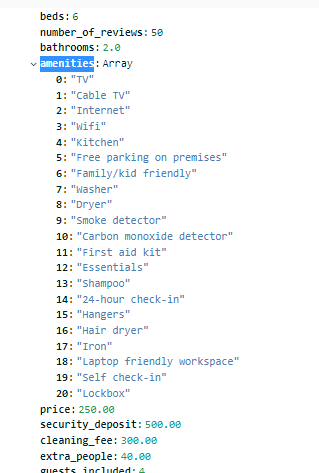

# Chapter 3: Advanced CRUD Operations

## 1. Query operators - Comparision

Trong các bài học trước, chúng ta đã được tiếp cận với một số các toán tử - operator trong các câu lệnh CRUD như `$set`, `$unset`, `$inc`, ... Trong phần này, chúng ta làm quen với 1 số toán tử khác cũng được sử dụng trong các câu lệnh CRUD. Và các toán tử này đều có chung cách sử dụng ở các điều kiện của các câu CRUD.


Giả sử, muốn tìm những chuyến đi có độ dài nhỏ hơn hoặc bằng 70 trong collection `trips` thuộc DB `sample_training`, chúng ta sẽ làm như sau


Hoặc sử dụng nhiều toán tử trong cùng một câu truy vấn như: những chuyến đi có độ dài nhỏ hơn hoặc bằng 70 và có loại người dùng không phải là `subscriber`.


## 2. Query operators - Logic

Các toán tử logic được thể hiện trong mongodb cũng có cú pháp giống như các toán tử trước: có ký tự `$`.


Cú pháp của `$and`, `$or` và `$nor` sẽ giống nhau: chứa một tập các mệnh đề


Còn cú pháp của `$not` sẽ khác biệt với 3 toán tử còn lại


Và lưu ý rằng, trong câu truy vấn với các điều kiện liên tục liền nhau, đó chính là việc sử dụng toán tử `$and`.

```JS
{"sector": "Mobile Food Vendor - 881", "result": "Warning"}
```

tương đương với:

```JS
{"$and": [{"sector": "Mobile Food Vendor - 881", "result": "Warning"}]}
```

Chúng ta hoàn toàn có thể thu gọn cú pháp của `$and` khi cảm thấy thừa thãi. Ví dụ:

```JS
{"$and": [{"student_id": {"$gt": 25}}, {"student_id": {"$lt": 100}}]}
```

chuyển thành

```JS
{"student_id": {"$gt": 25, "$lt": 100}}
```

Với các toán tử quen thuộc như trên, chúng ta không đề cập quá nhiều ở đây, nếu muốn đọc thêm về cú pháp, hãy truy cập phần document của các toán tử: [`$and`](https://www.mongodb.com/docs/manual/reference/operator/query/and/), [`$or`](https://www.mongodb.com/docs/manual/reference/operator/query/or/), [`$nor`](https://www.mongodb.com/docs/manual/reference/operator/query/nor/), [`$not`](https://www.mongodb.com/docs/manual/reference/operator/query/not/)

## 3. Expressive query operator

Chúng ta xét đến một toán tử mạnh mẽ trong MongoDB, đó chính là toán tử `$expr`. Toán tử này thường được sử dụng trong agregation pipline của MongoDB, nhưng ngoài công dụng đó, chúng ta còn có thể sử dụng nó trong câu truy vấn bình thường.

Có một kịch bản như sau: bình thường chúng ta sử dụng câu lệnh tìm kiếm để tìm kiếm các trường trong document có giá trị so sánh với một giá trị mà chúng ta biết trước. Ví dụ như tìm thành phố có số lượng dân số lớn hơn 100000. Nhưng một kịch bản khác đặt ra rằng, chúng ta cần so sánh hai trường trong một document với nhau thì chúng ta sẽ làm thế nào? Giống như trong SQL so sánh 2 cột với nhau vậy

```SQL
SELECT *
FROM TABLE
WHERE TABLE.COLUMN_A = TABLE.COLUMN_B
```

Khi ấy, chúng ta nghĩ tới toán tử `$expr`. Xét collection `trips` của db `sample_training`, đây là document mẫu của nó.


Chúng ta chú ý vào 2 trường `start station id` và `end station id`. Bây giờ, chúng ta muốn tìm một chuyến đi nào đó có điểm đầu và điểm cuối giống nhau, chúng ta sẽ làm như sau

```JS
db.trips.find({"$expr": {"$eq": ["$start station id", "$end station id"]}}).pretty()
```

Và đây là kết quả


Chúng ta có 316 bản ghi thỏa mãn điều kiện. Chúng ta sẽ thắc mắc ở cú pháp `$start station id` và `$end station id`. Đó chính là cú pháp lấy giá trị của 2 cột `start station id` và `end station id`. Dấu `$` ngoài việc thể hiện các toán tử như `$and`, `$or`, ..., nó còn thể hiện các biểu thức (expression) ánh xạ tới các cột như là `$start station id` và `$end station id`.

Và bây giờ, ngoài việc điểm đầu và điểm cuối của chuyến đi là giống nhau, thì chúng ta thử tìm kiếm theo 1 điều kiện nữa đó là thời lượng chuyến đi có giá trị 1200. Nếu sử dụng SQL, câu lệnh sẽ như sau:

```SQL
SELECT *
FROM TRIPS
WHERE START_STATION_ID = END_STATION_ID
AND TRIP_DURATION = 1200
```

Nhưng nếu sử dụng MongoDB, cú pháp sẽ như sau:

```JS
db.trips.find({"$expr": {"$and": [{"tripduration": 1200}, {"$eq": ["$start station id", "$end station id"]}]}).pretty()
```

Và kết quả là


## 4. Array operators

Chúng ta đã biết tới toán tử `$push` để thực hiện thao tác thêm một phần tử vào trong mảng khi cập nhật dữ liệu của một document nào đó. Bây giờ, xét tới ngữ cảnh chúng ta muốn tìm kiếm dữ liệu của document mà trường cần tìm kiếm là một mảng dữ liệu, và dữ kiện chúng ta biết chỉ là 1 hoặc 1 số phần tử của mảng đó.

Xét db `sample_airbnb` với collection `listingsAndReviews`. Các document lưu trữ trong đó sẽ có dạng


Trong đó có thuộc tính `amenities` là một mảng các String



Bây giờ, câu lệnh sau sẽ giúp chúng ta tìm ra các document mà trong đó trường `amenities` chứa phần tử mang giá trị `Wifi`

```JS
db.listingsAndReviews.find({"amenities": "Wifi"}).pretty()
```

Và đây là kết quả


Nếu sử dụng cú pháp

```JS
db.listingsAndReviews.find({"amenities": ["Wifi"]}).pretty()
```

thì sẽ không được. Vì db sẽ tìm kiếm chính xác trường `amenities` mang giá trị là một mảng chỉ có 1 phần tử là `wifi`. Nếu như ta tìm chính xác mảng thì sao?

```JS
db.listingsAndReviews.find({"amenities": ["TV","Cable TV","Wifi","Kitchen","Paid parking off premises","Smoking allowed","Pets allowed","Buzzer/wireless intercom","Heating","Family/kid friendly","Washer","First aid kit","Fire extinguisher","Essentials","Hangers","Hair dryer","Iron","Pack ’n Play/travel crib","Room-darkening shades","Hot water","Bed linens","Extra pillows and blankets","Microwave","Coffee maker","Refrigerator","Dishwasher","Dishes and silverware","Cooking basics","Oven","Stove","Cleaning before checkout","Waterfront"]}).pretty()
```

Thì nó chỉ ra 1 bản ghi với dữ liệu trường `amenities` khớp hoàn toàn với mảng cần tìm kiếm.


Nếu chúng ta thử đổi vị trí của TV và Cable TV cho nhau thì sao?


Kết quả là không ra bản ghi vừa rồi nữa. Điều này kết luận rằng, thứ tự tìm kiếm trong mảng là quan trọng và chúng ta nên chú ý khi tìm kiếm theo 1 mảng dữ liệu.

Nhưng chúng ta ngoài việc muốn tìm kiếm chính xác theo cả dữ liệu và thứ tự, nếu chúng ta muốn tìm kiếm 1 hoặc 1 số dữ liệu của mảng `amentities` khớp với 1 hoặc 1 số dữ liệu của mảng đầu vào ở điều kiện tìm kiếm thì sao? Chúng ta sẽ dùng toán tử `$all`.

```JS
db.listingsAndReviews.find({"amenities": {"$all": ["TV","Cable TV","Wifi","Kitchen","Paid parking off premises"]}}).pretty()
```

Câu truy vấn bên trên sẽ tìm ra các document mà có dữ liệu trong trường `amentites` có thể là `TV`, `Cable TV`, `Wifi`, `Paid parking off premises`, hoặc là tổ hợp của 4 dữ liệu đó (có thể khớp 1 trong 4, hoặc 2 trong 4, ... mà không quan tâm thứ tự)

Ngoài toán tử `$all`, toán tử `$size` cũng giúp ích trong việc thao tác với mảng khi truy vấn. Nó cho phép chúng ta lấy ra các document với độ dài dữ liệu là con số mà ta mong muốn. Ví dụ:

```JS
db.listingsAndReviews.find({"amenities": {"$size": 20}}).pretty()
```

Có 206 bản ghi thỏa mãn trường `amentities` trong nó là một mảng có 20 phần tử.


## 5. Array operators an projection

## 6. Array operators an sub-documents


<br/>
<br/>

REFERENCES

[1] MongoDB Basic tutorial of `MongoDB university`
