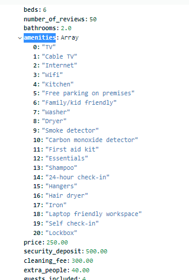
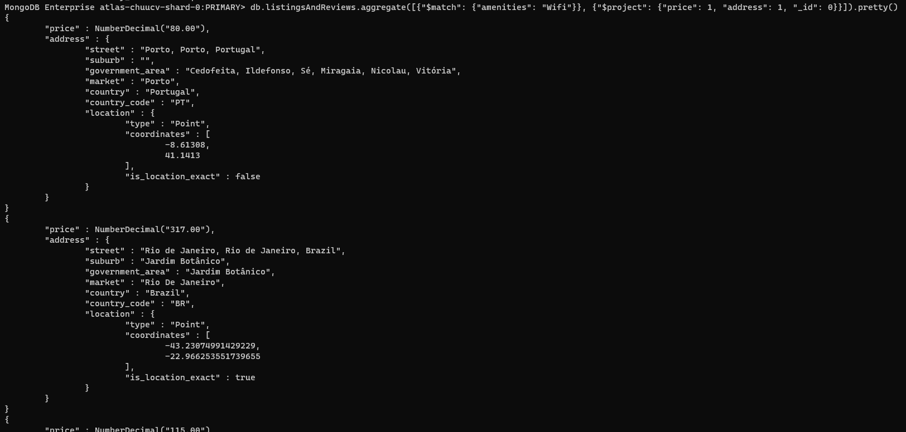
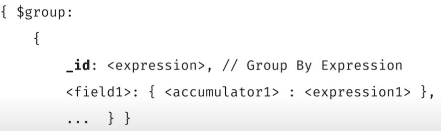
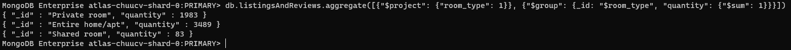
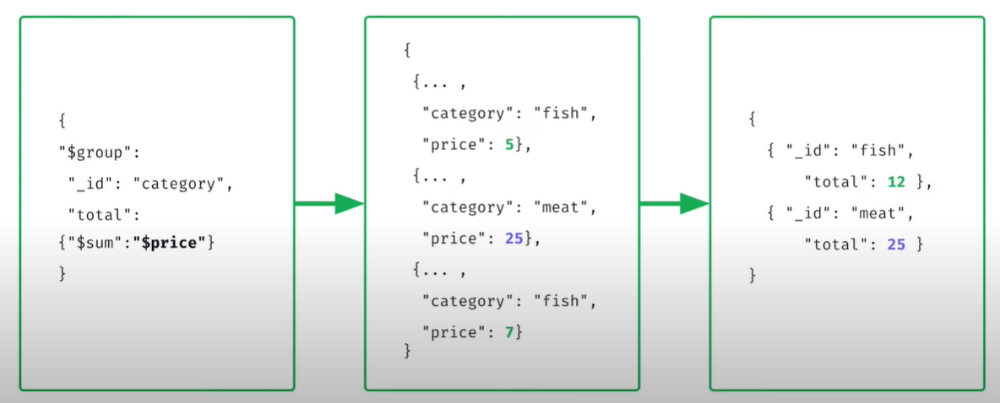
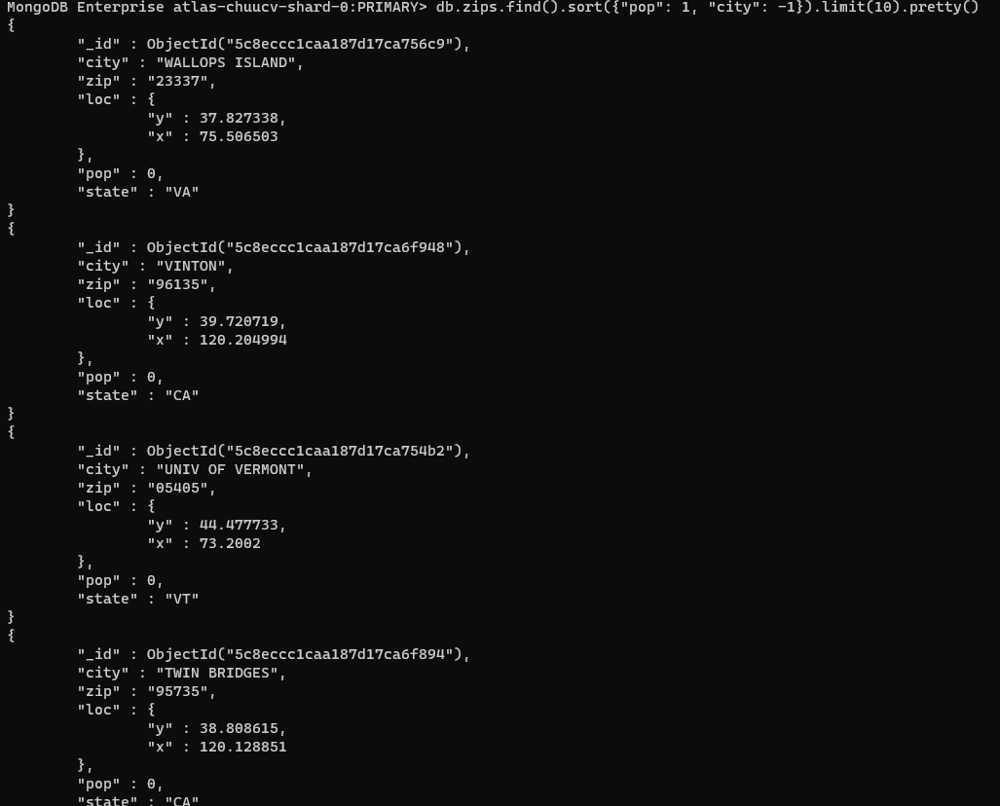

# Chapter 5: Indexing and Aggregation pipeline

## 1. Aggregation framework

Ở các bài trước, khi muốn truy vấn và thao tác với dữ liệu trong việc tìm kiếm, ta sử dụng các hàm `find` hoặc `findOne`. Nhưng đó là với các câu lệnh và yêu cầu tìm kiếm đơn giản, chưa tới mức phức tạp, chúng dường như tương đương với các câu truy vấn đơn của SQL (chỉ có select, from, và where, chưa có các hàm tính toán). 

Các hàm như `find` sẽ không đáp ứng được yêu cầu như gom nhóm, tính toán phức tạp, nối và cắt chuỗi, .... Vì thế nên chúng ta cần tìm hiểu Aggregation framework của MongoDB. Aggregation framework là một cách truy vấn linh hoạt hơn, đa nhiệm hơn và rộng hơn so với MongoDB Query Language mà ta vẫn thường sử dụng.


Ví dụ, chúng ta muốn tìm kiếm các document thuộc collection `listingsAndReviews` trong db `sample_airbnb` mà có giá trị `Wifi` trong mảng `amenities`, chỉ hiển thị cột giá và cột địa chỉ. Khi ấy, sử dụng câu lệnh `find` sẽ như sau



Nhưng khi sử dụng aggregation, câu lệnh sẽ như sau



Chúng ta có thể nhìn thấy rõ sự khác biệt `find` nhận vào một đối tượng được bao bọc bởi dấu {}, còn `aggregate` nhận vào một mảng các đối tượng, được bao bọc bởi dấu []. Bên trong mảng đó là các đối tượng được sắp xếp theo thứ tự của người sử dụng. Ví dụ như `$match` sẽ thực hiện tìm kiếm khớp với các điều kiện được liệt kê (đây chính là phần tìm kiếm tương tự câu lệnh `find`), phần `$project` sẽ thực hiện lấy các trường cần hiển thị và loại bỏ các trường khác.

Và thứ tự của chúng quyết định cách mà câu lệnh `aggregate` thực hiện: trước tiên, các document trong collection sẽ được lọc dựa vào điều kiện của `$match`, sau đó, các document thỏa mãn điều kiện sẽ đi qua bước `$projection`, bước này sẽ loại bỏ các trường không được hiện thị và để lại các trường người dùng muốn hiển thị. Từng bước từng bước như vậy giống như trong một đường ống - pipeline.


Nhưng tại sao cần phải sử dụng aggregation framework? Ngoài việc tìm kiếm `$match` và hiển thị các trường mong muốn `$project` ra thì aggregation còn làm được nhiều thứ hơn thế: nó có thể tính toán, đếm, tổng, trung bình, gom nhóm, ... như các câu lệnh sql có thể làm được.

Ví dụ như câu lệnh gom nhóm và đếm, chúng ta sẽ dùng `$group` của aggregation. Cú pháp của `$group` sẽ như sau



Trong đó, trường `_id` là trường mà chúng ta mong muốn group. Ví dụ như câu lệnh SQL như sau

```SQL
SELECT column_a, count(*) quantity
from table
GROUP BY column_a
```

sẽ tương đương với câu lệnh aggregate như sau

```JS
db.collection.aggregate([
    {
        "$match": {<your condition>}
    },
    {
        "$group": {
            "_id": "$column_a",
            "quantity": {"$sum": 1}
        }
    }
    ]).pretty()
```

Ví dụ, muốn đếm xem có bao nhiêu phòng mỗi loại được phục vụ trong collection `listingsAndReviews`, ta sẽ làm như sau



Hoặc muốn tính tổng một trường nào đó của document



## 2. `sort()` and `limit()`

Rất đơn giản, sắp xếp ta dùng hàm `sort()` và lấy số lượng bản ghi mong muốn từ trên xuống dưới trong danh sách kết quả trả về, ta dùng hàm `limit()`.

Trong MongoDB, tham số truyền vào của hàm `sort` là một đối tượng, trong đó, các trường muốn sắp xếp sẽ được liệt kê và mang giá trị 1 nếu là sắp xếp tăng dần và -1 nếu là sắp xếp giảm dần.



Và lưu ý rằng, hãy sử dụng điều kiện lọc trước khi thực hiện sắp xếp, vì nếu như chúng ta gặp một collection với dữ liệu nhiều hoặc quá lớn, việc sắp xếp sẽ làm cho câu truy vấn trở nên chậm hơn, vì nó sẽ phải sắp xếp tất cả các document trả về sau khi thực hiện lọc theo điều kiện của hàm `find`.

**Lưu ý**: Ngoài ra, khi chúng ta viết thứ tự của `sort` và `limit` trước hay sau thì đều giống nhau, MongoDB sẽ xử lý việc sắp xếp trước, sau đó sẽ lấy ra số lượng bản ghi mà ta mong muốn

## 3. Introduction to Indexes

Trong phần này, chúng ta không có nhiều thời gian để đi sâu vào index, chúng ta sẽ chỉ dừng lại ở mức khái niệm mà thôi.

Index trong DB (kể cả SQL hay NoSQL) đều có khái niệm và tác dụng giống nhau. Nó giúp cho các truy vấn của chúng ta trở nên nhanh chóng khi thao tác với các tập dữ liệu lớn và có nhiều dữ liệu. Giống như chỉ mục trong một cuốn sách, index trong DB giúp chúng ta tìm kiếm dữ liệu một cách nhanh chóng hơn dựa vào chỉ mục đã được đánh dấu từ trước cho dữ liệu.

Ví dụ, chúng ta có một cuốn sách, và chúng ta muốn tìm từ khóa `Toni` ở trong cuốn sách đó. Nếu như cuốn sách đó không có index - chỉ mục. Thì chẳng còn cách nào khác ngoài việc chúng ta phải tìm từng trang một, hoặc có thể ăn may hơn bằng cách tìm kiếm nhị phân hoặc một số thuật toán tìm kiếm khác. Ngược lại, nếu cuốn sách đó có chỉ mục, chúng ta chỉ cần mở phần chỉ mục, tìm tới chữ `T`, và trong danh sách các từ khóa trong mục chữ `T`, chúng ta tìm ta từ `Toni`, và chúng ta xem từ khóa này xuất hiện ở các trang nào, vậy là xong. Công việc gần như còn lại của chúng ta là đi tới trang mà chúng ta cần tìm kiếm. Done.

Việc xuất hiện chỉ mục sẽ làm câu truy vấn của chúng ta trở nên nhanh một cách chóng mặt. Vậy cụ thể, index trong MongoDB sẽ được lưu trữ như thế nào?

Một index là một collection trong MongoDB, nó phục vụ mục đích tìm kiếm (hầu hết các index được đánh theo thứ tự bảng chữ cái) và nó lưu trữ một phần nhỏ lượng dữ liệu của cả một collection theo một cấu trúc nhất định để khi tìm kiếm cho ra kết quả trong khoảng thời gian ngắn nhất.

Ví dụ, trong collection `trips`, hay xảy ra các câu truy vấn với trường `birth year`. Ví dụ:

```JS
db.trips.find({"birth year": 1989})
```

Khi ấy chúng ta sẽ thực hiện "đánh" một index, hay còn gọi là tạo một index như sau

```JS
db.trips.createIndex({"birth year": 1})
```

Số 1 sau "birth year" có nghĩa là index này được đánh theo thứ tự tăng dần (năm sinh tăng dần từ nhỏ tới lớn). Khi ấy các câu truy vấn mà điều kiện tìm kiếm là trường "birth year" sẽ sử dụng index mà chúng ta tạo ra, và cho tốc độ truy vấn tối ưu nhất.

Nhưng nếu như các câu truy vấn có nhiều điều kiện, hoặc điều kiện không liên quan tới trường "birth year", thì index sẽ không có tác dụng. Ví dụ như:

```JS
db.trips.find({"start station id": 476}).sort({"birth year": 1})
```

Với câu truy vấn này, và việc sort đã đề cập ở phần trước (chúng ta nên cẩn thận khi sort các dữ liệu lớn sẽ gây chậm), chúng ta nên sử dụng index hỗn hợp (compound index) của 2 trường `start station id` và `birth year`.

```JS
db.trips.createIndex({"start station id": 1, "birth year": 1})
```
Cụ thể hơn về index, chúng ta sẽ được học ở khóa về hiệu năng của MongoDB

## 4. Upsert - Update or Insert

`upsert` là một câu lệnh "lai" giữa `update` và `insert`. Nó là một option trong câu lệnh update, và nó sẽ có cú pháp như sau:

```JS
db.collection.update(<query>, <update>, {upsert: true})
```

`upsert` sẽ nhận 1 trong 2 giá trị `true` hoặc `false`, mặc định nếu không đề cập gì trong câu lệnh `update` thì `upsert` sẽ nhận giá trị là `false`.

Khi `upsert` mang giá trị là `true`, chuyện gì sẽ xảy ra? Khi ấy, MongoDB sẽ tìm kiếm theo điều kiện của `query`, nếu có bản ghi khớp với điều kiện, thì lệnh update sẽ cập nhật các bản ghi tìm thấy. Trong trường hợp ngược lại, nếu không tìm thấy bản ghi nào phù hợp với điều kiện tìm kiếm, khi ấy một lệnh `insert` sẽ được thực thi, và nội dung của document khi `insert` vào sẽ chính là tham số thứ 2 khi truyền vào câu lệnh `update`.

Đây là một lệnh khá hữu hiệu để tránh xảy ra lỗi khi không tìm thấy bản ghi cần cập nhật. Muốn biết thêm về `upsert`, đọc [tại đây](https://www.mongodb.com/docs/manual/reference/method/db.collection.update/#std-label-update-upsert)

<br/>
<br/>

REFERENCE

[1] MongoDB Basic tutorial of `MongoDB university`
