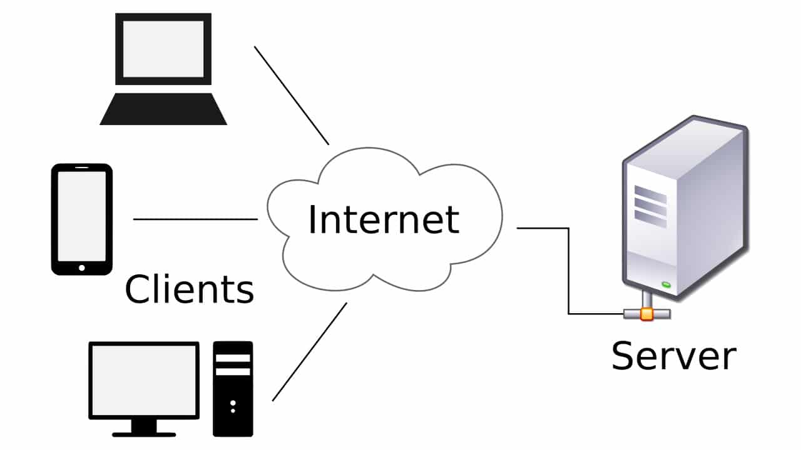

# RESTful

## 1. Một số khái niệm cơ bản

### 1.1 Mô hình client-server

Mô hình client - server là một mô hình khá lâu và vẫn được sử dụng rộng rãi ngày nay. Mô hình rất đơn giản bao gồm 2 thành phần chính là máy khách (client) và máy chủ (server), chúng giao tiếp với nhau thông qua đường truyền mạng.

Máy khách có thể là bất cứ thiết bị nào đang "cần được phục vụ" về mặt thông tin, dữ liệu mà máy chủ bất kỳ có thể đảm nhận. Một ví dụ nhỏ để hiểu về mô hình này đó chính là việc bạn muốn biết thời tiết của thành phố trong ngày hôm nay. Để làm điều này, bạn sẽ cần hỏi một người biết về điều kiện thời tiết ở thành phố. Giả sử chưa có máy tính, bạn có thể biết được thông tin thời tiết qua báo, đài. Trong quá trình này, có hai người tham gia riêng biệt. Đầu tiên là bạn, người muốn biết thông tin về thời tiết. Người thứ hai là báo hoặc đài, người cung cấp thông tin về thời tiết. Nếu đặt tên cho hai người tham gia này, chúng ta có:

- Người tiêu dùng muốn biết một thông tin cụ thể, là người đưa ra yêu cầu, hay còn được gọi là `client` trong mô hình client - server.
- Nhà cung cấp thông tin, là người tiếp nhận yêu cầu và xử lý nó, hay còn gọi là `server` trong mô hình client - server.

Tóm lại, client là người có nhu cầu cần được server phục vụ, client có thể là bất kỳ thứ gì, có thể là một chiếc laptop, điện thoại, thiết bị điện tử, ... yêu cầu phục vụ tới server khi cần. Còn server đơn thuần là một hệ thống bao gồm một hoặc nhiều máy tính, mang mục đích chia sẻ tài nguyên, tiếp nhận yêu cầu cần giải quyết của client thông qua đường truyền mạng. Điểm đặc biệt của máy tính khi là một server đó là máy tính đó thường có cấu hình khá hoặc là cao. Vì nó cần đảm bảo phục vụ được nhiều client cùng lúc và xuyên suốt qua thời gian.

Khi client cần thông tin phía server, client sẽ gửi một yêu cầu (request) lên phía server thông qua đường truyền internet, server sẽ tiếp nhận yêu cầu và xử lý, tính toán, cấu trúc, ... sau đó sẽ gói kết quả lại và trả về cho phía client bằng một phản hồi (response) thông qua đường truyền internet. Yêu cầu của client chỉ được tiếp nhận khi nó khớp với những gì mà server có thể phục vụ. Hiểu nôm na là chúng ta không thể ra quán bán rau mà yêu cầu mua một chiếc xe máy được, vì quán bán rau không bán xe máy, họ chỉ phục vụ nhu cầu cần rau của những người cần tới rau mà thôi.

Một ví dụ khác về kĩ thuật giúp hiểu hơn mô hình này, đó chính là ứng dụng facebook ở điện thoại thông minh. Ứng dụng facebook này chính là một client, mỗi khi ta sử dụng ứng dụng, chúng ta cần các thông tin về danh sách bài viết, bình luận của một bài viết, thông tin về các nhóm, hội trên facebook, thông tin cá nhân của người mà chúng ta quan tâm, ... Tất cả các thông tin đó không được lưu trữ ở trên ứng dụng điện thoại, mà nó sẽ được lưu ở máy chủ của facebook (facebook server). khi chúng ta sử dụng ứng dụng, mỗi lần vào một chức năng nào đó, ứng dụng này sẽ thực hiện gọi lên server để lấy thông tin mà chúng ta yêu cầu thông qua đường truyền internet.

### 1.2 Giao thức HTTP, thông điệp HTTP

Bức tranh tổng quan về mô hình client - server được đề cập ở phần 1. Nhưng dữ liệu truyền qua đường truyền internet theo cơ chế gì, thành phần nào sẽ mang những thông tin đó qua lại giữa client và server? Đó chính là gioa thức HTTP.

Client và server được kết nối với nhau bằng giao thức HTTP. Đây là một trong rất nhiều giao thức được phát minh và đang được sử dụng rộng rãi ngày nay. Dữ liệu được truyền qua internet bằng giao thức này dưới dạng các thông điệp HTTP (HTTP message). Cụ thể về định nghĩa, tính chất và đặc điểm của giao thức HTTP vui lòng đọc [tại đây](https://developer.mozilla.org/en-US/docs/Web/HTTP). (Do liên quan nhiều tới kiến thức mạng máy tính nên sẽ không đề cập sâu tại bài viết này).

[Thông điệp HTTP](https://developer.mozilla.org/en-US/docs/Web/HTTP/Messages) (hay còn gọi là gói tin HTTP) là một tập hợp các dữ liệu được tổ chức có cấu trúc và truyền qua lại trong internet thông qua giao thức HTTP. Một gói tin HTTP bao gồm nhiều thành phần, và gói tin yêu cầu (HTTP request) sẽ có chút khác biệt với gói tin phản hồi (HTTP response), nhưng cơ bản có các thành phần như sau:

- **`Start line`**: 
    + **Phương thức HTTP (HTTP method)**: là các phương thức thể hiện mục đích của client khi gọi lên phía server. Bao gồm các giá trị điển hình như GET (thể hiện việc lấy dữ liệu), POST (thể hiện việc tạo mới dữ liệu), PUT (thể hiện việc thay đổi dữ liệu), DELETE (thể hiện việc xóa bỏ dữ liệu).
    + **Đích đến của request (`request target`)**: chính là `URL` mà client gọi tới server. URL này là một đường dẫn mà hằng ngày duyệt web ta vẫn gặp, nó có dạng `http(s)://example.com`. URL này phải là một URL hợp lệ của một server nào đó đang tồn tại trên thế giới, nếu không thì yêu cầu của client sẽ không đến được server mong muôn.
- **`Header` (phần đầu)**: phần này chứa các thông tin cơ bản của một gói tin HTTP, như kiểu dữ liệu truyền trong gói tin, độ dài của gói tin, ngôn ngữ, ....
- **`Body` (phần thân)**: phần thân chứa các dữ liệu quan trọng liên quan tới từng mục đích cụ thể của request được gửi lên server, hoặc một response được gửi về cho client (kết quả của yêu cầu mà client muốn). Không phải tất cả các phương thức HTTP kể trên đều cần có phần body, phần body chủ yếu xuất hiện với phương thức POST (tạo mới dữ liệu, dữ liệu cần tạo mới sẽ được gói trong body) hoặc PUT (cập nhật dữ liệu, dữ liệu được cập nhật sẽ được gói trong body), còn các phương thức liên quan tới việc lấy dữ liệu từ server như GET, DELETE, ... sẽ không cần tới body.

Ngoài ra, còn 1 thành phần quan trọng của HTTP message trong trường hợp của gói tin phản hồi (response message), đó chính là `status code`. Đây là một mã gồm 3 chữ số, trải dài từ 100 tới 599 thể hiện trạng thái của yêu cầu gửi lên server sau khi server xử lý. Trạng thái của yêu cầu này có thể là xử lý thành công hoặc xử lý thất bại, xử lý thất bại thì lỗi do đâu. Phần `status code` này nằm trong `start line` mà chúng ta đã đề cập bên trên. Ví dụ một số HTTP status code điển hình như 404 Not Found (thể hiện rằng bạn đã bị sai URL), 500 Internal server error (thể hiện rằng đã có lỗi ở server), 200 OK (thể hiện yêu cầu được xử lý thành công), ... Tổng quát ta có:

- 1xx: Phản hồi liên quan tới thông tin (information responses)
- 2xx: Phần hồi thành công (successful responses)
- 3xx: Phản hồi chuyển hướng (redirection responses)
- 4xx: Phản hồi liên quan tới lỗi của client (client error responses)
- 5xx: Phản hồi liên quan tới lỗi của server (server error responses)

Chi tiết về status code có thể xem tại [đây](https://developer.mozilla.org/en-US/docs/Web/HTTP/Status). Và chi tiết về HTTP message có thể xem tại [đây](https://developer.mozilla.org/en-US/docs/Web/HTTP/Messages)

### 1.3 API
`API (Application Programming Interface)` là một tập các quy tắc và cơ chế mà theo đó, một ứng dụng hay một thành phần sẽ tương tác với một ứng dụng hay thành phần khác. 

API có thể trả về dữ liệu mà bạn cần cho ứng dụng của mình ở những kiểu dữ liệu phổ biến như JSON hay XML.

### 1.4 JSON & XML

## 2. REST và RESTful

`REST` (**RE**presentational **S**tate **T**ransfer) là `một tiêu chuẩn` dùng trong việc `thiết kế` API cho các ứng dụng web để tiện cho việc quản lý các tài nguyên (resource). Nó chú trọng vào tài nguyên hệ thống (tệp văn bản, ảnh, âm thanh, video, hoặc dữ liệu động, …), bao gồm các trạng thái tài nguyên được định dạng và được truyền tải qua HTTP.

Một `RESTful API` đơn giản là một API tuân thủ các nguyên tắc và ràng buộc của REST.

## 3. Các ràng buộc trong REST

REST có 6 ràng buộc được nêu rõ bởi nhà khoa học máy tính Roy Thomas Fielding vào năm 2012. Và chỉ cần tuân thủ 5 ràng buộc đầu tiên trong 6 ràng buộc này thì được gọi là RESTful. 6 ràng buộc bao gồm:

- `Kiến trúc client-server`: Ràng buộc này hoạt động dựa trên ý tưởng rằng máy khách và máy chủ phải hoàn toàn tách biệt và được phép phát triển riêng lẻ, độc lập. Phương thức hoạt động chính của REST là tách biệt giao diện người dùng ra khỏi dữ liệu lưu trữ. Với cách thức này, người dùng có thể thực hiện thay đổi với các ứng dụng di động của mình một cách độc lập. Việc này không làm ảnh hưởng đến cấu trúc dữ liệu hoặc thiết kế cơ sở dữ liệu của máy chủ. Ngược lại, việc điều chỉnh cơ sở dữ liệu hoặc thay đổi ứng dụng của máy chủ cũng không ảnh hưởng đến ứng dụng của máy khách.

- `Stateless` (phi trạng thái): Bất kỳ một RESTful API nào cũng phải phi trạng thái. Nghĩa là mỗi yêu cầu (request) từ máy khách đến máy chủ có thể được thực hiện độc lập. Đồng thời, mỗi yêu cầu phải chứa mọi thông tin cần thiết để máy chủ hiểu và hoàn thành nó. Ngoài ra, yêu cầu của máy khách không thể lạm dụng bất kỳ thông tin nào trên máy chủ. Đó cũng chính là lý do khiến trạng thái phiên (session state) được giữ hoàn toàn trên máy khách. Điều này sẽ giúp tăng độ tin cậy cho API, hạn chế lỗi và giảm tài nguyên sử dụng.

- `Cacheability` (có khả năng cache): API phi trạng thái có thể tăng số lượng request, nhất là khi có nhiều cuộc gọi đến và đi. Do đó, RESTful API được thiết kế để lưu trữ dữ liệu vào cache để tăng tính tái sử dụng. Cụ thể, ràng buộc này yêu cầu mỗi phản hồi phải đánh dấu dữ liệu bên trong nó là lưu được hoặc không lưu được vào cache. Nếu phản hồi lưu được vào cache, thì máy khách có thể sử dụng lại dữ liệu của phản hồi đó cho các yêu cầu tương tự sau này.

- `Layered system` (phân lớp hệ thống): Kiểu hệ thống phân lớp cho phép một kiến trúc chứa nhiều lớp phân cấp. Mỗi lớp sẽ có một chức năng và trách nhiệm cụ thể. Cách thức của REST là hạn chế hành vi của các thành phần trong một lớp. Mỗi thành phần hoàn toàn không thể thấy được những gì ở bên ngoài lớp mà chúng đang tương tác.

- `Uniform interface` (Giao diện thống nhất): REST áp dụng những nguyên tắc chung của kỹ thuật phần mềm cho giao diện thành phần. Chính vì lý do đó, tổng thể kiến trúc hệ thống được đơn giản hóa. Khả năng hiển thị của các tương tác cũng được cải thiện đáng kể. Để có giao diện thống nhất, REST cần nhiều ràng buộc kiến trúc cho các thành phần bên trong. Chẳng hạn, việc biểu diễn tài nguyên trên toàn hệ thống phải tuân theo các nguyên tắc cụ thể. Các nguyên tắc đó bao gồm: quy ước đặt tên, định dạng liên kết, định dạng dữ liệu (XML hoặc JSON). Ngoài ra, tất cả tài nguyên phải được truy cập thông qua một cách chung như HTTP GET. Việc điều chỉnh, sửa đổi tài nguyên cũng phải sử dụng một cách tiếp cận nhất quán.

- `Code on demand` (Code theo yêu cầu): Ràng buộc này là tùy chọn, không bắt buộc. Do đó, đây cũng là ràng buộc ít được biết đến của REST. Ràng buộc này cho phép người dùng mở rộng chức năng của máy khách. Họ có thể tải xuống và thực thi mã dưới dạng các ứng dụng nhỏ (applet) hoặc tập lệnh. Điều này sẽ đơn giản hóa công việc cho máy khách, bằng cách giảm các tính năng bắt buộc triển khai từ trước.

## 4. Một số "nguyên tắc" thiết kế RESTful API

Để thiết kế một API tốt thật sự là một điều rất khó. Tài liệu thiết kế API rất quan trọng nhưng cũng thật khó để tìm ra một lập trình viên thích viết tài liệu mô tả cho nó. Việc xây dựng một API là một trong những điều quan trọng nhất ta có thể làm để nâng cao giá trị dịch vụ của mình. Nếu áp dụng REST(ful) cho hệ thống để thiết kế các API, thì chúng ta cần tuân thủ các nguyên tắc sau:

### 4.1 Những hành động CRUD sử dụng những phương thức HTTP

Như đã đề cập bên trên, các phương thức HTTP đại diện cho hành động mà client cần yêu cầu lên phía server. Dựa vào các phương thức này mà server có thể hiểu được mục đích client cần, từ đó có thể phục vụ tốt hơn. Danh sách các HTTP method được liệt kê rất chi tiết ở [đây](https://developer.mozilla.org/en-US/docs/Web/HTTP/Methods)

### 4.2 Sử dụng danh từ số nhiều, không dùng động từ cho các URL

`GET /tickets` – Trả về danh sách những ticket

`GET /tickets/12` – Trả về một ticket được định danh

`POST /tickets` – Tạo mới một ticket

`PUT /tickets/12` – Cập nhật thông tin cho ticket #12

`PATCH /tickets/12` – Cập nhật một thuộc tính cho ticket #12

`DELETE /tickets/12` – Xóa ticket #12

 

Nếu tồn tại một quan hệ duy nhất với Resource khác, RESTful cung cấp những hướng dẫn có ích

`GET /tickets/12/messages` – Trả về danh sách message của ticket #12

`GET /tickets/12/messages/5` – Trả về message #5 của ticket #12

`POST /tickets/12/messages` – Tạo mới một message trong ticket #12

`PUT /tickets/12/messages/5` – Cập nhật message #5 của ticket #12

`PATCH /tickets/12/messages/5` – Cập nhật một số thuộc tính của message #5 cho ticket #12

`DELETE /tickets/12/messages/5` – Xoá message #5 for ticket #12

 

Và tránh dùng các động từ như:

`GET /getAllCars`

`POST /createNewCar`

`DELETE /deleteAllRedCars`

### 4.3 Đánh phiên bản (versioning)

Để phân biệt giữa các API trong quá khứ và đảm bảo các phiên bản của ứng dụng phía client được đáp ứng.

`https://example.org/api/v1/*`

`https://api.example.com/v1/*`

### 4.4 sử dụng `Snake_case` hay `camelCase`

Nhiều nghiên cứu chỉ ra rằng snake_case dễ đọc hơn camelCase khoảng 20% và rất nhiều những API phổ biến đều sử dụng snake_case. Vì vậy nên trong khi thiết kế API, chúng ta nên ưu tiên sử dụng snake case (dấu _).

### 4.5 Sử dụng kiểu dữ liệu JSON khi truyền dữ liệu qua lại giữa client và server

Trước đây, việc chấp nhận và phản hồi các yêu cầu API chủ yếu được thực hiện bằng XML và thậm chí cả HTML. Nhưng ngày nay, JSON (JavaScript Object Notation) phần lớn đã trở thành định dạng thực tế để gửi và nhận dữ liệu API.

Điều này là do, với XML chẳng hạn, việc giải mã và mã hóa dữ liệu thường gặp một chút rắc rối - vì vậy XML không còn được hỗ trợ rộng rãi bởi các khuôn khổ nữa.

JavaScript, ví dụ, có một phương thức có sẵn để phân tích cú pháp dữ liệu JSON thông qua API tìm nạp vì JSON chủ yếu được tạo cho nó. Nhưng nếu bạn đang sử dụng bất kỳ ngôn ngữ lập trình nào khác như Python hoặc PHP, thì giờ đây chúng đều có các phương thức để phân tích cú pháp và thao tác dữ liệu JSON.

### 4.6 Sử dụng các `HTTP status code` để giải quyết các lỗi xảy ra

Cũng giống như HTTP method, HTTP status code mang trong mình ý nghĩa của nó, và khi thiết kế API chúng ta chỉ cần sử dụng HTTP status code để nói rằng API đó là thành công, hay thất bại, có lỗi hay không, và lỗi cụ thể là gì.

### 4.7 Lọc kết quả, sắp xếp, tìm kiếm, phân trang

#### 4.7.1 Lọc kết quả

Sử dụng một biến duy nhất cho mỗi trường được lọc.

`GET /tickets?state=open` – Lấy duy nhất trạng thái đang open từ danh sách ticket

`GET /cars?seats<=2` Trả về một danh sách những oto với số ghế tối đa là 2

#### 4.7.2 Sắp xếp

Sử dụng tham biến `sort` để mô tả luật sắp xếp.

`GET /tickets?sort=-priority` – Trả về một danh sách những ticket được sắp xếp theo priority giảm dần.

`GET /tickets?sort=-priority,created_at` – Trả về một danh sách những ticket được sắp xếp theo priority giảm dần. Với một ticket cùng priority, những ticket cũ sẽ được sắp xếp trước.

#### 4.7.3 Tìm kiếm

Đôi khi những điều kiện lọc cơ bản không đủ và bạn cần đến full text search. Sử dụng tham biến `q`, một tham biến được dùng trong ElasticSearch hoặc Lucene.

`GET /tickets?q=keyword&state=open&sort=-priority,created_at`

#### 4.7.4 Giới hạn dữ liệu được trả về: 

Sử dụng tham biến `fields`: `GET /tickets?fields=id,subject,customer_name,updated_at&state=open&sort=-updated_at`

#### 4.7.5 Phân trang

Sử dụng `page` và `per_page`: `GET /ticket?page=1&per_page=100`

Hoặc có thể sử dụng mặc định` limit` và `offset`: `GET /ticket?offset=10&limit=100`

 
 

### REFERENCES

[1] https://viblo.asia/p/so-luoc-ve-mo-hinh-client-server-va-giao-thuc-http-jvElaarNlkw

[2] https://vn.got-it.ai/blog/restful-api-la-gi-6-rang-buoc-kien-truc-co-ban-cua-restful-api

[3] https://viblo.asia/p/tim-hieu-ve-restful-924lJM4zZPM

[4] https://www.freecodecamp.org/news/rest-api-best-practices-rest-endpoint-design-examples/

[5] https://viblo.asia/p/restful-api-la-gi-1Je5EDJ4lnL
