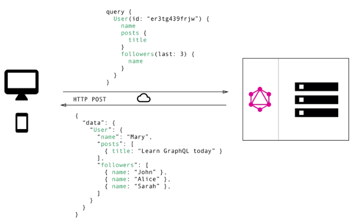

# GraphQL

## 1. Hoàn cảnh ra đời

Một trang web hiện đại hoặc hệ thống ngày nay thường áp dụng mô hình client-server để triển khai và phát triển. Điều này dẫn tới việc phải có cách luân chuyển dữ liệu qua lại giữa client và server thông qua mạng Internet. Dữ liệu được lưu trữ tại cơ sở dữ liệu (database - DB) được gọi là tài nguyên (resource), các tài nguyên này sẽ được phía client sử dụng bằng cách gửi yêu cầu tới server. Phía server sẽ được lập trình bằng cách nhất định nào đó để lấy ra các tài nguyên từ DB và phản hồi kết quả cho phía client. Đó là quy trình mà hiện tại các hệ thống từ nhỏ tới lớn vẫn đang sử dụng. Đó chính là các API.

Vì kiến trúc hệ thống tổng quan được thiết kế như vậy nên phải có một quy tắc, quy luật, sự thống nhất trong việc gửi yêu cầu và phản hồi giữa client và server để hệ thống hoạt động mạch lạc, trơn tru. Vì thế RESTful ra đời. Nhắc lại một chút, RESTful là **một bộ tiêu chuẩn** để **thiết kế** và **xây dựng** các API. Chúng ta sẽ không đi sâu vào RESTful ở phần này, nhưng điểm lại đặc điểm của RESTful, nó mạch lạc và thích hợp với hầu hết các ứng dụng. Nhưng vài năm gần đây, khi các hệ thống lớn đã mọc lên ngày một nhiều thì RESTful lại bộc lộ những bất cập khó giải quyết, đó là:

- Sự tăng dần của việc sử dụng các ứng dụng điện thoại ngày nay dẫn tới nhu cầu load dữ liệu một các hiệu quả hơn.
- Hiện nay có nhiều các nền tảng phía client và framework front end phát triển
- Việc phát triển nhanh của các hệ thống ở hiện tại và tương lai.

Tại sao 3 điều này lại làm cho RESTful trở nên bất cập, cùng xem ví dụ sau. Trong một ứng dụng viết blog, một ứng dụng cần hiển thị các tiêu đề của các bài đăng của một người dùng cụ thể. Màn hình tương tự cũng hiển thị tên của 3 người theo dõi cuối cùng của người dùng đó. Yêu cầu sẽ được giải quyết với REST và GraphQL nhưu thế nào?

Với REST API, bạn thường sẽ thu thập dữ liệu bằng cách truy cập vào nhiều endpoints. Trong ví dụ, những endpoints này có thể là `/users/<id>` để tìm dữ liệu người dùng ban đầu. Thứ hai, có thể là `/users/<id>/posts` trả về tất cả các bài viết cho người dùng. Và cuối cùng, endpoints `/users/<id>/followers` trả về một danh sách những người theo dõi của mỗi người dùng. 


Một trong những vấn đề của REST đó chính là phải truy vấn nhiều lần có thể dẫn tới quá tải. Đó là do cách thiết kế các API của REST là tĩnh, cứng nhắc và có thể gây thừa - thiếu thông tin, không linh động. Vì vậy GraphQL sẽ giải quyết chuyện đó, nó linh hoạt hơn nên việc gọi API sẽ nhẹ nhàng, ít hơn, tránh gây tải. Nếu như kịch bản giống trong ví dụ bên trên, ta phải gọi 3 API khi sử dụng REST, thì với GraphQL, ta chỉ cần gọi 1 lần duy nhất.



Vậy thì cơ chế gì để GraphQL có thể làm được chuyện đó, nó có các ưu điểm và nhược điểm như thế nào. Trong phần này chúng ta sẽ tìm hiểu sâu về nó.

## 2. Định nghĩa

### 2.1 Đinh nghĩa

GraphQL là một ngôn ngữ truy vấn cho API, và nó là một servers-side runtime cho việc chạy các câu truy vấn sử dụng một hệ thống kiểu (type system) mà người dùng tự định nghĩa ra.

Điều đáng chú ý ở khái niệm của GraphQL đó chính là một hệ thống các kiểu do người dùng tự định nghĩa ra, đây là phần quan trọng nhất của GraphQL. Để tìm hiểu sâu hơn, hãy đi vào phần tiếp theo.

### 2.2 Cấu trúc

GraphQL chia thành 3 phần chính:

- `Query`:  Các câu lệnh lấy dữ liệu (tương tự method GET trong REST API)
- `Mutation`: Các câu lệnh để thêm/sửa dữ liệu (tuơng tự method POST/PUT/DELETE trong REST API)
- `Subscription`: Câu lệnh dùng để lắng nghe sự kiên trên server, khi dữ liệu trên server được thay đổi nó cũng thay đổi theo nhằm cung cấp dữ liệu cho client một cách realtime nhất có thể.


Các thành phần này được bộ phận gọi là `resolver` giải quyết. Các trường (`field`) bên trong query hoặc mutation (được gọi là `payload`) của yêu cầu mà client gửi lên cho server phải khớp nối hoàn toàn với một function, đó chính là `resolver`.


## 3. Các khái niệm cơ bản

### 3.1 Ngôn ngữ định nghĩa lược đồ (Schema Definition Language - SDL)

Như đã nói ở trên, GraphQL có hệ thống riêng về kiểu của nó. Và chính các schema mà người dùng định nghĩa được gọi là bản giao ước giữa client và server. Giống như REST có các endpoint, method, ... chính là giao ước, quy tắc giao tiếp giữa client và server (nếu gọi sai endpoint, sai method, sai request thì sẽ không gọi được tới đúng API mong muốn), thì schema của GraphQL chính là giao ước tương tự như vậy.

GraphQL có cú pháp riêng để định nghĩa ra các schema cho mình, gọi là Schema Definition Language - SDL. Ví dụ:

```JS
type User {
  id: Int!
  name: String!
  email: String!
}
```

Hiểu đơn giản là kiểu dữ liệu `User` (type `User`) có 3 trường (field) với các kiểu tương ứng của nó là String hay Int. Dấu `!` để xác định trường đó là bắt buộc. 

Chúng ta cũng có thể thể hiện mối quan hệ giữa các types. Ví dụ, một một cửa hàng được sở hữu bởi một người dùng.

```JS
type Shop {
  id: Int!
  name: String!
  owner: User!
}
```

Hoặc một người dùng có thể sở hữu nhiều cửa hàng.

```JS
type User {
  id: Int!
  name: String!
  email: String!
  shops: [Shop]
}
```

Dấu `[]` để thể hiện là một mảng.

### 3.2 Lấy dữ liệu sử dụng các câu truy vấn

Khi làm việc với các API REST, dữ liệu được lấy về từ các endpoints cụ thể. 
Mỗi endpoints có một cấu trúc rõ ràng về thông tin mà nó trả về. 


Cách tiếp cận được thực hiện trong GraphQL hoàn toàn khác. 
Thay vì có nhiều endpoints trả về cấu trúc dữ liệu cố định, API GraphQL thường chỉ có một endpoint duy nhất. 
Cấu trúc của dữ liệu được trả về không cố định. 
Thay vào đó, nó hoàn toàn linh hoạt và cho phép client quyết định dữ liệu nào thực sự cần thiết. 
Điều đó có nghĩa là client cần gửi thêm thông tin đến server để thể hiện nhu cầu dữ liệu của mình - thông tin này được gọi là query.

#### 3.2.1 Truy vấn cơ bản

Một query đơn giản để lấy thông tin tất cả users


Hoặc chỉ muốn lấy tên của user thôi.


Trường `users` trong truy vấn này được gọi là `root field` của truy vấn. Mọi thứ theo sau `root field` được gọi là `payload` của truy vấn.

Một trong những ưu điểm chính của GraphQL là nó cho phép truy vấn thông tin lồng nhau một cách tự nhiên. Ví dụ nếu bạn muốn lấy tất cả thông tin user kèm với tên của shop mà user đó sở hữu.


Thậm chí là muốn xem luôn trong shop đó có những products gì:


#### 3.2.2 Truy vấn với tham số

Truy vấn với tham số là truy vấn mà chúng ta lấy thông tin với điều kiện lọc nào đó. Ví dụ như bên trên chúng ta lấy tất cả các shop của user có id là 1:

```JS
{
    user (id: 1) { <-- chính là đoạn này
        name
        shops{
            id
            name
        }
    }
}
```

### 3.3 Ghi dữ liệu

Với mỗi ứng dụng, hệ thống, thì các thao tác CRUD là điều dễ thấy và hay sử dụng. Chúng ta các tìm hiểu sơ bộ về các lấy dữ liệu, tức là R, còn các cách để thêm mới, sửa đổi hoặc xóa bỏ dữ liệu thì GraphQL sẽ sử dụng khái niệm `Mutation`.

Các `Mutations` có cấu trúc cú pháp như giống với `Queries`, nhưng chúng luôn bắt đầu bằng từ khóa `mutation`. 
Dưới đây là ví dụ về cách để tạo một user:


Kiểm tra xem đã tạo chưa:


Lưu ý rằng tương tự như `query` mà chúng ta đã viết trước đó, `mutation` cũng có `root field` - trong trường hợp này, nó được gọi là `createUser`. Cách tạo `root field` chúng ta sẽ thảo luận bên dưới.

### 3.4 Realtime Updates with Subscriptions

Một yêu cầu quan trọng khác đối với nhiều ứng dụng ngày nay là có một kết nối thời gian thực với máy chủ để nhận thông báo ngay lập tức về các sự kiện quan trọng. Đối với trường hợp sử dụng này, GraphQL cung cấp khái niệm `Subscriptions`.

Khi một client subscribes một sự kiện, nó sẽ khởi tạo và giữ kết nối ổn định với máy chủ. Bất cứ khi nào sự kiện cụ thể đó thực sự xảy ra, máy chủ sẽ đẩy dữ liệu tương ứng đến máy khách. Subscriptions được viết bằng cú pháp giống như queries và mutations. Cụ thể sẽ được tìm hiểu bên dưới.

### 3.5 Định nghĩa ra Schema

Nói chung, một schema chỉ đơn giản là một tập hợp các types của GraphQL. Tuy nhiên, khi viết schema cho một API, có một số loại gốc đặc biệt:

- `type Query { ... }`
- `type Mutation { ... }`
- `type Subscription { ... }`

Các loại `Query`, `Mutation` và `Subscription` là các `entry points` cho các request được gửi bởi client.

Để kích hoạt truy vấn `users` mà chúng ta đã thấy trước đây, kiểu query sẽ phải được viết như sau:

```JS
type Query {
  users: [User]
}
```

Tương tự, đối với mutation `createUser`, chúng ta sẽ phải thêm root field `createUser` vào loại Mutation:

```JS
type Mutation {
  createUser (name: String!, email: String!, password: String!): Person!
}
```

Để làm được điều đó, chúng ta cần nắm được các kiểu dữ liệu của SDL. SDL có 2 kiểu chính đó là `Scalar type` và `Object type`.

- `Scalar type` bao gồm `String`, `Int`, `Float`, `Boolean`, `ID`.
- `Object type` là kiểu dữ liệu đối tượng, giống như một object JSON.

Ngoài ra, còn có các kiểu dữ liệu mà người dùng tự định nghĩa, kiểu Interface, Union, ... Chúng ta sẽ tìm hiểu sau.


## 4. Sử dụng GraphQL với Java

Ở phần này, chúng ta sẽ demo một project nhỏ sử dụng Java Spring boot và GraphQL. Đầu tiên, tạo ứng dụng SPring boot và sử dụng thư viện `spring-boot-starter-graphql`.


Cấu trúc project vẫn sử dụng là một cấu trúc của Spring web project, bao gồm controller, service, repository.


Trước hết, chúng ta quan tâm tới file `src/main/resources/graphql/schema.graphqls`. Đây chính là file thể hiện schema của hệ thống:


Và controller tương ứng


Chú ý rằng `@SchemaMapping` ở `BookController.java` là việc map dữ liệu của author vào một cuốn sách khi trả ra response cho phía client.


Và cuối cùng là file cấu hình.


Sau khi code xong, chúng ta sẽ thực hiện test thử bằng tool [GraphiQL](https://www.electronjs.org/apps/graphiql). Tạo mới một author:


Lấy danh sách các cuốn sách:


Toàn bộ code demo được để ở [đây](./spring-boot-graphql)


## REFERENCES

[1] https://thegraphvn.com/graphql-la-gi-tim-hieu-ve-graphql/

[2] https://codelearn.io/sharing/graphql-va-uu-diem-so-voi-rest-api

[3] https://graphql.org/learn/

[4] https://www.howtographql.com/basics/0-introduction/

[5] https://docs.spring.io/spring-graphql/docs/current/reference/html/

[6] https://viblo.asia/p/tim-hieu-graphql-phan-1-graphql-vs-rest-api-924lJYG6ZPM

[7] https://www.graphql-java.com/tutorials/getting-started-with-spring-boot/

[8] https://www.apollographql.com/blog/graphql/basics/designing-graphql-mutations/
