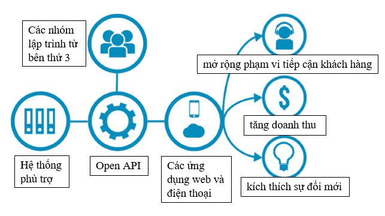
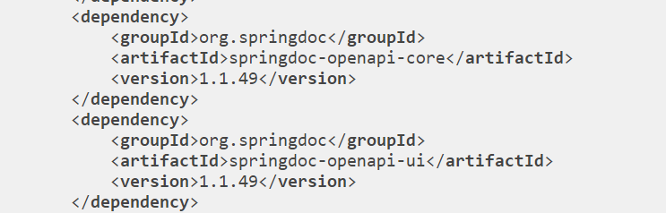
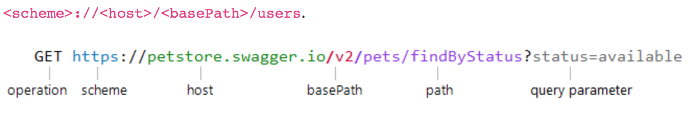

# 1.OPEN API
## 1.1. Định Nghĩa
OpenAPI Specification (OAS) là một định dạng mô tả API dành cho REST APIs. Một file OpenAPI cho phép bạn mô tả toàn bộ API bao gồm cả :
- Cho phép những endpoints (/users) và cách thức hoạt động của mỗi endpoint (GET /users, POST /users)
- Các tham số đầu vào & đầu ra của từng hoạt động
- Phương thức xác thực
- Thông tin liên lạc, chứng chỉ, điều khoản sử dụng và những thông tin khác

  
## 1.2. Phiên bản
 OAS được xây dựng dựa trên bộ mã nguồn mở Swagger vào cuối năm 2015 và cho ra đời bản thảo đầu tiên vào 28.02.2017. Đến 26.06.2017, đặc tả OpenAPI phiên bản 3.0.0 đầu tiên được phát hành và được triển khai rộng rãi trên môi trường mạng. Phiên bản hiện tại OpenAPI Specification 3.0.3 là phiên bản vá lỗi và hoạn thiện cuối cùng của đặc tả này vào ngày 20.02.2020.
## 1.3. Đặc tả 
  Xác định một giao diện chuẩn, không có ngôn ngữ cho các API RESTful cho phép cả người và máy tính khám phá và hiểu các khả năng của dịch vụ mà không cần truy cập vào mã nguồn, tài liệu hoặc thông qua kiểm tra lưu lượng mạng. Khi được xác định đúng, người dùng có thể hiểu và tương tác với dịch vụ từ xa với một lượng logic triển khai tối thiểu. Sau đó, định nghĩa OpenAPI có thể được sử dụng bởi các công cụ tạo tài liệu để hiển thị API, các công cụ tạo mã để tạo máy chủ và máy khách bằng các ngôn ngữ lập trình khác nhau, công cụ kiểm tra và nhiều trường hợp sử dụng khác.

 
## 1.4. Định dạng
 Bản thân tài liệu OpenAPI tuân theo Đặc điểm kỹ thuật OpenAPI là một đối tượng JSON, có thể được biểu diễn ở định dạng JSON hoặc YAML.
 - Ví dụ dưới dạng JSON :
 ```php
 {
   "field": [ 1, 2, 3 ]
 }
```
Tất cả các tên trường trong đặc tả đều phân biệt chữ hoa chữ thường. Điều này bao gồm tất cả các trường được sử dụng làm khóa trong miêu tả, ngoại trừ trường hợp được ghi chú rõ ràng rằng các khóa không phân biệt chữ hoa chữ thường.

Lược đồ hiển thị hai loại trường: trường cố định, có tên được khai báo và trường có mẫu, khai báo mẫu regex cho tên trường.

Các trường có mẫu phải có tên duy nhất với đối tượng mà nó đại diện.

Để duy trì khả năng thay đổi giữa các định dạng YAML và JSON, YAML phiên bản [1.2](https://yaml.org/spec/1.2.2/) được khuyến cáo cùng với một số ràng buộc bổ sung:
 - Các thẻ phải được giới hạn ở những thẻ được bộ quy tắc [JSON Schema ruleset](https://yaml.org/spec/1.2-old/spec.html#id2803231) .
 - Các khóa được sử dụng trong bản đồ YAML phải được giới hạn trong một chuỗi vô hướng, như được định nghĩa bởi bộ quy tắc lược đồ [YAML Failsafe](http://yaml.org/spec/1.2-old/spec.html#id2802346).

 Khuyến cáo rằng tài liệu OpenAPI gốc phải được đặt tên: openapi.json hoặc openapi.yaml.

Lưu ý: Mặc dù các API có thể được định nghĩa bởi các tài liệu OpenAPI ở định dạng YAML hoặc JSON, các cơ quan phản hồi và yêu cầu API cũng như nội dung khác không bắt buộc phải là JSON hoặc YAML.

## 1.5. Document Structure :
OpenAPI có thể được tạo thành từ một tài liệu duy nhất hoặc được chia thành nhiều phần, được kết nối theo quyết định của người dùng. Trong trường hợp sau, các trường `$ref ` phải được sử dụng trong đặc tả để tham chiếu các phần đó như sau từ các định nghĩa của [JSON Schema](http://json-schema.org/)

Chú ý rằng tài liệu OpenAPI gốc phải được đặt tên: openapi.json hoặc openapi.yaml.

## 1.6. Các loại dữ liệu
Các kiểu dữ liệu ban đầu trong OAS dựa trên các kiểu được hỗ trợ bởi [JSON Schema Specification Wright Draft 00](https://datatracker.ietf.org/doc/html/draft-wright-json-schema-00#section-4.2) (JSON Schema: A Media Type for Describing JSON Documents draft-wright-json-schema-00). Lưu ý rằng integer với tư cách là một loại cũng được hỗ trợ và được định nghĩa là số JSON không có phần phân số hoặc số mũ. null không được hỗ trợ như một loại (xem nullable giải pháp thay thế). Mô hình được định nghĩa bằng Đối tượng lược đồ, là một tập con mở rộng của Đặc tả lược đồ JSON Wright Draft 00.
Primitives có một định dạng sửa đổi tùy chọn: “format”. OAS sử dụng một số định dạng đã biết để xác định chi tiết kiểu dữ liệu đang được sử dụng. Tuy nhiên, để hỗ trợ nhu cầu tài liệu, “format” định dạng là định dạng được “string” miêu tả mở và có thể có bất kỳ giá trị nào.

Các định dạng chẳng hạn như "email", "uuid"v.v., có thể được sử dụng mặc dù không được xác định bởi đặc tả này. Các kiểu không kèm theo thuộc “format” tính tuân theo định nghĩa kiểu trong Lược đồ JSON. Các công cụ không nhận ra một cụ thể “format” có thể mặc định trở lại “type” một mình, như một “format” ở thể không được chỉ định.
Các định dạng được xác dịnh bởi OAS là:

| Common Name	 | type | format  | Comments  |
|:--------------:|:------:|:-----:| :---------|
|  integer  |  integer  |   int32  |Ký ở định dạng 32 bit|
|  long  |  integer  |   int64 |Ký ở định đạng 64 bit|
| float | number | float ||
| double | number | double ||
| string | string |  ||
| byte | string | byte |Ký tự được mã hóa base64|
| binary | string | binary |Bất kỳ chuỗi octet nào|
| boolean | boolean |  ||
| date | string | date |Theo định nghĩa “full-date” thuộc RFC3339|
| dateTime | string |dateTime|Theo định nghĩa “date-time” thuộc RFC3339|
| password | string |password|Một gợi ý cho giao diện người dùng để che khuất đầu nhập vào.
|

## 1.7 Định dạng văn bản đa dạng thứ
Trong suốt các trường thông số kỹ thuật, “description" được ghi nhận là hỗ trợ định dạng đánh dấu CommonMark. Trường hợp công cụ OpenAPI hiển thị văn bản đa dạng thức thì nó phải hỗ trợ, ở mức tối thiểu, cú pháp đánh dấu như được mô tả bởi CommonMark 0.27. Việc xây dựng API có thể chọn bỏ qua một số tính năng CommonMark để giải quyết các mối lo ngại về bảo mật.

## 1.8 Phần mở rộng đặc điểm
Trong khi Đặc điểm kỹ thuật OpenAPI cố gắng đáp ứng hầu hết các trường hợp sử dụng, dữ liệu bổ sung có thể được thêm vào để mở rộng thông số kỹ thuật tại một số điểm nhất định.

Các thuộc tính tiện ích mở rộng được triển khai dưới dạng các trường mẫu luôn có tiền tố là "x-".
## 1.9 Bảo mật với yếu tố lọc bỏ
Một số đối tượng trong Đặc tả OpenAPI có thể được khai báo và vẫn trống hoặc bị loại bỏ hoàn toàn, mặc dù chúng vốn dĩ là cốt lõi của tài liệu API.

Lý do là để cho phép một lớp kiểm soát truy cập bổ sung đối với tài liệu. Mặc dù không phải là một phần của bản đặc tả, nhưng một số thư viện có thể chọn cho phép truy cập vào các phần của tài liệu dựa trên một số hình thức xác thực / ủy quyền.

Hai ví dụ về điều này:

- Các Paths Object có thể rỗng. Nó có thể phản trực giác, nhưng điều này có thể cho người xem biết rằng họ đã đến đúng nơi, nhưng không thể truy cập bất kỳ tài liệu nào. Họ vẫn có quyền truy cập vào đối tượng thông tin có thể chứa thông tin bổ sung về xác thực.

- Các đường dẫn mục Object có thể rỗng. Trong trường hợp này, người xem sẽ biết rằng đường dẫn tồn tại, nhưng sẽ không thể thấy bất kỳ hoạt động hoặc tham số nào của nó. Điều này khác với việc ẩn chính đường dẫn khỏi đối tượng đường dẫn, bởi vì người dùng sẽ nhận thức được sự tồn tại của nó. Điều này cho phép nhà cung cấp tài liệu kiểm soát tốt những gì người xem có thể nhìn thấy.

<!-- ## Cài đặt
- Chúng ta sử dụng :


 
- Trong đó :
    - springdoc là một thư viện java implementation của OpenApi Specification 
    - springdoc-openapi-core chứa core của swagger, giúp chúng ta khai báo document cho api.
    - springdoc-openapi-ui giúp chúng ta biểu diễn tài liệu dưới dạng web view, dễ nhìn và test. -->
***


 # 2.Swagger
 ## 2.1 Định nghĩa
Swagger là một bộ công cụ mã nguồn mở để xây dựng OpenAPI specifications giúp bạn có thể thiết kế, xây dựng tài liệu và sử dụng REST APIs
- Swagger-Editor : dùng để design lên các APIs hoàn toàn mới hoặc edit lại các APIs có sẵn thông qua 1 file config.
- Swagger-Codegen : dùng để generate ra code từ các file config có sẵn
- Swagger-UI : dùng để generate ra file html,css,… từ 1 file config.
## 2.2 Cấu trúc cơ bản của file Swagger
 - Metadata: Mọi thông số kỹ thuật của Swagger đều bắt đầu với phiên bản Swagger . Phiên bản Swagger xác định cấu trúc tổng thể của đặc tả API - những gì bạn có thể ghi lại và cách bạn ghi lại nó. Ngoài ra các thông tin chi tiết như tiêu đề, mô tả hay version của bản api hiện tại cũng được khai báo tại đây.
 - Base Url: Nơi bạn sẽ định nghĩa host của server, đường dẫn cơ bản cũng như giao thức https hoặc http.
- Consumes, Produces: xác định các loại MiME được API hỗ trợ
- Paths: xác định các điểm cuối riêng lẻ (đường dẫn) trong API của bạn và các phương thức HTTP (hoạt động) được hỗ trợ bởi các điểm cuối này. Và đây là phần quan trọng chứa thông tin API của bạn sẽ như thế nào bằng đường dẫn API, phương thức (GET, POST, PUT...), request (query, path, body..), response API

## 2.3 API Host and Base URL
REST APIs có một URL cơ sở mà các đường dẫn điểm cuối được nối vào. Đường url này được định nghĩa bởi schema, host, basePath

 ```php
host: petstore.swagger.io
basePath: /v2
schemes:
    - https
```
Ví dụ : 


Trong đó : 
- Schema là giao thức truyền được API sử dụng. Swagger hỗ trợ 2 giao thức là http và https
- host là tên miền hoặc địa chỉ IP (IPv4) của máy chủ lưu trữ cung cấp API. Nó có thể bao gồm số cổng nếu khác với cổng mặc định của lược đồ (80 cho HTTP và 443 cho HTTPS). Lưu ý rằng đây chỉ phải là máy chủ lưu trữ, không có http (s): // hoặc đường dẫn phụ
- basePath là tiền tố URL cho tất cả các đường dẫn API, liên quan đến gốc máy chủ. Nó phải bắt đầu bằng một dấu gạch chéo /. Nếu basePath không được chỉ định, nó sẽ mặc định là /, nghĩa là, tất cả các đường dẫn đều bắt đầu từ máy chủ gốc

## 2.4 Paths and Operations
Các phương thức HTTP được sử dụng để thao tác các đường dẫn này, chẳng hạn như GET, POST hoặc DELETE. Khi đã khai báo đường dẫn đến API và phương thức của API, chúng ta cần tiếp tục khai báo đến request input của API gọi là Parameters

## 2.5 Parameters
Các tham số hoạt động API được xác định trong phần tham số trong định nghĩa hoạt động. Mỗi tham số có tên, kiểu giá trị (đối với tham số giá trị nguyên thủy) hoặc lược đồ (đối với nội dung yêu cầu) và mô tả tùy chọn. Các dạng Parameters như là :
- query parameters, ví dụ /users?role=admin. Tham số truy vấn là loại tham số phổ biến nhất. Chúng xuất hiện ở cuối URL yêu cầu sau dấu chấm hỏi (?), Với các cặp tên = giá trị khác nhau được phân tách bằng dấu và (&). Tham số truy vấn có thể được yêu cầu và tùy chọn.
- path parameters, ví dụ /users/{id}. Tham số đường dẫn là các thành phần của đường dẫn URL có thể khác nhau. Chúng thường được sử dụng để trỏ đến một tài nguyên cụ thể trong một bộ sưu tập, chẳng hạn như người dùng được xác định bằng ID. Một URL có thể có một số tham số đường dẫn, mỗi tham số được biểu thị bằng dấu ngoặc nhọn {}.
- header parameters, ví dụ X-MyHeader: Value. Một lệnh gọi API có thể yêu cầu gửi các tiêu đề tùy chỉnh cùng với một yêu cầu HTTP. Swagger cho phép bạn xác định tiêu đề yêu cầu tùy chỉnh như trong: tham số tiêu đề. Ví dụ: giả sử, một cuộc gọi tới GET / ping yêu cầu tiêu đề X-Request-ID:
- body parameters sử dụng trong the body of POST, PUT and PATCH requests. Các yêu cầu POST, PUT và PATCH có thể có phần thân yêu cầu (tải trọng), chẳng hạn như dữ liệu JSON hoặc XML. Theo thuật ngữ Swagger, nội dung yêu cầu được gọi là tham số nội dung. Chỉ có thể có một tham số nội dung, mặc dù hoạt động có thể có các tham số khác (đường dẫn, truy vấn, tiêu đề).
- form parameters sử dụng cho những request truyền lên nhiều data ví dụ như việc upload file chả hạn
## 2.6 Response API
Một API cần chỉ định các phản hồi cho tất cả các hoạt động API. Mỗi thao tác phải có ít nhất một phản hồi được xác định, thường là một phản hồi thành công. Phản hồi được xác định bằng mã trạng thái HTTP của nó và dữ liệu được trả về trong nội dung phản hồi và / hoặc tiêu đề

 ```php
paths:
  /ping:
    get:
      produces:
        - application/json
      responses:
        200:
          description: OK
```

mỗi định nghĩa phản hồi bắt đầu bằng một mã trạng thái, chẳng hạn như 200 hoặc 404. Một hoạt động thường trả về một mã trạng thái thành công và một hoặc nhiều trạng thái lỗi. Mỗi trạng thái phản hồi yêu cầu một mô tả.

 ```php
 responses:
        200:
          description: OK
        400:
          description: Bad request. User ID must be an integer and bigger than 0.
        401:
          description: Authorization information is missing or invalid.
        404:
          description: A user with the specified ID was not found.
```
Một thứ rất hay của Swagger hỗ trợ là `$ref`. Nó giúp chúng ta có thể sử dụng lại những data mà ta đã định nghĩa. Nó giúp tránh việc trùng lặp hay khai báo nhiều lần.

## 2.6 Sử dụng Swagger trong Java
### 2.6.1 Depndency
Chúng ta cần sử dụng các dependency : 
```
<dependency>
			<groupId>io.springfox</groupId>
			<artifactId>springfox-swagger-ui</artifactId>
			<version>3.0.0</version>
		</dependency>
		<dependency>
			<groupId>io.springfox</groupId>
			<artifactId>springfox-swagger2</artifactId>
			<version>3.0.0</version>
		</dependency>
		<dependency>
			<groupId>io.springfox</groupId>
			<artifactId>springfox-boot-starter</artifactId>
			<version>3.0.0</version>
		</dependency>
```
### 2.6.2 Configuration Java
Phần configuration của Swagger chủ yếu nằm ở xung quanh Docket bean:
```
@Configuration
public class SpringFoxConfig {                                    
    @Bean
    public Docket api() { 
        return new Docket(DocumentationType.SWAGGER_2)  
          .select()                                  
          .apis(RequestHandlerSelectors.any())              
          .paths(PathSelectors.any())                          
          .build();                                           
    }
}
```
Sau khi xác định Docket bean. Hàm select() của nó sẽ trả về một instance của ApiSelectorBuilder thứ sẽ cung cấp cách để kiểm soát các endpoint mà Swagger tương tác.

Chúng ta có thể cài đặt để chọn RequestHandlers với sự giúp đỡ từ RequestHandlerSelectors và PathSelectors. Sử dụng any() cho cả 2 sẽ tạo documentation cho toàn bộ API khả dụng thông qua Swagger.
## 2.7 Code demo
 Code demo được để ở [đây](./swagger)
***

# REFERENCES
[1] https://github.com/OAI/OpenAPI-Specification/blob/main/versions/3.0.0.md#definitions

[2] https://viblo.asia/p/co-ban-ve-swagger-oOVlYjOV58W

[3] https://hocspringboot.net/2020/10/16/swagger-trong-springboot-la-gi/