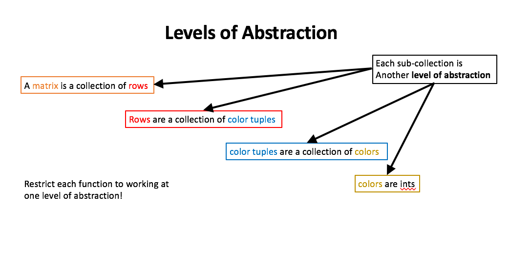

# CÁCH VIẾT HÀM

## So Sánh 2 hàm sau.
- Hàm 1: 
```java
public static String testableHtml(
PageData pageData,
boolean includeSuiteSetup) 
throws Exception {
    WikiPage wikiPage = pageData.getWikiPage();
    StringBuffer buffer = new StringBuffer();
    if (pageData.hasAttribute("Test")) {
        if (includeSuiteSetup) {
            WikiPage suiteSetup =
                    PageCrawlerImpl.getInheritedPage(
                            SuiteResponder.SUITE_SETUP_NAME, wikiPage);
            if (suiteSetup != null) {
                WikiPagePath pagePath =
                    suiteSetup.getPageCrawler().getFullPath(suiteSetup);
                String pagePathName = PathParser.render(pagePath);
                buffer.append("!include -setup .")
                    .append(pagePathName)
                    .append("\n");
            }
        }
        WikiPage setup =
            PageCrawlerImpl.getInheritedPage("SetUp", wikiPage);
        if (setup != null) {
            WikiPagePath setupPath =
                wikiPage.getPageCrawler().getFullPath(setup);
            String setupPathName = PathParser.render(setupPath);
            buffer.append("!include -setup .")
                .append(setupPathName)
                .append("\n");
        }
    }
    buffer.append(pageData.getContent());
    if (pageData.hasAttribute("Test")) {
        WikiPage teardown =
        PageCrawlerImpl.getInheritedPage("TearDown", wikiPage);
        if (teardown != null) {
            WikiPagePath tearDownPath =
                wikiPage.getPageCrawler().getFullPath(teardown);
            String tearDownPathName = PathParser.render(tearDownPath);
            buffer.append("\n")
                .append("!include -teardown .")
                .append(tearDownPathName)
                .append("\n");
        }
        if (includeSuiteSetup) {
            WikiPage suiteTeardown =
                PageCrawlerImpl.getInheritedPage(
                SuiteResponder.SUITE_TEARDOWN_NAME,
                wikiPage);
            if (suiteTeardown != null) {
                WikiPagePath pagePath =
                    suiteTeardown.getPageCrawler()
                    .getFullPath(suiteTeardown);
                String pagePathName = PathParser.render(pagePath);
                buffer.append("!include -teardown .")
                    .append(pagePathName)
                    .append("\n");
            }
        }
    }
    pageData.setContent(buffer.toString());
    return pageData.getHtml();
}
```
- Hàm 2: 
```java
public static String renderPageWithSetupsAndTeardowns(
PageData pageData, boolean isSuite
) throws Exception {
    boolean isTestPage = pageData.hasAttribute("Test");
    if (isTestPage) {
        WikiPage testPage = pageData.getWikiPage();
        StringBuffer newPageContent = new StringBuffer();
        includeSetupPages(testPage, newPageContent, isSuite);
        newPageContent.append(pageData.getContent());
        includeTeardownPages(testPage, newPageContent, isSuite);
        pageData.setContent(newPageContent.toString());
    }
    return pageData.getHtml();
}
```
- Có thể thấy rằng hàm 2 dễ hiểu hơn hàm 1, vậy làm thế nào để đạt được sự dễ hiểu này.

## Các quy tắc để hàm sạch
### 1- Hàm phải nhỏ 
- Các dòng không nên dài quá 150 ký tự, các hàm không nên quá 20 dòng
- Ví dụ như hàm 2 bên trên còn có thể rút lại thành hàm 3.
- Hàm 3:
```java
public static String renderPageWithSetupsAndTeardowns(
PageData pageData, boolean isSuite) throws Exception {
    if (isTestPage(pageData))
        includeSetupAndTeardownPages(pageData, isSuite);
    return pageData.getHtml();
}
```
- Các khối lệnh trong câu lệnh if-else phải dài 1 dòng và dòng đó nên là một lời gọi hàm,
giúp giữ cho các hàm nhỏ và bổ sung thêm giá trị tài liệu cho code.

### 2- Hàm chỉ thực hiện 1 việc
- "HÀM CHỈ NÊN THỰC HIỆN MỘT VIỆC. CHÚNG NÊN LÀM TỐT VIỆC ĐÓ, VÀ CHỈ LÀM DUY NHẤT VIỆC ĐÓ"
- Để biết hàm A đang làm nhiều hơn 1 việc: có thể trích suất 1 hàm khác từ hàm A, hàm được trích xuất có chức năng khác
tên hàm A (ví dụ hàm 1 và 2)

### 3- Mỗi hàm là 1 cấp độ trừu tượng 
- Cấp độ trừu tượng :
- 
  Mức độ phức tạp mà hệ thống được xem hoặc lập trình. Cấp càng cao thì càng ít chi tiết. Cấp càng thấp thì càng chi tiết.
Mức trừu tượng cao nhất là toàn bộ hệ thống. Cấp độ tiếp theo sẽ là một số ít các thành phần, v.v., trong khi cấp độ thấp
nhất có thể là hàng triệu đối tượng

- Đọc code từ trên xuống dưới: nguyên tắc Stepdown
thứ tự của các dòng code, trên cùng là các hàm có cấp độ trừu tượng cao nhất, càng xuống dưới thì cấp độ trừu tượng càng thấp dần.

### 4- Câu lệnh switch.
- Bản chất của câu lệnh switch là thực hiện nhiều việc, rất khó để sử dụng câu lệnh này trong 1 hàm mà hàm đó chỉ làm 1
việc
```java
public Money calculatePay(Employee e)
throws InvalidEmployeeType {
    switch (e.type) {
        case COMMISSIONED:
            return calculateCommissionedPay(e);
        case HOURLY:
            return calculateHourlyPay(e);
        case SALARIED:
            return calculateSalariedPay(e);
        default:
            throw new InvalidEmployeeType(e.type);
    }
}
```
- Nguyên tắc Đơn nhiệm: Mỗi lớp chỉ nên chịu trách nhiệm về một nhiệm vụ cụ thể nào đó mà thôi.
- Nguyên tắc Đóng & mở: Chúng ta nên hạn chế việc chỉnh sửa bên trong một Class hoặc Module có sẵn, thay vào đó hãy xem 
xét mở rộng chúng.
- Để giải quyết vấn đề này ta sử dụng cách giấu câu lệnh switch trong  một
  lớp cơ sở của ABSTRACT FACTORY và không bao giờ để người khác trông thấy nó. ABSTRACT FACTORY sẽ sử dụng câu lệnh 
switch để tạo ra các trường hợp thích hợp của các dẫn xuất (lớp con) của Employee, và các hàm khác như calculatePay, 
isPayday, và deliverPay, sẽ được gọi bằng tính đa hình thông qua interface của Employee.

```java
public abstract class Employee {
    public abstract boolean isPayday();
    public abstract Money calculatePay();
    public abstract void deliverPay(Money pay);
}
/*...*/
public interface EmployeeFactory {
    public Employee makeEmployee(EmployeeRecord r) throws InvalidEmployeeType;
}
/*...*/
public class EmployeeFactoryImpl implements EmployeeFactory {
    public Employee makeEmployee(EmployeeRecord r) throws   InvalidEmployeeType {
        switch (r.type) {
            case COMMISSIONED:
                return new CommissionedEmployee(r) ;
            case HOURLY:
                return new HourlyEmployee(r);
            case SALARIED:
                return new SalariedEmploye(r);
            default:
                throw new InvalidEmployeeType(r.type);
        }
    }
}
```
- Factory Pattern xác định một interface để tạo một đối tượng, nhưng cho phép các lớp con quyết định lớp nào sẽ khởi tạo.
Factory Pattern giao việc khởi tạo một đối tượng cụ thể cho lớp con

### 5- Dùng tên có tính mô tả
- Tên tốt là tên có thể mô tả được chức năng của hàm .
- Đừng ngại đặt tên dài.
- Thử nghiệm và tìm ra cái tên phù hợp.

### 6- Đối số của hàm
- Số lượng đối số lý tưởng cho một hàm là không (niladic), tiếp đến là một (monadic), sau đó là hai (dyadic). Nên tránh
trường hợp ba đối số (triadic) nếu có thể. Các hàm có nhiều hơn ba đối số (polyadic) chỉ cần thiết trong các trường hợp
đặc biệt, và sau đó nên hạn chế sử dụng chúng đến mức thấp nhất.
- Hình thức chung của hàm 1 đối số: 
  + Đặt một câu hỏi đúng – sai cho đối số đó, như boolean fileExists(“MyFile”).
  + Thao tác trên đối số đó, biến nó thành một thứ gì khác và trả lại nó. Ví dụ, InputStream fileOpen(“MyFile”) 
  + Gọi hàm như một sự kiện, và sử dụng các đối số để thay đổi trạng thái của hệ thống, ví dụ, 
  void passwordAttemptFailedNtimes(int attempts).
- Hàm 2 đối số: 
  + Hàm có hai đối số sẽ khó hiểu hơn hàm có một đối số. Ví dụ writeField(name) sẽ dễ hiểu hơn writeField(output-Stream,
  name).
  + Có những lúc hai đối số sẽ hợp lý hơn một đối số. Ví dụ:
    Point p = new Point(0,0);
  + Nếu có thể hãy chuyển hàm 2 đối số thành 1 đối số.
- Hàm 3 đối số:
   + Cần cẩn thận trước khi tạo ra hàm 3 đối số.
- Đối số đối tượng: 
  + Khi một hàm có vẻ cần nhiều hơn hai hoặc ba đối số, có khả năng một số đối số đó phải được bao bọc thành một lớp 
  riêng của chúng.
```java
Circle makeCircle(double x, double y, double radius);
Circle makeCircle(Point center, double radius);
```
- Động từ và các từ khóa.
  + Chọn tên tốt cho một hàm có thể góp phần giải thích ý định của hàm và mục đích của các
    đối số vd:  assertEquals có thể được cải tiến thành assertExpectedEqualsActual(expected, actual)

### 7- Không có tác dụng phụ
 - Mỗi hàm chỉ làm 1 việc, đừng tạo ra các tác dụng phụ không nằm trong chức năng được nêu ở tên hàm.
```java
public class UserValidator {
    private Cryptographer cryptographer;
    public boolean checkPassword(String userName, String password) {
        User user = UserGateway.findByName(userName);
        if (user != User.NULL) {
            String codedPhrase = user.getPhraseEncodedByPassword();
            String phrase = cryptographer.decrypt(codedPhrase, password);
            if ("Valid Password".equals(phrase)) {
                Session.initialize();
                return true;
            }
        }
        return false;
    }
}
```
 - Tác dụng phụ ở đây là lời gọi hàm Session.initialize(). Hàm checkPassword, theo cách đặt tên của nó, nói rằng nó chỉ
kiểm tra mật khẩu. Tên hàm không thông báo rằng nó khởi tạo session. Nếu bắt buộc phải khởi tạo sesion hãy nêu nó ở tên 
hàm checkPasswordAndInitializeSession
 
### 8- Ưu tiên các trường hợp ngoại lệ để return mã lỗi
 - Khi trả về một mã lỗi, bạn tạo ra vấn đề mà nơi gọi phải xử lý lỗi ngay lập tức.
```java
if (deletePage(page) == E_OK) {
    if (registry.deleteReference(page.name) == E_OK) {
        if (configKeys.deleteKey(page.name.makeKey()) == E_OK){
            logger.log("page deleted");
        } else {
            logger.log("configKey not deleted");
        }
    } else {
        logger.log("deleteReference from registry failed");
    }
} else {
    logger.log("delete failed");
    return E_ERROR;
}
```
 - Mặt khác, nếu bạn sử dụng các ngoại lệ thay vì các mã lỗi trả về, thì mã xử lý lỗi có thể được tách ra khỏi luồng code 
và có thể được đơn giản hóa:
```java
try {
    deletePage(page);
    registry.deleteReference(page.name);
    configKeys.deleteKey(page.name.makeKey());
}
catch (Exception e) {
    logger.log(e.getMessage());
}
```
 - GIẢI NÉN KHỐI TRY/CATCH
   - Các khối try/catch là xấu theo đúng nghĩa của chúng. Chúng nhầm lẫn cấu trúc của code và trộn lẫn xử lý lỗi với xử 
   lý thông thường. Vì vậy, tốt hơn là trích xuất phần thân của khối try và catch thành các chức năng của riêng chúng.
   
```java
public void delete(Page page) {
    try {
        deletePageAndAllReferences(page);
    }
    catch (Exception e) {
        logError(e);
    }
}
private void deletePageAndAllReferences(Page page) throws Exception {
    deletePage(page);
    registry.deleteReference(page.name);
    configKeys.deleteKey(page.name.makeKey());
}
private void logError(Exception e) {
    logger.log(e.getMessage());
}
```


 - Xử lý lỗi 1 lần 
   - Các hàm chỉ nên làm một việc. Xử lý lỗi là một lần. Vì vậy, một chức năng xử lý lỗi không nên làm gì khác. Điều này 
   ngụ ý (như trong ví dụ trên) rằng nếu từ khóa try tồn tại trong một hàm, nó phải là từ đầu tiên trong hàm và không 
   được có gì khác sau các khối catch/ final.

### 9- Đừng lặp lại code của bạn
 - Sự trùng lặp có lẽ là gốc rễ của mọi tội lỗi trong lập trình. Nhiều nguyên tắc và kinh nghiệm đã được tạo ra cho mục 
đích kiểm soát hoặc loại bỏ nó. Lập trình cấu trúc, lập trình hướng đối tượng (OOP), lập trình hướng khía cạnh (Aspect 
Oriented Programming – AOP), lập trình hướng thành phần (Component Oriented Programming – COP), tất cả chúng đều có 
chiến lược để loại bỏ code trùng lặp. Nó chứng minh rằng kể từ khi chương trình con được phát minh, các sáng kiến 
trong ngành công nghiệp phát triển phần mềm đều nhắm đến việc loại bỏ những đoạn code trùng lặp ra khỏi mã nguồn.

### 10- Tôi đã viết các hàm này như thế nào?
  - Viết và làm cho các hàm chạy trước, sau đó sắp xếp và clean lại sau.
