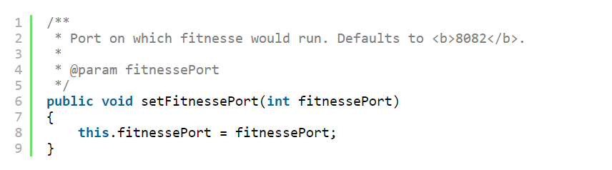

# **CHƯƠNG 4: Comment thế nào cho chuẩn ?**

                                        “Đừng biến đống code gớm ghiếc của bạn thành comment – hãy viết lại nó”

                                                                                                BRIAN W. KERNIGHAN AND P. J. PLAUGHER
**Các comment tốt nhất nên trở thành sự lựa chọn cuối cùng**
- Khi các dòng code của bạn chưa rõ nghĩa thì cần đến các dòng comment
- => Suy nghĩ cách thể biến các dòng code trở nên dễ hiểu và chính xác với những gì ta muốn thể hiện
- Các dòng comment dần trở nên dứt đoạn với độ chính xác giảm dần theo thời gian tái lập và tạo lên chương trình

- 

=> Chân lý chỉ có thể tìm thấy tại một nơi duy nhất: Code. Chỉ có code mới nói cho bạn biết thật sự những gì nó làm.
Nó là nguồn thông tin chính xác duy nhất. Do đó, mặc dù comment đôi khi là cần thiết, nhưng chúng tôi sẽ cố gắng để giảm thiểu nó.

# **Đừng dùng comment để làm màu cho code**
  - Thay vì tự nhủ rằng: “Ồ, tốt hơn nên viết comment ở đây!”. Không! Tốt hơn bạn nên viết lại code!

# **Giải thích ý nghĩa ngay trong code**
- 

Hay cái này

- 

Trong nhiều trường hợp, nó chỉ đơn giản là tạo ra một hàm có tên giống với comment mà bạn muốn viết

# **Comment tốt**
**- COMMENT PHÁP LÝ**

**- COMMENT CUNG CẤP THÔNG TIN**
- Ví dụ, hãy xem cách mà comment này giải thích về giá trị trả về của một phương thức trừu tượng:

=> Ví dụ, trong trường hợp này, chúng ta có thể dọn dẹp comment trên bằng cách đặt lại tên hàm thành _**responderBeingTested**_.

**- GIẢI THÍCH MỤC ĐÍCH**
- Đôi khi comment không chỉ cung cấp thông tin về những dòng code mà còn cung cấp ý định đằng sau nó.

**- LÀM DỄ HIỂU**
- Đôi khi bạn cần dùng comment để diễn giải ý nghĩa của các đối số khó hiểu hoặc giá trị trả về, để biến chúng thành thứ gì đó có thể hiểu được. 
- Nhưng khi nó là một phần của thư viện, hoặc thuộc về một phần code mà bạn không có quyền tùy chỉnh, thì một comment giải thích dễ hiểu có thể có ích trong trường hợp này.

**- CÁC CẢNH BÁO VỀ HẬU QUẢ**

- Sử dụng @Ignore (“It takes too long to run”).
- Nhưng trước khi JUnit 4 xuất hiện, việc đặt một dấu gạch dưới vào trước tên hàm là một quy tắc rất phổ biến. 

**- TODO COMMENTS**

- Những comment dạng TODO là những công việc mà lập trình viên cho rằng nên được thực hiện, nhưng vì lý do nào đó mà họ không thể thực hiện nó ngay lúc này. Nó có thể là một lời nhắc để xóa một hàm không dùng nữa, hoặc yêu cầu người khác xem xét một số vấn đề: đặt lại một cái tên khác tốt hơn, lời nhắc thay đổi code của hàm khi kế hoạch của dự án thay đổi,.. 
- Ngày nay, hầu hết các IDE đều cung cấp các tính năng đặc biệt để định vị các comment TODO, do đó bạn không cần lo việc bỏ quên/lạc mất nó

**- KHUẾCH ĐẠI**

**- JAVADOCS TRONG PUBLIC APIS**
- Không có gì hữu ích và tuyệt vời bằng một public API được mô tả tốt. Các javadoc của thư viện chuẩn của Java là một trường hợp điển hình. Sẽ rất khó để viết các chương trình Java mà thiếu chúng.

# **- Comment tồi**
- Đa số các comment rơi vào thể loại này.
- húng thường được sử dụng như cái cớ cho việc viết code rởm hoặc biện minh cho các cách giải quyết đầy thiếu sót, các giá trị không đầy đủ so với cách lập trình viên nghĩ về nó.

**- ĐỘC THOẠI**
- Quăng vào một comment chỉ vì bạn thấy thích, hoặc chỉ vì quá trình xử lý cần đến nó, điều đó được gọi là hack (giải quyết vấn đề không theo cách thường mà dùng thủ thuật, đường tắt,…). Nếu bạn quyết định viết comment, hãy dành thời gian cho nó để đảm bảo đó là comment tốt nhất mà bạn có thể viết.

- Trong trường hợp này các thuộc tính mặc định sẽ được tải.
-Nhưng, cái gì sẽ tải thuộc tính mặc định? Những thuộc tính mặc định đó đã được tải trước khi gọi loadProperties()? Hay chúng được tải khi loadedProperties.load(propertiesStream) phát sinh Exception? Hay chúng được tải sau khi gọi loadProperties()?  Có phải tác giả chỉ đang cố làm hài lòng chính bản thân anh ta về việc bỏ trống khối catch? Hoặc, kinh khủng hơn – tác giả đã dùng comment như một dấu hiệu, để sau này quay lại và viết các đoạn code tải các thuộc tính mặc định vào khối catch?

**- CÁC COMMENT THỪA THẢI**

Listing 4-1: waitForClose

    // Utility method that returns when this.closed is true. Throws an exception
    // if the timeout is reached.
    // Phương thức return khi this.closed là true, phát sinh ngoại lệ nếu hết thời gian chờ
    public synchronized void waitForClose(final long timeoutMillis)
    throws Exception
    {
    if(!closed)
    {
    wait(timeoutMillis);
    if(!closed)
    throw new Exception("MockResponseSender could not be closed");
    }
    }

- Nó chắn chắn không cung cấp nhiều thông tin hơn code. Nó không diễn giải cho code, không cung cấp mục đích hoặc lý do. Nó không dễ hiểu hơn code. Sự thật là, nó ít chính xác hơn code nhưng lại lôi cuốn người đọc chấp nhận sự thiếu chính xác đó thay cho hiểu biết thật sự.

**-CÁC COMMENT SAI SỰ THẬT**

- Bạn có phát hiện ra comment ở Listing 4-1 sai lệch như thế nào chưa? Phương thức không return khi (become) this.closed là true, nó return nếu (if) this.closed là true. Mặt khác, nó giả vờ chờ một khoản thời gian và sinh ra một Exception nếu this.closed vẫn chưa là true.

**- CÁC COMMENT BẮT BUỘC**
- Thật điên rồ khi cho rằng tất cả các hàm đều phải có javadoc, hoặc mọi biến đều phải có comment. Những comment như vậy chỉ làm rối code, đưa ra những lời bịa đặt, và ủng hộ việc gây nhầm lẫn và vô tổ chức. 

Listing 4-3

**- CÁC COMMENT NHẬT KÝ**
- Khi còn chưa có các hệ thống quản lý mã nguồn (source control)Đôi khi mọi người thêm một comment vào đầu module mỗi khi họ chỉnh sửa nó.

**- CÁC COMMENT GÂY NHIỄU**
- Đôi khi bạn gặp các comment không cung cấp thông tin gì ngoài sự phiền phức, chúng lặp lại một vấn đề hiển nhiên và không cung cấp thêm thông tin mới

Còn cái này:

Và sau đó là sự thừa thãi này:

Ví dụ khác:

_**Ví dụ:** Listing 4-4: startSending_

**- ĐỪNG DÙNG COMMENT KHI BẠN CÓ THỂ DÙNG HÀM HOẶC BIẾN**
Hãy xem xét đoạn code sau:

Chúng có thể được viết lại mà không cần comment:

- Có thể tác giả đã viết comment trước (tôi đoán thế), và sau đó viết code để hoàn thành nội dung của comment. Tuy nhiên, tác giả nên tái cấu trúc code, như tôi đã làm, để comment được xóa mà không ảnh hưởng đến thông điệp của đoạn code đó.

**- ĐÁNH DẤU LÃNH THỔ**
- Thỉnh thoảng vài lập trình viên thích đánh dấu một vị trí trong tệp mã nguồn

**- CÁC COMMENT KẾT THÚC**
- Mặc dù điều này có thể có ý nghĩa với các hàm dài và có nhiều cấu trúc lồng nhau, nhưng chúng lại thường được dùng trong các hàm nhỏ, hoặc các hàm mà lập trình viên thấy thích. Vì vậy lần tới nếu muốn đánh dấu kết thúc một khối lệnh phức tạp, hãy thử chia nhỏ hoặc rút ngắn hàm của bạn.

Listing 4-6: wc.java

**- THUỘC TÍNH VÀ DÒNG TÁC GIẢ**

- Hệ thống quản lý mã nguồn ghi nhớ rất tốt việc ai đã thêm gì, thêm khi nào,.. 

**- COMMENT-HÓA CODE**
- Comment-hóa code (chuyển code thành comment) là một trong những thói quen khiến lập trình viên dễ bị ghét nhất. Đừng làm việc đó!

**- HTML COMMENT**

- Nó làm comment khó đọc trực tiếp nhưng lại dễ đọc hơn trên trình soạn thảo hoặc IDE khác

**- THÔNG TIN PHI TẬP TRUNG**
- Nếu bắt buộc phải viết một comment, hãy đảm bảo rằng nó giải thích cho phần code gần nó nhất. Đừng cung cấp thông tin của toàn bộ hệ thống trong một comment cục bộ.

**- QUÁ NHIỀU THÔNG TIN**

- Đừng đưa các cuộc thảo luận hoặc mô tả không liên quan vào comment của bạn.
- Comment dưới đây được lấy ra từ một module có chức năng mã hóa và giải mã base64.

**- MỐI QUAN HỆ KHÓ HIỂU**
- Sự kết nối giữa comment và code mà nó mô tả nên rõ ràng.

- Một byte của bộ lọc nghĩa là gì? Nó có liên quan gì đến +1 không? Hay *3? Hay cả hai? Tại sao lại là giá trị 200 mà không phải giá trị khác? Mục đích của comment là để giải thích code, không phải giải thích chính nó. Thật đáng tiếc khi comment lại cần một lời giải thích cho riêng mình.

**- COMMENT LÀM TIÊU ĐỀ CHO HÀM**
- Các hàm ngắn không cần nhiều mô tả. Đặt một cái tên đủ tốt cho hàm thường tốt hơn việc đặt một comment ở trước hàm đó.

**- JAVADOCS TRONG CODE KHÔNG CÔNG KHAI**

VD: GeneratePrimes.java (example_01/example_02)

- Thật dễ để chỉ ra comment đầu tiên là dư thừa vì nó đọc rất giống hàm generatePrimes. Tuy nhiên, tôi nghĩ rằng comment giúp người đọc dễ tiếp cận thuật toán, vì vậy tôi có xu hướng để lại nó.
- Comment thứ hai chắc chắn là cần thiết. Nó giải thích lý do đằng sau việc sử dụng giá trị căn bậc hai làm giới hạn vòng lặp.

