## **ĐỊNH DẠNG CODE**
- Khi tiến hành bảo trì dự án, chúng tôi muốn mọi người ấn tượng bởi sự gọn gàng, nhất quán, và chú ý đến từng dòng code mà chúng tôi đã tạo ra.
- Chúng tôi muốn họ choáng ngợp bởi sự ngăn nắp.
- Chúng tôi muốn họ phải bất ngờ khi xem qua các module.
- Chúng tôi muốn người khác nhận thức được rằng chúng tôi chuyên nghiệp, và đây là sản phẩm được tạo ra bởi những chuyên gia.
- Nhưng nếu điều đó không xảy ra, nếu họ nhìn thấy “một đống” code tứ tung, cứ như thể đống code đó được tạo ra trong cơn phê sau khi lập trình viên hút cần, thì nhiều khả năng họ kết luận rằng những chi tiết cẩu thả tương tự sẽ xuất hiện đầy rẫy trong dự án.

- Bạn nên để tâm đến việc format code của bạn. Bạn cũng nên chọn ra một tập hợp các quy tắc định dạng đơn giản để áp dụng cho toàn bộ code của mình. Nếu bạn đang làm việc trong một nhóm thì cả nhóm nên thống nhất một bộ quy tắc định dạng chung và tất cả thành viên nên tuân thủ nó.

# **- Mục đích của việc định dạng**
- Giúp code của bạn trở nên rõ ràng
- Giúp dễ bảo trì, nâng cấp

_=> Vậy hãy xem chúng ta có những biện pháp nào cho vấn đề này._
# **- Định dạng theo chiều dọc**

- Bắt đầu với kích thước file: vậy bao nhiêu là đủ?
    - Tong java kích thước file gắn liền với kích thước class, nhưng hiện tại ta chỉ quán tâm đến kích thước file
    - kích thước một file mã nguồn Java có các kích thước khác nhau (Như hình)
  
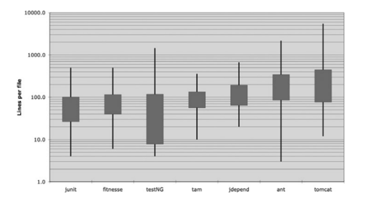

Độ dài tệp trong một số dự án

- Có bảy dự án khác nhau được mô tả. Junit, FitNesse, testNG, Time and Money (tam), JDepend, Ant, và Tomcat.\
- Đường kẻ đen xuyên qua hình chữ nhật biểu thị số dòng lớn nhất, nhỏ nhất trong mỗi file nguồn.
- Hình chữ nhật biểu thị cho khoảng 1/3 giá trị phổ biến nhất.
- Khoảng giữa hình chữ nhật là giá trị trung bình.

**Ví dụ với dự án FitNesse:**
- Kích thước tệp trung bình của loại dự án này là 65 dòng.
- Đa số nằm trong khoảng 40 đến 100+ dòng.
- File lớn nhất trong dự án có kích thước khoảng 400 dòng, nhỏ nhất là 6 dòng.

- Junit, FitNesse, và Time and Money (tam) bao gồm các file tương đối nhỏ. Không có file nào vượt quá 500 dòng và đa số các file dưới 200 dòng. Mặt khác, Tomcat và Ant có các file dài vài nghìn dòng và gần một nửa các file dài hơn 200 dòng.

- Điều này có ý nghĩa gì? Các file lớn, thường dài 200-500 dòng chứng tỏ rằng chúng được xây dựng cho các hệ thống quan trọng. Mặc đù đây không phải là một quy tắc bất di bất dịch, nhưng nó nên được xem xét. Các file nhỏ luôn dễ hiểu hơn các file lớn.

**- “HÀNH CODE” NHƯ NHÀ BÁO HÀNH VĂN**
- Tên file nên đơn giản nhưng có khả năng giải thích.
- Những dòng đầu tiên của file mã nguồn sẽ cung cấp các khái niệm và thuật toán.
- Các hàm được trình bày với mức độ thấp nhất ở cuối file và mọi thứ sẽ dần sáng tỏ khi cuộn chuột xuống cuối.
- Một ờ báo nên gồm nhiều bài báo nhỏ, một số thì lớn hơn một chút. Điều này làm bài báo hữu dụng hơn. Vì 1 bài báo dài với nhiều vấn đề sắp xếp thiếu tổ chức sẽ chẳng ai đọc
- => cũng như code

**- KHOẢNG CÁCH GIỮA CÁC ĐỊNH NGHĨA**
- Gần như tất cả code của bạn được đọc từ trái qua phải, từ trên xuống dưới. Mỗi dòng đại diện cho một biểu thức hoặc một mệnh đề, và mỗi nhóm dòng đại diện cho một mạch logic hoàn chỉnh. Những định nghĩa đó nên được tách biệt với nhau bằng những dòng trống.

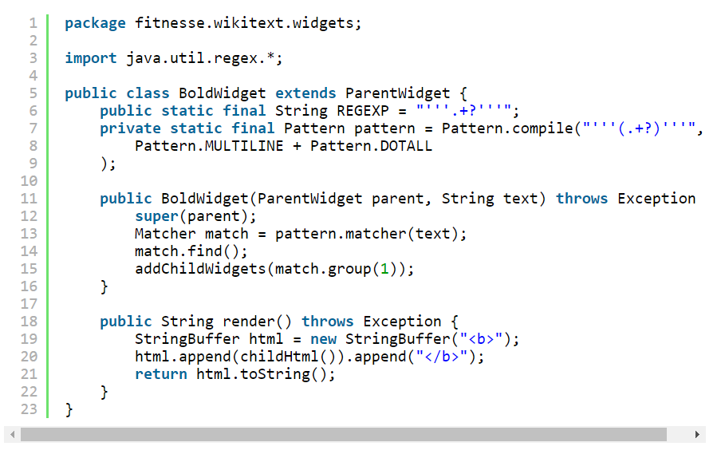

Khi xóa các dòng trống đó đi:

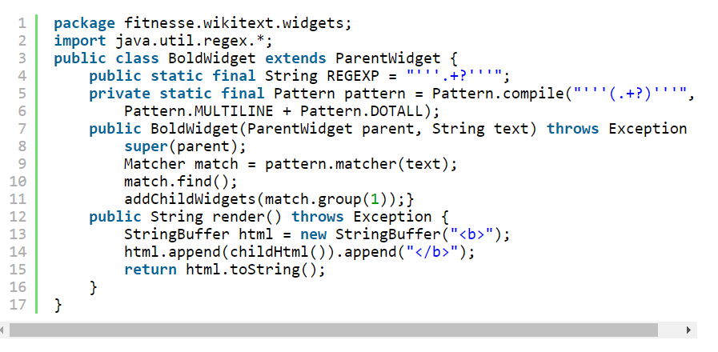

=> khoảng cách dọc dùng để tách các định nghĩa

**- MẬT ĐỘ THEO CHIỀU DỌC**
=> Mật độ theo chiều dọc nghĩa là sự liên kết các dòng của khái niệm/ định nghĩa

_Hình 1_
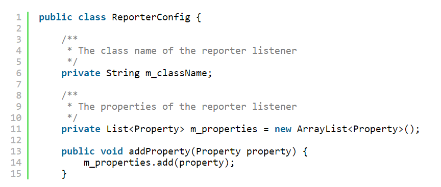

_Hình 2_
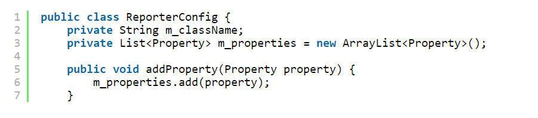
=> Trông dễ nhìn, biết ngay rằng đây có 1 class với 2 biến và một phương thức

**- KHOẢNG CÁCH THEO CHIỀU DỌC**
- Các định nghĩa có liên quan với nhau nên được giữ gần nhau theo chiều dọc

**Khai Báo Biến**

- Các biến nên được khai báo càng gần với nơi sử dụng chúng càng tốt
  (Vì hàm của chúng ta rất ngắn, nên các biến cục bộ phải đc khai báo ở dòng đầu tiên của mỗi hàm)
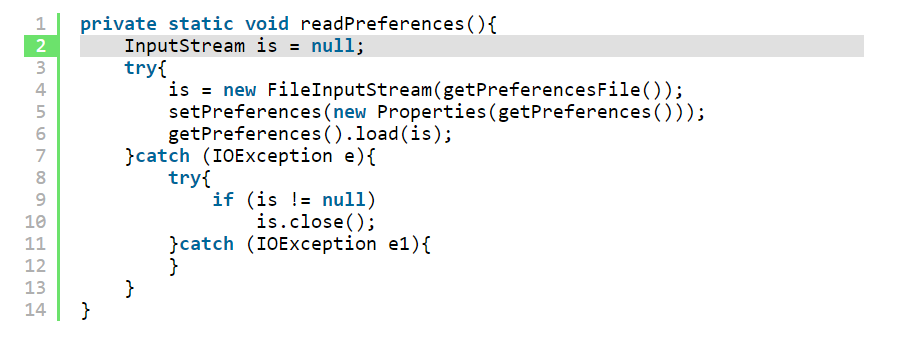

- Các biến điều khiển vòng lặp nên được khai báo trong vòng lặp, như ví dụ:
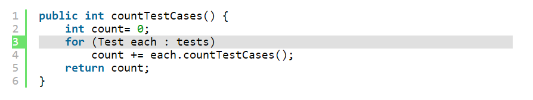

- Trong một vài trường hợp hiếm gặp, một biến có thể được khai báo ở đầu một khối lệnh hoặc ngay trước một vòng lặp trong một hàm-hơi-dài. Bạn có thể thấy một biến như vậy bên dưới, được trích từ một hàm-rất-dài trong TestNG.
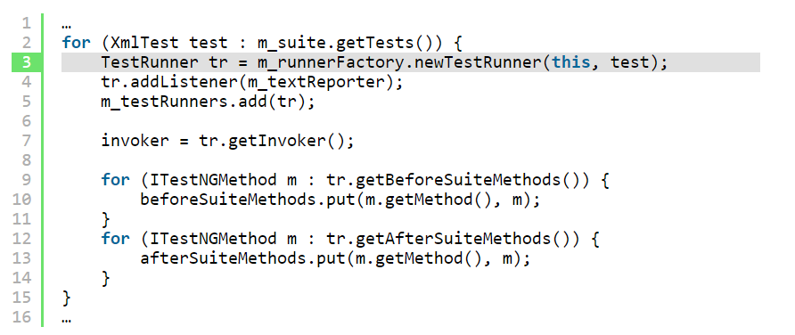

**Các Biến Instance**
- Nên được khai báo ở đầu các class, và cũng không nên tạo khoảng cách giữa các biến này vì trong một class được thiết kế tốt, các biến instance được sử dụng bởi nhiều phương thức của class.

- Hãy xem xét một ví dụ lạ của class TestSuite trong JUnit. Nếu bạn nhìn xuống khoảng giữa của class, bạn sẽ thấy hai biến instance được khai báo ở đó. Thật khó để đặt chúng ở một nơi tốt hơn.
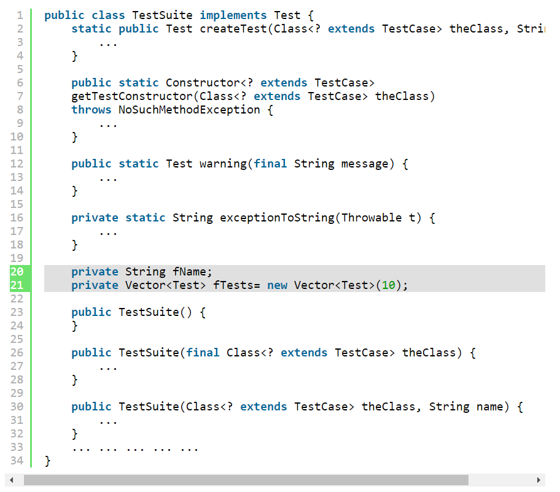

**Các Hàm Phụ Thuộc Nhau**
- Nếu một hàm gọi một hàm khác, chúng nên được đặt gần nhau. Và nếu có thể, hàm gọi nên ở trên hàm được gọi

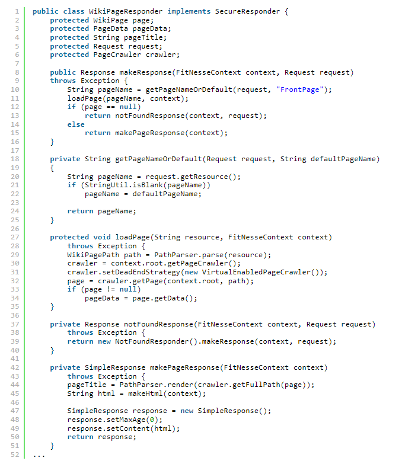

**Các Định Nghĩa Có Liên Quan**
- Các định nghĩa có liên quan, có mỗi liên hệ nhất định, mối quan hệ càng mạnh thì khoảng cách giữa chúng càng ít.

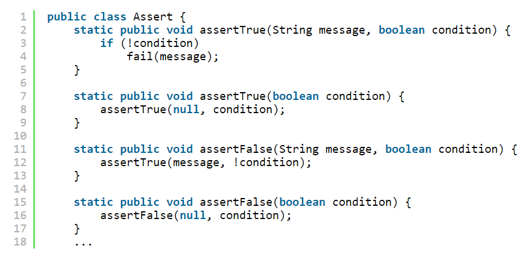

-> Các hàm này có mối liên hệ mạnh vì chúng có cùng một định dạng tên và thực hiện các biến thể của cùng một tác vụ. Việc chúng gọi nhau là hiển nhiên, ngay cả khi không, chúng vẫn nên ở gần nhau.

**- TRẬT TỰ THEO CHIỀU DỌC**
-Các lời gọi hàm phụ thuộc nhau theo hướng đi xuống, nghĩa là lời gọi hàm nên gọi tới hàm bên dưới (Hàm thực hiện gọi hàm đó) -> giúp tạo ra luồn dữ liệu trong module mã nguồn từ cấp cao đến cấp thấp

# **- Định dạng theo chiều ngang**
- Độ rộng của một dòng code nên dài bao nhiều ?

Hình cho thấy sự phân phối kích thước của các dòng trong 7 dự án

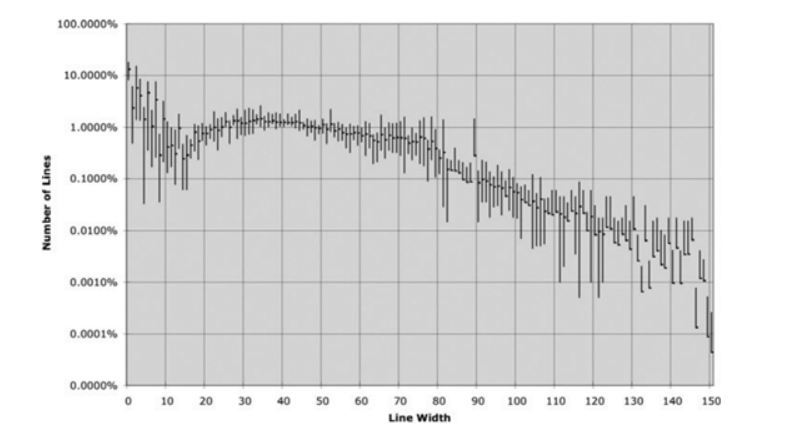

- một dòng xoay quanh mức 45 ký tự.
- có khoảng 1% số dòng có độ rộng từ 20-60 ký tự, chiếm 40% mã nguồn.
- Có khoảng 30% số dòng dưới 10 ký tự.
-> Quá rõ ràng, các lập trình viên thích những dòng code ngắn!

- Điều này cho thấy chúng ta nên cố gắng giữ các dòng code của chúng ta ngắn. Giới hạn cũ của Hollerith là 80 ký tự, và tôi không có ý kiến gì khi các dòng có thể vượt quá 100 hay 120 ký tự ở thời điểm hiện tại. Nhưng nhiều hơn số đó thì không hay chút nào.

**- KHOẢNG CÁCH VÀ MẬT ĐỘ**

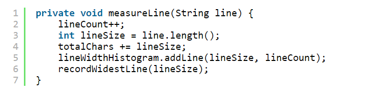
- Chúng tôi bao quanh các toán tử gán bằng khoảng trắng để làm nổi bật chúng. Câu lệnh gán có hai yếu tố rõ ràng: vế trái và vế phải. Các khoảng trắng làm sự tách biệt này thêm rõ ràng.

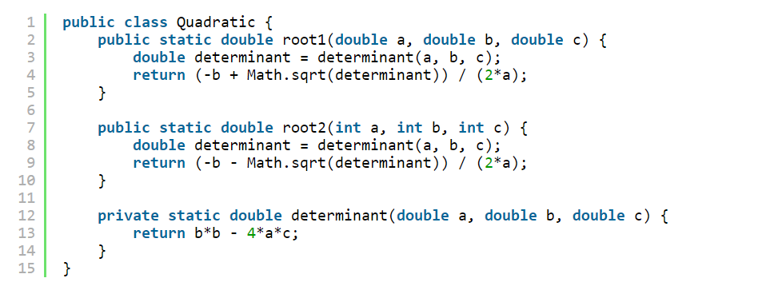
- Các hệ số (của phép nhân) không chứa khoảng trắng vì chúng có độ ưu tiên cao. Các số hạng được phân tách bởi khoảng trắng bởi vì phép cộng và phép trừ có độ ưu tiên thấp hơn.

**- CĂN CHỈNH THEO CHIỀU NGANG**
- Biện pháp căn chỉnh theo chiều ngang để làm nổi bật một số cấu trúc nhất định.

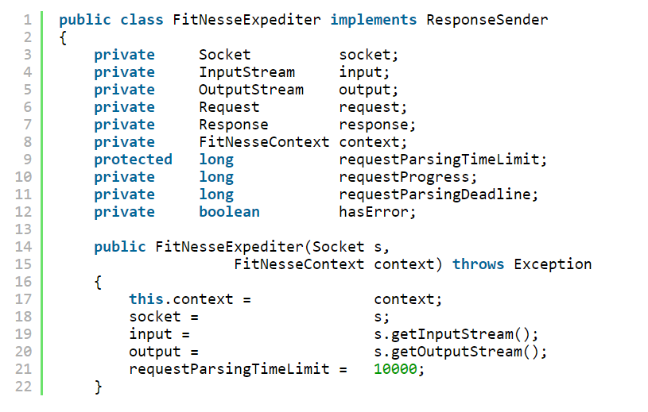

- Tuy nhiên, loại căn chỉnh này không hữu ích

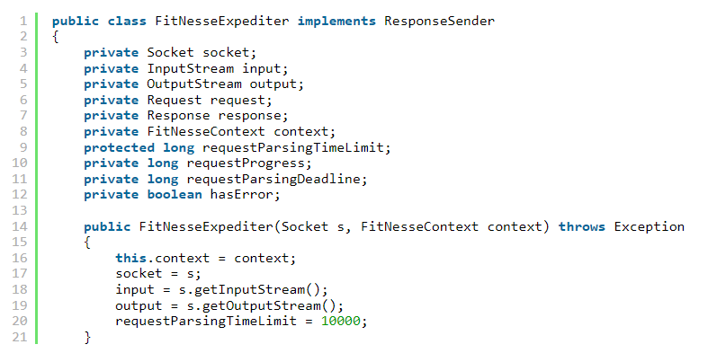

**- VIỆC LÙI ĐẦU DÒNG**
- Một file mã nguồn nên giống một hệ thống hoàn chỉnh hơn là một bản phác thảo sơ sài. Sẽ có thông tin về toàn bộ file, thông tin về các class riêng lẻ trong file, thông tin về các khối lệnh của hàm và các khối lệnh con trong hàm. Mỗi cấp độ của hệ thống này tạo ra một phạm vi mà ở đó bạn có thể khai báo các biến, trong đó các khai báo và câu lệnh được thể hiện một cách rõ ràng.

- Để làm cho hệ thống này trở nên rõ hơn với người đọc, chúng tôi lùi các dòng code tỉ lệ thuận với vị trí của chúng trong hệ thống phân cấp.

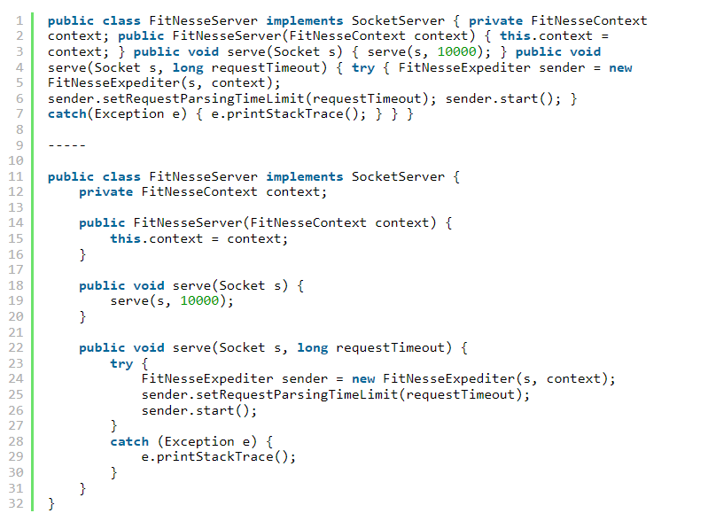

- Bỏ qua các đoạn lùi dòng. Thỉnh thoảng tôi bị dụ dỗ phá vỡ các quy tắc về việc lùi đầu dòng, như các câu lệnh if ngắn, vòng lặp while ngắn hay các hàm ngắn. Bất cứ khi nào việc đó xảy ra, tôi hầu như luôn quay lại và đặt vào đó một khoảng lùi dòng. 

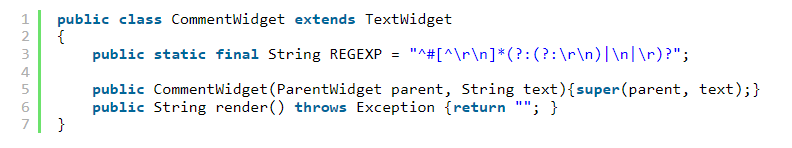

Thay vào đó, tôi thích viết chúng lại theo cách này:

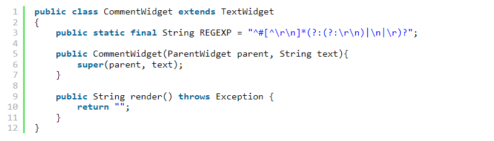

**- NHỮNG KHOẢNG TRỐNG GIẢ**
- Đôi khi phần thân của vòng lặp while hoặc vòng lặp for là một thân giả, như ví dụ dưới đây.

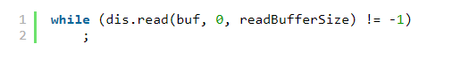

- nó không cùng một cấp với nhau và nhiều khi sẽ không biết tại sao nó sinh ra một dấu chấm phẩy

# **- Các quy tắc trong nhóm**
- Mỗi lập trình viên đều có bộ quy tắc định dạng yêu thích của riêng mình. Nhưng nếu anh ta làm việc trong một nhóm, thì nên tuân theo quy tắc nhóm.

# **- Các quy tắc định dạng của Uncle Bob**

https://toihocdesignpattern.com/chuong-5-dinh-dang-code.html

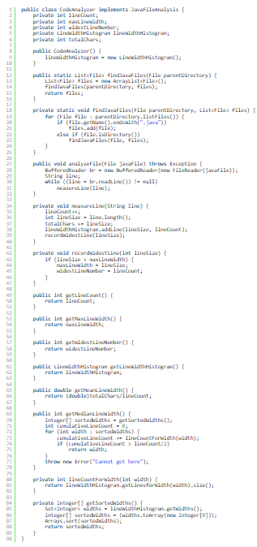

