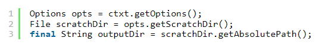
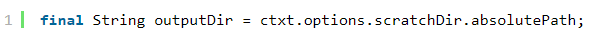
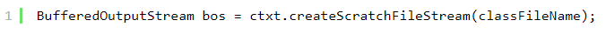

ĐỐI TƯỢNG VÀ CẤU TRÚC DỮ LIỆU

1- Trừu tượng hóa dữ liệu
- Cố gắng trừu tượng hóa dữ liệu = cách đặt tên, interface, getter và setter.

2- Cấu trúc dữ liệu và đối tượng
- Đối tượng: Các đối tượng ẩn dữ liệu của chúng bên dưới việc trừu tượng hóa và đưa ra các hàm dựa trên dữ liệu đó.
- Cấu trúc dữ liệu: có cấu trúc phơi bày dữ liệu của chúng và không có các hàm có nhiều ý nghĩa.
=> sử dụng linh hoạt giũa cấu trúc dữ liệu và đối tươgj

3- Áp dụng The Law of Demeter
- The Law of Demeter: một module không nên biết về thành phần bên trong của một đối tượng mà nó sử dụng
- Một phương thức f của class C chỉ nên gọi những phương thức sau:
  - C
  - Một đối tượng được tạo bởi f
  - Một đối tượng được truyền vào dưới dạng đối số của f
  - Một đối tượng chứa một biến instance của C

4- Tránh nối đòàn tàu. 
 - 
 - Nếu như là cấu trúc dữ liệu có thể làm như hình bên dưới: 
 - 

5- Con Lai
- Đừng dùng kết hợp giữa đối tượng và cấu trúc dữ liệu.
- ví dụ: cấu trúc dữ liệu nhung nhiều hàm phức tạp, đối tượng nhưng lại có thuộc tính public, hoặc đặt getter, setter thừa thãi,
không cần thiết 

6- Ẩn cấu trúc
- Giao việc cho đối tượng 1 cách hợp lý.

7- Data Transfer Objects
- Dạng thuần túy của cấu trúc dữ liệu là DTO
- Các DTO là cấu trúc rất hữu ích, đặc biệt là khi giao tiếp với cơ sở dữ liệu hoặc chuyển đổi thông điệp từ các socket, v.v
Chúng thường là bước đầu tiên trong quá trình chuyển đổi dữ liệu từ cơ sở dữ liệu thành các đối tượng của chương trình.
