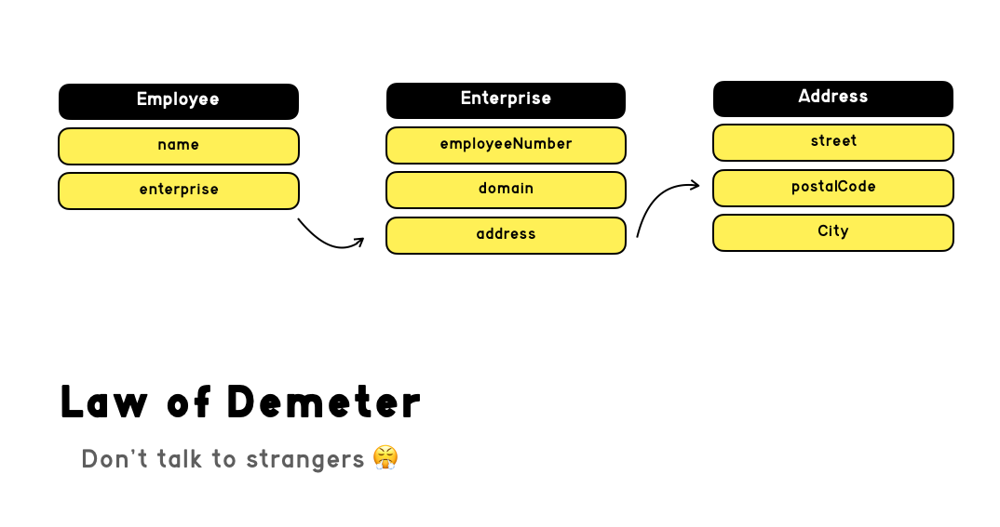

#ĐỐI TƯỢNG VÀ CẤU TRÚC DỮ LIỆU

## Trừu tượng hóa dữ liệu
- Cố gắng trừu tượng hóa dữ liệu  qua các cách: 
### 1-Đặt tên
- Đặt tên tránh tiết lộ hình thức của dữ liệu.
- Cách đặt tên chưa trừu tượng do dùng các thuật ngữ cụ thể để miêu tả hàm => người dùng biết rằng các hàm này chỉ là truy suất đến các biền.
```java
public interface Vehicle {
    double getFuelTankCapacityInGallons();
    double getGallonsOfGasoline();
}
```
- Cách đặt tên trừu tượng, che giấu đi hình thức của dữ liệu
```java
public interface Vehicle {
    double getPercentFuelRemaining();
}
```
### 2- Dùng getter setter và interface
- Chưa trừu tượng hóa
```java
public class Point {
    public double x;
    public double y;
}
```
- Đã trừu tượng hóa
```java
public interface Point {
    double getX();
    double getY();
    void setCartesian(double x, double y);
    double getR();
    double getTheta();
    void setPolar(double r, double theta);
}
```
## Cấu trúc dữ liệu và đối tượng
- Đối tượng: Các đối tượng ẩn dữ liệu của chúng bên dưới việc trừu tượng hóa và đưa ra các hàm dựa trên dữ liệu đó.
```java
public class Square implements Shape {
    private Point topLeft;
    private double side;
 
    public double area() {
        return side*side;
    }
}
 
public class Rectangle implements Shape {
    private Point topLeft;
    private double height;
    private double width;
 
    public double area() {
        return height * width;
    }
}
 
public class Circle implements Shape {
    private Point center;
    private double radius;
    public final double PI = 3.141592653589793;
 
    public double area() {
        return PI * radius * radius;
    }
}
```
- Cấu trúc dữ liệu: có cấu trúc phơi bày dữ liệu của chúng và không có các hàm có nhiều ý nghĩa.
```java
public class Square {
    public Point topLeft;
    public double side;
}
 
public class Rectangle {
    public Point topLeft;
    public double height;
    public double width;
}
 
public class Circle {
    public Point center;
    public double radius;
}
 
public class Geometry {
    public final double PI = 3.141592653589793;
     
    public double area(Object shape) throws NoSuchShapeException
    {
        if (shape instanceof Square) {
            Square s = (Square)shape;
            return s.side * s.side;
        }else if (shape instanceof Rectangle) {
            Rectangle r = (Rectangle)shape;
            return r.height * r.width;
        }
        else if (shape instanceof Circle) {
            Circle c = (Circle)shape;
            return PI * c.radius * c.radius;
        }
        throw new NoSuchShapeException();
    }
}
```
=> sử dụng linh hoạt giũa cấu trúc dữ liệu và đối tượng.

## Áp dụng The Law of Demeter
- The Law of Demeter: một module không nên biết về thành phần bên trong của một đối tượng mà nó sử dụng


- Một phương thức f của class C chỉ nên gọi những phương thức sau:
  - C
  - Một đối tượng được tạo bởi f
  - Một đối tượng được truyền vào dưới dạng đối số của f
  - Một đối tượng chứa một biến instance của C
- Đoạn code bên dưới không tuân thủ The Law of Demeter.
```java
final String outputDir = ctxt.getOptions().getScratchDir().getAbsolutePath();

```
### Tránh nối đoàn tàu. 
 - Tách đoạn code bên trên ra để tránh tạo thành 1 đoàn tàu.
```java
Options opts = ctxt.getOptions();
File scratchDir = opts.getScratchDir();
final String outputDir = scratchDir.getAbsolutePath();

```

 - Nếu như là cấu trúc dữ liệu có thể làm như bên dưới: 
```java
final String outputDir = ctxt.options.scratchDir.absolutePath;

```

### Con Lai
- Đừng dùng kết hợp giữa đối tượng và cấu trúc dữ liệu.
- ví dụ: cấu trúc dữ liệu nhung nhiều hàm phức tạp, đối tượng nhưng lại có thuộc tính public, hoặc đặt getter, setter thừa thãi,
không cần thiết 

### Ẩn cấu trúc
- Giao việc cho đối tượng 1 cách hợp lý.

## Data Transfer Objects
- Dạng thuần túy của cấu trúc dữ liệu là DTO
- Các DTO là cấu trúc rất hữu ích, đặc biệt là khi giao tiếp với cơ sở dữ liệu hoặc chuyển đổi thông điệp từ các socket, v.v
Chúng thường là bước đầu tiên trong quá trình chuyển đổi dữ liệu từ cơ sở dữ liệu thành các đối tượng của chương trình.
```java
public class Address {
    private String street;
    private String streetExtra;
    private String city;
    private String state;
    private String zip;
 
    public Address(String street, String streetExtra,
                    String city, String state, String zip) {
        this.street = street;
        this.streetExtra = streetExtra;
        this.city = city;
        this.state = state;
        this.zip = zip;
    }
 
    public String getStreet() {
        return street;
    }
 
    public String getStreetExtra() {
        return streetExtra;
    }
 
    public String getCity() {
        return city;
    }
 
    public String getState() {
        return state;
    }
 
    public String getZip() {
        return zip;
    }
}

```
Nguồn: https://toihocdesignpattern.com/chuong-6-doi-tuong-va-cau-truc-du-lieu.html
