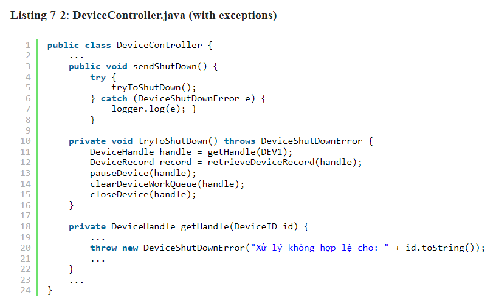
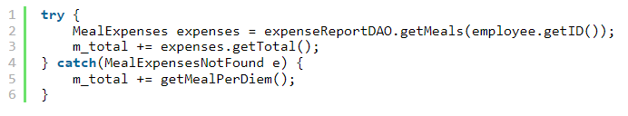

XỬ LÝ LỖI

1- Sử dụng ngoại lệ thay vì để cho code xử lý
- Không nên dùng cách đặt cờ hay trả lại mã lỗi vì gây lộn xộn, việc code và xử lý lỗi bị trộn lẫn với nhau.
- Logic của code và việc sử lý lỗi nên được xử lý riêng biệt.
- 
- 
 
2- Viết khối Try-Catch-Finally
- Khi viết TCF hãy kiểm tra, tìm kiếm các ngoại lệ có thể xảy ra rồi mới bắt đầu xử lý các bước logic

3- Ưu tiên sử dụng Unchecked Exceptions
- Lý do ko dùng các checked exceptions: Các checked exceptions khi sử dụng ở các cấp thấp sẽ dẫn đến thay đổi ở các cấp
cao hơn.
- Custom lại lớp exception theo nhu cầu của người gọi.

4- Cung cấp ngữ cảnh có ngoại lệ
- Một ngoại lệ cần cung cấp đầy đủ thông tin để xác định nguyên nhân, vị trí lỗi
- Nếu cần thiết hãy cung cấp thêm thông tin ở phần log.

5- Xác định ngoại lệ theo nhu cầu 
- Có nhiều cách phân loại lỗi. Chúng ta có thể phân loại chúng theo nguồn của chúng: Chúng đến từ thành phần này hay
thành phần khác? Hoặc loại của chúng: Chúng bị lỗi thiết bị, lỗi mạng, hoặc lỗi lập trình? Tuy nhiên, khi chúng ta xác
định các lớp ngoại lệ trong một ứng dụng, mối quan tâm quan trọng nhất của chúng ta là cách chúng được bắt.
- 
- code ngoại lệ đểu thuộc 1 loại, giải quyết bằng cách gói các API vào 1 class và đảm bảo trả về 1 ngoại lệ chung.
- 
- 
- Đóng gói API bên thứ 3 giúp giảm bớt sự phụ thuộc vào nó , thông thường 1 lớp ngoại lệ duy nhất là tốt cho 1 vùng code
cụ thể 

5- Xác định dòng chảy bình thường
- Khi code xử lý lỗi dùng để xử lý 1 trường hợp đặc biệt, hãy tạo ra 1 lớp hoặc cấu hình 1 đối tượng để  xử lý trường  hợp đặc biệt đó 
- 
- 
- 

6- Đừng trả về null

7- Đừng truyền vào null
