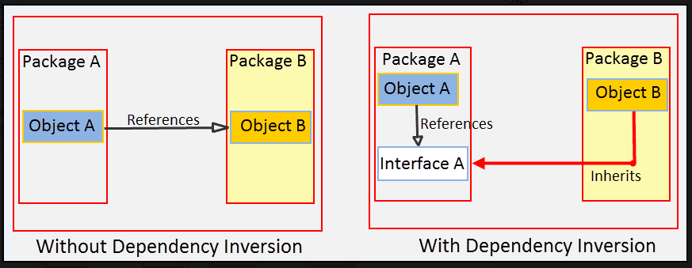

# Lớp đối tượng
- Chương này tập chung vào cách code sạch ở mức độ class.

## Tổ chức lớp.
- Quy ước tiêu chuẩn của java: 
    + 1 class bắt đầu bằng 1 danh sách các biến.
    + Thứ tự xuất hiện từ trên xuống dưới:  public static constants > private static > private
    + Các hàm private con nên đặt sau hàm public cha.
  
### Đóng gói
- Xử dụng các từ khóa truy cập 1 cách hợp lý. 
- Đôi khi 1 số hàm có thể đặt protected để test.

## Lớp nên nhỏ!
- Lớp phải nhỏ.
- Kích thước của 1 lớp được đo bằng trách nghiệm của lớp đó trong hệ thống.
- Ví dụ về 1 lớp mang quá nhiều trách nghiệm (God class).
```java
public class SuperDashboard extends JFrame implements MetaDataUser {
    public String getCustomizerLanguagePath();
    public void setSystemConfigPath(String systemConfigPath);
    public String getSystemConfigDocument();
    public void setSystemConfigDocument(String systemConfigDocument); 
    public boolean getGuruState();
    public boolean getNoviceState();
    public boolean getOpenSourceState();
    public void showObject(MetaObject object); 
    public void showProgress(String s);
    public boolean isMetadataDirty();
    public void setIsMetadataDirty(boolean isMetadataDirty);
    public Component getLastFocusedComponent();
    public void setLastFocused(Component lastFocused);
    public void setMouseSelectState(boolean isMouseSelected); 
    public boolean isMouseSelected();
    public LanguageManager getLanguageManager();
    public Project getProject();
    public Project getFirstProject();
    public Project getLastProject();
    public String getNewProjectName();
    public void setComponentSizes(Dimension dim);
    public String getCurrentDir();
    public void setCurrentDir(String newDir);
    public void updateStatus(int dotPos, int markPos);
    public Class[] getDataBaseClasses();
    public MetadataFeeder getMetadataFeeder();
    public void addProject(Project project);
    public boolean setCurrentProject(Project project);
    public boolean removeProject(Project project);
    public MetaProjectHeader getProgramMetadata();
    public void resetDashboard();
    public Project loadProject(String fileName, String projectName); 
    public void setCanSaveMetadata(boolean canSave);
    public MetaObject getSelectedObject();
    public void deselectObjects();
    public void setProject(Project project);
    public void editorAction(String actionName, ActionEvent event); 
    public void setMode(int mode);
    public FileManager getFileManager();
    public void setFileManager(FileManager fileManager);
    public ConfigManager getConfigManager();
    public void setConfigManager(ConfigManager configManager); 
    public ClassLoader getClassLoader();
    public void setClassLoader(ClassLoader classLoader);
    public Properties getProps();
    public String getUserHome();
    public String getBaseDir();
    public int getMajorVersionNumber();
    public int getMinorVersionNumber();
    public int getBuildNumber();
    public MetaObject pasting(
    MetaObject target, MetaObject pasted, MetaProject project); 
    public void processMenuItems(MetaObject metaObject);
    public void processMenuSeparators(MetaObject metaObject); 
    public void processTabPages(MetaObject metaObject);
    public void processPlacement(MetaObject object);
    public void processCreateLayout(MetaObject object);
    public void updateDisplayLayer(MetaObject object, int layerIndex); 
    public void propertyEditedRepaint(MetaObject object);
    public void processDeleteObject(MetaObject object);
    public boolean getAttachedToDesigner();
    public void processProjectChangedState(boolean hasProjectChanged); 
    public void processObjectNameChanged(MetaObject object);
    public void runProject();
    public void setAçowDragging(boolean allowDragging); 
    public boolean allowDragging();
    public boolean isCustomizing();
    public void setTitle(String title);
    public IdeMenuBar getIdeMenuBar();
    public void showHelper(MetaObject metaObject, String propertyName); 
    // ... many non-public methods follow ...
}
```
- Ví dụ 2 về 1 lớp ít hàm nhưng vẫn mang nhiều trách nghiệm.
```java
public class SuperDashboard extends JFrame implements MetaDataUser {
    public Component getLastFocusedComponent();
    public void setLastFocused(Component lastFocused);
    public int getMajorVersionNumber();
    public int getMinorVersionNumber();
    public int getBuildNumber(); 
}
```
- Tên 1 lớp phải mô tả trách nghiệm của nó trong hệ thống, đặt tên là cách để xác định quy mô của 1 lớp.
- Khồng dùng các từ như Processer, Manager, Supper,If ,And ,But ,Or để đặt tên cho lớp vì những từ này có hàm ý mang nhiều trách nghiệm.
- Tên lớp nên nằm trong khoảng 25 từ.

### Nguyên tắc đơn trách nhiệm (The Single Responsibility Principle)
 - 1 lớp nên chỉ có 1 trách nhiệm và 1 lý do để thay đổi.
 - Ví dụ về class đảm bảo quy tắc đơn nghiệm đc tách ra từ class class SuperDashboard bên trên.

```java
public class Version {
    public int getMajorVersionNumber(); 
    public int getMinorVersionNumber(); 
    public int getBuildNumber();
}
```
- Chúng ta muốn hệ thống của mình bao gồm nhiều lớp nhỏ, không phải một vài lớp lớn. Mỗi lớp nhỏ chứa đựng một khả năng
đáp ứng duy nhất, có một lý do duy nhất để thay đổi và cộng tác với một vài lớp khác để đạt được các hành vi hệ thống mong muốn

### Sự gắn kết
- Mỗi lớp nên có ít các biến instance và mỗi phương thức của lớp đó nên thao tác với 1 hoặc nhiều biến của lớp.
- Ví dụ về 1 lớp có độ gắn kết cao.
```java
public class Stack {
    private int topOfStack = 0;
    List<Integer> elements = new LinkedList<Integer>();
     
    public int size() { 
        return topOfStack;
    }
     
    public void push(int element) { 
        topOfStack++; 
        elements.add(element);
    }
     
    public int pop() throws PoppedWhenEmpty { 
        if (topOfStack == 0)
            throw new PoppedWhenEmpty();
        int element = elements.get(--topOfStack); 
        elements.remove(topOfStack);
        return element;
    } 
}
```
### Duy trì kết quả gắn kết trong nhiều lớp nhỏ
- Khi lớp mất đi tính liên kết thì hãy chia nhỏ class đó thành nhiều class nhỏ hơn.
- Ví dụ về 1 lớp bị mất liên kết.
```java
package literatePrimes;
 
public class PrintPrimes {
    public static void main(String[] args) {
        final int M = 1000;
        final int RR = 50;
        final int CC = 4;
        final int WW = 10;
        final int ORDMAX = 30;
        int P[] = new int[M + 1];
        int PAGENUMBER;
        int PAGEOFFSET;
        int ROWOFFSET;
        int C;
        int J;
        int K;
        boolean JPRIME;
        int ORD;
        int SQUARE;
        int N;
        int MULT[] = new int[ORDMAX + 1];
        J = 1;
        K = 1;
        P[1] = 2;
        ORD = 2;
        SQUARE = 9;
        while (K < M) {
            do {
                J = J + 2;
                if (J == SQUARE) {
                    ORD = ORD + 1;
                    SQUARE = P[ORD] * P[ORD];
                    MULT[ORD - 1] = J;
                }
                N = 2;
                JPRIME = true;
                while (N < ORD && JPRIME) {
                    while (MULT[N] < J) MULT[N] = MULT[N] + P[N] + P[N];
                    if (MULT[N] == J)
                        JPRIME = false;
                    N = N + 1;
                }
            } while (!JPRIME);
            K = K + 1;
            P[K] = J;
        }
        {
            while (PAGEOFFSET <= M) {
                PAGENUMBER = 1;
                PAGEOFFSET = 1;
                System.out.println("The First " + M + " Prime Numbers --- Page " + PAGENUMBER);
                System.out.println("");
                for (ROWOFFSET = PAGEOFFSET; ROWOFFSET < PAGEOFFSET + RR; ROWOFFSET++) {
                    for (C = 0; C < CC; C++)
                        if (ROWOFFSET + C * RR <= M)
                            System.out.format("%10d", P[ROWOFFSET + C * RR]);
                    System.out.println("");
                }
                System.out.println("\f");
                PAGENUMBER = PAGENUMBER + 1;
                PAGEOFFSET = PAGEOFFSET + RR * CC;
            }
        }
    }
}
```
- Lớp bên trên nên được tách thành các lớp nhỏ như sau.
```java
package literatePrimes;
 
public class PrimePrinter {
    public static void main(String[] args) {
        final int NUMBER_OF_PRIMES = 1000;
        int[] primes = PrimeGenerator.generate(NUMBER_OF_PRIMES);
        final int ROWS_PER_PAGE = 50;
        final int COLUMNS_PER_PAGE = 4;
        RowColumnPagePrinter tablePrinter =
                new RowColumnPagePrinter(ROWS_PER_PAGE, COLUMNS_PER_PAGE,
                        "The First " + NUMBER_OF_PRIMES + " Prime Numbers");
        tablePrinter.print(primes);
    }
}
```
```java
package literatePrimes;
 
import java.io.PrintStream;
 
public class RowColumnPagePrinter {
    private int rowsPerPage;
    private int columnsPerPage;
    private int numbersPerPage;
    private String pageHeader;
    private PrintStream printStream;
 
    public RowColumnPagePrinter(int rowsPerPage, int columnsPerPage,
                                String pageHeader) {
        this.rowsPerPage = rowsPerPage;
        this.columnsPerPage = columnsPerPage;
        this.pageHeader = pageHeader;
        numbersPerPage = rowsPerPage * columnsPerPage;
        printStream = System.out;
    }
 
    public void print(int data[]) {
        int pageNumber = 1;
        for (int firstIndexOnPage = 0;
             firstIndexOnPage < data.length;
             firstIndexOnPage += numbersPerPage) {
            int lastIndexOnPage =
                    Math.min(firstIndexOnPage + numbersPerPage - 1, data.length - 1);
            printPageHeader(pageHeader, pageNumber);
            printPage(firstIndexOnPage, lastIndexOnPage, data);
            printStream.println("\f");
            pageNumber++;
        }
    }
 
    private void printPage(int firstIndexOnPage, int lastIndexOnPage,
                           int[] data) {
        int firstIndexOfLastRowOnPage =
                firstIndexOnPage + rowsPerPage - 1;
        for (int firstIndexInRow = firstIndexOnPage;
             firstIndexInRow <= firstIndexOfLastRowOnPage;
             firstIndexInRow++) {
            printRow(firstIndexInRow, lastIndexOnPage, data);
            printStream.println("");
        }
    }
 
    private void printRow(int firstIndexInRow, int lastIndexOnPage,
                          int[] data) {
        for (int column = 0; column < columnsPerPage; column++) {
            int index = firstIndexInRow + column * rowsPerPage;
            if (index <= lastIndexOnPage)
                printStream.format("%10d", data[index]);
        }
    }
 
    private void printPageHeader(String pageHeader, int pageNumber) {
        printStream.println(pageHeader + " --- Page " + pageNumber);
        printStream.println("");
    }
 
    public void setOutput(PrintStream printStream) {
        this.printStream = printStream;
    }
}
```
```java
package literatePrimes;
 
import java.util.ArrayList;
 
public class PrimeGenerator {
    private static int[] primes;
    private static ArrayList<Integer> multiplesOfPrimeFactors;
 
    protected static int[] generate(int n) {
        primes = new int[n];
        multiplesOfPrimeFactors = new ArrayList<Integer>();
        set2AsFirstPrime();
        checkOddNumbersForSubsequentPrimes();
        return primes;
    }
 
    private static void set2AsFirstPrime() {
        primes[0] = 2;
        multiplesOfPrimeFactors.add(2);
    }
 
    private static void checkOddNumbersForSubsequentPrimes() {
        int primeIndex = 1;
        for (int candidate = 3;
             primeIndex < primes.length;
             candidate += 2) {
            if (isPrime(candidate))
                primes[primeIndex++] = candidate;
        }
    }
 
    private static boolean isPrime(int candidate) {
        if (isLeastRelevantMultipleOfNextLargerPrimeFactor(candidate)) {
            multiplesOfPrimeFactors.add(candidate);
            return false;
        }
        return isNotMultipleOfAnyPreviousPrimeFactor(candidate);
    }
 
    private static boolean isLeastRelevantMultipleOfNextLargerPrimeFactor(int candidate) {
        int nextLargerPrimeFactor = primes[multiplesOfPrimeFactors.size()];
        int leastRelevantMultiple = nextLargerPrimeFactor * nextLargerPrimeFactor;
        return candidate == leastRelevantMultiple;
    }
 
    private static boolean isNotMultipleOfAnyPreviousPrimeFactor(int candidate) {
        for (int n = 1; n < multiplesOfPrimeFactors.size(); n++) {
            if (isMultipleOfNthPrimeFactor(candidate, n)) return false;
        }
        return true;
    }
 
    private static boolean isMultipleOfNthPrimeFactor(int candidate, int n) {
        return candidate == smallestOddNthMultipleNotLessThanCandidate(candidate, n);
    }
 
    private static int
    smallestOddNthMultipleNotLessThanCandidate(int candidate, int n) {
        int multiple = multiplesOfPrimeFactors.get(n);
        while (multiple < candidate)
            multiple += 2 * primes[n];
        multiplesOfPrimeFactors.set(n, multiple);
        return multiple;
    }
}
```
- Sau khi tách lớp ra sẽ khiến cho chương trình dài hơn do:
    + Chương trình được tái cấu trúc sử dụng các tên biến mô tả dài hơn.
    + Chương trình được tái cấu trúc sử dụng khai báo hàm và lớp như một cách để thêm chú thích vào code.
    + Sử dụng kỹ thuật định dạng và khoảng trắng để giữ cho chương trình có thể đọc được

## Tổ chức để thay đổi
- Tổ chức các class trong hệ thống để giảm thiểu nguy cơ phải thay đổi.
- Ví dụ về 1 class khả năng cao phải thay đổi trong tương lai.
```java
public class Sql {
    public Sql(String table, Column[] columns);
 
    public String create();
 
    public String insert(Object[] fields);
 
    public String selectAll();
 
    public String findByKey(String keyColumn, String keyValue);
 
    public String select(Column column, String pattern);
 
    public String select(Criteria criteria);
 
    public String preparedInsert();
 
    private String columnList(Column[] columns);
 
    private String valuesList(Object[] fields, final Column[] columns);
 
    private String selectWithCriteria(String criteria);
 
    private String placeholderList(Column[] columns);
}
```
- Class bên trên có thể được tách thành nhiều class khác nhau như sau :
```java
abstract public class Sql {
    public Sql(String table, Column[] columns);
 
    abstract public String generate();
}
 
public class CreateSql extends Sql {
    public CreateSql(String table, Column[] columns);
 
    @Override
    public String generate();
}
 
public class SelectSql extends Sql {
    public SelectSql(String table, Column[] columns);
 
    @Override
    public String generate();
}
 
public class InsertSql extends Sql {
    public InsertSql(String table, Column[] columns, Object[] fields);
 
    @Override
    public String generate();
 
    private String valuesList(Object[] fields, final Column[] columns);
}
 
public class SelectWithCriteriaSql extends Sql {
    public SelectWithCriteriaSql(
            String table, Column[] columns, Criteria criteria);
 
    @Override
    public String generate();
}
 
public class SelectWithMatchSql extends Sql {
    public SelectWithMatchSql(
            String table, Column[] columns, Column column, String pattern);
 
    @Override
    public String generate();
}
 
public class FindByKeySql extends Sql {
 
        public FindByKeySql(
                String table, Column[] columns, String keyColumn, String keyValue);
 
        @Override
        public String generate();
}
 
public class PreparedInsertSql extends Sql {
    public PreparedInsertSql(String table, Column[] columns);
 
    @Override
    public String generate() {
        private String placeholderList(Column[] columns);
    }
}
 
public class Where {
    public Where(String criteria);
 
    public String generate();
}
 
public class ColumnList {
    public ColumnList(Column[] columns);
 
    public String generate();
}
```
- Bằng cách tách thành nhiều class nhỏ như trên chúng ta đã khiến cho hệ thống dễ dàng để sửa đổi và mở rộng.
- Đảm bảo được nguyên tắc Đóng/Mở(OCP) và Đơn nhiệm (SRP).

### Tách biệt khỏi sự thay đổi
- Khi phát triển hệ thống sự thay đổi luôn luôn sảy ra để hệ thống có thể thích ứng với điểu này hãy áp dụng nguyên tắc thiết kế
  Đảo ngược Phụ thuộc (DIP)
- Đảo ngược Phụ thuộc (DIP): 
  + Các lớp nên phụ thuộc vào các yếu tố trừu tượng không phụ thuộc vào các chi tiết cụ thể.


