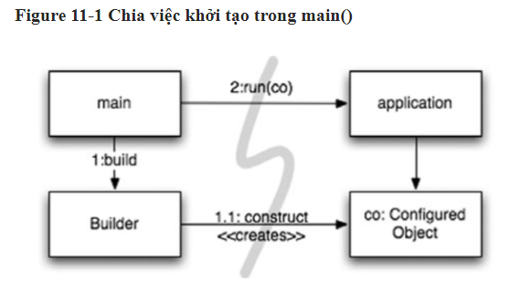
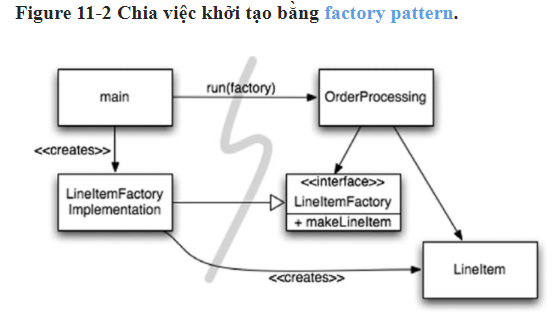
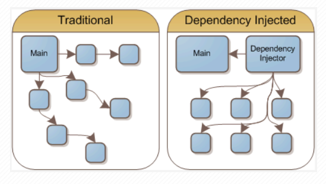

# Code sạch cấp hệ thống

## Bạn sẽ xây dựng một thành phố như thế nào?
- Xây dựng 1 hệ thống cũng giống như 1 thành phố có những người quản lý và làm các công việc cụ thể (các lớp hàm có cấp độ abstract thấp), 
trong khi đó lại có những người chịu trách nhiệm điều hành (mức độ abstract cao).
- Chương này sẽ nói về cách duy trì sự sạch sẽ ở cấp độ abstract cao.

## Tách biệt việc xây dựng một hệ thống với việc sử dụng nó
- Xây dựng và sử dụng là 2 quá trình hoàn toàn khác nhau vì vậy hãy tác biệt 2 quá trình này ra.
- Trong khi xây dựng hệ thống hãy phân định rõ ràng quá trình khởi tạo và code logic.

### Tách Main
- Di chuyển toàn bộ việc khởi tạo sang main hoặc các các mô-đun được gọi bởi main.
   + Hàm main xây dựng các đối tượng cần thiết cho hệ thống, sau đó chuyển chúng cho application, application chỉ việc sử dụng.



### Factories
- Đôi khi application cần tạo ra đối tượng mới, lúc này t có thể áp dụng mẫu thiết kế ABSTRACT FACTORY để cung cấp cho cho application quyền kiểm soát thời điểm xây dựng
các object.



### Dependency Injection
- Một cơ chế mạnh mẽ để tách việc xây dựng khỏi tạo việc sử dụng là Dependency Injection (DI), ứng dụng Inversion of Control (IoC) để quản lý sự phụ thuộc.
- Dependency Injection:  là một kĩ thuật trong đó một object (hoặc một static method) cung cấp các dependencies của một object khác.
Một dependency là một object mà có thể sử dụng (một service).



## Mở rộng quy mô
- Bản chất của sự lặp đi lặp lại và phát triển là sửa những sai lầm hiện tại và cải tiến thêm những khả năng mới.
- Hệ thống phần mềm là duy nhất so với hệ thống vật lý. Các kiến trúc của chúng có thể phát triển từng bước, nếu chúng ta duy trì sự phân tách các mối quan tâm một cách thích hợp.
- Tách các nhiệm vụ cho class một cách thích hợp để dễ dàng mở rộng sau này.
- Vi dụ về các phần logic bị gộp lại với nhau làm mất đi lợi ích của OOP.
```java
package com.example.banking;
import java.util.Collections;
import javax.ejb.*;
 
public interface BankLocal extends java.ejb.EJBLocalObject {
    String getStreetAddr1() throws EJBException;
    String getStreetAddr2() throws EJBException;
    String getCity() throws EJBException;
    String getState() throws EJBException;
    String getZipCode() throws EJBException;
    void setStreetAddr1(String street1) throws EJBException;
    void setStreetAddr2(String street2) throws EJBException;
    void setCity(String city) throws EJBException;
    void setState(String state) throws EJBException;
    void setZipCode(String zip) throws EJBException;
    Collection getAccounts() throws EJBException;
    void setAccounts(Collection accounts) throws EJBException;
    void addAccount(AccountDTO accountDTO) throws EJBException;
}
```


```java
package com.example.banking;
 
import java.util.Collections;
import javax.ejb.*;
 
public abstract class Bank implements javax.ejb.EntityBean {
    // Business logic...
    public abstract String getStreetAddr1();
    public abstract String getStreetAddr2();
    public abstract String getCity();
    public abstract String getState();
    public abstract String getZipCode();
    public abstract void setStreetAddr1(String street1);
    public abstract void setStreetAddr2(String street1);
    public abstract void setCity(String city);
    public abstract void setState(String state);
    public abstract void setZipCode(String zip);
    public abstract Collection getAccounts();
    public abstract void setAccounts(Collection accounts);
    public void addAccount(AccountDTO accountDTO) {
        InitialContext context = new InitialContext();
        AccountHomeLocal accountHome = context.lookup("AccountHomeLocal");
        AccountLocal account = accountHome.create(accountDTO);
        Collection accounts = getAccounts();
        accounts.add(account);
    }
    // EJB container logic
    public abstract void setId(Integer id);
    public abstract Integer getId();
    public Integer ejbCreate(Integer id) { ...}
    public void ejbPostCreate(Integer id) { ...}
    // The rest had to be implemented but were usually empty:
    public void setEntityContext(EntityContext ctx) {}
    public void unsetEntityContext() {}
    public void ejbActivate() {}
    public void ejbPassivate() {}
    public void ejbLoad() {}
    public void ejbStore() {}
    public void ejbRemove() {}
}
```
### Mối quan hệ xuyên suốt
- Trong 1 domain, các class có thể có mối quan hệ xuyên suốt.
