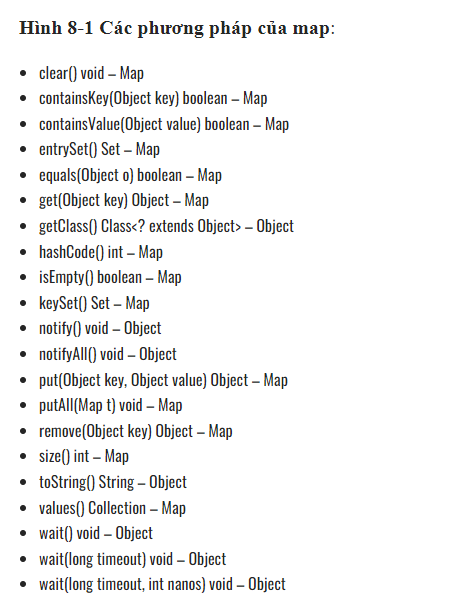
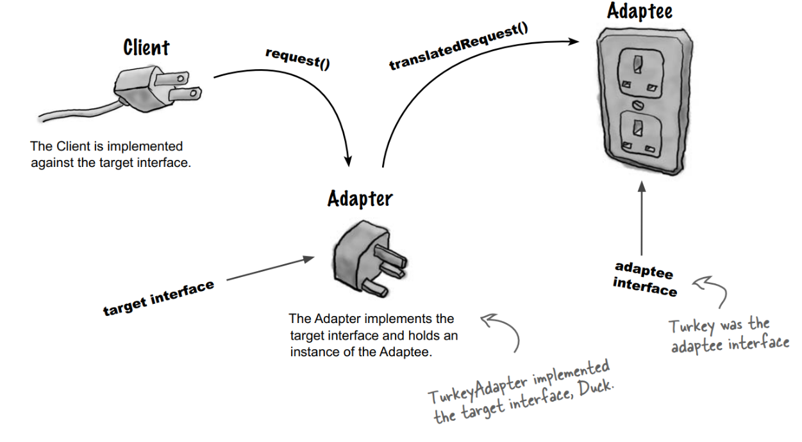
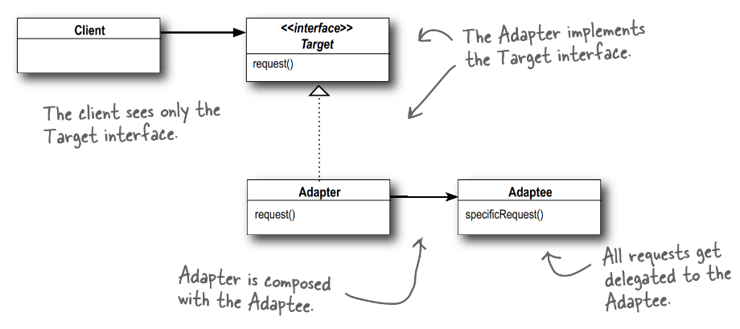

# Ranh giới code

- Trong khi viết code chúng tra luôn phải làm việc với code bên thứ 3 (thư viện, module cũ của dự án...)
.Chương này sẽ đưa ra các phương pháp để quản lý ranh giới giữa  code của cá nhân và code bên thứ 3

## Sử dụng code của bên thứ ba
- Người viết thư viện thì muốn thư viện nhiều tính năng để thu hút người dùng, nhưng người dùng lại muốn những tính năng 
tập trung vào nhu cầu cụ thể của họ
- Nếu Map thay đổi thì sẽ rất nhiều code bị ảnh hưởng.


```java
       Map sensors = new HashMap();

       Sensor s = (Sensor) sensors.get(sensorId);


        Map<Sensor> sensors = new HashMap<Sensor>();
        ...
        Sensor s = sensors.get(sensorId);
```
- Gói Map vào trong 1 class để phù hợp với nhu cầu của ứng dụng.
```java
  public class Sensors {
  private Map sensors = new HashMap();
 
  public Sensor getById(String id) { 
    return (Sensor) sensors.get(id);
  }
  //snip 
}
```

- Không nhất thiết phải luôn luôn đóng gói các Interface (Map, ArrayList...) vào trong 1 class như trên nhưng hãy hạn chế trả lại hoặc truyền vào Interface 

## Ranh giới Khám phá và Học hỏi
- Viết test để hiểu sâu hơn về thư viện => learning tests
- Test code của thư viện trước để: 
 + Biết được thư viện này làm gì.
 + Nếu sảy ra lỗi biết được bug là của mình hay là của thư viện.
- Khi test thư viện thì tập trung vào những tính năng mà dự án cần dùng.

## Học log4j
- Test thư viện, chia ra các unit test cho đến khi thư viện chạy đúng theo những gì đã tìm hiểu và mong đợi.
```java
public class LogTest { 
  private Logger logger;
   
  @Before
  public void initialize() {
    logger = Logger.getLogger("logger"); 
    logger.removeAllAppenders(); 
    Logger.getRootLogger().removeAllAppenders();
  }
   
  @Test
  public void basicLogger() {
    BasicConfigurator.configure();
    logger.info("basicLogger"); 
  }
   
  @Test
  public void addAppenderWithStream() {
    logger.addAppender(new ConsoleAppender( 
      new PatternLayout("%p %t %m%n"), 
      ConsoleAppender.SYSTEM_OUT));
    logger.info("addAppenderWithStream"); 
  }
   
  @Test
  public void addAppenderWithoutStream() {
    logger.addAppender(new ConsoleAppender( 
      new PatternLayout("%p %t %m%n")));
    logger.info("addAppenderWithoutStream"); 
  }
}
```

## Learning Tests tốt hơn là không làm gì cả
- Learning Tests giúp bổ sung kiến thức về thư viện mà ta đang dùng 
- Trong tương lai khi thư viện thay đổi ta có thể dùng lại các Learning Tests đã viết để kiểm tra những tính năng có bị thay đổi không.
- Learning test xác minh rằng các thư viện của bên thứ ba đang hoạt động theo cách chúng ta mong muốn.

## Sử dụng code chưa tồn tại
- Khi sử các thư viện bên thứ 3 mà ta có rất ít thông tin về chúng hoặc các hệ thống con chưa xác định interface,
ta có thể áp dụng Adapter Pattern để hạn chế ảnh hưởng của các thay đổi của thư viện trong tương lai tới hệ thống hiện tại.

## Adapter Pattern 




- Client: Đây là lớp sẽ sử dụng đối tượng của bạn (hệ thống của chúng ta).
- Adaptee: Đây là những lớp bạn muốn lớp Client sử dụng, nhưng hiện thời giao diện của nó không phù hợp (hệ thống mới).
- Adapter: Đây là lớp trung gian, thực hiện việc chuyển đổi giao diện cho Adaptee và kết nối Adaptee với Client.



## Ranh giới sạch
- Khi sử dụng thư viện bên thứ 3 hãy luôn sẵn sàng với thay đổi , thiết kế phần mềm sao cho khi thay đổi sảy ra thì hệ 
thống ít bị ảnh hưởng nhất có thể.
- Để quản ký và phân chia rạch ròi giữa thư viện bên thứ 3 và hệ thống hiện tại sử có 2 cách hay dùng:
 + Đóng gói thư viện vào 1 class
 + Sử dụng Adapter Pattern 
