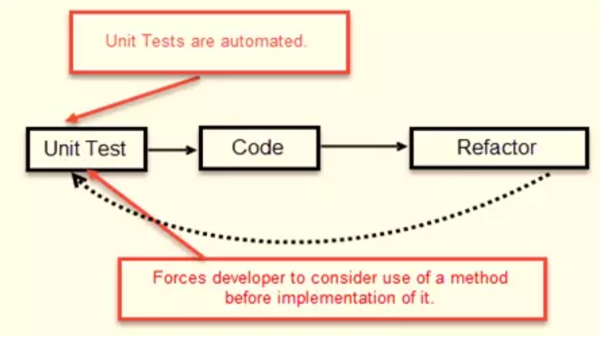
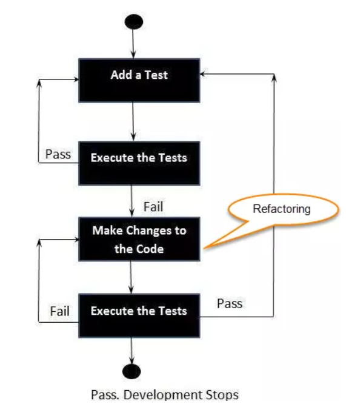
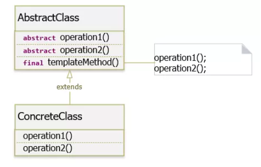

# Unit test
- Unit: là phần nhỏ nhất mà ta có thể kiểm tra được như hàm, quy trình, thuật toán, class
- Unit test: kiểm tra các đơn vị riêng lẻ của phần mềm. Mục tiêu của Unit test là cô lập 1 phần code và xác minh tính chính xác của nó.
## Ba định luật TDD (Test-Driven Development – Hướng phát triển thử nghiệm)
- Test-Driven Development: là viết test trước khi bắt đầu viết code logic.

- Viết test trước giúp:
  + dev có thể nghĩ về hành vi của unit được test.
  + Chuyển từ viết code sang viết API.(cần gì viết đấy)
  + Test tập trung vào behavior của unit hơn là implement của unit đó.



- Các bước để thực hiện TDD:
  - Tạo test
  - Chạy test và check xem có lỗi hay không
  - Viết code
  - Chạy test và refactor code (đương nhiên là refactor để pass test)
  - Lặp lại các bước trên



- 3 quy tắc trong TDD: 
 + Bạn không được viết code product cho đến khi bạn viết một bài unit test không đạt.
 + Bạn không được viết nhiều bài unit test hơn mức đủ để không đạt, và không biên dịch sẽ không thành công
 + Bạn không được viết nhiều code product hơn mức đủ để vượt qua bài kiểm tra hiện đang không đạt.
## Giữ sạch các bài kiểm tra
- Code test cũng quan trọng như code product.  Các bài test bẩn thì không có giá trị.

### Kiểm tra kích hoạt khả năng
- Test sạch giúp cho code của chúngg ta có thể bảo trì và tái sử dụng.
- Khi có các bài test chúng ta không sợ phải thay đổi code, test giúp chúng ta đảm bảo sau khi code thay đổi vẫn hoạt động đúng yêu cầu.

## Kiểm tra sạch
- Điều quan trọng nhất với 1 bài test sạch là khả năng đọc. Trong 1 bài test hãy biểu đạt nhiều với ít cách diễn đạt nhất có thể.
- Ví dụ về test có khả năng đọc kém.
```java
public void testGetPageHieratchyAsXml() throws Exception {
    crawler.addPage(root, PathParser.parse("PageOne")); 
    crawler.addPage(root, PathParser.parse("PageOne.ChildOne"));  
    crawler.addPage(root, PathParser.parse("PageTwo"));
     
    request.setResource("root"); 
    request.addInput("type", "pages");
    Responder responder = new SerializedPageResponder(); 
    SimpleResponse response = 
        (SimpleResponse) responder.makeResponse(
            new FitNesseContext(root), request);
    String xml = response.getContent();
     
    assertEquals("text/xml", response.getContentType());
    assertSubString("<name>PageOne</name>", xml);
    assertSubString("<name>PageTwo</name>", xml);
    assertSubString("<name>ChildOne</name>", xml);
}
 
public void testGetPageHieratchyAsXmlDoesntContainSymbolicLinks() throws Exception {
    WikiPage pageOne = crawler.addPage(root, PathParser.parse("PageOne"));
    crawler.addPage(root, PathParser.parse("PageOne.ChildOne"));
    crawler.addPage(root, PathParser.parse("PageTwo"));
     
    PageData data = pageOne.getData();
    WikiPageProperties properties = data.getProperties();
    WikiPageProperty symLinks = properties.set(SymbolicPage.PROPERTY_NAME);
    symLinks.set("SymPage", "PageTwo");
    pageOne.commit(data);
     
    request.setResource("root"); 
    request.addInput("type", "pages");
    Responder responder = new SerializedPageResponder(); 
    SimpleResponse response = 
        (SimpleResponse) responder.makeResponse( 
            new FitNesseContext(root), request);
    String xml = response.getContent();
     
    assertEquals("text/xml", response.getContentType());
    assertSubString("<name>PageOne</name>", xml);
    assertSubString("<name>PageTwo</name>", xml);
    assertSubString("<name>ChildOne</name>", xml); 
    assertNotSubString("SymPage", xml);
}
 
public void testGetDataAsHtml() throws Exception {
    crawler.addPage(root, PathParser.parse("TestPageOne"), "test page");
    request.setResource("TestPageOne"); 
    request.addInput("type", "data");
    Responder responder = new SerializedPageResponder(); 
    SimpleResponse response = 
        (SimpleResponse) responder.makeResponse( 
            new FitNesseContext(root), request);
    String xml = response.getContent();
     
    assertEquals("text/xml", response.getContentType()); 
    assertSubString("test page", xml); 
    assertSubString("<Test", xml);
}
```
- Ví dụ về test readable.
```java
public void testGetPageHierarchyAsXml() throws Exception { 
    makePages("PageOne", "PageOne.ChildOne", "PageTwo");
     
    submitRequest("root", "type:pages");
     
    assertResponseIsXML(); 
    assertResponseContains(
        "<name>PageOne</name>", "<name>PageTwo</name>", "<name>ChildOne</name>" );
}
 
public void testSymbolicLinksAreNotInXmlPageHierarchy() throws Exception {  
    WikiPage page = makePage("PageOne");
    makePages("PageOne.ChildOne", "PageTwo");
     
    addLinkTo(page, "PageTwo", "SymPage"); 
     
    submitRequest("root", "type:pages");
     
    assertResponseIsXML(); 
    assertResponseContains(
        "<name>PageOne</name>", "<name>PageTwo</name>", "<name>ChildOne</name>" );
    assertResponseDoesNotContain("SymPage"); 
}
 
public void testGetDataAsXml() throws Exception {    
    makePageWithContent("TestPageOne", "test page");
 
    submitRequest("TestPageOne", "type:data");
     
    assertResponseIsXML();
    assertResponseContains("test page", "<Test"); 
}
```

### Ngôn ngữ kiểm tra miền cụ thể (Domain-Specific Testing Language)
- Hãy áp dụng các quy tắc clean code đã học vào test code.

### Tiêu chuẩn kép
- Hai môi trường test và product có những yêu cầu và quy chuẩn khác nhau.
- Code test vẫn cần đơn giản ngắn gọn nhưng không cần hiệu quả như product
- Đoạn code bên dưới thiều khả năng đọc do có nhiều câu lệnh ko thực hiện đúng mục đích so với tên hàm
```java
@Test
public void turnOnLoTempAlarmAtThreashold() throws Exception {
    hw.setTemp(WAY_TOO_COLD); 
    controller.tic(); 
    assertTrue(hw.heaterState()); 
    assertTrue(hw.blowerState()); 
    assertFalse(hw.coolerState()); 
    assertFalse(hw.hiTempAlarm()); 
    assertTrue(hw.loTempAlarm());
}
```
- Hàm sau đã gom các lệnh ko phù hợp thành 1 hàm
```java
@Test
public void turnOnLoTempAlarmAtThreshold() throws Exception {
    wayTooCold();
    assertEquals("HBchL", hw.getState());
}
```
- Trong môi trường test hạn chế dùng nhiều tài nguyên của máy tính như bộ nhớ hay hiệu suất CPU nhưng vẫn phải đẳm bảo độ sạch của test code
## Một xác nhận cho mỗi bài kiểm tra

- Tối thiểu số lượng assert trong một hàm test code.
- Sử dung mẫu thiết kế TEMPLATE METHOD để hạn chế trùng lặp code.
### Template Method Pattern



   + AbstractClass(Protocol) : Định nghĩa các phương thức trừu tượng cho từng bước có thể được điều chỉnh bởi các lớp con.
Cài đặt một phương thức duy nhất điều khiển thuật toán và gọi các bước riêng lẻ đã được cài đặt ở các lớp con.
   + ConcreteClass : là một thuật toán cụ thể, cài đặt các phương thức của AbstractClass. Các thuật toán này ghi đè lên các
phương thức trừu tượng để cung cấp các triển khai thực sự. Nó không thể ghi đè phương thức duy nhất đã được cài đặt ở AbstractClass (templateMethod).
   
### Khái niệm đơn cho mỗi thử nghiệm
- Mỗi hàm chỉ làm duy nhất 1 việc vậy nên mỗi 1 hàm test code cũng chỉ nên kiểm tra một việc duy nhất .
- Hàm test bên dưới là hàm kiểm tra nhiều hơn 1 việc.
```java
/**
 * Miscellaneous tests for the addMonths() method. */
public void testAddMonths() {
    SerialDate d1 = SerialDate.createInstance(31, 5, 2004);
     
    SerialDate d2 = SerialDate.addMonths(1, d1); 
    assertEquals(30, d2.getDayOfMonth()); 
    assertEquals(6, d2.getMonth()); 
    assertEquals(2004, d2.getYYYY());
     
    SerialDate d3 = SerialDate.addMonths(2, d1); 
    assertEquals(31, d3.getDayOfMonth()); 
    assertEquals(7, d3.getMonth()); 
    assertEquals(2004, d3.getYYYY());
     
    SerialDate d4 = SerialDate.addMonths(1, SerialDate.addMonths(1, d1));
    assertEquals(30, d4.getDayOfMonth());
    assertEquals(7, d4.getMonth());
    assertEquals(2004, d4.getYYYY());
}
```
##  F.I.R.S.T.


### Fast
- Các bài test phải chạy nhanh.
### Independent
- Các bài test phải độc lập không nên phụ thuộc vào nhau, các bài test phải có khả năng chạy theo bất kỳ thứ tự nào mà bạn muốn.

### Repeatable
- Các bài test có thể lặp lại trên nhiều môi trường khác nhau.

### Self-Validating
- Các bài test phải có khả năng tự xác thực, khi nhìn vào đầu ra của bài test phải biết được ngay pass hay failed.

### Timely 
- Các bài test phải viết đúng thời điểm, viết test trước khi viết code logic.

