## 6.1 Introduction

- chúng ta sẽ định nghĩa lỗ hổng bảo mật là một điểm yếu hoặc lỗ hổng được `present` trong một ứng dụng. Tất nhiên, tất
  cả các hệ thống đều có lỗ hổng, nhưng sự khác biệt lớn nằm ở việc các lỗ hổng này có bị khai thác và gây hại hay
  không.
- Đề cập đến bảo mật thường gây ra tiếng rên rỉ từ các nhà phát triển. Trong số các nhà phát triển, chúng ta nghe thấy
  những nhận xét như: “Thật khó hiểu, khó hiểu và thậm chí khó gỡ lỗi hơn".
- Tuy nhiên, chúng ta sẽ không tìm thấy bất kỳ nhà phát triển nào ( ngoại trừ có thể là một nhà phát triển thiếu kinh
  nghiệm ) nói rằng họ không lo lắng về bảo mật. Bảo mật kiến trúc microservices là một nhiệm vụ phức tạp và tốn nhiều
  công sức, bao gồm nhiều lớp bảo vệ:
    - The application layer: Đảm bảo rằng có các biện pháp kiểm soát người dùng thích hợp để chúng ta có thể xác thực
      rằng người dùng có đúng như họ nói và họ có quyền làm những gì họ đang cố gắng làm không.
    - Infrastructure: Giữ cho service luôn chạy, được vá và cập nhật để giảm thiểu nguy cơ có lỗ hổng bảo mật.
    - A network layer: Triển khai các kiểm soát truy cập mạng để một service chỉ có thể truy cập được thông qua các port
      được xác định rõ và chỉ với một số ít máy chủ được ủy quyền.
- Để implement authorization và authentication controls, chúng ta sẽ sử dụng the Spring Cloud Security module và
  Keycloak để Spring-based services của chúng ta.
- Keycloak là phần mềm quản lý danh tính và truy cập mã nguồn mở cho các modern applications và services. Phần mềm nguồn
  mở này được viết bằng Java và nó hỗ trợ SAML (Ngôn ngữ đánh dấu xác nhận bảo mật) v2 và OpenID Connect (OIDC)
  /OAuth2-federated identity protocols.

## 6.2  What is OAuth2?.

- OAuth2 là token-based security framework thông báo mô tả patterns để cấp quyền nhưng không xác định cách thực hiện
  authentication.
- Thay vào đó, nó cho phép người dùng tự xác thực bằng `a third-party authentication service`, được gọi
  là `identity provider` (IdP).
- Nếu người dùng xác thực thành công, họ sẽ được cung cấp một mã thông báo phải được gửi với mọi yêu cầu. Sau đó, mã
  thông báo có thể được xác thực trở lại dịch vụ xác thực.
- Sức mạnh thực sự đằng sau OAuth2 là nó cho phép các nhà phát triển ứng dụng dễ dàng tích hợp với các nhà cung cấp đám
  mây bên thứ ba, đồng thời xác thực và ủy quyền cho người dùng với các service đó mà không cần phải liên tục chuyển
  thông tin đăng nhập của người dùng cho service của bên thứ ba.
- OpenID Connect (OIDC) là `a layer on top of the OAuth2 framework` cung cấp thông tin authentication và profile
  information đã đăng nhập vào ứng dụng (danh tính).
- Khi an authorization server hỗ trợ OIDC, nó đôi khi được gọi là `identity provider`. Trước khi đi sâu vào chi tiết kỹ
  thuật của việc bảo vệ các service của mình, hãy cùng tìm hiểu kiến trúc Keycloak.

## 6.3 Introduction to Keycloak.

- Keycloak là `an open source identity` và nhận dạng mã nguồn mở cho các service và ứng dụng của chúng ta.
- Mục tiêu chính của Keycloak là sự bảo vệ của service và ứng dụng có ít hoặc không có mã.
    - Nó tập trung xác thực và cho phép xác thực đăng nhập một lần (SSO).
    - Nó cho phép các nhà phát triển tập trung vào business functionality thay vì lo lắng về các khía cạnh bảo mật như
      ủy quyền và xác thực.
    - Nó cho phép two-factor authentication.
    - Nó là LDAP compliant.
    - Nó cung cấp một số adapters cho các ứng dụng và máy chủ an toàn một cách dễ dàng.
    - Nó cho phép bạn customize password policies.
      

- Keycloak security có thể được chia thành bốn thành phần sau: protected resource, resource owner, application, và
  authentication/authorization server.
    - A protected resource: Tài nguyên mà bạn muốn bảo vệ, đảm bảo rằng chỉ những người dùng đã được xác thực có quyền
      phù hợp mới có thể truy cập vào tài nguyên đó.
    - A resource owner: Chủ sở hữu này xác định ứng dụng nào được phép gọi service, người dùng nào được cấp quyền truy
      cập vào service và những gì người dùng có thể làm với service. Mỗi ứng dụng được chủ sở hữu tài nguyên đăng ký
      được đặt một tên ứng dụng xác định ứng dụng đó, cùng với the secret key. Sự kết hợp của tên ứng dụng và the secret
      key là một phần của thông tin xác thực được chuyển khi authenticating an access token.
    - An application: Đây là ứng dụng sẽ thay mặt người dùng gọi service. Rốt cuộc, người dùng hiếm khi gọi trực tiếp
      một service. Thay vào đó, họ dựa vào một ứng dụng để thực hiện công việc cho họ.
    - Authentication/authorization server: The authentication server là trung gian giữa ứng dụng và các service được sử
      dụng. The authentication server cho phép người dùng tự xác thực mà không cần phải chuyển thông tin đăng nhập người
      dùng của họ cho mọi dịch vụ mà ứng dụng sẽ thay mặt họ gọi.
- Các thành phần bảo mật của Keycloak tương tác với nhau để authenticate the service users. Users authenticate với the
  Keycloak server bằng cách cung cấp thông tin đăng nhập của họ và ứng dụng / thiết bị mà họ đang sử dụng để truy cập
  tài nguyên được bảo vệ (microservice).
- Nếu the users’ credentials hợp lệ, máy chủ Keycloak cung cấp an authentication token có thể được chuyển từ service này
  sang service khác mỗi khi người dùng sử dụng service.
- Sau đó, tài nguyên được bảo vệ có thể liên hệ với the Keycloak server để the token’s validity và truy xuất các vai trò
  được chỉ định cho người dùng. Các vai trò được sử dụng để nhóm những người dùng có liên quan lại với nhau và xác định
  những tài nguyên nào họ có thể truy cập. Đối với chương này, chúng ta sẽ sử dụng Keycloak roles để xác định những động
  từ HTTP nào mà người dùng có thể sử dụng để gọi các authorized service endpoints.

## 6.4 Starting small: Using Spring and Keycloak to protect a single endpoint

- Thêm một Keycloak service đến Docker.
- Thiết lập dịch vụ Keycloak và đăng ký the O-stock application làm an authorized application có thể authenticate và
  authorize user identities.
- Sử dụng Spring Security để bảo vệ các O-stock services của chúng ta. chúng ta sẽ không xây dựng UI cho O-stock; thay
  vào đó, chúng ta sẽ mô phỏng a user logging vào Postman để cung cấp xác thực cho dịch vụ Keycloak của chúng ta.
- Bảo vệ the licensing and organization services để chúng chỉ có thể được gọi bởi an authenticated user.

### 6.4.1 Adding Keycloak to Docker

- Phần này giải thích cách thêm dịch vụ Keycloak vào Docker environment của chúng ta. Để đạt được điều này, hãy bắt đầu
  bằng cách thêm mã hiển thị trong danh sách sau vào tệp dockercompose.yml của chúng ta.
  

### 6.4.2 Setting up Keycloak

- Sau khi the services chạy, hãy truy cập liên kết sau để mở the Keycloak Administration
  Console: http://keycloak:8080/auth/. Configuring Keycloak là một quá trình đơn giản.
- Lần đầu tiên chúng ta truy cập Keycloak, trang Chào mừng sẽ hiển thị. Trang này hiển thị các tùy chọn khác nhau, chẳng
  hạn như truy cập the Administration Console, documentation, reporting issues ...

  
- Để tiếp tục configuring our data, hãy tạo realm của chúng ta. A realm là một khái niệm mà Keycloak sử dụng để chỉ một
  đối tượng quản lý một tập hợp users, credentials, roles, and groups. Để tạo cảnh giới của chúng ta, hãy nhấp vào tùy
  chọn Add Realm option được hiển thị trong Master drop-down menu sau khi chúng ta đăng nhập vào Keycloak. chúng ta sẽ
  gọi lĩnh vực này là realm spmia-realm.
  
  
- Sau khi the realm được tạo, bạn sẽ thấy trang chính của spmia-realm với configuration được hiển thị trong hình 9.5.
  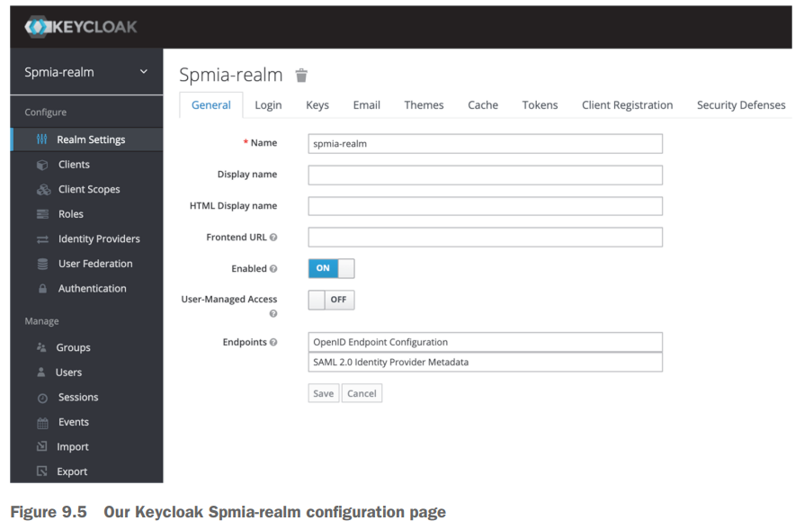

### 6.4.3 Registering a client application

- Bước tiếp theo trong configuration của chúng ta là tạo một a client. Clients trong Keycloak là các thực thể có thể yêu
  cầu user authentication.
- The clients thường là the applications hoặc services mà chúng ta muốn bảo mật bằng cách cung cấp a single sign-on (
  SSO) solution. Để tạo a client, hãy nhấp vào tùy chọn the Clients option trên trái menu.
- 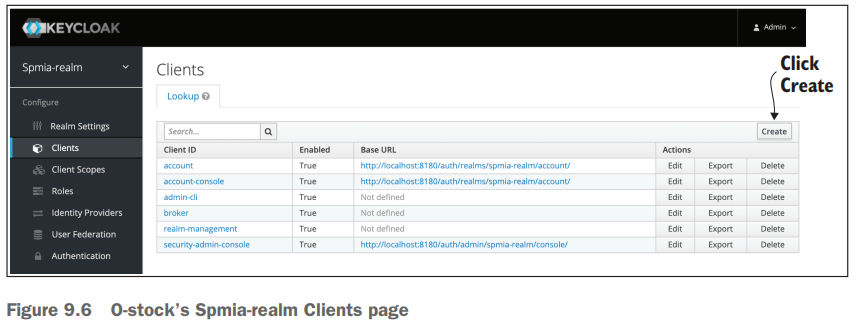
- Sau khi Client’s list được hiển thị, hãy nhấp vào the Create button. Sau khi nhấp vào, bạn sẽ thấy an Add Client form
  yêu cầu thông tin sau:
    - Client ID
    - Client Protocol
    - Root URL
      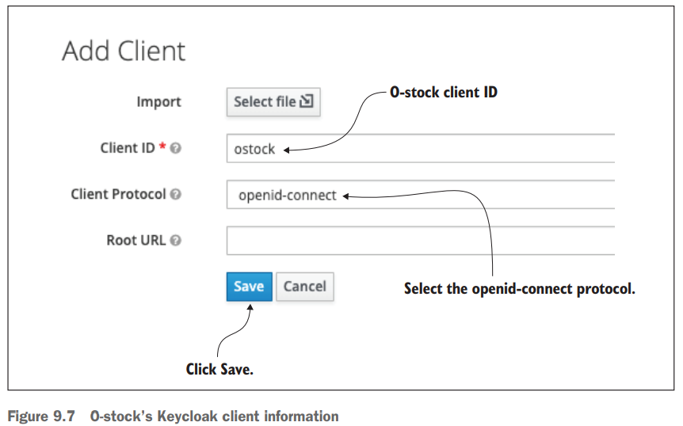

- Sau khi lưu the client, bạn sẽ thấy trang the Client Configuration được hiển thị trong hình 9.8. Trên trang đó, chúng
  tôi sẽ nhập dữ liệu sau:
    - Access Type: Confidential
    - Service Accounts Enabled: On
    - Authorization Enabled: On
    - Valid Redirect URLs: http://localhost:80*
    - Web Origins: *
- Bước tiếp theo là thiết lập the client roles, vì vậy hãy nhấp vào the Roles tab. Để hiểu rõ hơn về client roles, hãy
  tưởng tượng rằng ứng dụng của chúng ta sẽ có hai loại users: admins và regular users. The admin users có thể thực thi
  tất cả các the application services và the regular users sẽ chỉ được phép thực thi một số service.
- Khi the Roles page được tải, bạn sẽ thấy a list of predefined client roles. Hãy nhấp vào Add Role button được hiển thị
  ở góc trên bên phải của the Roles table.
  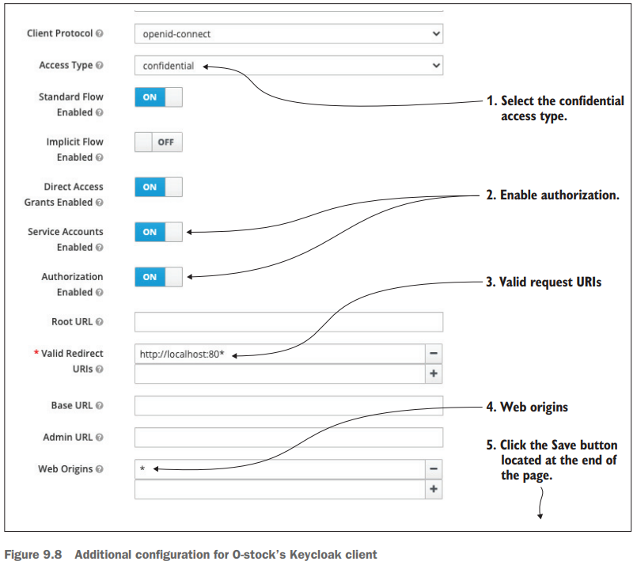
  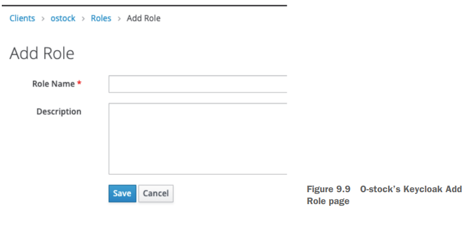
- Vào the Add Role page, Chúng ta cần tạo the following client roles.
  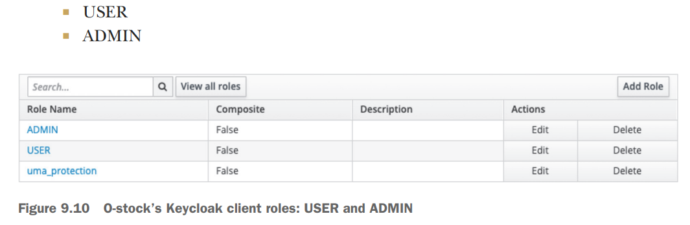
- Bây giờ chúng ta đã hoàn thành basic client configuration, hãy truy cập the Credentials page. The Credentials page sẽ
  hiển thị the required client secret được yêu cầu cho the required client secret.
  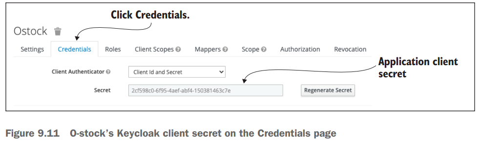
- Bước tiếp theo trong configuration của chúng ta là tạo các create realm roles. The realm roles sẽ cho phép chúng ta
  kiểm soát tốt hơn những vai trò nào đang được đặt cho mỗi người dùng. Đây là một bước tùy chọn. Nếu không muốn tạo
  những vai trò này, bạn có thể tiếp tục và create the users directly. Nhưng càng về sau, việc xác định và duy trì vai
  trò cho mỗi người dùng có thể khó hơn.
- Để tạo the realm roles, hãy nhấp vào the Roles option trong menu bên trái, sau đó click the Add Role button ở trên
  cùng bên phải của bảng. Giống như với the client roles, chúng ta sẽ tạo two types of realm roles: the ostock-user và
  the ostock-admin.
  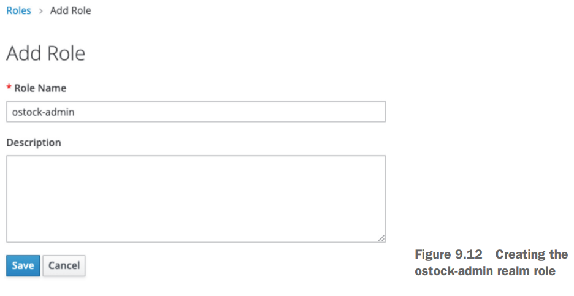
  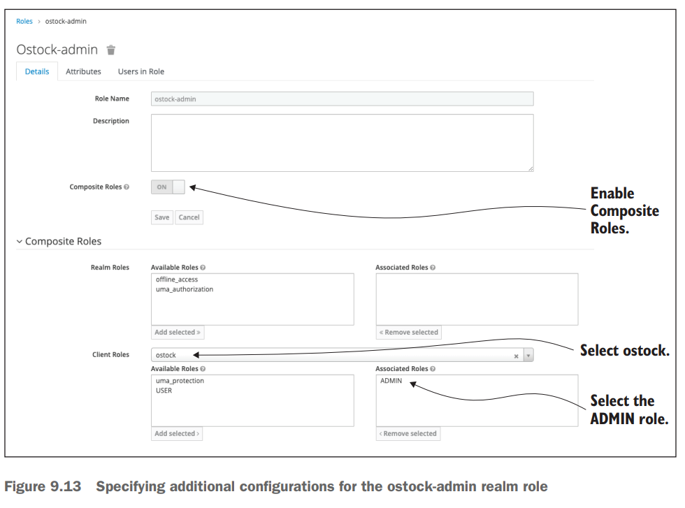
- Bây giờ chúng ta đã định the ostock-admin realm role configured, hãy lặp lại các bước tương tự để tạo create the
  ostock-user role.
  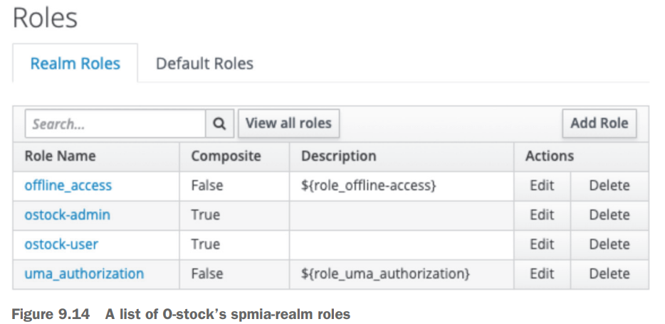

### 6.4.4 Configuring O-stock users

- Bây giờ chúng ta đã xác định application-level và realm-level roles, chúng ta đã sẵn sàng thiết lập thông tin user
  credentials và the roles for the users. Để create the users, hãy nhấp vào the Users option hiển thị ở the left menu in
  Keycloak’s admin console.
  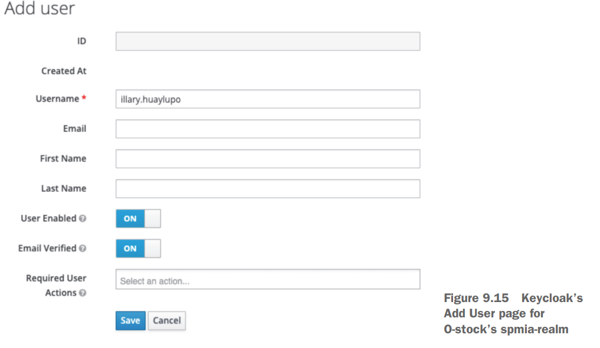
- Sau khi this form được lưu, hãy nhấp the Credentials tab. Bạn cần nhập the user’s password, tắt the Temporary option
  và click the Set Password button.
- 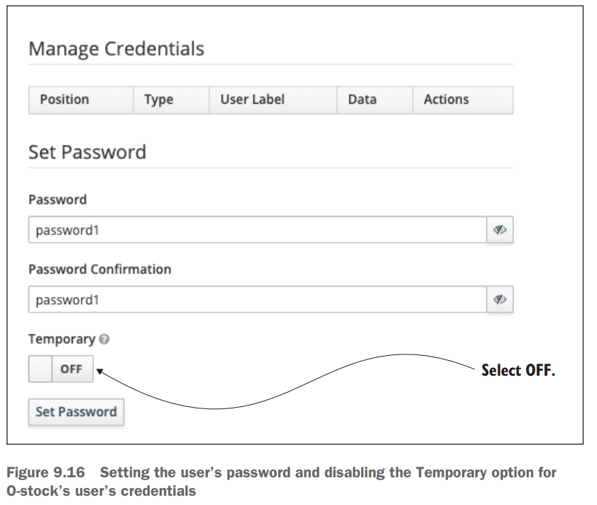
- Một khi the password is đặt, click the Role Mappings tab và assign the user a specific role.
- 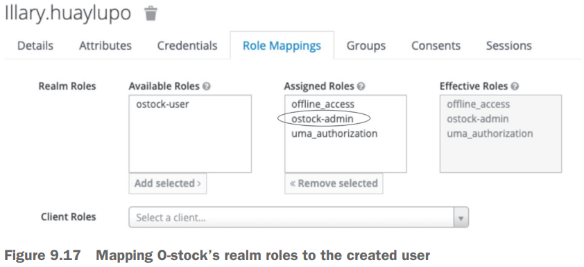
- Để hoàn thành configuration của chúng ta, hãy lặp lại các bước tương tự cho người dùng khác.

### 6.4.5 Authenticating our O-stock users.

- Tại thời điểm này, chúng ta có đủ base Keycloak server functionality của mình để thực hiệnperform application và user
  authentication cho quy trình cấp mật khẩu.
  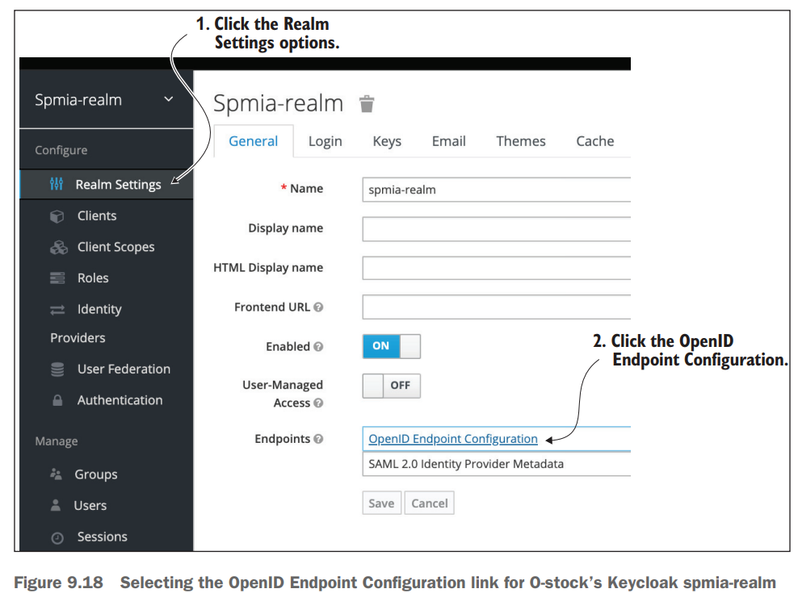
  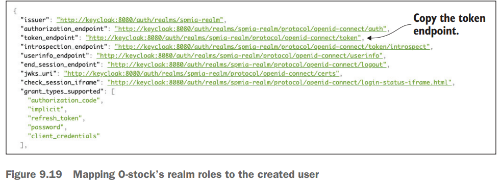
- Bây giờ chúng ta sẽ mô phỏng một người dùng muốn acquire an access token. chúng ta sẽ thực hiện việc này bằng cách sử
  dụng Postman to POST đến endpoint t http://keycloak:8080/auth/realms/spmia-realm/protocol/openid-connect/token và sau
  đó cung cấp ứng dụng, secret key, user ID, và password.
- Để mô phỏng a user có được an authentication token, chúng ta cần thiết lập Postman với the application name và secret
  key. Đối với điều này, chúng ta sẽ chuyển các phần tử này đến authentication server endpoint của chúng ta bằng cách sử
  dụng basic authentication.
  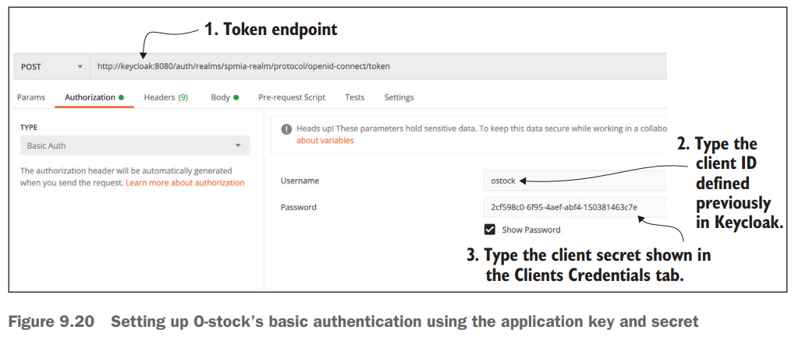
- Tuy nhiên, chúng ta chưa sẵn sàng thực hiện cuộc gọi để nhận the token . Khi the application name and secret key được
  configured, chúng ta cần chuyển thông tin sau vào service dưới dạng HTTP form parameters:
    - grant_type: The grant type để thực thi
    - username: Name of the user logging in.
    - password: Password of the user logging in.

- Không giống như các lệnh gọi REST khác trong cuốn sách này, this list’s parameters này sẽ không được chuyển vào JSON
  body. The authentication standard mong đợi tất cả parameters được chuyển đến the token generation endpoint to be HTTP
  form parameters.
  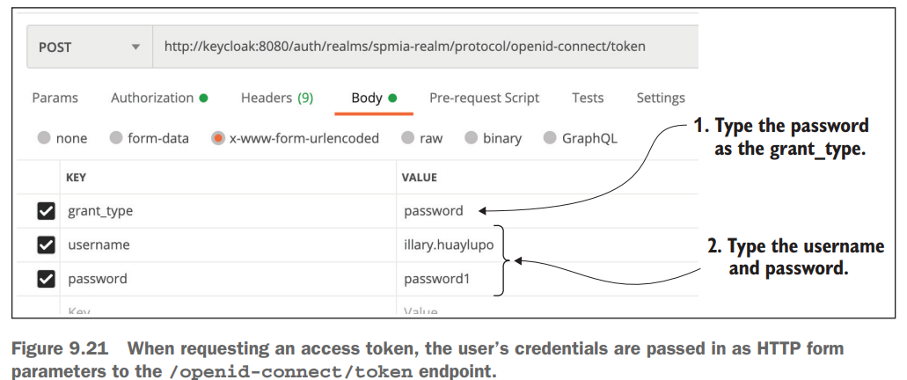
  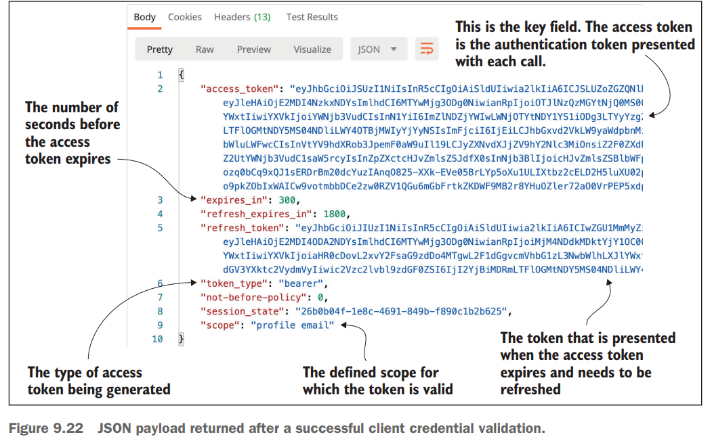
    - access_token: The access token truy cập sẽ được hiển thị với each service call mà người dùng thực hiện đối với tài
      nguyên được bảo vệ.
    - token_type: The authorization specification cho phép chúng ta xác định multiple token types. Loại mã thông báo phổ
      biến nhất được sử dụng là the Bearer Token.
    - refresh_token: The refresh token có thể được xuất trình trở lại the authorization server để phát hành lại a token
      sau khi hết hạn
    - expires_in: Đây là số giây trước khi the access token expires. Giá trị mặc định để hết hạn mã thông báo ủy quyền
      vào Spring là 12 hours.
    - scope: Điều này xác định the scope mà access token này hợp lệ
      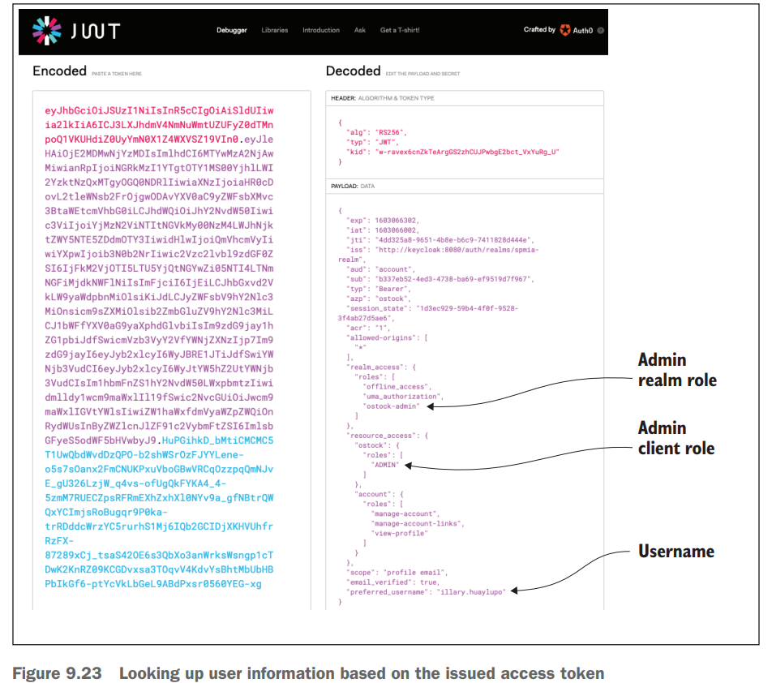

## 6.5 Protecting the organization service using Keycloak

- Sau khi đã đăng ký a client trong Keycloak server của mình và thiết lập các individual user accounts with role, chúng
  tôi có thể bắt đầu khám phá cách bảo vệ tài nguyên bằng Spring Security và Keycloak Spring Boot Adapter.
- Mặc dù việc tạo và quản lý access tokens là the Keycloak server’s responsibility, nhưng trong Spring, định nghĩa về
  user roles nào có quyền thực hiện những hành động xảy ra ở cấp service riêng lẻ. Để thiết lập một tài nguyên được bảo
  vệ:
    - Thêm các Spring Security và Keycloak JARs thích hợp vào service mà chúng ta đang bảo vệ.
    - Configure the service to point to our Keycloak server.
    - Define what và who có thể truy cập the service.

### 6.5.1 Adding the Spring Security and Keycloak JARs to the individual services

- Như thường lệ với Spring microservices, chúng ta phải thêm một số phụ thuộc vào organization service’s Maven
  configuration file: organization-service/pom.xml.
  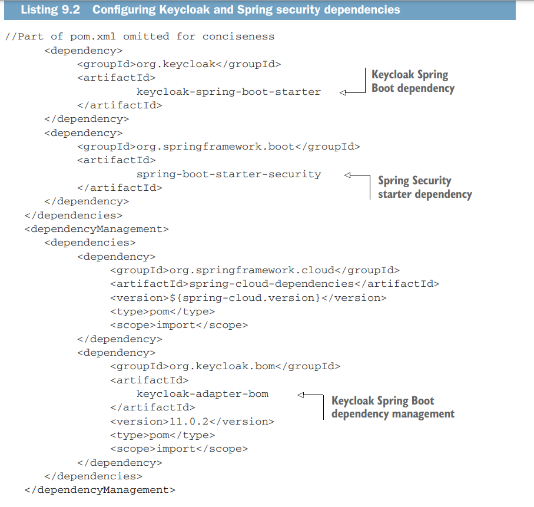

### 6.5.2  Configuring the service to point to our Keycloak server.

- Sau khi chúng ta thiết lập the organization service được bảo vệ, mỗi khi thực hiện cuộc gọi tới service, người gọi
  phải bao gồm the authentication HTTP header có chứa a Bearer access token vào service.
- Sau đó, tài nguyên được bảo vệ của chúng ta phải gọi lại the Keycloak server để xem the token có hợp lệ hay không.
  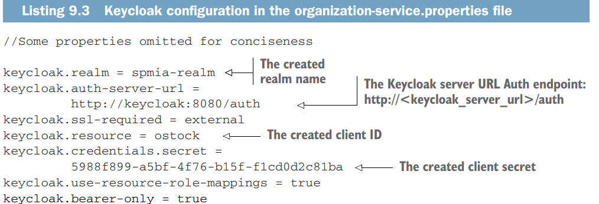

### 6.5.3 Defining who and what can access the service

- Bây giờ chúng ta đã sẵn sàng để bắt đầu xác định the access control rules around the service. Để xác định các access
  control rules, chúng ta cần mở rộng lớp KeycloakWebSecurityConfigurerAdapter và override các phương thức sau:
    - configure()
    - configureGlobal()
    - sessionAuthenticationStrategy()
    - KeycloakConfigResolver()
      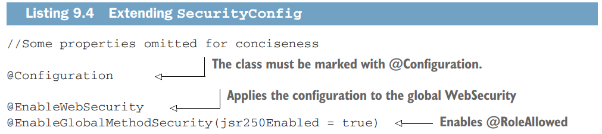
      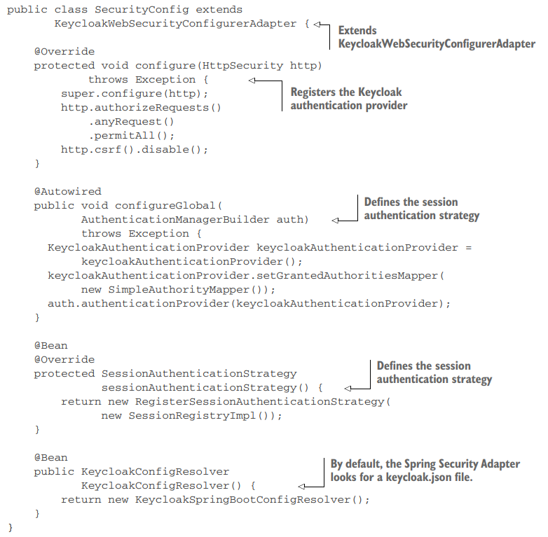
- Các quy tắc truy cập có thể bao gồm từ coarse-grained (any authenticated user được xác thực nào cũng có thể truy cập
  toàn bộ service) đến chi tiết (chỉ ứng dụng có vai trò này, nhưng được phép truy cập URL này thông qua DELETE).
- Chúng ta không thể thảo luận về mọi hoán vị của các Spring Security’s access control rules, nhưng chúng ta có thể xem
  xét một số ví dụ phổ biến hơn.
    - Chỉ authenticated users có thế truy cập a service URL.
    - Chỉ users với a specific role có thế truy cập a service URL.
- Điều đầu tiên chúng ta sẽ làm là bảo vệ the organization service để nó chỉ có thể được truy cập bởi an authenticated
  user.
  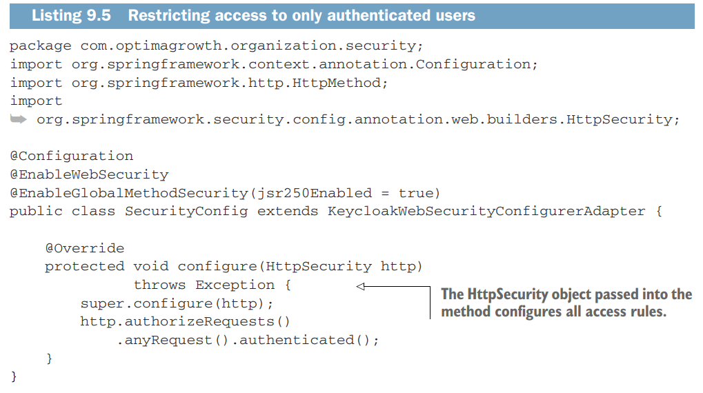
- Giả sử chúng ta truy cập the organization service mà không có an access token có trong the HTTP header. Trong trường
  hợp này, chúng ta sẽ nhận được a 401 HTTP response và thông báo cho biết rằng full authentication đến the service là
  được yêu cầu.
  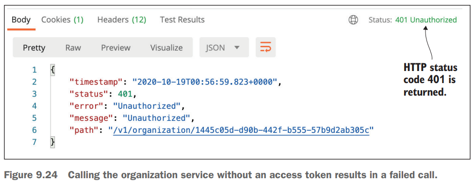
- Tiếp theo, chúng ta sẽ gọi the organization service với an access token. chúng ta muốn cắt và dán giá trị access_token
  từ the returned JSON call to the /openid-connect/token endpoint và sử dụng nó trong lệnh gọi của chúng tôi tới the
  organization service.
- Hãy nhớ rằng, khi chúng ta gọi the organization service, chúng ta cần đặt the authorization type dến Bearer Token mang
  tên với the access_token value.
  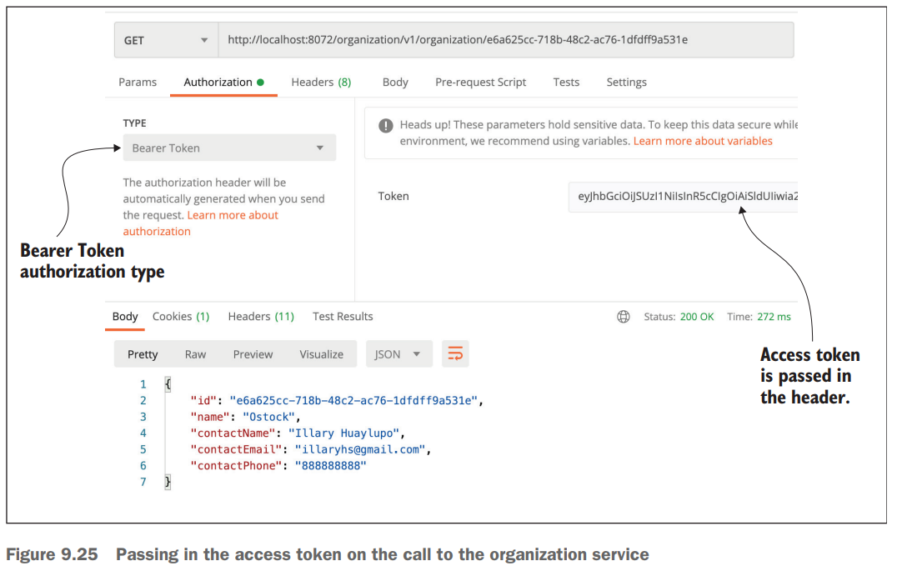
- Đây có lẽ là một trong những trường hợp sử dụng đơn giản nhất để bảo vệ an endpoint sử dụng JWTs. Tiếp theo, chúng ta
  sẽ xây dựng dựa trên ví dụ này và hạn chế quyền truy cập vào a specific endpoint cho a specific role.
    - Trong ví dụ tiếp theo, chúng ta sẽ khóa lệnh gọi XÓA trên organization service của chúng ta chỉ với những users
      with ADMIN access.
    - chúng ta có thể permit specific roles cụ thể thực thi một số phương thức bằng cách sử dụng @RolesAllowed trong the
      controller.

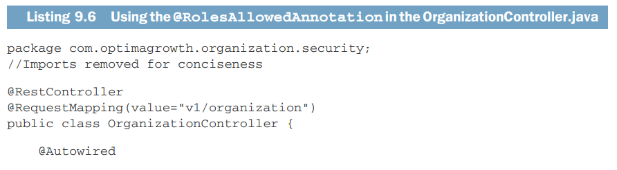
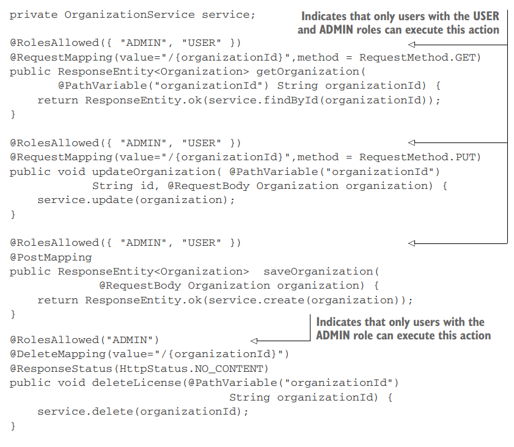

- Bây giờ, để lấy the token cho `john.carnell` (password: password1), chúng ta cần thực hiện lại yêu cầu the
  openid-connect/token POST. Khi chúng ta có the new access token, sau đó chúng ta cần gọi the DELETE endpoint cho the
  organization service: http://localhost:8072/organization/v1/organization/dfd13002-57c5-47ce-a4c2-a1fda2f51513.
- chúng ta sẽ nhận được a 403 Forbidden HTTP status code trong cuộc gọi và an error message cho biết rằng quyền truy cập
  đã bị denied cho this service. The JSON text được trả về bởi cuộc gọi của chúng ta được hiển thị ở đây:
  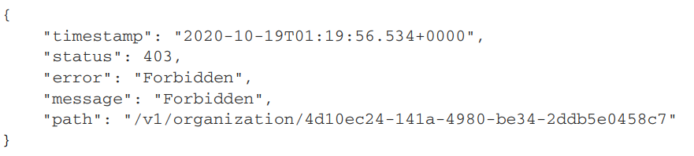
- Nếu chúng ta đã thử cùng một cuộc gọi bằng the illary.huaylupo user account (password: password1)
  và `its access token`, chúng ta sẽ thấy a successful call không trả về nội dung và the HTTP status code 204, No
  Content.
- Tại thời điểm này, chúng ta đã xem xét cách gọi và bảo vệ a single service  (dịch vụ tổ chức) bằng Keycloak. Tuy
  nhiên, thường trong a microservice environment, chúng ta sẽ có multiple service để thực hiện a single transaction.
- Trong các loại tình huống này, chúng ta cần đảm bảo rằng the access token được truyền từ service call to service call.

### 6.5.4 Propagating the access token.

- Để chứng minh việc tuyên truyền a token giữa các service, chúng ta cũng sẽ bảo vệ licensing service của mình bằng
  Keycloak. Hãy nhớ rằng, the licensing service gọi the organization service để tra cứu thông tin. Câu hỏi trở thành,
  làm cách nào để chúng ta truyền the token từ service này sang service khác?
- chúng ta sẽ thiết lập một ví dụ đơn giản trong đó chúng ta sẽ gọi the licensing service là the organization service.
  Nếu bạn đã làm theo các ví dụ mà chúng ta đã xây dựng trong các chương trước, bạn sẽ thấy rằng cả hai service đều đang
  chạy sau a gateway.
  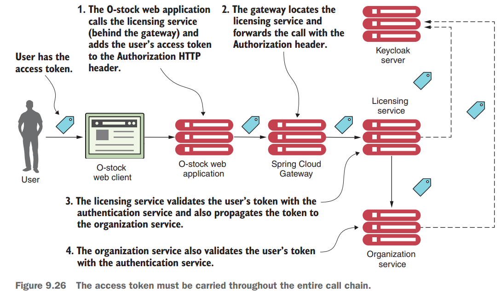
    - Người dùng đã authenticated với the Keycloak serverk và thực hiện cuộc gọi đến the O-stock web application. The
      user’s access token được lưu trữ trong the user’s session. The O-stock web application cần truy xuất một số
      licensing data và gọi the licensing service REST endpoint. Là một phần của lời kêu gọi the licensing REST
      endpoint, the O-stock web application thêm the access token qua the HTTP Authorization header. The licensing
      service chỉ có thể truy cập sau Spring Cloud Gateway.
    - The gateway tìm kiếm licensing service endpoint và sau đó chuyển tiếp cuộc gọi đến một trong the licensing
      service’s servers. The services gateway sao chép the authorization HTTP header và đảm bảo rằng the HTTP header
      được chuyển tiếp tới the new endpoint.
    - The licensing service nhận cuộc gọi đến. Vì the licensing service là tài nguyên được bảo vệ nên the licensing
      service sẽ validate the token với the Keycloak server (3) và sau đó kiểm tra the user’s roles để tìm the
      appropriate permissions. Là một phần của công việc, the licensing service Khi thực hiện việc này, the organization
      service cần truyền the user’s access token tới the organization service.
    - Khi the organization service nhận cuộc gọi, nó sẽ lấy the HTTP Authorization header và validates the token với the
      Keycloak server.
- Để thực hiện các bước này, chúng ta cần thực hiện một số thay đổi đối với mã của mình. Nếu chúng ta không làm điều
  này, chúng ta sẽ gặp lỗi sau khi truy xuất the organization information từ the licensing service:
  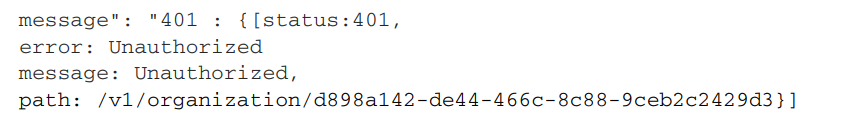
- Bước đầu tiên là sửa đổi the gateway để nó truyền the access token truy cập đến the licensing service: Theo mặc định,
  the gateway không chuyển tiếp các sensitive HTTP headers như cookie, set-cookie và authorization dến downstream
  services. Để cho phép truyền the authorization HTTP header, chúng ta cần thêm vào each route the following filter
  trong gateway-server.yml nằm trong the Spring Cloud Config repository:
    - `RemoveRequestHeader= Cookie,Set-Cookie`
- This configuration là một danh sách đen của the sensitive headers mà the gateway sẽ không được truyền tới a downstream
  service. Sự vắng mặt của the Authorization value trong danh sách RemoveRequestHeader có nghĩa là cổng sẽ cho phép tiêu
  đề đó đi qua. Nếu chúng ta không đặt this configuration property, the gateway sẽ tự động chặn việc truyền cả ba giá
  trị (Cookie, Set-Cookie và Authorization).
- Tiếp theo, chúng ta cần configure licensing service của mình để bao gồm the Keycloak và Spring Security dependencies
  và thiết lập any authorization rules nào mà chúng ta muốn cho the service. Cuối cùng, chúng ta cần thêm the Keycloak
  properties vào the application properties file trong the configuration server.
- Khi tuyên truyền access tokens, bước đầu tiên của chúng ta là add the Maven dependencies vào licensing service pom.xml
  file của chúng ta. Danh sách sau đây cho thấy the dependencies.
  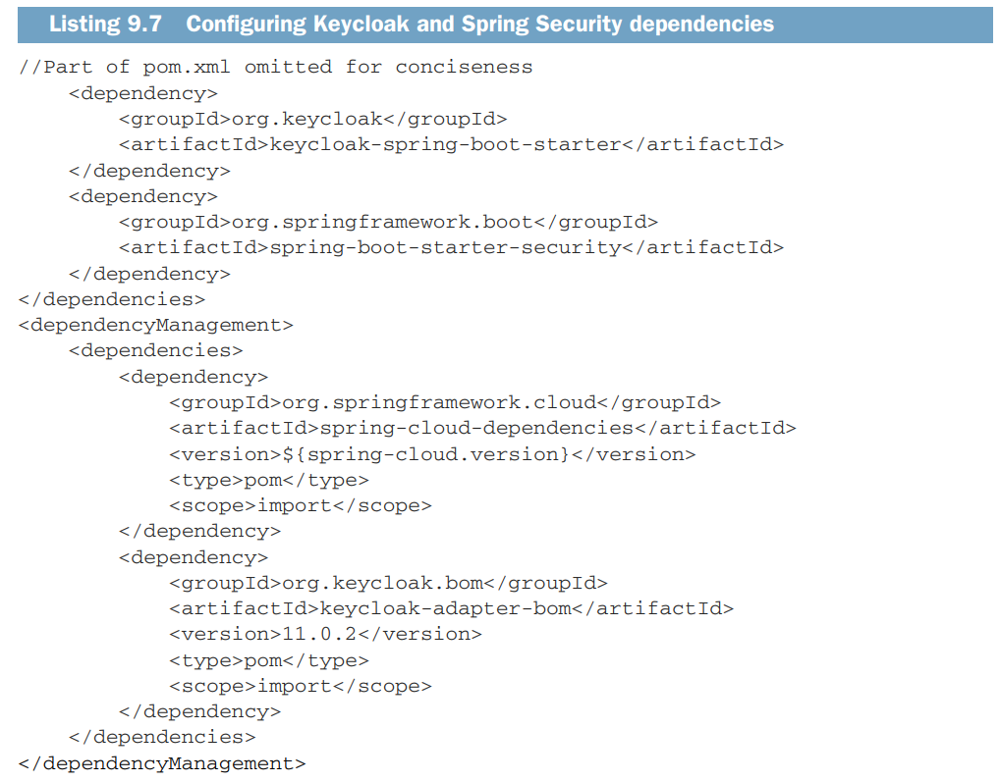
- Bước tiếp theo là bảo vệ the licensing service để nó chỉ có thể được truy cập bởi an authenticated user. Danh sách sau
  đây cho thấy the SecurityConfig class.
  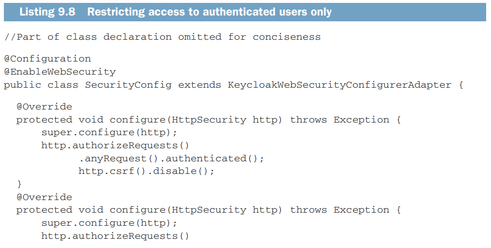
  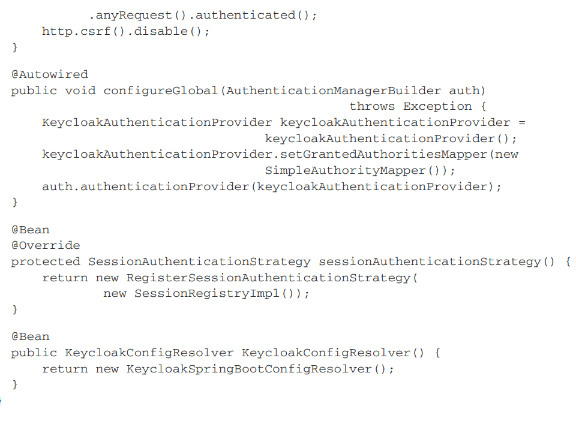
- Bước cuối cùng trong configuring the licensing service là thêm add the Keycloak configuration vào
  licensing-service.properties file của chúng ta.
  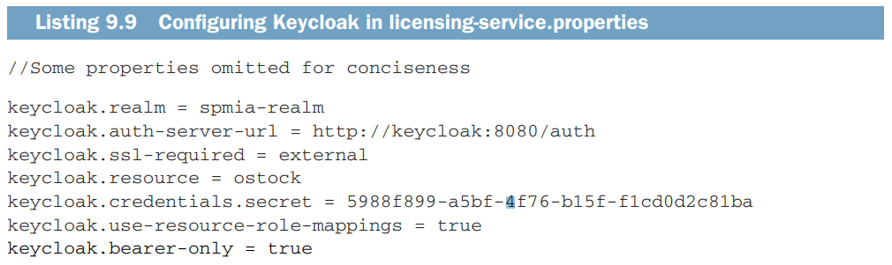
- Bây giờ chúng ta đã có các thay đổi the gateway để phổ biến tthe authorization header và the licensing service được
  thiết lập, chúng ta có thể chuyển sang bước cuối cùng của mình, đó là truyền the access token. Tất cả những gì chúng
  ta cần làm cho bước này là sửa đổi cách mã trong the licensing service calls the organization service. Đối với điều
  đó, chúng ta cần đảm bảo rằng the HTTP Authorization header được inject vào the application call đến the organization
  service.
- Nếu không có Spring Security, chúng ta sẽ phải viết a servlet filter để lấy the HTTP header của licensing service call
  đến và sau đó thêm nó theo cách thủ công vào mọi outbound service call đi trong the licensing service. Keycloak cung
  cấp a new REST template class mới hỗ trợ các cuộc gọi này. Lớp được gọi là KeycloakRestTemplate.
- Để sử dụng class, trước tiên chúng ta cần hiển thị nó như một bean có thể được tự động tải vào a service gọi another
  protected service.
  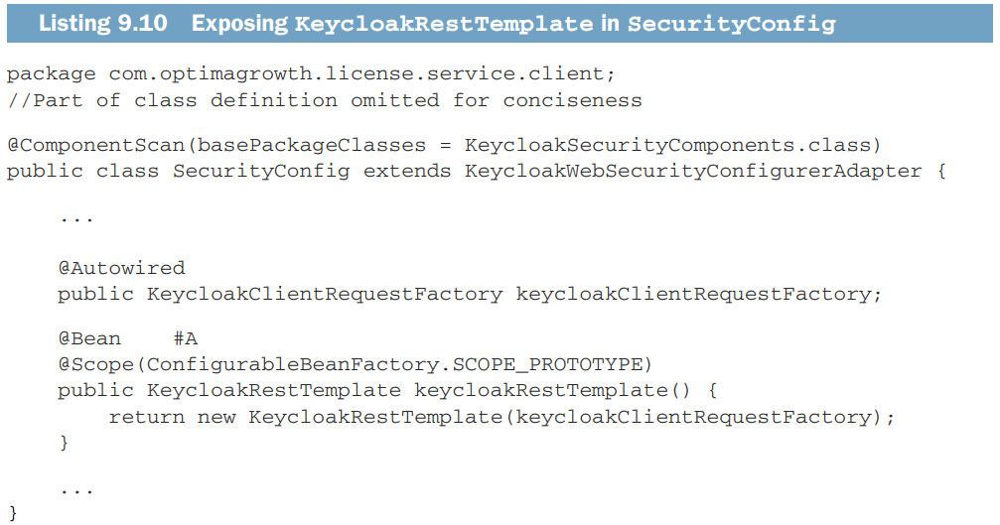
  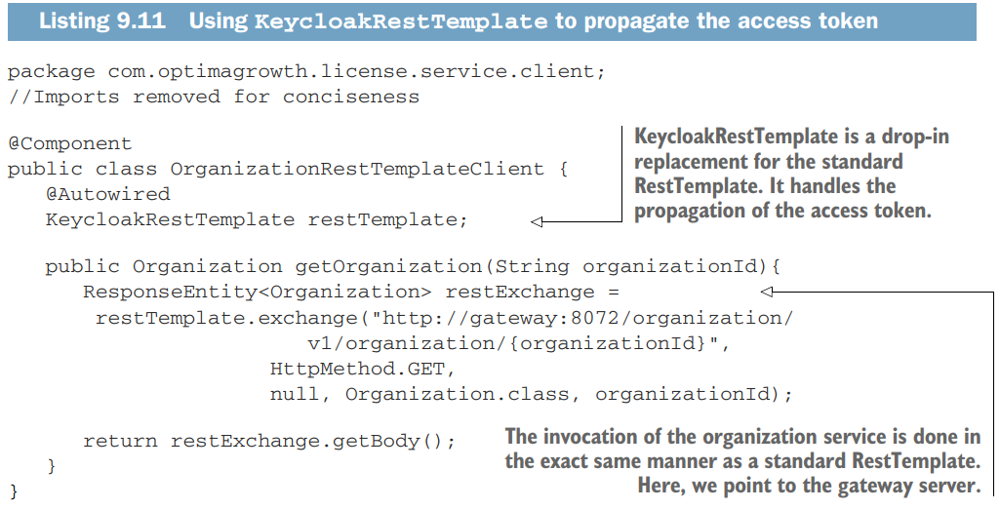
- Để kiểm tra mã này, bạn có thể request a service trong the licensing service gọi the organization service để truy xuất
  dữ liệu.
  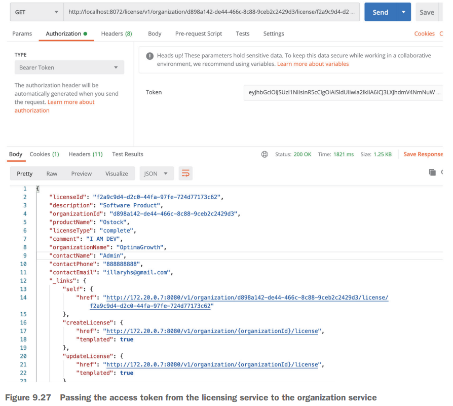

### 6.5.5 Parsing a custom field in a JWT.

- chúng ta sẽ chuyển sang gateway của chúng ta để biết ví dụ về cách phân tích cú pháp a custom field in a JWT. Cụ thể,
  chúng ta sẽ sửa đổi the TrackingFilter class mà chúng ta đã giới thiệu trong chương 6 để decode the preferred_username
  field từ the JWT flowing thông qua the gateway.
- Để thực hiện việc này, chúng ta sẽ lấy thư viện trình phân tích cú pháp JWT và thêm nó vào the Gateway server’s
  pom.xml file. Multiple token có sẵn, nhưng chúng ta đã chọn the Apache Commons Codec và the org.json package để phân
  tích cú pháp the JSON body.
  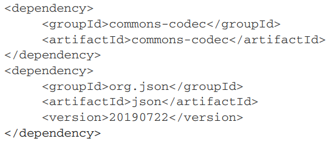
- Sau khi the libraries được thêm vào, sau đó chúng ta có thể thêm a new method called getUsername() vào the tracking
  filter.
  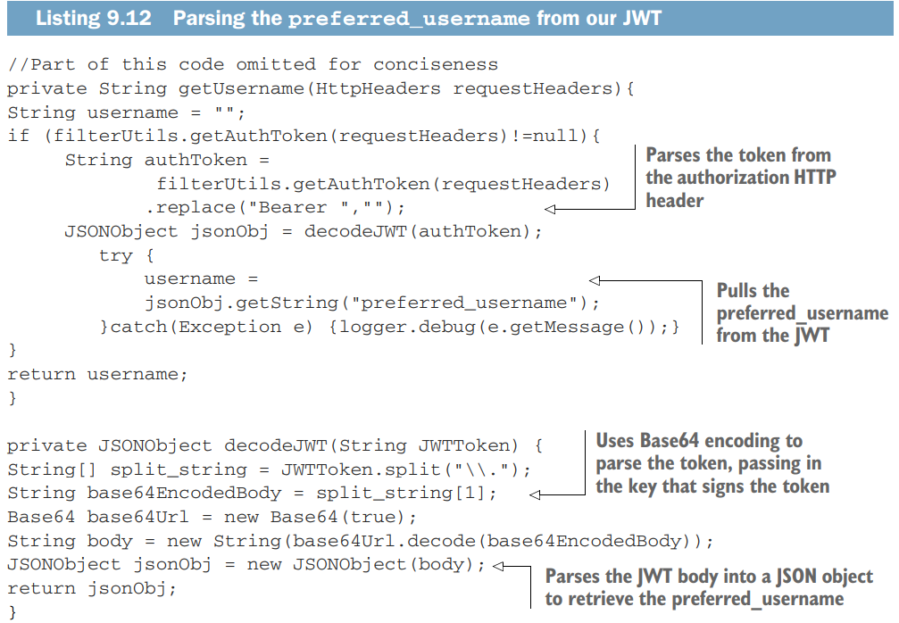
- Để làm cho ví dụ này hoạt động, chúng ta cần đảm bảo biến AUTH_TOKEN trong FilterUtils được đặt thành Authorization
  như trong the following code snippet.
    - `public static final String AUTH_TOKEN = "Authorization";`
- Khi chúng ta triển khai hàm getUsername(), chúng ta có thể thêm System.out.println vào a System.out.println trên the
  tracking filter để in print the preferred_username cú pháp từ JWT của chúng ta đang chảy qua the gateway.
- Bây giờ, khi chúng ta thực hiện cuộc gọi đến the gateway, chúng ta sẽ thấy the preferred_username trong the console
  output.
  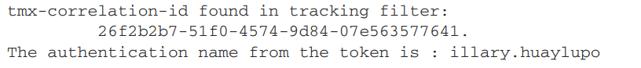

## 6.6 Some closing thoughts on microservice security.

- Mặc dù chương này đã được giới thiếu bạn đến OpenID, OAuth2, và the Keycloak specification như cách bạn có thể sử dụng
  Spring Cloud security với Keycloak để triển khai an authentication và authorization service. Keycloak chỉ là một phần
  của `the microservice security puzzle`.
    - Sử HTTPS/Secure Sockets Layer (SSL) cho tất cả service communications.
    - Sử dụng an API gateway cho tất cả service calls.
    - Cung cấp vùng cho services (for example, a public API và private API).
    - Hạn chế bề mặt tấn công của các microservices của bạn bằng cách khóa các cổng mạng không cần thiết.
      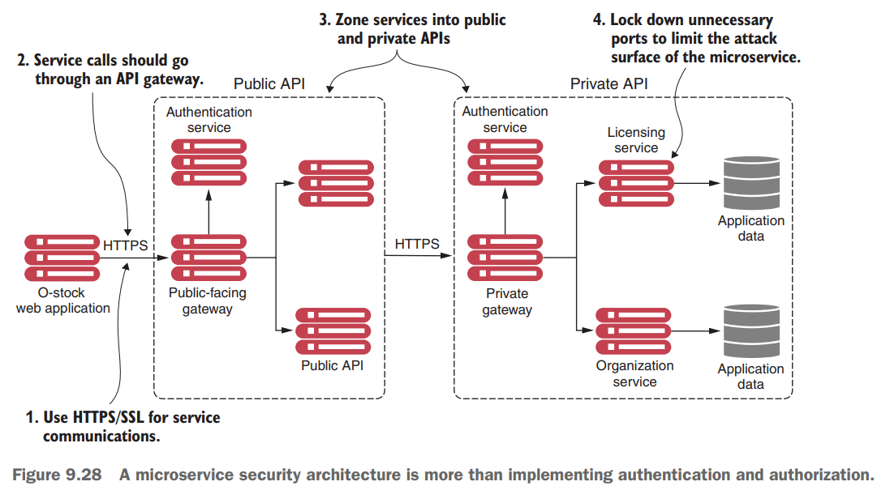

### 6.6.1 Use HTTPS secure sockets layer (SSL) for all service communication

- Trong tất cả các ví dụ về mã trong cuốn sách này, chúng ta đã sử dụng HTTP vì HTTP là một giao thức đơn giản và không
  yêu cầu thiết lập trên mọi service trước khi bạn bắt đầu sử dụng service.
- Tuy nhiên, In a production environment, các microservices của bạn chỉ nên giao tiếp thông qua các kênh được mã hóa
  được cung cấp thông qua HTTPS và SSL. Lưu ý rằng cấu hình và thiết lập HTTPS có thể được tự động hóa thông qua các tập
  lệnh DevOps của bạn.

### 6.6.2 Use a service gateway to access your microservices

- The individual servers, service endpoints, và ports đang chạy sẽ không bao giờ được the client truy cập trực tiếp.
  Thay vào đó, hãy sử dụng a service gateway để hoạt động như an entry point và `gatekeeper` cho các cuộc gọi service
  của bạn.
- Configure the network layer trên operating system hoặc container mà microservices của bạn đang chạy để chỉ chấp nhận
  lưu lượng truy cập từ the service gateway. Hãy nhớ rằng the service gateway có thể hoạt động như a Policy Enforcement
  Point (PEP), có thể được thực thi trong tất cả services.
- Việc thực hiện các service calls thông qua a service gateway cho phép bạn nhất quán về cách bạn đang bảo mật và kiểm
  tra các services của mình. A service gateway cũng cho phép bạn khóa port và endpoints mà bạn sẽ tiếp xúc với the
  outside world.

### 6.6.3 Zone your services into a public API and private API

- Bảo mật, nói chung, là tất cả về việc xây dựng các lớp truy cập và thực thi khái niệm về least privilege. Least
  privilege ngụ ý rằng người dùng chỉ nên có quyền truy cập mạng tối thiểu và các đặc quyền để thực hiện công việc hàng
  ngày của họ.
- The public zone chứa tất cả các the public APIs sẽ được khách hàng của bạn sử dụng (trong ví dụ của cuốn sách này là
  the O-stock application).Public API microservices phải thực hiện các tác vụ hẹp theo hướng quy trình làm việc.
- Những microservices này có xu hướng là `service aggregators`, kéo dữ liệu và thực hiện các tác vụ trên nhiều service.
  Public microservices cũng phải đứng sau service gateway của riêng chúng và có dịch vụ xác thực riêng để thực hiện xác
  thực và ủy quyền.
- Việc truy cập vào public services của các client applications phải đi qua a single route được bảo vệ bởi the service
  gateway. Ngoài ra, the public zone nên có service xác thực riêng.
- The private zone đóng vai trò như một bức tường để bảo vệ chức năng và dữ liệu ứng dụng cốt lõi của bạn. Nó chỉ được
  truy cập thông qua a single, well-known port và phải được khóa lại để chỉ chấp nhận lưu lượng mạng từ the network
  subnet nơi the private services đang chạy.
- The private zone phải có gateway and authentication service.Public API services phải xác thực dựa the private zone’s
  authentication service. Tất cả dữ liệu ứng dụng ít nhất phải nằm trong the private zone’s network subnet và chỉ
  nmicroservices cư trú trong the private zone mới có thể truy cập được.

### 6.6.4 Limit the attack surface of your microservices by locking down unneeded network ports

- Nhiều nhà phát triển không xem xét kỹ số lượng cổng port tối thiểu tuyệt đối mà họ cần mở để service của họ hoạt động.
  Configure the operating system your service đang chạy để chỉ cho phép truy cập vào và ra vào các port hoặc một phần cơ
  sở hạ tầng mà service của bạn cần  (monitoring, log aggregation).
- Đừng chỉ tập trung vào các access ports đầu vào. Nhiều nhà phát triển quên khóa các port đi của họ. Khóa các port gửi
  đi của bạn có thể ngăn không cho dữ liệu bị rò rỉ ra khỏi service của bạn nếu kẻ tấn công đã xâm phạm chính service
  đó. Ngoài ra, hãy đảm bảo rằng bạn xem xét quyền network port access trong cả public và private API zones của mình.
