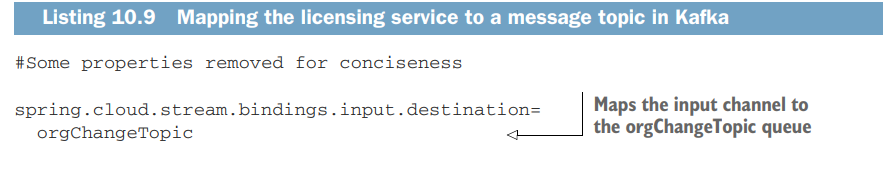

## 7.1 Introduction

- Con người luôn ở trong trạng thái chuyển động khi họ tương tác với môi trường của họ. Thông thường, các cuộc trò
  chuyện của họ synchronous, linear, or as narrowly defined như a request-response model.
- Đó là một cái gì đó giống như message-driven hơn, nơi chúng ta liên tục gửi và receiving messages từ những thứ xung
  quanh chúng ta. Khi nhận được tin nhắn, chúng ta sẽ phản ứng với những tin nhắn đó, thường làm gián đoạn nhiệm vụ
  chính mà chúng ta đang thực hiện.
- Chương này nói về cách thiết kế và triển khai các Spring-based microservices của chúng ta để giao tiếp với các
  microservices khác bằng cách sử dụng asynchronous messages. Việc sử dụng asynchronous messages để liên lạc giữa các
  ứng dụng không phải là điều mới mẻ. Điểm mới là khái niệm sử dụng tin nhắn để truyền đạt các sự kiện đại diện cho
  những thay đổi trong trạng thái.
- Khái niệm này được gọi là kiến trúc hướng sự kiện (EDA). Nó còn được gọi là message driven architecture (MDA). Điều mà
  an EDA-based approach cho phép chúng ta làm là xây dựng các hệ thống được tách biệt cao có thể phản ứng với các thay
  đổi mà không bị kết hợp chặt chẽ với các specific libraries or services.
- Khi được kết hợp với microservices, EDA cho phép chúng ta nhanh chóng thêm chức năng mới vào ứng dụng của mình bằng
  cách chỉ để the service listen to the stream of events (messages) được phát ra bởi ứng dụng của chúng ta.
- The Spring Cloud project khiến việc xây dựng các giải pháp message-based thông qua the Spring Cloud Stream subproject
  trở nên đơn giản hơn. Spring Cloud Stream cho phép chúng ta dễ dàng triển khai việc message publication and
  consumption trong khi bảo vệ các service của chúng ta khỏi các chi tiết triển khai được liên kết với nền tảng
  messaging cơ bản.

## 7.2  The case for messaging, EDA, and microservices

- Tại sao messaging lại quan trọng trong việc xây dựng các microservice-based applications? Để trả lời câu hỏi đó, hãy
  bắt đầu với một ví dụ. Đối với điều này, chúng ta sẽ sử dụng the two services mà chúng ta đã sử dụng trong suốt cuốn
  sách: licensing and organization services của chúng ta.
- Hãy tưởng tượng rằng sau these services này được triển khai vào sản xuất, chúng ta nhận thấy rằng các lệnh gọi the
  licensing service calls mất rất nhiều thời gian khi tra cứu thông tin từ the organization service.
- Khi xem xét the usage patterns of the organization data, chúng ta thấy rằng the organization data hiếm khi thay đổi và
  hầu hết các lần đọc dữ liệu từ the organization service được thực hiện bởi khóa chính của the organization record.
- Nếu chúng ta có thể lưu vào bộ nhớ cache các lần đọc cho the organization data mà không phải the cost of accessing a
  database, chúng ta có thể cải thiện đáng kể thời gian phản hồi của the licensing service calls. Để triển khai a
  caching solution, chúng ta cần xem xét ba yêu cầu cốt lõi sau:
    - Cached data cần phải nhất quán trong all instances of the licensing service. Điều này có nghĩa là chúng ta không
      thể cache the data locally trong the licensing service vì chúng ta muốn đảm bảo rằng the same organization data
      được đọc bất kể the service instance đánh vào nó.
    - chúng ta không thể cache the organization data trong the memory of the container hosting the licensing service.
      The run-time container hosting our service thường bị hạn chế về kích thước và có thể lấy dữ liệu bằng different
      access patterns. A local cache có thể gây phức tạp vì chúng ta phải đảm bảo local cache của chúng ta sync với tất
      cả các services khác trong cluster.
    - Khi an organization record thay đổi thông qua cập nhật hoặc xóa, chúng ta muốn the licensing service nhận ra rằng
      đã có sự thay đổi trạng thái trong the organization service. Sau đó, The licensing service sẽ vô hiệu hóa any
      cached data nào mà nó có cho specific organization và loại bỏ nó khỏi the cache.
- Hãy xem xét hai cách tiếp cận để thực hiện các yêu cầu này. Cách tiếp cận đầu tiên sẽ thực hiện các yêu cầu đã nêu
  trước đó bằng cách sử dụng a synchronous requestresponse model. Khi the organization state changes, the licensing and
  organization services sẽ giao tiếp qua lại thông qua các REST endpoints của họ.
- Đối với cách tiếp cận thứ hai, the organization service sẽ emit an asynchronous event
  (message)  để thông báo rằng organization data của nó đã thay đổi. The organization service sau đó publish a message
  đến một hàng đợi, thông báo này sẽ cho biết rằng an organization record đã được cập nhật hoặc bị xóa — một sự thay đổi
  về trạng thái. The licensing service sẽ lắng nghe người trung gian (message broker or queue) để xác định xem an
  organization event occurred hay không và nếu có, hãy xóa the organization data from its cache.

## 7.2.1  Using a synchronous request-response approach to communicate state change

- Đối với organization data cache của chúng ta, chúng ta sẽ sử dụng Redis (https://redis.io/), một kho lưu trữ key-value
  trị phân tán được sử dụng làm database, cache, or message broker.
  
- Trong hình 10.1, khi a user calls the licensing service, the licensing service sẽ cần tra cứu the organization data.
  Để làm như vậy, the licensing service trước tiên sẽ truy xuất organization mong muốn theo ID của nó từ a Redis
  cluster.
- Nếu the licensing service không thể tìm thấy the organization data, sau đó nó sẽ gọi the organization service bằng a
  REST-based endpoint, lưu trữ data được trả lại trong Redis trước khi trả lại the organization data cho người dùng.
- Nếu ai đó cập nhật hoặc xóa the organization record bằng cách sử dụng the organization service’s REST endpoint, the
  organization service sẽ cần gọi an endpoint được hiển thị trên the licensing service và yêu cầu nó làm mất hiệu lực
  the organization data trong cache.
- The licensing service yêu cầu nó làm mất hiệu lực the Redis cache, chúng ta có thể thấy ít nhất ba vấn đề:
    - The organization and licensing services được kết hợp chặt chẽ với nhau. Sự kết hợp này tạo ra độ giòn giữa
      services.
    - Nếu the licensing service endpoint để làm mất hiệu lực the cache changes, the organization service phải thay đổi.
      Cách tiếp cận này không linh hoạt.
    - chúng ta không thể thêm new consumers of the organization data mà không sửa đổi mã trên the organization service
      để xác minh rằng nó gọi the licensing service để cho organization biết về bất kỳ thay đổi nào.
- TIGHT COUPLING BETWEEN SERVICES
    - Để truy xuất dữ liệu, the licensing service phụ thuộc vào the organization service. Tuy nhiên, bằng cách để the
      organization service liên lạc lại trực tiếp với the licensing service khi an organization record được cập nhật
      hoặc bị xóa, chúng ta đã giới thiệu việc ghép nối từ the organization service back to the licensing service.
    - the data in the Redis cache bị vô hiệu, the organization service cần an exposed endpoint trên the licensing
      service có thể được gọi để làm mất hiệu lực Redis cache của nó hoặc the organization service cần nói chuyện trực
      tiếp với the Redis server thuộc sở hữu của the licensing service để xóa dữ liệu trong đó.
    - Việc để the organization service nói chuyện với Redis có vấn đề riêng vì chúng ta đang trao đổi với một cửa hàng
      dữ liệu thuộc sở hữu trực tiếp của một service khác. In a microservice environment, đây là một điều tuyệt vời. Mặc
      dù người ta có thể lập luận rằng the organization data thuộc về the organization service, nhưng the licensing
      service sử dụng nó trong một bối cảnh cụ thể và có thể có khả năng biến đổi dữ liệu hoặc xây dựng các business
      rules xung quanh nó.
    - Nếu the organization service nói chuyện trực tiếp với the Redis service, nó có thể vô tình phá vỡ các quy tắc do
      nhóm sở hữu the licensing service thực hiện.
- BRITTLENESS BETWEEN THE SERVICES:
    - Sự kết hợp chặt chẽ giữa the licensing service and the organization service cũng tạo ra sự khó khăn giữa the two
      services. Nếu the licensing service không hoạt động hoặc chạy chậm, the organization service có thể bị ảnh hưởng
      vì the organization service hiện đang giao tiếp trực tiếp với the licensing service.
    - Một lần nữa, nếu the organization service trao đổi trực tiếp với the licensing service’s Redis data store, chúng
      tôi tạo ra sự phụ thuộc giữa the organization service and Redis. Trong trường hợp này, bất kỳ sự cố nào với the
      shared Redis server hiện đều có khả năng làm hỏng both services.
- INFLEXIBILITY IN ADDING NEW CONSUMERS TO CHANGES IN THE ORGANIZATION SERVICE
    - Với mô hình trong hình 10.1, nếu chúng ta có một service khác quan tâm đến việc the organization data changes,
      chúng ta cần thêm một lệnh gọi khác từ the organization service to the other service. Điều này có nghĩa là thay
      đổi mã và triển khai lại the organization service, có thể dẫn đến trạng thái không linh hoạt trong mã của chúng
      tôi.
    - Nếu chúng ta sử dụng the synchronous, request-response model để giao tiếp thay đổi trạng thái, chúng ta bắt đầu
      thấy a web-like pattern of dependency between our core services trong application của chúng ta và các services
      khác. Các trung tâm của các trang web này trở thành điểm lỗi chính của chúng ta trong ứng dụng của chúng ta.

### 7.2.2  Using messaging to communicate state changes between services.

- chúng ta sẽ inject một chủ đề giữa the licensing and organization service bằng cách a messaging approach. The
  messaging system sẽ không được sử dụng để read data from the organization service mà thay vào đó sẽ được the
  organization service sử dụng để publish bất kỳ thay đổi trạng thái nào trong dữ liệu do the organization service quản
  lý khi những thay đổi này xảy ra.

- Trong mô hình ở hình 10.2, khi organization data changes, , the organization service sẽ publishes a message to a
  topic.
- The licensing service giám sát the topic for messages, và khi một messages đến, nó sẽ xóa the appropriate organization
  record khỏi the Redis cache.
- Khi nói đến trạng thái giao tiếp, the message queue đóng vai trò trung gian giữa các the licensing and organization
  services. Cách tiếp cận này mang lại bốn lợi ích: loose coupling, durability, scalability, and flexibility. Chúng ta
  sẽ xem xét từng thứ trong các phần sau.
- LOOSE COUPLING:
    - Một ứng dụng microservices có thể bao gồm hàng chục service nhỏ và phân tán tương tác với nhau và dữ liệu do nhau
      quản lý. Như chúng ta đã thấy với thiết kế đồng bộ được đề xuất trước đó, a synchronous HTTP response tạo ra sự
      phụ thuộc cứng giữa các the licensing and organization services.
    - chúng ta không thể loại bỏ hoàn toàn những phụ thuộc này nhưng chúng ta có thể cố gắng giảm thiểu những phụ thuộc
      bằng cách chỉ để lộ những endpoints trực tiếp quản lý dữ liệu do service.
    - A messaging approach cho phép chúng ta tách biệt hai service bởi vì, khi nói đến các thay đổi trạng thái giao
      tiếp, cả hai service đều không biết về nhau. Khi the organization service cần xuất bản một thay đổi trạng thái, nó
      sẽ ghi một message vào hàng đợi. The licensing service chỉ biết rằng nó nhận được a message; nó không biết ai đã
      published the message.
- DURABILITY:
    - Sự hiện diện của hàng đợi cho phép chúng ta đảm bảo rằng a message sẽ được gửi ngay cả khi the consumer of the
      service is down. Ví dụ: the organization service có thể publishing messages thông báo ngay cả khi the licensing
      service không khả dụng. The messages được lưu trữ trong hàng đợi và ở đó cho đến khi the licensing service khả
      dụng.
    - Ngược lại, với the combination of a cache và the queue approach, nếu the organization service gặp sự cố, the
      licensing service có thể degrade gracefully vì ít nhất một phần dữ liệu của the organization data sẽ nằm trong bộ
      nhớ cache của nó. Đôi khi dữ liệu cũ còn tốt hơn là không có dữ liệu.
- SCALABILITY:
    - Vì messages được lưu trữ trong một hàng đợi, the sender không phải đợi phản hồi từ the message consumer. The
      sender có thể tiếp tục và tiếp tục làm việc. Tương tự như vậy, nếu a consumer đọc tin nhắn từ hàng đợi không xử lý
      tin nhắn đủ nhanh, thì việc thu hút nhiều consumer hơn và yêu cầu họ xử lý messages là một nhiệm vụ nhỏ. Cách tiếp
      cận khả năng mở rộng này rất phù hợp với mô hình microservices.
    - Một trong những điều chúng ta đã nhấn mạnh trong suốt cuốn sách này là việc tạo ra các new instances of a
      microservice sẽ trở nên đơn giản. Sau đó, microservice bổ sung có thể trở thành một service khác để xử lý the
      message queue. Đây là một ví dụ về chia tỷ lệ theo chiều ngang
    - Các cơ chế chia tỷ lệ truyền thống để đọc messages trong hàng đợi liên quan đến việc tăng số lượng luồng mà a
      message consumer có thể xử lý cùng một lúc. Thật không may, với cách tiếp cận này, cuối cùng chúng ta đã bị giới
      hạn bởi số lượng CPU có sẵn cho the message consumer.
    - Mô hình microservice không có giới hạn này vì chúng ta có thể mở rộng quy mô bằng cách tăng số lượng máy lưu trữ
      the service consuming the messages.
- FLEXIBILITY:
    - The sender không biết ai sẽ sử dụng nó. Điều này có nghĩa là chúng ta có thể dễ dàng thêm add new message
      consumers (và chức năng mới) mà không ảnh hưởng đến the original sending service. Đây là một khái niệm cực kỳ mạnh
      mẽ vì chức năng mới có thể được thêm vào ứng dụng mà không cần phải chạm vào các service hiện có. Thay vào đó, mã
      mới có thể lắng nghe các listen for events being published và phản ứng với chúng một cách phù hợp.

### 7.2.3 Downsides of a messaging architecture.

- Giống như bất kỳ mô hình kiến trúc nào, a message-based architecture có sự đánh đổi. A messagebased architecture có
  thể phức tạp và đòi hỏi nhóm phát triển phải chú ý đến một số điều chính, bao gồm message-handling semantics, message
  visibility, and message choreography. Hãy xem xét những điều này chi tiết hơn.
- MESSAGE-HANDLING SEMANTICS:
    - Việc sử dụng messages in a microservice-based application hỏi nhiều hơn là hiểu cách publish and consume messages.
      Nó đòi hỏi chúng ta phải hiểu ứng dụng của mình sẽ hoạt động như thế nào dựa trên thứ tự mà các tin nhắn được sử
      dụng và điều gì sẽ xảy ra nếu một messages được xử lý không theo thứ tự.
    - Ví dụ: nếu chúng ta có các yêu cầu nghiêm ngặt rằng tất cả các đơn đặt hàng từ một khách hàng phải được xử lý theo
      thứ tự mà họ nhận được, chúng ta sẽ cần thiết lập và cấu trúc việc xử lý thông báo của mình khác với nếu every
      message có thể được sử dụng độc lập với nhau
    - Điều đó cũng có nghĩa là nếu chúng ta đang sử dụng messaging để thực thi chuyển đổi trạng thái nghiêm ngặt đối với
      dữ liệu của mình, chúng ta cần suy nghĩ về việc thiết kế các ứng dụng của mình để xem xét các trường hợp trong đó
      thông báo đưa ra ngoại lệ hoặc lỗi được xử lý không theo thứ tự. Nếu một messaging không thành công, chúng ta có
      thử xử lý lại lỗi hay chúng ta để nó không thành công? Làm cách nào để chúng ta xử lý các messaging trong tương
      lai liên quan đến khách hàng đó nếu một trong các messaging của khách hàng đó không thành công? Đây là những câu
      hỏi quan trọng cần suy nghĩ.
- MESSAGE VISIBILITY:
    - Việc sử dụng messages trong các microservices của chúng ta thường có nghĩa là sự kết hợp của các synchronous
      service calls và xử lý asynchronous service . Bản chất không đồng bộ của messages có nghĩa là chúng có thể không
      được nhận hoặc xử lý gần với thời điểm thông báo được published or consumed.
    - Ngoài ra, việc có những thứ như correlation IDs để tracking a user’s transactions trên các thông báo và lệnh gọi
      web service là rất quan trọng để hiểu và gỡ lỗi những gì đang diễn ra trong ứng dụng của chúng ta. Như bạn có thể
      nhớ từ chương 8, correlation IDs là một số duy nhất được tạo khi bắt đầu a user’s transaction và được chuyển cùng
      với mọi lệnh gọi service. Nó cũng phải được chuyển cùng với mọi published and consumed.
- MESSAGE CHOREOGRAPHY:
    - Như được đề cập trong phần về message visibility, a message-based application khiến việc lập luận thông qua
      business logic trở nên khó khăn hơn vì mã của nó không còn được xử lý theo kiểu tuyến tính với a simple block
      request-response model. Thay vào đó, debugging message-based applications có thể liên quan đến việc duyệt qua the
      logs của một số service khác nhau, nơi user transactions có thể được thực hiện không theo thứ tự và vào những thời
      điểm khác nhau.
- NOTE: Messaging có thể phức tạp nhưng mạnh mẽ. Trong các phần trước, chúng ta không có ý làm bạn sợ sử dụng tính năng
  messaging trong các ứng dụng của bạn. Thay vào đó, mục tiêu của chúng ta là nhấn mạnh rằng việc sử dụng messaging
  trong các service của bạn đòi hỏi phải được suy tính trước. Mặt tích cực của messaging là bản thân các doanh nghiệp
  hoạt động asynchronously, vì vậy, cuối cùng, chúng ta đang mô hình hóa hoạt động business của mình chặt chẽ hơn.

### 7.3  Introducing Spring Cloud Stream

- Spring Cloud giúp bạn dễ dàng tích hợp messaging vào các Spring-based microservices của chúng ta. Nó thực hiện điều
  này thông qua the Spring Cloud Stream project  (https://spring.io/projects/spring-cloud-stream).
- Spring Cloud Stream cũng cho phép chúng ta tóm tắt chi tiết triển khai của nền tảng nhắn tin mà chúng ta đang sử dụng.
  chúng ta có thể sử dụng nhiều nền tảng tin nhắn với Spring Cloud Stream, bao gồm cả dự án Apache Kafka và RabbitMQ,
  đồng thời, thông tin chi tiết về triển khai cụ thể của nền tảng được giữ ngoài mã ứng dụng. Việc thực hiện message
  publication and consumption trong ứng dụng của bạn được thực hiện thông qua các platform-neutral Spring interfaces.
- Để hiểu Spring Cloud Stream, chúng ta hãy bắt đầu thảo luận về kiến trúc của nó và tự làm quen với một số thuật ngữ.
  
- Với Spring Cloud, bốn thành phần có liên quan đến việc publishing and consuming a message:
    - Source
    - Channel
    - Binder
    - Sink
- Khi một service sẵn sàng publish a message, nó sẽ publish the message đó bằng cách sử dụng a source. A source là một
  Spring-annotated interface bằng Spring lấy a Plain Old Java Object (POJO), đại diện cho the message to be published.
  The source takes the message, tuần tự hóa nó (the default serialization là JSON) và publishes the message lên một
  channel.
- A channel là một phần tóm tắt trong hàng đợi lưu giữ the message sau khi được published bởi a message producer or
  consumed by a message consumer. Nói cách khác, chúng ta có thể mô tả a channel như một hàng đợi gửi và nhận tin nhắn.
  A channel name được kết hợp với tên hàng đợi đích, nhưng tên hàng đợi đó không bao giờ được hiển thị trực tiếp với mã.
  Thay vào đó, the channel name được sử dụng trong mã, có nghĩa là chúng ta có thể chuyển đổi các hàng đợi mà kênh đọc
  hoặc ghi từ đó bằng cách thay đổi the application’s configuration chứ không phải mã của ứng dụng.
- The binder là một phần của the Spring Cloud Stream framework. Đó là the Spring code nói chuyện với a specific message
  platform. The binder part of the Spring Cloud Stream framework cho phép chúng ta làm việc với các messages mà không
  cần phải tiếp xúc với platformspecific libraries and APIs để publishing and consuming messages.
- Trong Spring Cloud Stream, khi a service nhận được tin nhắn từ một hàng đợi, nó sẽ thực hiện nó thông qua a sink. a
  sink lắng nghe a channel cho các tin nhắn đến và deserializes the message trở lại a POJO object. Từ đó, the message có
  thể được xử lý theo business logic of the Spring service.

## 7.4 Writing a simple message producer and consumer

- chúng ta sẽ chuyển một message từ our organization service to our licensing service, service này sẽ in a log message
  tới the console. Ngoài ra, vì chúng ta sẽ chỉ có one Spring Cloud Stream source (the message producer) and a sink (
  message consumer) trong ví dụ này, chúng ta sẽ bắt đầu ví dụ bằng một vài phím tắt Spring Cloud đơn giản.
- Điều này sẽ làm cho việc setting up the source trong the organization service và a sink in the licensing service
  trivial.

### 7.4.1 Configuring Apache Kafka and Redis in Docker

- Trong phần này, chúng ta sẽ giải thích cách add the Kafka and Redis services vào môi trường Docker cho trình our
  message producer. Để đạt được điều này, hãy bắt đầu bằng cách thêm mã được hiển thị trong danh sách sau vào tệp
  docker-compose.yml của chúng ta.
- 
- 

### 7.4.2 Writing the message producer in the organization service

- Để tập trung vào cách sử dụng các chủ đề trong kiến trúc của chúng ta, chúng ta sẽ bắt đầu bằng cách sửa đổi the
  organization service để mỗi khi organization data được thêm, cập nhật hoặc xóa, the organization service sẽ publish a
  message to a Kafka topic, cho biết rằng an organization thay đổi đã xảy ra.
- The published message sẽ bao gồm the organization ID được liên kết với the change event và hành động đã xảy ra (thêm,
  cập nhật hoặc xóa).
- Điều đầu tiên chúng ta cần làm là set up our Maven dependencies trong tệp Maven pom.xml củathe organization service.
  
- Hãy nhớ thực thi the services bằng cách thực hiện các lệnh sau trong thư mục gốc nơi chứa pom.xml mẹ:
    - `mvn clean package dockerfile:build && docker-compose -f docker/docker-compose.yml up`
- Khi chúng ta đã xác định the Maven dependencies, chúng ta cần thông báo cho ứng dụng của mình rằng nó sẽ liên kết với
  a Spring Cloud Stream message broker. chúng ta có thể làm điều này bằng cách annotating the organization service’s
  bootstrap class, OrganizationServiceApplication, với @EnableBinding.
  
- Trong danh sách 10.2, the @EnableBinding annotation cho Spring Cloud Stream biết rằng chúng ta muốn liên kết service
  với the service to a message broker. Việc sử dụng Source.class trong @EnableBinding cho Spring Cloud Stream biết rằng
  service này sẽ giao tiếp với the message broker thông qua một tập hợp channels được xác định trong the Source class.
  Hãy nhớ rằng, channels nằm phía trên a message queue. Spring Cloud Stream có a default set of channels có thể được
  định cấu hình để nói chuyện với a message broker.
  
- The next step is to create the logic to publish the message.
  
- Trong danh sách 10.4, chúng ta injected the Spring Cloud Source class của mình. Hãy nhớ rằng, all communication to a
  specific message topic xảy ra thông qua a Spring Cloud Stream construct được gọi là một channel, được đại diện bởi một
  a Java interface class. Trong danh sách, chúng ta đã the Source interface, giao diện này hiển thị a single method
  called output().
- The Source interface thuận tiện để sử dụng khi service của chúng ta chỉ cần publish to a single channel. The output()
  method trả về a class of type MessageChannel. Với loại này, chúng ta sẽ gửi tin nhắn đến the message broker.
- ActionEnum được truyền bởi the parameters in the output() method chứa các hành động sau:
  
- The actual publication of the message xảy ra trong phương thức publishOrganizationChange (). Phương pháp này xây dựng
  một POJO Java được gọi là OrganizationChangeModel. Danh sách sau đây hiển thị mã cho POJO này.
  
- The OrganizationChangeModel class declares three data elements:
    - action — Đây là hành động đã kích hoạt event. chúng ta đã đưa the action element vào the message để cung cấp cho
      the message consumer thêm ngữ cảnh về cách xử lý một event.
    - OrganizationId—This is the organization ID associated with the event.
    - correlationId — Đây là the correlation ID of the service đã kích hoạt event. chúng ta nên luôn bao gồm a
      correlation ID trong các events của mình vì nó giúp ích rất nhiều cho việc tracking and debugging the flow of
      messages thông qua các service của chúng ta.
- Nếu chúng ta quay lại the SimpleSourceBean class, chúng ta có thể thấy rằng khi chúng ta sẵn sàng publish the message,
  chúng ta có thể sử dụng the send() method trên MessageChannel class được trả về từ the source.output() method như sau:
- `source.output().send(MessageBuilder.withPayload(change).build());`
- The send() method nhận a Spring Message class. chúng ta sử dụng a Spring helper class, được gọi là MessageBuilder, để
  the contents of the OrganizationChangeModel class và chuyển nó thành lớp Spring Message.
- Đây là tất cả mã chúng ta cần để gửi message. Tuy nhiên, tại thời điểm này, mọi thứ sẽ giống như một phép thuật vì
  chúng ta chưa biết cách liên kết organization service to a specific message queue, chứ chưa nói đến the actual message
  broker. Tất cả điều này được thực hiện thông qua cấu hình.
- Listing 10.6 hiển thị the configuration ánh xạ service’s Spring Cloud Stream Source của chúng ta tới a Kafka message
  broker và a message topic. This configuration information có thể được localized trong our Spring Cloud Config entry
  for the organization service.
  
    - The spring.cloud.stream.bindings is the start of the configuration needed for our service to publish to a Spring
      Cloud Stream message broker.
    - The configuration property spring.cloud.stream.bindings.output trong listing maps the source.output()
      channel trong listing 10.4 tới orgChangeTopic trên the message broker mà chúng ta sắp giao tiếp.
    - Nó cũng cho Spring Cloud Stream biết rằng các messages được gửi đến this topic nên được serialized dưới dạng JSON.
      Spring Cloud Stream có thể serialized các message ở nhiều định dạng bao gồm JSON, XML và định dạng Avro của Apache
      Foundation.
- Bây giờ chúng ta đã có mã sẽ publish a message qua Spring Cloud Stream và the configuration để yêu cầu Spring Cloud
  Stream sử dụng Kafka as a message broker, hãy xem nơi the publication of the message trong our organization service.
  

### 7.4.3 Writing the message consumer in the licensing service

- Tại thời điểm này, chúng ta đã sửa đổi the organization service to publish a message to Kafka mỗi khi the organization
  service changes data. Any interested service cũng có thể phản ứng mà không cần phải được the organization service
  gọi một cách rõ ràng. Điều đó cũng có nghĩa là chúng ta có thể dễ dàng thêm chức năng mới có thể phản ứng với những
  thay đổi trong the organization service bằng cách lắng nghe các thông báo đến trong the message queue.
  
  
- Tiếp theo, chúng ta sẽ the licensing service rằng nó cần sử dụng Spring Cloud Stream để liên kết với a message broker.
  Giống như the organization service, chúng ta sẽ chú thích the licensing service’s bootstrap class,
  LicenseServiceApplication, với the @EnableBinding annotation.
  
- Vì the licensing service là the message consumer, chúng ta sẽ chuyển @EnableBinding the value Sink.class. Điều này
  yêu cầu Spring Cloud Stream liên kết với một a message broker bằng Spring Sink interface. Tương tự như the Source
  interface (được mô tả trong phần 10.3.1), Spring Cloud Stream hiển thị a default channel on the Sink interface. This
  Sink interface channel này được gọi là input và được sử dụng để lắng nghe các tin nhắn đến.
- Khi chúng ta đã xác định rằng chúng ta muốn nghe tin nhắn qua the @EnableBinding annotation, chúng ta có thể viết mã
  để xử lý tin nhắn đến từ the Sink input channel. Để thực hiện việc này, chúng ta sẽ sử dụng Spring Cloud Stream
  @StreamListener annotation.This annotation yêu cầu Spring Cloud Stream thực thi the loggerSink() method khi nhận được
  thông báo the input channel. Spring Cloud Stream tự động giải mã tin nhắn đến tới một Java POJO được gọi là
  OrganizationChangeModel.
  
  
    - an input channel defined with the spring.cloud.stream.bindings property.This value maps to the Sink.INPUT channel
      defined.This property maps the input channel to the orgChangeTopic.
    - spring.cloud.stream.bindings.input.group: thuộc tính nhóm xác định tên của nhóm người tiêu dùng sẽ sử dụng thông
      báo.
- The concept of a consumer group là thế này: chúng ta có thể có nhiều service với mỗi service multiple instances
  listening to the same message queue. chúng ta muốn each unique service xử lý a copy of a message, nhưng chúng ta chỉ
  muốn one service instance trong a group of service instances để sử dụng và xử lý một thông báo. The group propertym
  xác định the consumer group mà the service thuộc về.
  

### 7.4.4 Seeing the message service in action

- Tại thời điểm này, the organization service publishes a message to the orgChangeTopic mỗi khi a record được thêm, cập
  nhật hoặc xóa và the licensing service nhận được thông báo có the same topic. Tiếp theo, chúng ta sẽ thấy mã này hoạt
  động bằng cách tạo an organization service record và xem the console để xem the corresponding log message tương ứng từ
  the licensing service.
- Để tạo the organization service record, chúng ta sẽ phát hành a POST on the organization service. chúng ta sẽ sử
  dụng http://localhost:8072/organization/v1/organization/
  endpoint và gửi body on the POST call to the endpoint.
  
  
- Khi chúng ta thực hiện the organization service call, chúng ta sẽ thấy kết quả được hiển thị trong hình 10.8 trong the
  console window running the services.
- Cloud Stream đóng vai trò là người trung gian cho các service này. Từ góc độ messaging, các service không biết gì về
  nhau. Họ đang sử dụng a messaging broker để giao tiếp với tư cách là người trung gian và Spring Cloud Stream như một
  lớp trừu tượng trên the messaging broker.

## 7.5 A Spring Cloud Stream use case: Distributed caching

- Hiện chúng ta có hai service giao tiếp bằng messaging, nhưng chúng ta không thực sự làm bất cứ điều gì với messaging.
  Tiếp theo, chúng ta sẽ xây dựng ví dụ về the distributed caching mà chúng ta đã thảo luận trước đó trong chương. Vì
  vậy, the licensing service sẽ luôn kiểm tra a distributed Redis cache cho the organization data được liên kết với a
  particular license.
- Nếu the organization data tồn tại trong the cache, chúng ta sẽ trả lại the data from the cache. Nếu không, chúng ta sẽ
  gọi the organization service and cache the results of the call in a Redis hash.
- Khi dữ liệu được cập nhật trong the organization service, the organization service sẽ gửi một thông báo đến Kafka. The
  licensing service sẽ nhận thông báo và đưa ra DELETE đối với Redis để xóa bộ nhớ cache.

### 7.5.1 Using Redis to cache lookups

- Chúng ta sẽ bắt đầu bằng cách thiết lập licensing service để sử dụng Redis. May mắn thay, Spring Data giúp việc giới
  thiệu Redis vào licensing service của chúng ta trở nên đơn giản.
    - Configure the licensing service to include the Spring Data Redis dependencies
    - Construct a database connection to Redis.
    - Define the Spring Data Redis repositories that our code will use to interact with a Redis hash.
    - Use Redis and the licensing service to store and read organization data.
- CONFIGURING THE LICENSING SERVICE WITH SPRING DATA REDIS DEPENDENCIES
    - Điều đầu tiên chúng ta cần làm là bao gồm the spring-data-redis dependencies, cùng với jedis vào the licensing
      service’s pom.xml file.
      
      -CONSTRUCTING THE DATABASE CONNECTION TO A REDIS SERVER
    - Khi chúng ta có kết nối với Redis, chúng ta sẽ sử dụng kết nối đó để tạo a Spring RedisTemplate object. The Spring
      Data repository classes mà chúng ta sẽ triển khai trong thời gian ngắn sẽ sử dụng e the RedisTemplate object để
      thực thi các truy vấn và lưu dữ liệu organization service data to our Redis service. Danh sách sau đây cho thấy mã
      này.
      
- Công việc cơ bản để thiết lập the licensing service giao tiếp với Redis đã hoàn tất. Bây giờ chúng ta hãy chuyển sang
  viết logic sẽ lấy, thêm, cập nhật và xóa dữ liệu.
- ServiceConfig là một lớp đơn giản chứa logic để truy xuất các thông số tùy chỉnh mà chúng ta sẽ xác định trong the
  configuration file for the licensing service(trong trường hợp này: the Redis host and port)
  
- The Spring Cloud Config service repository defines the following host and port for the Redis server in the
  /configserver/src/main/resources/config/licensing-service .properties file:
    - redis.server = localhost
    - redis.port = 6379
- DEFINING THE SPRING DATA REDIS REPOSITORIES
    - Redis là a key-value data store hoạt động giống như một HashMap lớn, phân tán, trong bộ nhớ. Trong trường hợp đơn
      giản nhất, nó lưu trữ và tra cứu dữ liệu bằng a key. Nó không có bất kỳ ngôn ngữ truy vấn phức tạp nào để truy
      xuất dữ liệu. Sự đơn giản của nó chính là điểm mạnh của nó, và một trong những lý do tại sao rất nhiều nhà phát
      triển đã áp dụng nó để sử dụng trong các dự án của họ.
    - Bởi vì chúng ta đang sử dụng Spring Data to access our Redis store, chúng ta cần xác định một repository class.
      Như bạn có thể nhớ ngay từ những chương đầu tiên, Spring Data sử dụng user-defined repository classes để cung cấp
      một cơ chế đơn giản cho một lớp Java truy cập cơ sở dữ liệu Postgres của chúng ta mà không cần phải viết các truy
      vấn SQL cấp thấp. Đối với the licensing service, chúng ta sẽ xác định hai tệp cho our Redis repository.
      
      
    - Một điều quan trọng cần lưu ý từ mã trong danh sách 10.14 là a Redis server có thể chứa nhiều hàm băm và cấu trúc
      dữ liệu bên trong nó. Do đó, chúng ta cần cho Redis biết tên của cấu trúc dữ liệu mà chúng ta muốn thực hiện thao
      tác trong mỗi lần tương tác với Redis.
- USING REDIS AND THE LICENSING SERVICE TO STORE AND READ ORGANIZATION DATA
    - Bây giờ chúng ta đã có mã để thực hiện các hoạt động với Redis, chúng ta có thể sửa đổi licensing service của mình
      để mỗi khi the licensing service cần the organization data, nó sẽ kiểm tra bộ nhớ cache của Redis trước khi gọi
      the organization service.
      
      
    - Phương thức getOrganization () là nơi diễn ra cuộc gọi đến the organization service. Trước khi thực hiện cuộc gọi
      REST thực, chúng ta cần truy xuất Organization object được liên kết với lệnh gọi từ Redis bằng phương thức
      checkRedisCache().
    - Nếu the organization object được đề cập không có trong Redis, mã trả về giá trị null. Nếu giá trị null được trả về
      từ phương thức checkRedisCache (), mã sẽ gọi the organization service’s REST endpoint để truy xuất bản ghi tổ chức
      mong muốn. Nếu the organization service trả về an organization, thì organization object trả về sẽ được lưu vào bộ
      nhớ đệm bằng phương thức cacheOrganizationObject().
    - Đầu ra đầu tiên từ bảng điều khiển cho thấy lần đầu tiên chúng ta cố gắng truy cập the licensing service endpoint
      cho the organization e839ee96-28de-4f67-bb79-870ca89743a0. The licensing service đã kiểm tra bộ nhớ cache của
      Redis và không thể tìm thấy the organization record mà nó đang tìm kiếm. Sau đó, mã được gọi là the organization
      service để truy xuất dữ liệu. Kết quả tiếp theo cho thấy rằng khi bạn nhập the licensing service endpoint lần thứ
      hai, the organization record hiện đã được lưu vào bộ nhớ đệm.

### 10.5.2 Defining custom channels

- Trước đây, chúng ta đã xây dựng tích hợp nhắn tin giữa các the licensing and organization services để sử dụng the
  default output and input channels được the Source and Sink interfaces trong Spring Cloud Stream.
- Tuy nhiên, nếu chúng ta muốn xác định nhiều kênh cho ứng dụng của mình hoặc chúng ta muốn tùy chỉnh tên của các
  channel của mình, chúng ta có thể xác định giao diện của riêng mình và hiển thị nhiều input and output channels tùy
  theo nhu cầu của ứng dụng.
- Để tạo a custom channel, chúng ta sẽ gọi inboundOrgChanges trong the licensing service.
  
    - The key từ danh sách 10.16 là đối với each custom input channel mà chúng ta muốn hiển thị, chúng ta xác định một
      phương thức với @Input trả về a SubscribableChannel class. Sau đó, chúng ta sử dụng @OutputChannel trước phương
      thức sẽ được gọi nếu chúng ta muốn xác định các kênh đầu ra để publishing messages. Trong trường hợp là an output
      channel, phương thức đã xác định trả về a MessageChannel class thay vì the SubscribableChannel class được sử
      dụng với the input channel. Đây là cuộc gọi đến @OutputChannel:
    - Bây giờ chúng ta đã có a custom input channel, chúng ta cần sửa đổi thêm two more things to use it in the
      licensing service. Đầu tiên, chúng ta cần sửa đổi the licensing service để map Kafka topic’s custom input channel
      name in the licensing configuration file.
      
    - Tiếp theo, chúng ta cần inject the CustomChannels interface đã xác định trước đó vào a class sẽ sử dụng nó để
      process messages. Đối với ví dụ về the distributed caching, chúng ta đã di chuyển mã để xử lý an incoming message
      sang the OrganizationChangeHandler licensing service class.
      
    - Now, let’s create an organization and then find it. We can do this using the following two endpoints.
      
