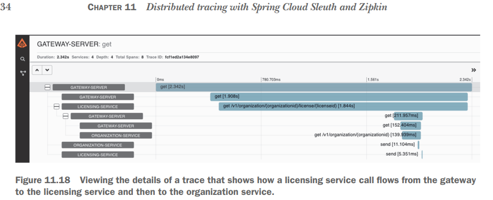

## 8.1 Introduction

- Kiến trúc microservices là một mô hình thiết kế mạnh mẽ để chia nhỏ các monolithic software systems phức tạp thành các
  phần nhỏ hơn, dễ quản lý hơn. Những phần này có thể được xây dựng và triển khai độc lập với nhau; tuy nhiên, sự linh
  hoạt này đi kèm với một cái giá - sự phức tạp.
- Bởi vì bản chất của các microservices được phân phối, việc cố gắng gỡ lỗi khi có vấn đề xảy ra có thể rất khó chịu.
  Bản chất phân tán của các service có nghĩa là chúng ta cần theo dõi một hoặc nhiều giao dịch trên nhiều dịch
  vụ,physical machines và các kho lưu trữ dữ liệu khác nhau, sau đó cố gắng kết hợp chính xác những gì đang diễn ra.
- Chương này trình bày một số kỹ thuật và công nghệ để sử dụng distributed debugging.
    - Using correlation IDs to link together transactions across multiple services.
    - Tổng hợp log data từ các service khác nhau vào một nguồn có thể tìm kiếm duy nhất.
    - Visualizing luồng giao dịch của người dùng trên nhiều service để hiểu từng phần về đặc điểm hiệu suất của giao
      dịch.
    - Analyzing, searching, and visualizing log data trong thời gian thực bằng the ELK stack.

## 8.2 Spring Cloud Sleuth and the correlation ID

- A correlation ID là một chuỗi hoặc số duy nhất được tạo ngẫu nhiên được chỉ định cho một giao dịch khi giao dịch được
  bắt đầu. Khi giao dịch lưu chuyển qua nhiều service, correlation ID được truyền từ lệnh gọi service này sang lệnh gọi
  service khác.
- chúng ta đã sử dụng a Spring Cloud Gateway filter để kiểm tra tất cả các HTTP requests đến và inject a correlation ID
  vào the request nếu không có. Khi đã có the correlation ID , chúng ta đã sử dụng a custom Spring HTTP filter trên
  từng service của mình để map biến đến với a custom UserContext object.
- Với this object, chúng ta đã thêm the correlation ID vào log statements của mình theo cách thủ công bằng cách thêm
  the correlation ID vào một a log statement hoặc thêm một chút the correlation ID trực tiếp vào Spring’s Mapped
  Diagnostic Context (MDC). MDC là a map that stores a set of key-value pairs được cung cấp bởi ứng dụng được chèn vào
  the log messages.
- Trong chương nayf, chúng ta cũng đã viết a Spring interceptor để đảm bảo rằng tất cả các cuộc gọi HTTP từ một service
  sẽ truyền the correlation ID bằng cách thêm the correlation ID vào the HTTP headers of outbound calls. May mắn thay,
  Spring Cloud Sleuth quản lý tất cả cơ sở hạ tầng và độ phức tạp của mã này cho chúng ta.
- chúng ta sẽ thấy rằng bằng cách thêm Spring Cloud Sleuth vào các microservices của mình, chúng ta có thể:
    - Rõ ràng là tạo và inject a correlation ID vào các lệnh gọi service của chúng ta nếu ID không tồn tại.
    - Quản lý việc truyền correlation IDs to outbound service calls để correlation ID cho một giao dịch được tự động
      thêm
    - Thêm the correlation information vào ghi Spring’s MDC logging để the generated. correlation ID được tự động ghi
      lại bằng Spring Boot’s default SL4J and Logback implementation.
    - Theo tùy chọn, publish the tracing information trong lệnh gọi service tới the Zipkin distributed tracing platform.

### 8.2.1 Adding Spring Cloud Sleuth to licensing and organization

- chúng ta cần thêm a single Maven dependency to the pom.xml files trong cả hai service.
  
- These dependencies kéo theo tất cả các all the core libraries cần thiết cho Spring Cloud Sleuth.
    - Kiểm tra mọi HTTP service đến và xác định xem thông tin theo dõi Spring Cloud Sleuth có tồn tại trong cuộc gọi đến
      hay không. Nếu có dữ liệu theo dõi Spring Cloud Sleuth, thông tin theo dõi được chuyển vào microservice của chúng
      tôi sẽ được thu thập và cung cấp cho service của chúng ta để logging and processing.
    - Thêm Spring Cloud Sleuth tracing information vào Spring MDC để mọi log statement được tạo bởi microservice của
      chúng ta sẽ được thêm vào the log.
    - Đưa thông tin theo dõi Spring Cloud vào mỗi outbound HTTP call và Spring messaging channel message mà service của
      chúng ta thực hiện.

### 8.2.2 Anatomy of a Spring Cloud Sleuth trace

- Nếu mọi thứ được thiết lập chính xác, mọi log statements written bằng mã ứng dụng service của chúng ta giờ đây sẽ bao
  gồm Spring Cloud Sleuth trace information.
  
- Spring Cloud Sleuth thêm four pieces of information vào each log entry.
    - The application name của service nơi the log entry is entered. Theo mặc định, Spring Cloud Sleuth sử dụng the
      application name (spring.application.name)  làm tên được ghi trong the trace.
    - The trace ID, là thuật ngữ tương đương cho correlation ID. Đây là a unique number đại diện cho toàn bộ giao dịch.
    - Span ID, là a unique ID đại diện cho một phần của giao dịch tổng thể. Mỗi service tham gia vào giao dịch sẽ có
      span ID của nó. Span ID đặc biệt có liên quan nếu bạn tích hợp với Zipkin để trực quan hóa các giao dịch của mình.
    - Export, a true/false indicator xác định xem trace data có được gửi đến Zipkin hay không. Trong high-volume
      services, the amount of trace data được tạo ra có thể quá tải và không tạo thêm giá trị đáng kể. Spring Cloud
      Sleuth cho phép chúng ta xác định thời điểm và cách thức gửi giao dịch đến Zipkin.
    - NOTE By default, any application flow starts with the same trace and span IDs.
      
    - chúng ta có thể thấy rằng cả the licensing and organization services đều có cùng một trace ID, 85f4c6e4a1738e77.
      Tuy nhiên, the organization service có span ID là 85f4c6e4a1738e77 (cùng giá trị với the transaction ID). The
      licensing service có a span ID là 382ce00e427adf7b.

## 8.3 Log aggregation and Spring Cloud Sleuth

- In a large-scale microservice environment (especially in the cloud), logging data là một công cụ quan trọng để
  debugging.
- Tuy nhiên, vì chức năng của a microservice-based application được phân tách thành các service nhỏ, chi tiết và chúng
  tôi có thể có multiple service instances cho a single service type, việc cố gắng liên kết debugging để log data từ
  multiple services để giải quyết vấn đề của người dùng có thể cực kỳ khó khăn.
- Các nhà phát triển muốn debug sự cố trên s multiple servers thường phải thử những cách sau:
    - Log into multiple servers để kiểm tra the logs có trên mỗi service. Đây là một nhiệm vụ cực kỳ tốn công sức, đặc
      biệt nếu các service được đề cập có khối lượng giao dịch khác nhau khiến logs cuộn qua ở các tốc độ khác nhau.
    - Viết home-grown query scripts sẽ cố gắng phân tích cú pháp the logs và xác định the relevant log entries. Bởi vì
      every query có thể khác nhau, chúng ta thường kết thúc với sự gia tăng lớn các tập lệnh tùy chỉnh để truy vấn dữ
      liệu từ logs của chúng ta.
    - Prolong the recovery of a downgraded service bị hạ cấp để sao lưu the logs nằm trên servcer. Nếu a server hosting
      lưu trữ một service bị lỗi hoàn toàn, the logs thường bị mất.
- Mỗi vấn đề được liệt kê là real concerns mà chúng ta thường gặp phải. Debugging sự cố trên các distributed servers là
  một công việc tồi tệ và thường làm tăng đáng kể lượng thời gian cần để xác định và giải quyết sự cố.
- Một cách tiếp cận tốt hơn nhiều là truyền trực tuyến, theo thời gian thực, tất cả log từ tất cả các our service
  instances đến một điểm tổng hợp tập trung, nơi the log data có thể được lập chỉ mục và có thể tìm kiếm được.
  
- May mắn thay, có nhiều mã nguồn mở và các sản phẩm thương mại có thể giúp chúng ta implement the logging architecture
  trong hình 11.3. Ngoài ra, tồn tạimultiple implementation models cho phép chúng ta lựa chọn giữa giải pháp tại chỗ,
  được quản lý cục bộ hoặc a cloud-based solution.
  
- chúng ta sẽ xem ELK như một ví dụ về cách tích hợp Spring Cloud Sleuth-backed logs hậu thuẫn vào một nền tảng logging
  thống nhất. chúng ta đã chọn ELK Stack vì:
    - ELK is open source.
    - Cài đặt đơn giản, dễ sử dụng và thân thiện với người dùng.
    - Đây là một công cụ hoàn chỉnh cho phép chúng ta search, analyze, and visualize real-time logs được tạo từ các
      service khác nhau
    - Nó cho phép chúng ta tập trung tất cả the logging để xác định các vấn đề về server and application issues.

### 8.3.1 A Spring Cloud Sleuth/ELK Stack implementation in action

- Trong hình 11.3, chúng ta đã thấy một kiến trúc logging architecture. Bây giờ, hãy xem cách chúng ta có thể triển khai
  cùng một kiến trúc với Spring Cloud Sleuth và the ELK Stack. Để thiết lập ELK hoạt động với môi trường của chúng ta,
  chúng ta cần thực hiện các hành động sau:
    - Configure Logback in our services
    - Define and run the ELK Stack applications in Docker containers
    - Configure Kibana
    - Test the implementation by issuing queries based on the correlation IDs from Spring Cloud Sleuth
      
    - Trong hình 11.4, the licensing, organization, and gateway services giao tiếp thông qua TCP với Logstash để gửi dữ
      liệu the log data. Logstash filters, transforms và chuyển dữ liệu đến kho lưu trữ dữ liệu trung tâm (trong trường
      hợp này là Elasticsearch).
    - Elasticsearch lập chỉ mục và lưu trữ dữ liệu ở định dạng có thể tìm kiếm để Kibana có thể truy vấn sau này. Khi dữ
      liệu được lưu trữ, Kibana sử dụng các mẫu chỉ mục từ Elasticsearch để truy xuất dữ liệu.
    - Tại thời điểm này, chúng ta có thể tạo một chỉ mục truy vấn cụ thể và nhập Spring Cloud Sleuth trace ID để xem tất
      cả the log entries từ các service khác nhau có chứa nó. Sau khi dữ liệu được lưu trữ, chúng ta có thể the
      real-time logs chỉ bằng cách truy cập Kibana.

### 8.3.2 Configuring Logback in our services

- Bây giờ chúng ta đã thấy the logging architecture with ELK, hãy bắt đầu configuring Logback cho các service của chúng
  tôi.
    - Add the logstash-logback-encoder dependency in the pom.xml of our services
    - Create the Logstash TCP appender in a Logback configuration file
- ADDING THE LOGSTASH ENCODER:
    - we chúng ta cần thêm the logstash-logback-encoder dependency to the pom.xml file of our licensing, organization,
      and gateway services.
      

- CREATING THE LOGSTASH TCP APPENDER:
    - Khi the dependency được thêm vào mỗi service, chúng ta cần thông báo cho the licensing service rằng nó cần giao
      tiếp với Logstash để gửi the applications logs, được định dạng là JSON. (Logback, theo mặc định, tạo ra các bản
      ghi ứng dụng ở dạng văn bản thuần túy, nhưng để sử dụng các chỉ mục Elasticsearch, chúng ta cần đảm bảo rằng
      chúng ta gửi the log data ở định dạng JSON.)
    - Using the net.logstash.logback.encoder.LogstashEncoder class
    - Using the net.logstash.logback.encoder.LoggingEventCompositeJsonEncoder class
    - Parsing the plain-text log data with Logstash
    - Đối với ví dụ này, chúng ta sẽ sử dụng LogstashEncoder. chúng ta đã chọn lớp này vì nó là lớp dễ dàng và nhanh
      nhất để triển khai và bởi vì, trong ví dụ này, chúng ta không cần thêm các trường bổ sung vào the logger.
    - Với LoggingEventCompositeJsonEncoder, chúng ta có thể thêm các mẫu hoặc trường mới, vô hiệu hóa các nhà cung cấp
      mặc định, v.v. Nếu chúng ta chọn một trong hai lớp này, the one in charge of parsing the log files thành định dạng
      Logstash là Logback. Với tùy chọn thứ ba, chúng ta có thể ủy quyền phân tích cú pháp hoàn toàn cho Logstash bằng
      cách sử dụng a JSON filter.
    - Cả ba tùy chọn đều tốt, nhưng chúng ta khuyên bạn nên sử dụng LoggingEventCompositeJsonEncoder khi bạn phải thêm
      hoặc xóa cấu hình mặc định. Hai lựa chọn còn lại sẽ hoàn toàn phụ thuộc vào nhu cầu business needs.
    - Để định cấu hình bộ mã hóa này, chúng ta sẽ tạo a Logback configuration file có tên logbackspring.xml. Tệp cấu
      hình này phải được đặt trong the service resources folder.
      
      
      
- Trong hình 11.5, chúng ta có thể thấy hai khía cạnh quan trọng. Đầu tiên là LogstashEncoder bao gồm tất cả các giá trị
  được lưu trữ trong Spring’s MDC logger theo mặc định và thứ hai là vì chúng ta đã thêm the Spring Cloud Sleuth
  dependency vào service của mình, chúng ta có thể thấy TraceId, X-B3-TraceId, SpanId, X- Các trường B3-SpanId và
  spanExportable trong log data. của chúng ta. Lưu ý rằng tiền tố X-B3 truyền tiêu đề mặc định mà Spring Cloud Sleuth
  sử dụng từ service này sang service khác.
- Tên này bao gồm X, được sử dụng cho custom headers không phải là một phần của đặc tả HTTP và B3, viết tắt của
  “BigBrotherBird”, tên trước đây của Zipkin.
- Bạn cũng có thể configure the log data được hiển thị trong hình 11.5 bằng cách sử dụng
  LoggingEventCompositeJsonEncoder. Sử dụng this composite encoder, chúng ta có thể vô hiệu hóa tất cả các nhà cung cấp
  đã được thêm theo mặc định vào cấu hình của chúng ta, add new patterns để hiển thị các MDC fields hiện có hoặc tùy
  chỉnh, v.v.
  
- Mặc dù chúng ta đã chọn the LogstashEncoder option cho ví dụ này, nhưng bạn nên chọn tùy chọn phù hợp nhất với nhu
  cầu của mình. Bây giờ chúng ta đã có cấu hình Logback trong the licensing service, hãy thêm cấu hình tương tự vào các
  service khác của chúng ta: configuration and gateway. chúng ta sẽ xác định và chạy các the ELK Stack applications
  trong Docker containers.

### 8.3.3 Defining and running ELK Stack applications in Docker

- Để thiết lập ELK Stack containers của chúng ta, chúng ta cần làm theo hai bước đơn giản. Đầu tiên là tạo the Logstash
  configuration file và thứ hai là xác định các the ELK Stack applications in our Docker configuration. Tuy nhiên, trước
  khi chúng ta bắt đầu tạo our configuration, điều quan trọng cần lưu ý là đường dẫn Logstash có hai phần tử bắt buộc
  và một phần tử tùy chọn. Các yếu tố bắt buộc là the inputs and outputs:
    - The input cho phép Logstash đọc a specific source. Logstash hỗ trợ nhiều plugin đầu vào như GitHub, Http, TCP,
      Kafka và các plugin khác.
    - The output chịu trách nhiệm gửi dữ liệu sự kiện đến a particular destination. Elastic hỗ trợ nhiều plugin như CSV,
      Elasticsearch, email, tệp, MongoDB, Redis, stdout và các plugin khác.
    - Phần tử tùy chọn trong the Logstash configuration là the filter plugins. These filters này chịu trách nhiệm thực
      hiện xử lý trung gian đối với một sự kiện, chẳng hạn như translations, thêm thông tin mới, phân tích cú pháp ngày,
      cắt bớt trường, v.v. Hãy nhớ rằng, Logstash nhập và transforms the log data received.
      
- Đối với ví dụ này, chúng ta sẽ sử dụng làm the input plugin, the Logback TCP appender mà chúng ta đã định configured
  and as the output plugin the Elasticsearch engine.
  
    - Trong danh sách 11.3, chúng ta có thể thấy năm yếu tố cần thiết. Đầu tiên là the input section. Trong phần này,
      chúng ta chỉ định the tcp plugin để sử dụng the log data. Tiếp theo là the port number 5000; đây là port mà chúng
      tôi sẽ chỉ định cho Logstash sau này trong the docker-compose.yml file.
    - Phần tử thứ ba là tùy chọn và tương ứng với các filters; cho trường hợp cụ thể này, chúng ta đã thêm ma mutate
      filter. This filtery thêm a manningPublications tag vào các sự kiện. A real-world scenario về a possible tag cho
      các service của bạn có thể là the environment nơi ứng dụng chạy. Cuối cùng, phần tử thứ tư và thứ năm chỉ định
      plugin đầu ra cho Logstash service của chúng ta và gửi dữ liệu đã xử lý đến service Elasticsearch đang chạy trên
      cổng

    9200.

- Bây giờ chúng ta đã có the Logstash configuration, hãy thêm ba mục nhập ELK Docker vào the docker-compose.yml file.
  Hãy nhớ rằng, chúng ta đang sử dụng tệp này để kích hoạt tất cả các the Docker containers được sử dụng cho các ví dụ
  mã trong chương này và các chương trước. Danh sách sau đây hiển thị the docker/docker-compose.yml file với các mục
  nhập mới.
  
  
- Để chạy n the Docker environment, chúng ta cần thực hiện các lệnh sau trong thư mục gốc nơi chứa the parent pom.xml.
  Lệnh mvn tạo a new image với những thay đổi mà chúng ta đã thực hiện cho the organization, licensing, and gateway
  services:
  `mvn clean package dockerfile:build docker-compose -f docker/docker-compose.yml up`

### 8.3.4 Configuring Kibana

- Cấu hình Kibana là một quá trình đơn giản và chúng ta chỉ cần cấu hình nó một lần. Để truy cập Kibana, hãy mở trình
  duyệt web theo liên kết sau: http://localhost:5601/. Lần đầu tiên chúng ta truy cập Kibana, một trang Chào mừng được
  hiển thị. Trang này hiển thị hai tùy chọn.

- Để khám phá dữ liệu của chúng ta, hãy nhấp vào link the Explore on My Own. Sau khi nhấp vào, chúng ta sẽ thấy an Add
  Data page giống như trong hình 11.8. Trên trang này, chúng ta cần nhấp vào the Discover icon ở bên trái của trang.
  
- Để tiếp tục, chúng ta phải tạo an index pattern. Kibana sử dụng a set of index patterns để lấy dữ liệu từ một công cụ
  Elasticsearch. The index pattern trách nhiệm cho Kibana biết Elasticsearch indexes nào mà chúng ta muốn khám phá. Ví
  dụ: trong trường hợp của chúng ta, chúng ta sẽ tạo một mẫu chỉ mục cho biết rằng chúng ta muốn truy xuất tất cả
  thông tin Logstash từ Elasticsearch. Để tạo mẫu chỉ mục của chúng ta, hãy nhấp vào the Index Patterns link trong phần
  Kibana ở bên trái của trang.
  
- Trên the Create Index Pattern trong hình 11.9, chúng ta có thể thấy rằng Logstash đã tạo an index as a first step. Tuy
  nhiên, this index vẫn chưa sẵn sàng để sử dụng. Để kết thúc việc thiết lập chỉ mục, chúng ta phải chỉ định an index
  pattern cho index đó. Để tạo nó, chúng ta cần viết the index pattern, logstash-*,và nhấp vào nút Bước tiếp theo.
- Đối với bước 2, chúng ta sẽ chỉ định a time filter.
  
- Giờ đây, chúng ta có thể bắt đầu thực hiện các yêu cầu đối với service của mình để xem the real-time logs in Kibana.
  

### 8.3.5 Searching for Spring Cloud Sleuth trace IDs in Kibana

- Bây giờ logs của chúng ta đang chuyển sang ELK, chúng ta có thể bắt đầu đánh giá cao cách Spring Cloud Sleuth adds
  trace IDs to our log entries. Để truy vấn tất cả the log entries related to a single transaction, chúng ta cần lấy a
  trace ID và truy vấn nó trên Kibana’s Discover screen (hình 11.12).
  
  

### 8.3.6 Adding the correlation ID to the HTTP response with Spring Cloud Gateway

- Nếu chúng ta kiểm tra the HTTP response từ bất kỳ lệnh gọi service nào được thực hiện bằng Spring Cloud Sleuth, chúng
  tôi sẽ thấy rằng the trace ID được sử dụng trong cuộc gọi không bao giờ được trả lại trong the HTTP response headers.
  Nếu chúng ta kiểm tra the documentation for Spring Cloud Sleuth.
- chúng ta sẽ thấy rằng the Spring Cloud Sleuth team tin rằng việc trả lại bất kỳ dữ liệu theo dõi nào có thể là một vấn
  đề bảo mật tiềm ẩn (mặc dù họ không liệt kê rõ ràng lý do tại sao họ tin vào điều này). Nhưng chúng ta nhận thấy rằng
  việc trả lại mối a correlation or tracing ID in the HTTP response là vô giá khi gỡ lỗi sự cố.
- Spring Cloud Sleuth cho phép chúng ta “decorate” the HTTP response information bằng các tracing and span IDs của nó.
  Tuy nhiên, quá trình để làm điều này bao gồm việc viết ba lớp và injecting two custom Spring beans.
- Một giải pháp đơn giản hơn nhiều là viết a Spring Cloud Gateway filter injects the trace ID into the HTTP response.
  Trong chương 5, nơi chúng ta giới thiệu Spring Cloud Gateway, chúng ta đã biết cách xây dựng a gateway response
  filter, adding the generated correlation ID đã tạo vào the HTTP response do người gọi trả về để sử dụng trong các dịch
  vụ của chúng ta.
- Bây giờ chúng ta sẽ sửa đổi bộ lọc đó để thêm tSpring Cloud Sleuth header. Để thiết lập gateway response filter của
  chúng ta, chúng ta cần đảm bảo rằng chúng ta có các the Spring Cloud Sleuth dependencies trong tệp pom.xml của
  chúng ta như sau:
  
- chúng ta sẽ sử dụng the spring-cloud-starter-sleuth dependency để nói với Spring Cloud Sleuth rằng chúng ta muốn the
  gateway tham gia vào a Spring Cloud trace.

- Bởi vì the gateway hiện đã được kích hoạt Spring Cloud Sleuth, chúng ta có thể truy cập tracing information từ bên
  trong ResponseFilter của chúng ta bằng cách autowiring trong lớp Tracer. Lớp này cho phép chúng ta truy cập thông
  tin về dấu vết hiện đang được thực thi.
- Phương thức tracer.currentSpan () .context (). TraceIdString () cho phép chúng ta truy xuất the current trace ID dưới
  dạng một Chuỗi cho giao dịch đang được thực hiện. Việc thêm the trace ID vào HTTP response gửi đi chuyển trở lại qua
  gateway là rất đơn giản.
    - `exchange.getResponse().getHeaders()
      .add(FilterUtils.CORRELATION_ID, traceId);`

- Với mã này, nếu chúng ta gọi an O-stock microservice thông qua gateway của mình, chúng ta sẽ nhận được an HTTP
  response có tên tmx-tương quan-id với a Spring Cloud Sleuth trace ID. Hình 11.14 cho thấy kết quả của một lệnh gọi tới
  endpoint to GET the licenses of an organization:
  

## 8.4 Distributed tracing with Zipkin

- Có một logging platform thống nhất với các correlation IDs là một công cụ gỡ lỗi mạnh mẽ. Tuy nhiên, đối với phần còn
  lại của chương, chúng ta sẽ chuyển khỏi việc tracing log entries và xem xét cách visualize luồng giao dịch khi chúng
  di chuyển qua các service nhỏ khác nhau. Một bức tranh sáng sủa, súc tích có giá trị hơn một triệu lượt đăng nhập.
- Distributed tracing liên quan đến việc cung cấp một bức tranh trực quan về cách một giao dịch di chuyển qua
  microservices khác nhau của chúng ta. Distributed tracing tools cũng đưa ra ước tính gần đúng về thời gian phản hồi
  của từng microservice.
- Tuy nhiên, không nên nhầm lẫn distributed tracing tools với full-blown Application Performance Management (APM) . Các
  gói APM cung cấp out-of-the-box, low-level performance data trên actual service code, cũng như dữ liệu hiệu suất như
  bộ nhớ, mức sử dụng CPU và sử dụng I/O vượt quá thời gian phản hồi.
- Đây là nơi the Spring Cloud Sleuth and Zipkin projects shine (còn được gọi là OpenZipkin) . Zipkin (http://zipkin.io/)
  là a distributed tracing platform cho phép chúng ta theo dõi các giao dịch qua nhiều lần gọi service. Nó cho phép
  chúng ta xem bằng đồ thị lượng thời gian của một giao dịch và chia nhỏ thời gian dành cho mỗi microservice liên quan
  đến cuộc gọi.
- Zipkin là một công cụ vô giá để xác định các vấn đề về hiệu suất trong kiến trúc microservices. Setting up Spring
  Cloud Sleuth and Zipkin involves:
    - Adding Spring Cloud Sleuth and Zipkin JAR files to the services that capture trace data
    - Configuring a Spring property trong mỗi service trỏ đến the Zipkin server sẽ thu thập the trace data.
    - Installing and configuring a Zipkin server to collect the data.
    - Xác định the sampling strategy mà mỗi khách hàng sẽ sử dụng để gửi thông tin tracing information to Zipkin.

### 8.4.1 Setting up the Spring Cloud Sleuth and Zipkin dependencies

- chúng ta đã đưa các yếu tố phụ thuộc vào Spring Cloud Sleuth trong our licensing and organization services. Các JAR
  files này hiện bao gồm các Spring Cloud Sleuth libraries cần thiết để kích hoạt Spring Cloud Sleuth trong một service.
  Tiếp theo, chúng ta cần bao gồm a new dependency, the spring-cloud-sleuth-zipkin dependency, để tích hợp với Zipkin.
  

### 8.4.2 Configuring the services to point to Zipkin

- Với the JAR files in place, chúng ta cần configure each service muốn giao tiếp với Zipkin. chúng ta sẽ thực hiện việc
  này bằng cách đặt a Spring property xác định URL được sử dụng để giao tiếp với Zipkin. Thuộc tính cần được đặt là the
  spring.zipkin.baseUrl property.
- Thuộc tính này được đặt trong each service’s configuration file nằm trong the repository of the Spring Cloud Config
  Server. Để chạy nó cục bộ, hãy đặt giá trị của thuộc tính baseUrl thành localhost:9411. Tuy nhiên, nếu bạn muốn chạy
  nó với Docker, bạn cần ghi đè giá trị đó bằng zipkin:9411 như sau:
- `zipkin.baseUrl: zipkin:9411`

### 8.4.3 Configuring a Zipkin server

- Có một số cách để thiết lập Zipkin, nhưng chúng ta sẽ sử dụng a Docker container với the Zipkin server. Tùy chọn này
  sẽ cho phép chúng ta tránh việc tạo a new project trong kiến trúc của chúng ta. Để thiết lập Zipkin, chúng ta sẽ
  thêm the following registry entry vào our dockercompose.yml file nằm trong the Docker folder for the project:
  
- Để chạy a Zipkin server, cần little configuration. Một trong những thứ chúng ta cần cấu hình khi chạy Zipkin là kho dữ
  liệu phụ trợ mà Zipkin sử dụng để lưu trữ dữ liệu theo dõi. Zipkin hỗ trợ bốn kho dữ liệu phụ trợ khác nhau:
    - In-memory data
    - MySQL (http://mysql.com/)
    - Cassandra (https://cassandra.apache.org/)
    - Elasticsearch (http://elastic.co/)
- Theo mặc định, Zipkin sử dụng in-memory data store để lưu trữ. Tuy nhiên, nhóm Zipkin khuyên không nên sử dụng cơ sở
  the in-memory database trong a production environment. The in-memory database chứa a limited amount of data và the
  data sẽ bị mất khi máy chủ Zipkin bị tắt hoặc bị lỗi.
- Đối với ví dụ này, chúng ta sẽ chỉ cho bạn cách sử dụng Elasticsearch làm nơi lưu trữ dữ liệu vì chúng ta đã định
  configured Elasticsearch. Các cài đặt bổ sung duy nhất mà chúng ta cần thêm là các biến STORAGE_TYPE và ES_HOSTS
  trong the environment section của our configuration file. Đoạn mã sau hiển thị the complete Docker Compose registry:
  

### 8.4.4 Setting tracing levels

- Bây giờ chúng ta có the clients configured để nói chuyện với a Zipkin server và chúng ta đã the server configured và
  sẵn sàng chạy. Nhưng chúng ta cần thực hiện thêm một bước nữa trước khi có thể bắt đầu sử dụng Zipkin và đó là xác
  định tần suất mỗi service sẽ ghi data to Zipkin.
- Theo mặc định, Zipkin chỉ ghi 10% tất cả các giao dịch vào the Zipkin server. Giá trị mặc định đảm bảo rằng Zipkin sẽ
  không lấn át our logging and analysis infrastructure.
- Việc lấy mẫu giao dịch có thể được controlled bằng cách đặt a Spring property trên mỗi service gửi dữ liệu đến Zipkin:
  the spring.sleuth.sampler.percentage property. This property này có giá trị từ 0 đến 1 như sau:
    - A value of 0 means Spring Cloud Sleuth doesn’t send Zipkin any transactions.
    - A value of .5 means Spring Cloud Sleuth sends 50% of all transactions.
    - A value of 1 means Spring Cloud Sleuth sends all transactions (100%).
- Vì mục đích của chúng ta, chúng ta sẽ gửi tất cả thông tin theo dõi (100%) cho các service và tất cả các giao dịch
  của chúng ta. Để thực hiện việc này, chúng ta có thể đặt giá trị của spring.sleuth.sampler.percentage hoặc chúng ta
  có thể thay thế lớp Sampler mặc định được sử dụng trong Spring Cloud Sleuth bằng AlwaysSampler.
- Lớp AlwaysSampler có thể được injected vào như một Spring bean vào một ứng dụng. Nhưng đối với ví dụ này, chúng ta sẽ
  sử dụng spring.sleuth.sampler.percentage trong the configuration file của the licensing, organization, and gateway
  services như sau:
    - `zipkin.baseUrl: zipkin:9411 spring.sleuth.sampler.percentage: 1`

### 8.4.5 Using Zipkin to trace transactions

- Hãy bắt đầu phần này với một tình huống. Hãy tưởng tượng bạn là một trong những nhà phát triển ứng dụng O-stock và bạn
  sẽ được gọi trong tuần này. Bạn nhận được phiếu hỗ trợ từ một khách hàng phàn nàn rằng một trong các màn hình trong
  ứng dụng chạy chậm. Bạn có nghi ngờ rằng the licensing service đang được sử dụng bởi màn hình là thủ phạm. Nhưng tại
  sao và ở đâu?.
- Trong kịch bản của chúng ta, the licensing service dựa vào the organization service và cả hai service đều thực hiện
  các lệnh gọi đến các different databases. service nào là người hoạt động kém? Ngoài ra, bạn biết rằng các service này
  liên tục được sửa đổi, vì vậy ai đó có thể đã thêm lệnh gọi service mới vào hỗn hợp.
- Để giải quyết tình huống khó xử này, chúng ta sẽ sử dụng Zipkin để theo dõi hai giao dịch từ our organization service
  của chúng ta khi the Zipkin service traces them. The organization service là một service đơn giản chỉ thực hiện cuộc
  gọi đến a single database. Những gì chúng ta sẽ làm là sử dụng Postman để gửi hai cuộc gọi đến the organization
  service với the following endpoint. The organization service sẽ chuyển qua the gateway trước khi các cuộc gọi được
  chuyển hướng downstream to an organization service instance:
- `GET http://localhost:8072/organization/v1/organization/4d10ec24-141a-4980-➥ be34-2ddb5e0458c6`
- Nếu chúng ta nhìn vào ảnh chụp màn hình trong hình 11.15, chúng ta sẽ thấy rằng Zipkin đã ghi lại hai giao dịch và mỗi
  giao dịch được chia thành một hoặc nhiều nhịp. Trong Zipkin, một nhịp đại diện cho một service hoặc cuộc gọi cụ thể
  trong đó thông tin thời gian được thu thập.
- Hãy nhớ rằng the gateway không chuyển tiếp một cách mù quáng một cuộc gọi HTTP. Nó nhận cuộc gọi HTTP đến, kết thúc nó
  và sau đó xây dựng một cuộc gọi mới để gửi đến service được nhắm mục tiêu (trong trường hợp này là the organization
  service). Việc kết thúc cuộc gọi ban đầu là cách the gateway có thể thêm response, pre-, and post-filters cho mỗi cuộc
  gọi đi vào the gateway .
  
- Hai cuộc gọi đến the organization service thông qua cổng lần lượt mất 1,151 giây và 39,152 ms. Hãy cùng tìm hiểu chi
  tiết về cuộc gọi kéo dài nhất (1,151 giây). Chúng ta có thể xem chi tiết hơn bằng cách nhấp vào giao dịch và xem chi
  tiết.
  
- Trong hình 11.16, chúng ta có thể thấy rằng toàn bộ giao dịch từ góc độ a gateway kết nối mất khoảng 1,151 giây. Tuy
  nhiên, cuộc gọi the organization service được thực hiện bởi cổng này mất 524,689 mili giây trong 1,151 giây liên quan
  đến cuộc gọi tổng thể. Hãy đi sâu vào từng khoảng thời gian để biết thêm chi tiết. Nhấp vào the organization-service
  span và nhận thấy các chi tiết bổ sung từ cuộc gọi.
  
- Một trong những phần thông tin có giá trị nhất trong hình 11.17 là sự cố của khách hàng (Gateway) khi nó được gọi là
  service tổ chức, khi the organization service nhận được cuộc gọi và khi the organization service received phản hồi.
  Loại thông tin thời gian này là vô giá trong việc phát hiện và xác định các vấn đề về độ trễ của mạng. Để thêm a
  custom span vào the licensing service’s call to Redis, chúng ta sẽ sử dụng lớp sau:
- `/licensing-service/src/main/java/com/optimagrowth/license/service/client/ ➥ OrganizationRestTemplateClient.java`
    - Với OrganizationRestTemplateClient, chúng ta sẽ implement the checkRedisCache()
      method. Danh sách sau đây cho thấy mã này.
      .png)

### 8.4.6 Visualizing a more complex transaction

- Điều gì xảy ra nếu chúng ta muốn hiểu chính xác những service dependencies nào tồn tại giữa các cuộc gọi service?
  chúng ta có thể gọi the licensing service thông qua cổng và sau đó truy vấn Zipkin để tìm dấu vết licensing service
  traces bằng lệnh gọi GET tới the licensing services sử dụng endpoint sau. Hình 11.18 cho thấy dấu vết chi tiết của
  cuộc gọi này.
- `http://localhost:8072/license/v1/organization/4d10ec24-141a-4980-be34-➥ 2ddb5e0458c8/license/4af05c3b-a0f3-411d-b5ff-892c62710e15`
- chúng ta có thể thấy rằng cuộc gọi đến the licensing service liên quan đến tám cuộc gọi HTTP. chúng ta thấy lệnh gọi
  đến the gateway và sau đó từ the gateway to the licensing service; the licensing service to the gateway and the
  gateway to the organization; và cuối cùng, , the organization to the licensing service using Apache Kafka to update
  the Redis cache.
  

### 8.4.7 Capturing messaging traces

- Messaging có thể giới thiệu các vấn đề về hiệu suất và độ trễ của chính nó trong ứng dụng. Một service có thể không xử
  lý một tin nhắn từ một hàng đợi đủ nhanh. Hoặc có thể có vấn đề về độ trễ mạng. chúng ta đã gặp phải những tình huống
  này khi xây dựng các microservice-based applications.
- Spring Cloud Sleuth gửi dữ liệu theo dõi Zipkin trên any inbound or outbound message channel nào đã đăng ký trong dịch
  vụ. Sử dụng Spring Cloud Sleuth và Zipkin, chúng ta có thể xác định khi nào một thư được xuất bản từ hàng đợi và khi
  nào thư được nhận. Chúng ta cũng có thể xem hành vi nào diễn ra khi nhận được thông báo trên hàng đợi và được xử lý.
- Chúng ta cũng có thể xem hành vi nào diễn ra khi nhận được thông báo trên hàng đợi và được xử lý. Và, bạn sẽ nhớ từ
  chương 7, khi an organization record được thêm, cập nhật hoặc xóa, a Kafka message được tạo và published via Spring
  Cloud Stream. The licensing service nhận the message và updates a Redis key-value store mà nó sử dụng để lưu vào bộ
  nhớ cache dữ liệu.
- `http://localhost:8072/organization/v1/organization/4d10ec24-141a-4980-be34-➥ 2ddb5e0458c7`
- Trước đó trong chương, chúng ta đã biết cách thêm the trace ID as an HTTP response header, thêm a new HTTP response
  header được gọi là tmx-correlation-id. chúng ta đã trả về tmxcorrelation-id trong cuộc gọi của mình với giá trị là
  054accff01c9ba6b. chúng ta có thể tìm kiếm dấu vết cụ thể này của Zipkin bằng cách the trace ID theo dõi được trả về
  bởi cuộc gọi của chúng ta vào hộp tìm kiếm ở góc trên bên phải của the Zipkin query screen Hình 11.19 cho thấy nơi
  chúng ta có thể nhập the trace ID.
- Với the specific trace in hand, chúng ta có thể truy vấn Zipkin về giao dịch và xem việc the publication of the
  DELETE message. The second span trong hình 11.20 là thông báo the channel output, được sử dụng để publish to a Kafka
  topic được gọi là orgChangeTopic.
  
  
- Bạn có thể thấy the licensing service receive the message bằng cách nhấp vào g the licensing service span. Hình 11.21
  cho thấy dữ liệu này.
  

### 8.4.8 Adding custom spans

- Thêm a custom span là điều cực kỳ dễ thực hiện với Zipkin. chúng ta sẽ bắt đầu bằng cách thêm a custom span vào our
  licensing service để có thể theo dõi thời gian lấy dữ liệu từ Redis. Sau đó, chúng ta sẽ thêm a custom span to our
  organization service của mình để xem mất bao lâu để truy xuất dữ liệu từ the organization database. Danh sách sau đây
  tạo a custom span cho the licensing service được gọi là readLicensingDataFromRedis.
  
- Tiếp theo, chúng ta sẽ thêm a custom span, called getOrgDbCall, vào the organization service để theo dõi mất bao lâu
  để truy xuất organization data từ cơ sở dữ liệu Postgres. Dấu vết cho các cuộc gọi the organization service database
  có thể được nhìn thấy trong lớp OrganizationService.
  -method.png)
- Với two custom spans này, hãy khởi động lại các service. Sau đó chọn GET endpoint sau:
- `http://localhost:8072/license/v1/organization/4d10ec24-141a-4980-be34-➥ 2ddb5e0458c9/license/4af05c3b-a0f3-411d-b5ff-892c62710e16`
- Nếu chúng ta xem xét the transaction in Zipkin,, chúng ta sẽ thấy việc bổ sung two new spans khi chúng ta gọi the
  licensing service endpoint để truy xuất licensing information.
  
- Hình 11.22 cũng cho thấy tracing và thời gian bổ sung liên quan đến Redis và tra cứu cơ sở dữ liệu của chúng ta. Đi
  sâu vào, chúng ta có thể thấy rằng cuộc gọi đã đọc tới Redis mất 5,503 mili giây. Vì cuộc gọi không tìm thấy một mục
  trong bộ nhớ cache của Redis, cuộc gọi SQL tới cơ sở dữ liệu Postgres mất 234,888 mili giây.
